# //cumulative-layout-shift/samples/pages+cached

[→ Parent](../..)


## Raw


```yaml
p90min: 1.2892389814588758
p90max: 1.3739595625135634
p90range: 0.0847205810546876
p90mean: 1.3105931060753755
p90median: 1.3056710561116536
p90stdev: 0.02107412370239296
p90skewness: 2.2532664094933654
p90eccentricity: 0.9999999999999997
p90discretization: 1.0705882352941176
outlandishness: 1.0036001791310676
confidence: 0.0123310757059234
p90confidence: 0.008659781126738597

```

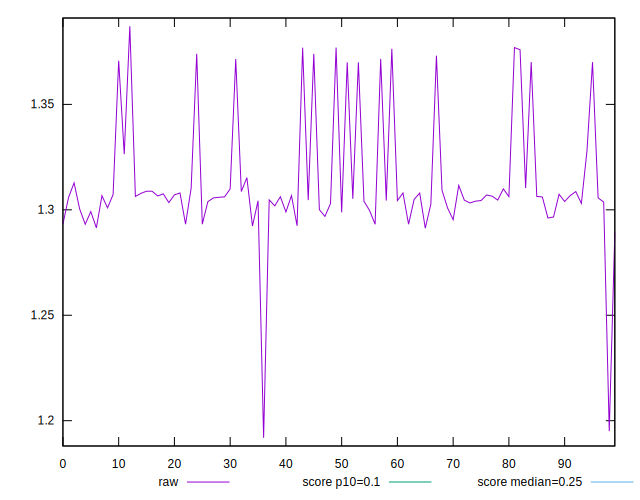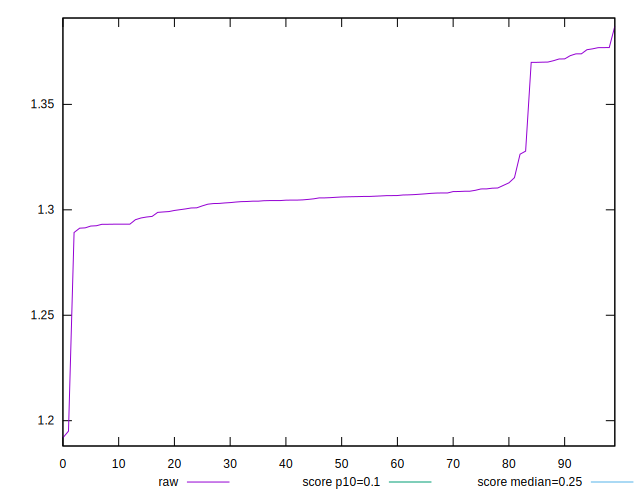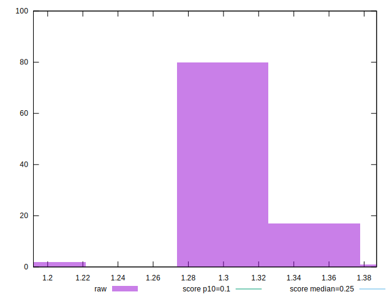
## Score


```yaml
p90min: 0.01
p90max: 0.01
p90range: 0
p90mean: 0.010000000000000007
p90median: 0.01
p90stdev: 6.938893903907228e-18
p90skewness: -1
p90eccentricity: 1
p90discretization: 91
outlandishness: 1
confidence: 3.469446951953614e-18
p90confidence: 3.469446951953614e-18

```

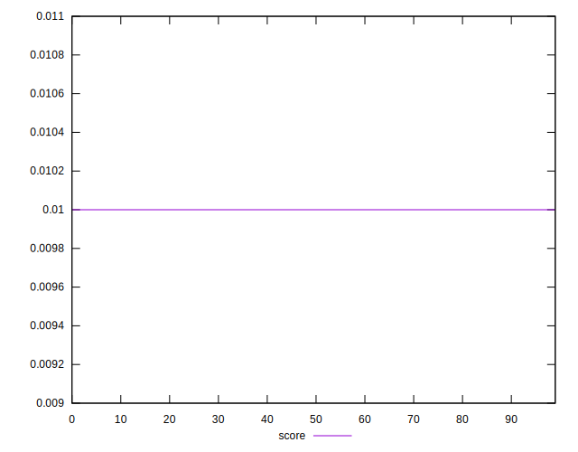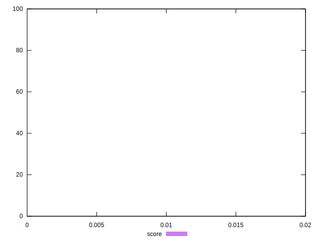
## Raw Estimate

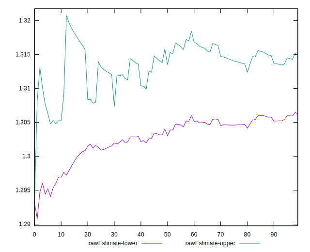
## Score Estimate

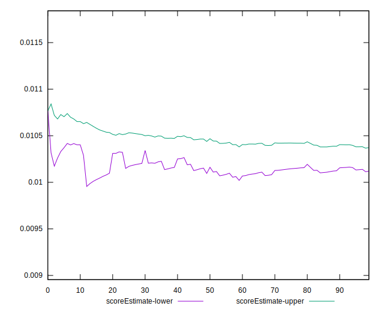
## P Score


```yaml
p90min: 0.008580191248917068
p90max: 0.010888399600877341
p90range: 0.0023082083519602725
p90mean: 0.010265765327402062
p90median: 0.010390160232700896
p90stdev: 0.0005689554451356856
p90skewness: -2.164997178730049
p90eccentricity: 1.0000000000000004
p90discretization: 1.0833333333333333
outlandishness: 0.9919237929583964
confidence: 0.0003625085548829357
p90confidence: 0.00023379523131401153

```

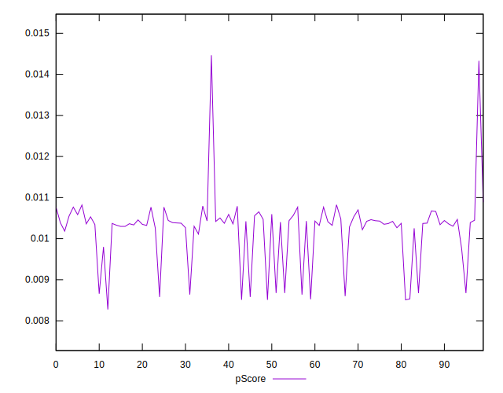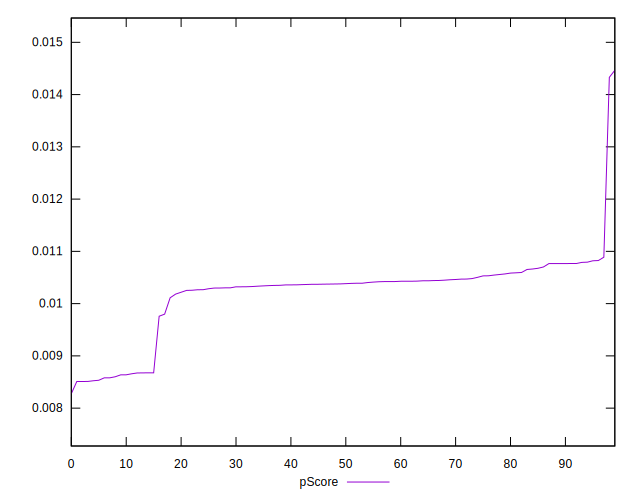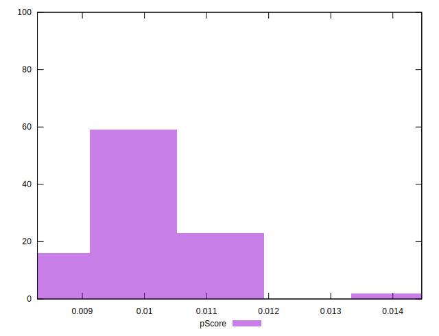
## Score Difference


```yaml
p90min: 0
p90max: 0
p90range: 0
p90mean: 0
p90median: 0
p90stdev: 0
p90skewness: .nan
p90eccentricity: .nan
p90discretization: 91
outlandishness: .nan
confidence: 0
p90confidence: 0

```


## P Score Difference


```yaml
p90min: -0.0014198087510829318
p90max: 0.0008883996008773407
p90range: 0.0023082083519602725
p90mean: 0.00026576532740205637
p90median: 0.0003901602327008955
p90stdev: 0.0005689554451356856
p90skewness: -2.1649971787300686
p90eccentricity: 1.0000000000000002
p90discretization: 1.0833333333333333
outlandishness: 0.7118351480500986
confidence: 0.000362508554882935
p90confidence: 0.00023379523131401316

```

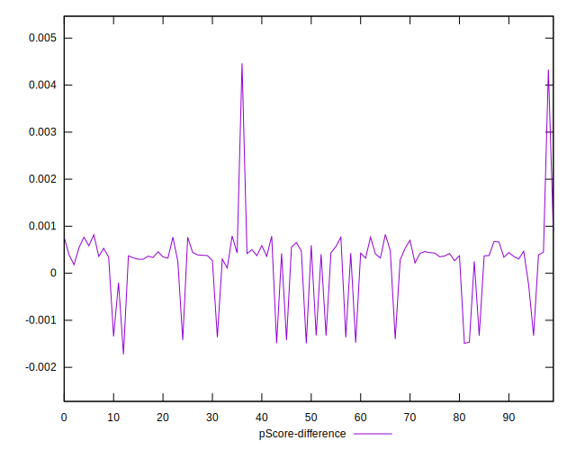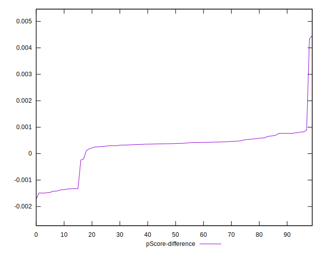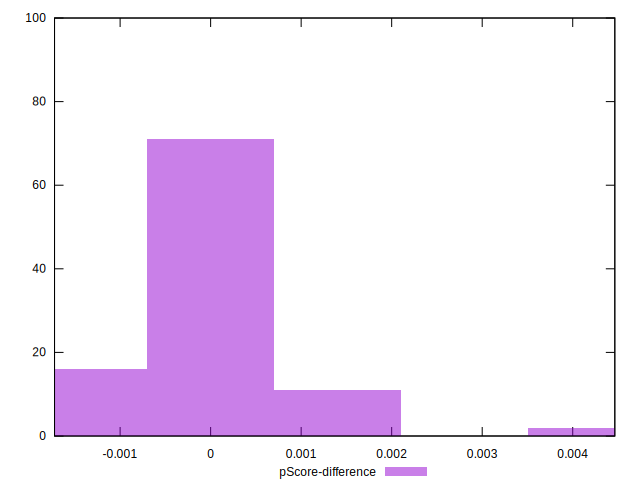