# //cumulative-layout-shift/samples/pages

[→ Parent](../..)


## Raw


```yaml
p90min: 1.0843936581081814
p90max: 1.3062030656602648
p90range: 0.22180940755208334
p90mean: 1.181982432345623
p90median: 1.158686518351237
p90stdev: 0.05366027356562818
p90skewness: 1.5362569013442193
p90eccentricity: 1
p90discretization: 1.8571428571428572
outlandishness: 1.0203366992935285
confidence: 0.025093199773141617
p90confidence: 0.022050085253437324

```

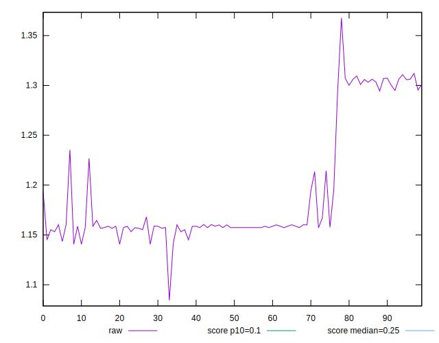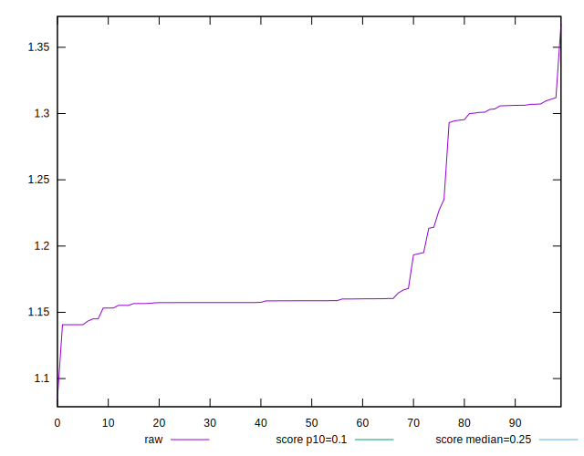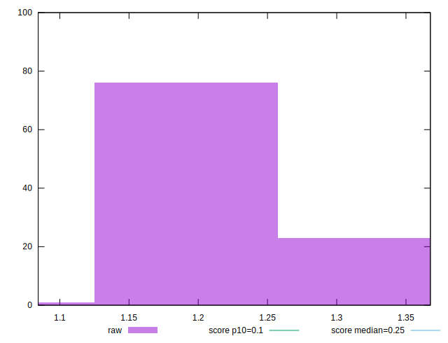
## Score


```yaml
p90min: 0.01
p90max: 0.02
p90range: 0.01
p90mean: 0.0176923076923077
p90median: 0.02
p90stdev: 0.004213250442347437
p90skewness: -1.2780193008453917
p90eccentricity: 0.9999999999999969
p90discretization: 45.5
outlandishness: 0.9232703213610588
confidence: 0.0017963366637084102
p90confidence: 0.0017313093145941774

```

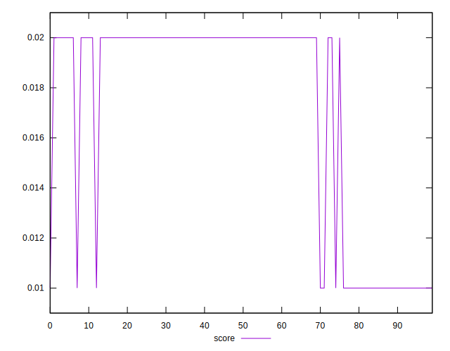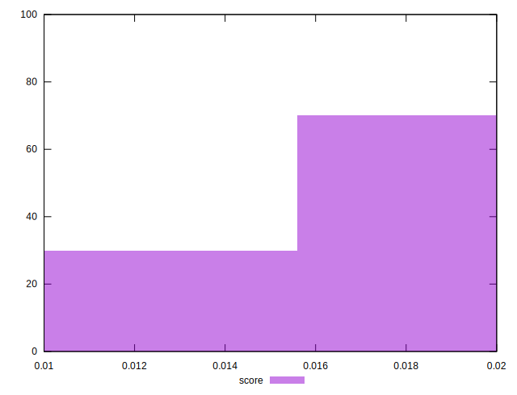
## Raw Estimate

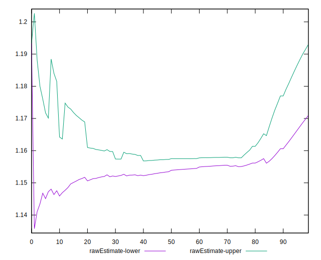
## Score Estimate

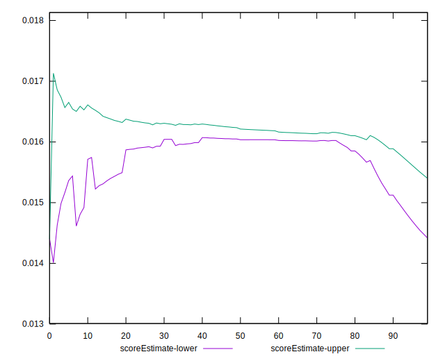
## P Score


```yaml
p90min: 0.010373711741971159
p90max: 0.016877152400296802
p90range: 0.006503440658325643
p90mean: 0.014991843549574422
p90median: 0.015979855564776158
p90stdev: 0.0021037939763581164
p90skewness: -1.478004663011608
p90eccentricity: 0.9999999999999999
p90discretization: 1.8958333333333333
outlandishness: 0.9551827096618005
confidence: 0.0009681157814368652
p90confidence: 0.0008644912418798896

```

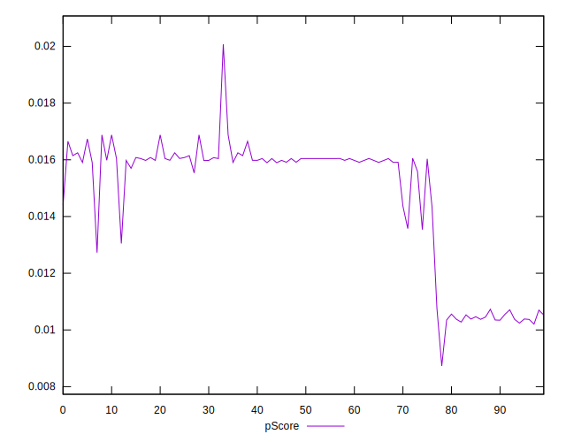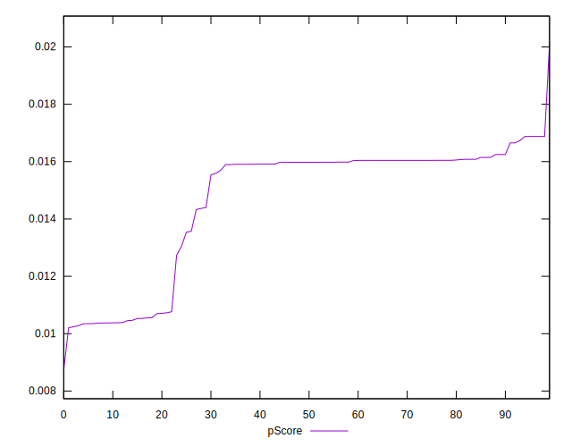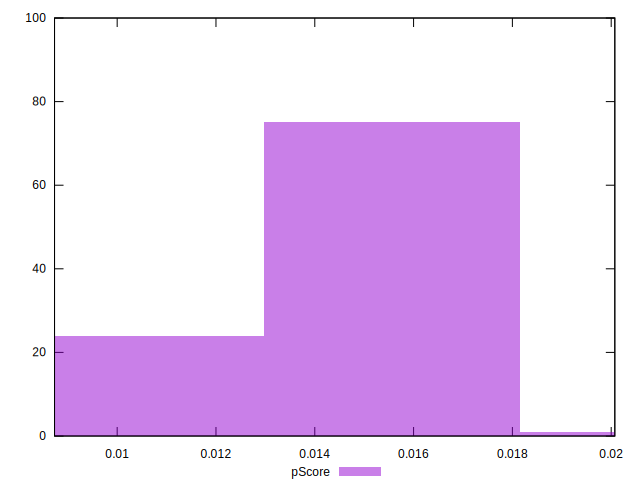
## Score Difference


```yaml
p90min: 0
p90max: 0
p90range: 0
p90mean: 0
p90median: 0
p90stdev: 0
p90skewness: .nan
p90eccentricity: .nan
p90discretization: 91
outlandishness: .nan
confidence: 0
p90confidence: 0

```


## P Score Difference


```yaml
p90min: -0.004464248279489085
p90max: 0.0007109609052121744
p90range: 0.0051752091847012596
p90mean: -0.0028821430000377786
p90median: -0.003956369588038782
p90stdev: 0.0018420407329225342
p90skewness: 1.1768163271338494
p90eccentricity: 0.9999999999999993
p90discretization: 1.8958333333333333
outlandishness: 0.6636638948450129
confidence: 0.0009710965779826386
p90confidence: 0.0007569315715763181

```

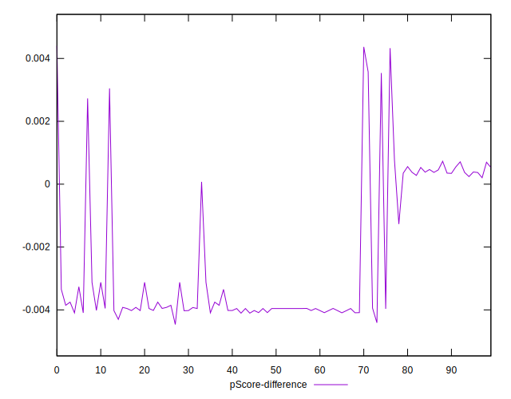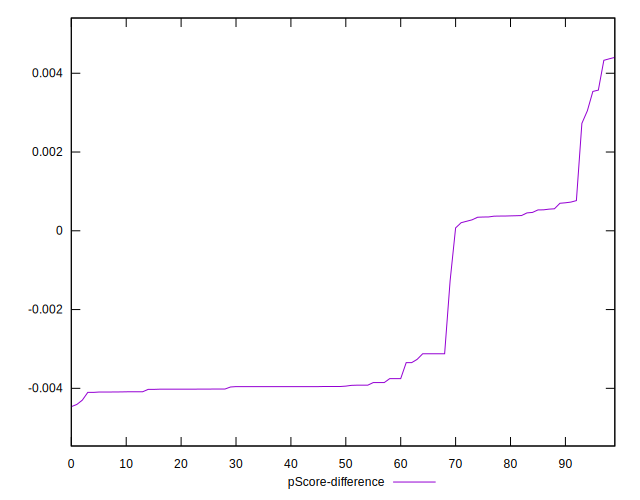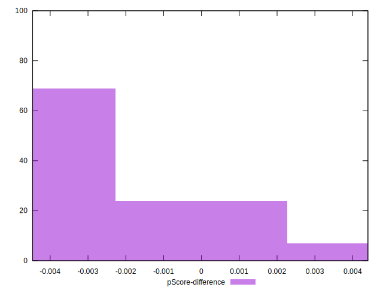