# //estimated-input-latency/samples/pages+cached+noexternal+nomedia+nocss+nojs

[→ Parent](../..)


## Raw


```yaml
p90min: 62.93333333333333
p90max: 235.20000000000002
p90range: 172.26666666666668
p90mean: 108.15018315018314
p90median: 96.26666666666667
p90stdev: 40.58844767696885
p90skewness: 1.5498590344446015
p90eccentricity: 0.9999999999999999
p90discretization: 1.123456790123457
outlandishness: 1.720849719213708
confidence: 50.01204221229392
p90confidence: 16.678609185382868

```

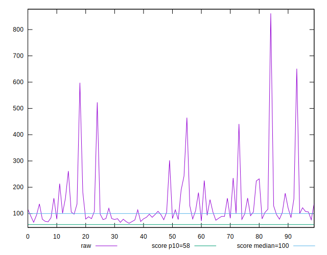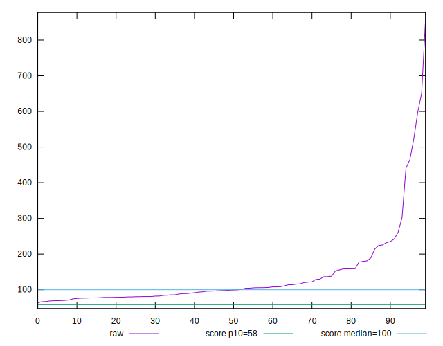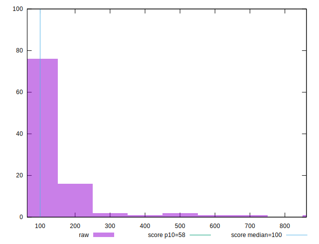
## Score


```yaml
p90min: 0.02
p90max: 0.86
p90range: 0.84
p90mean: 0.5007692307692307
p90median: 0.54
p90stdev: 0.2395519204050302
p90skewness: -0.540780428116705
p90eccentricity: 1.0000000000000004
p90discretization: 1.75
outlandishness: 0.8291906814755035
confidence: 0.10554001135344215
p90confidence: 0.09843670031043228

```

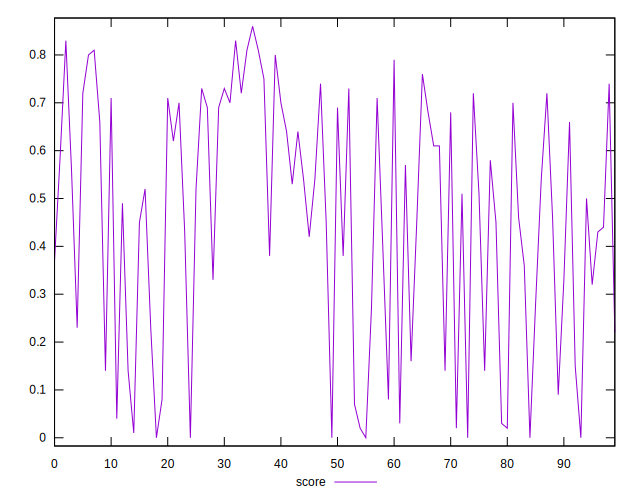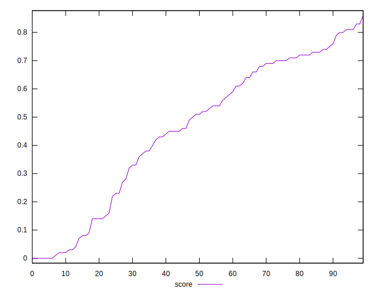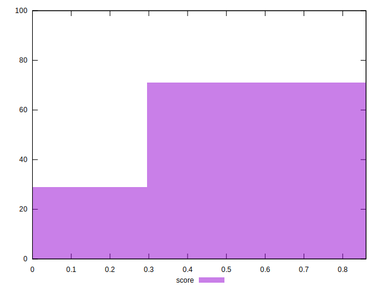
## Raw Estimate

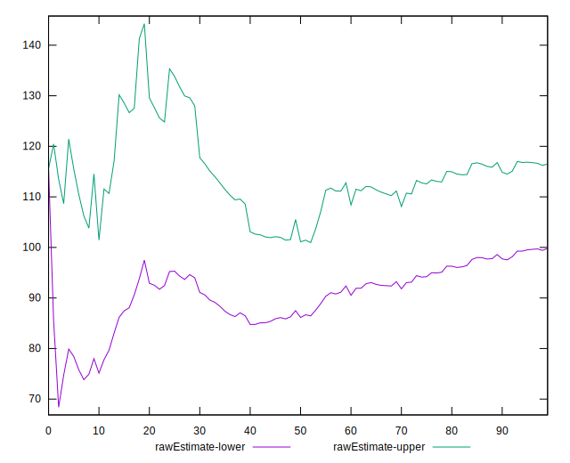
## Score Estimate

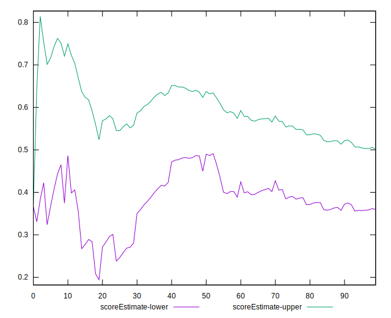
## P Score


```yaml
p90min: 0.022102504324772176
p90max: 0.8620327727006816
p90range: 0.8399302683759093
p90mean: 0.5006591175566448
p90median: 0.5356632412507952
p90stdev: 0.23940445086571216
p90skewness: -0.5412516666500734
p90eccentricity: 0.9999999999999993
p90discretization: 1.123456790123457
outlandishness: 0.8293921999003445
confidence: 0.1054499854471479
p90confidence: 0.09837610211183623

```

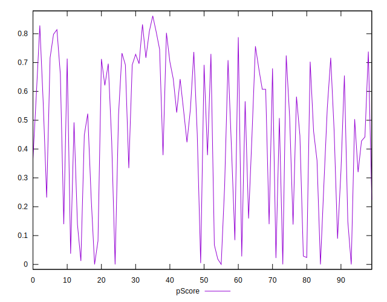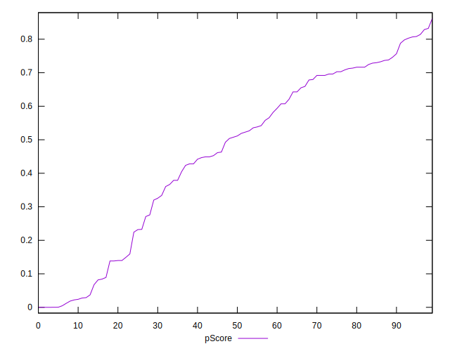
## Score Difference


```yaml
p90min: 0
p90max: 1.1102230246251565e-16
p90range: 1.1102230246251565e-16
p90mean: 1.2200253017858864e-18
p90median: 0
p90stdev: 1.1574176270033067e-17
p90skewness: 9.381423725166233
p90eccentricity: 1.000000000000001
p90discretization: 45.5
outlandishness: 82.80999999999999
confidence: 1.3055982858434594e-17
p90confidence: 4.756061729361274e-18

```

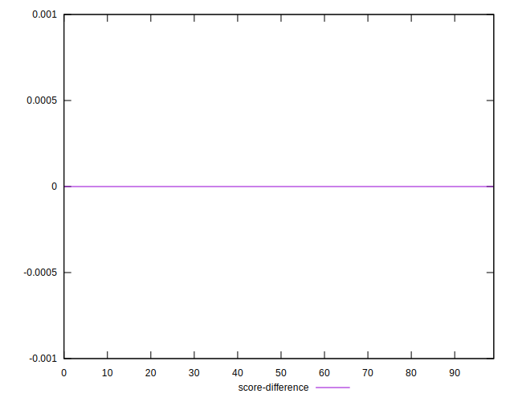
## P Score Difference


```yaml
p90min: -0.004223104538718936
p90max: 0.003984014044244477
p90range: 0.008207118582963413
p90mean: -0.0001901413775178496
p90median: -0.00039778366304576984
p90stdev: 0.0023687850042904772
p90skewness: 0.0941399124243494
p90eccentricity: 1.0000000000000002
p90discretization: 1.123456790123457
outlandishness: 0.055696684562227254
confidence: 0.0010335099507186355
p90confidence: 0.0009733813829291745

```

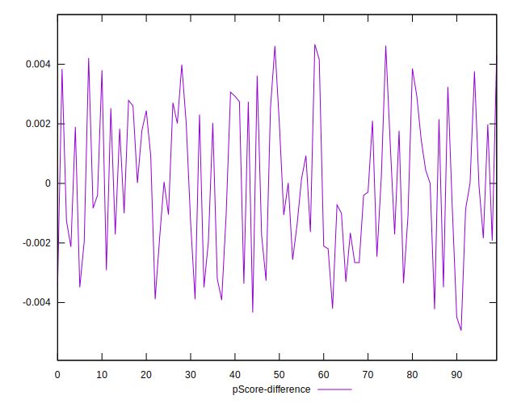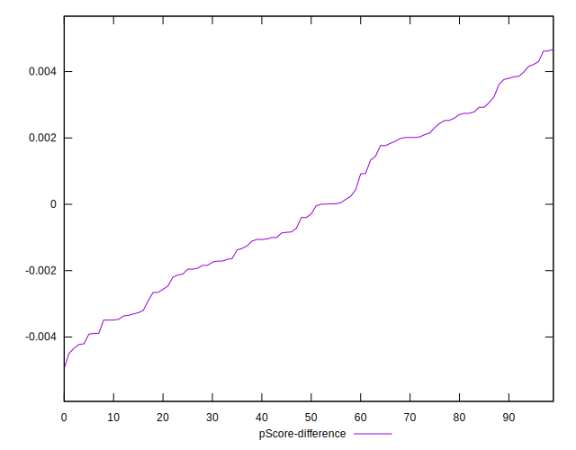