# //estimated-input-latency/samples/pages+cached+noexternal+nomedia+nocss

[→ Parent](../..)


## Raw


```yaml
p90min: 61.2
p90max: 198.4
p90range: 137.2
p90mean: 107.05347985347981
p90median: 102
p90stdev: 30.470864355671058
p90skewness: 0.7786277697788077
p90eccentricity: 1.0000000000000009
p90discretization: 1.0963855421686748
outlandishness: 1.40538292638924
confidence: 31.656447371465816
p90confidence: 12.521090783608031

```

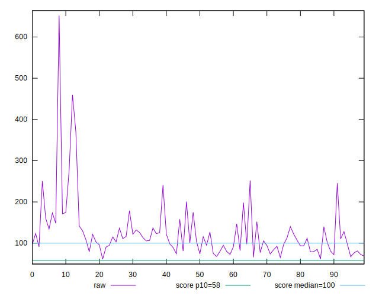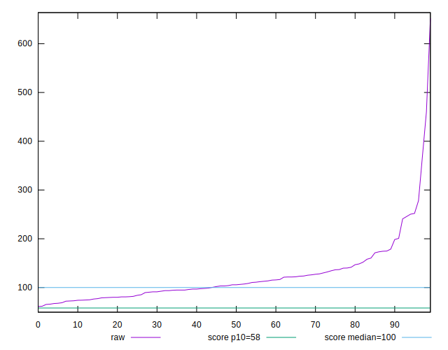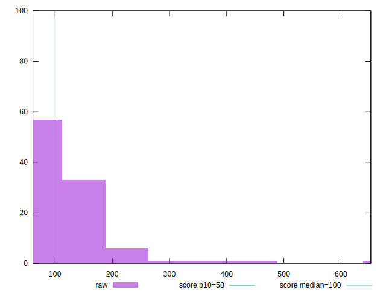
## Score


```yaml
p90min: 0.02
p90max: 0.84
p90range: 0.82
p90mean: 0.46087912087912103
p90median: 0.47
p90stdev: 0.22431653631678877
p90skewness: -0.10465315699984766
p90eccentricity: 0.9999999999999993
p90discretization: 1.5689655172413792
outlandishness: 0.9011187930494982
confidence: 0.098388435068397
p90confidence: 0.09217617467960937

```

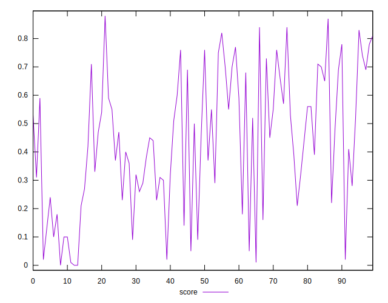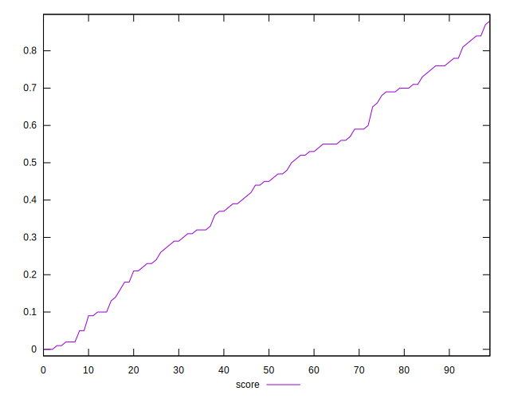
## Raw Estimate

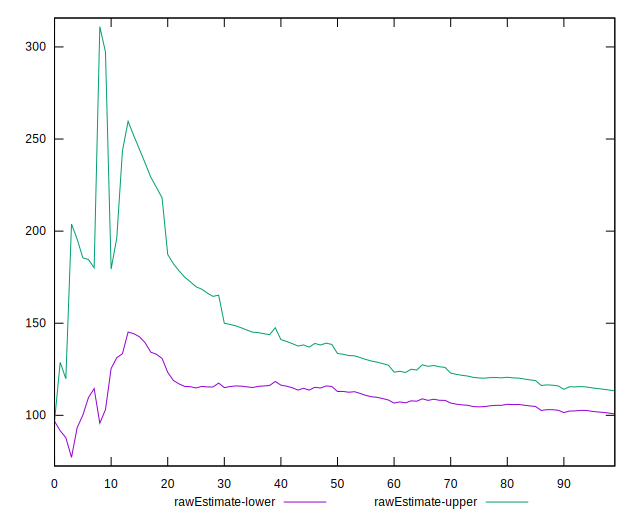
## Score Estimate

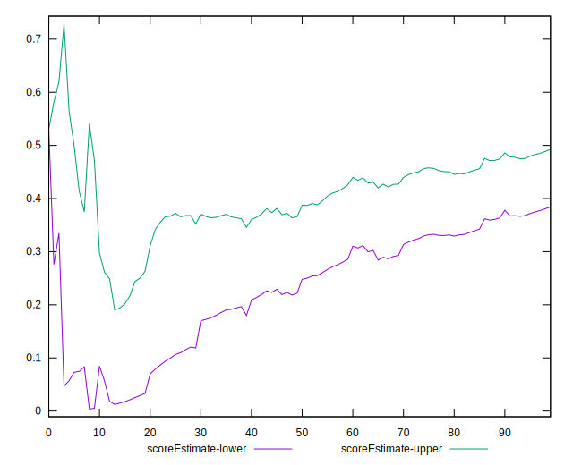
## P Score


```yaml
p90min: 0.01934349846369743
p90max: 0.8416945516490851
p90range: 0.8223510531853877
p90mean: 0.46104191243272974
p90median: 0.47046323393931444
p90stdev: 0.22417479127962398
p90skewness: -0.10694239606755487
p90eccentricity: 1.0000000000000004
p90discretization: 1.0963855421686748
outlandishness: 0.9009124199918584
confidence: 0.09836079790492103
p90confidence: 0.0921179287940398

```

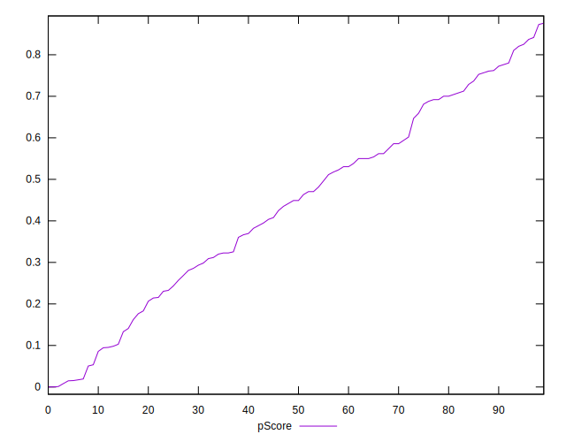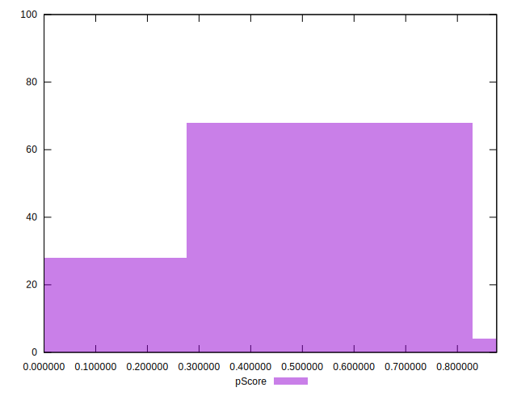
## Score Difference


```yaml
p90min: 0
p90max: 5.551115123125783e-17
p90range: 5.551115123125783e-17
p90mean: 1.8300379526788295e-18
p90median: 0
p90stdev: 9.911532406336115e-18
p90skewness: 5.231388366621644
p90eccentricity: 0.9999999999999988
p90discretization: 45.5
outlandishness: 40.57689999999999
confidence: 1.2797749402560922e-17
p90confidence: 4.07284793814226e-18

```

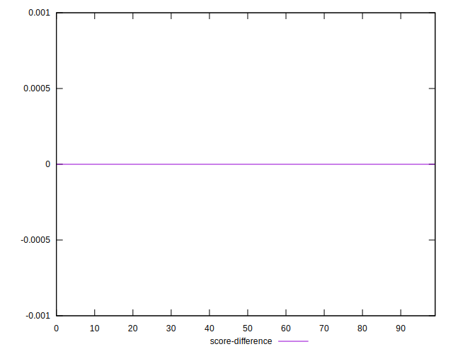
## P Score Difference


```yaml
p90min: -0.004311571232302136
p90max: 0.0044418543658748255
p90range: 0.008753425598176962
p90mean: 0.00026283383830964823
p90median: 0.0004632339393144669
p90stdev: 0.0024325625751211873
p90skewness: -0.2477880342006083
p90eccentricity: 0.9999999999999999
p90discretization: 1.0963855421686748
outlandishness: 0.15782098490725235
confidence: 0.0010690461403133253
p90confidence: 0.0009995888690381364

```

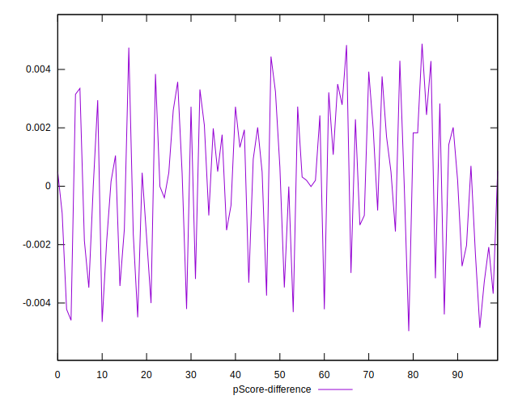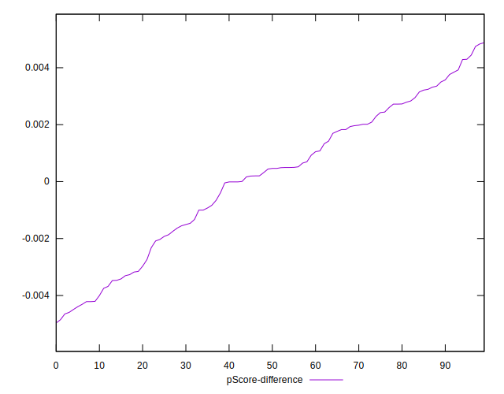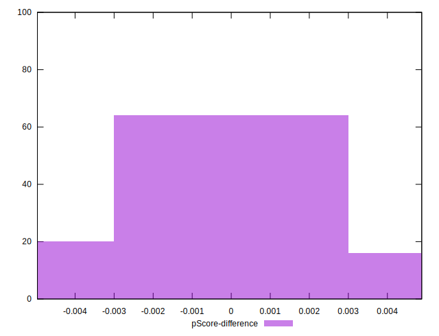