# //estimated-input-latency/samples/pages+cached+noexternal+nomedia

[→ Parent](../..)


## Raw


```yaml
p90min: 60.26666666666668
p90max: 121.60000000000001
p90range: 61.33333333333333
p90mean: 80.46227106227104
p90median: 76.4
p90stdev: 15.017293416517623
p90skewness: 0.9688817387592497
p90eccentricity: 1
p90discretization: 1.1375
outlandishness: 1.3037880013195335
confidence: 23.50358977824095
p90confidence: 6.170907789076239

```

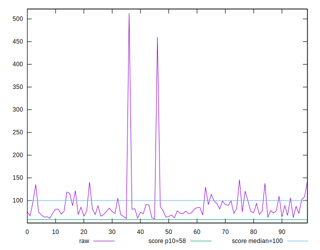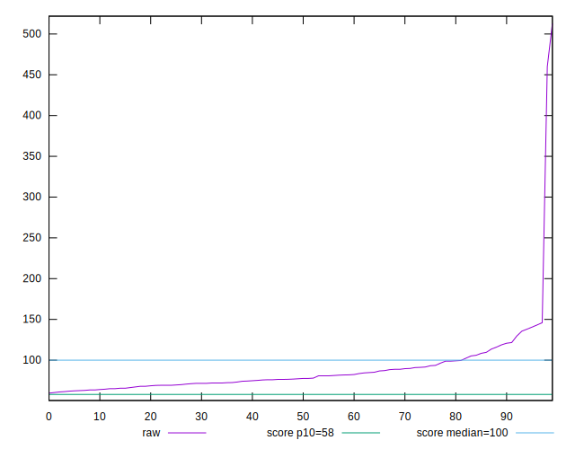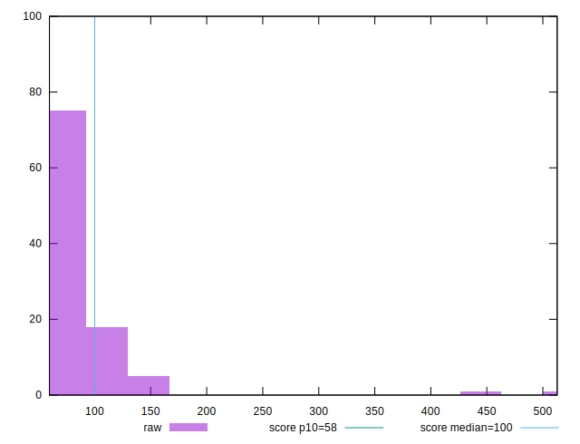
## Score


```yaml
p90min: 0.33
p90max: 0.89
p90range: 0.56
p90mean: 0.7015384615384614
p90median: 0.74
p90stdev: 0.1402660194523882
p90skewness: -0.8882791201989163
p90eccentricity: 1.0000000000000007
p90discretization: 2.275
outlandishness: 0.8714590990737537
confidence: 0.07926302754428005
p90confidence: 0.057638127455738264

```

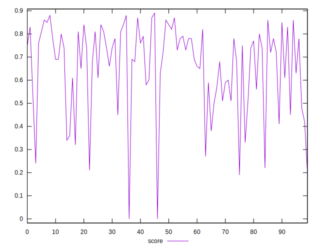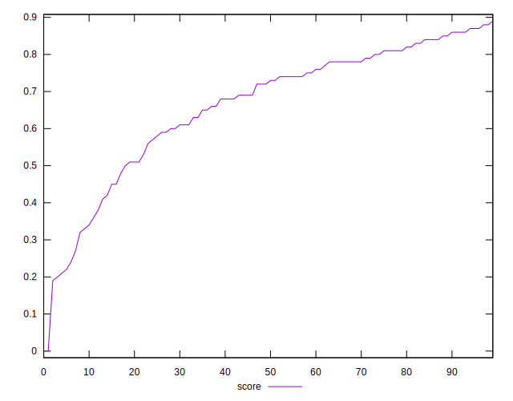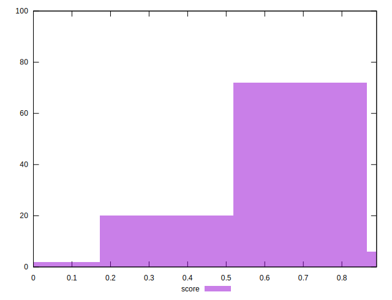
## Raw Estimate


## Score Estimate

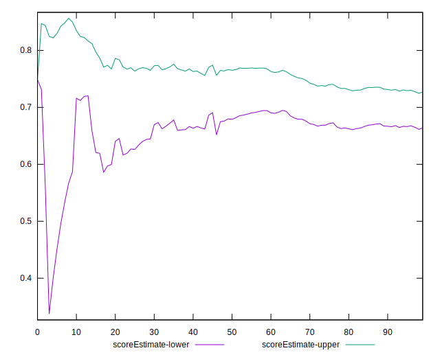
## P Score


```yaml
p90min: 0.32831500190057666
p90max: 0.8882986128235573
p90range: 0.5599836109229805
p90mean: 0.7017490238212917
p90median: 0.7367323376123127
p90stdev: 0.1399178062437863
p90skewness: -0.8811168710950513
p90eccentricity: 0.9999999999999996
p90discretization: 1.1375
outlandishness: 0.871503565608516
confidence: 0.07918249728020066
p90confidence: 0.05749503964746139

```

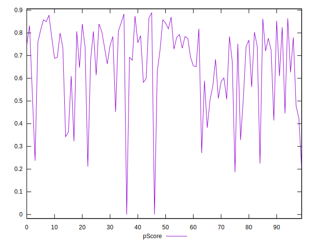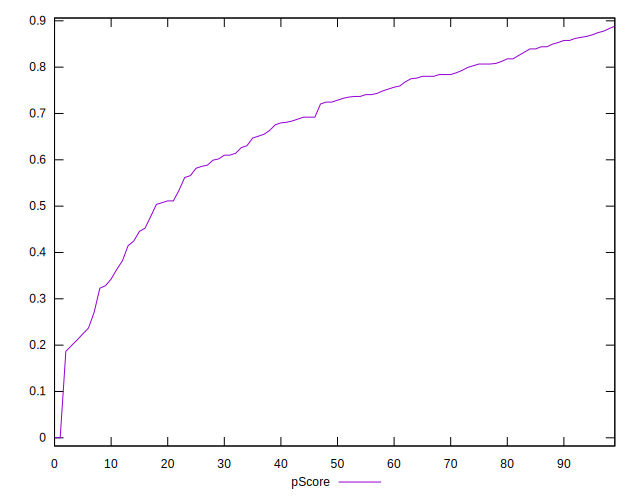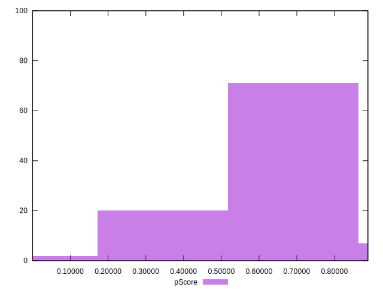
## Score Difference


```yaml
p90min: 0
p90max: 5.551115123125783e-17
p90range: 5.551115123125783e-17
p90mean: 6.100126508929432e-19
p90median: 0
p90stdev: 5.7870881350165325e-18
p90skewness: 9.381423725166233
p90eccentricity: 1.0000000000000022
p90discretization: 45.5
outlandishness: 298.9441
confidence: 1.2573799485070425e-17
p90confidence: 2.3780308646806364e-18

```

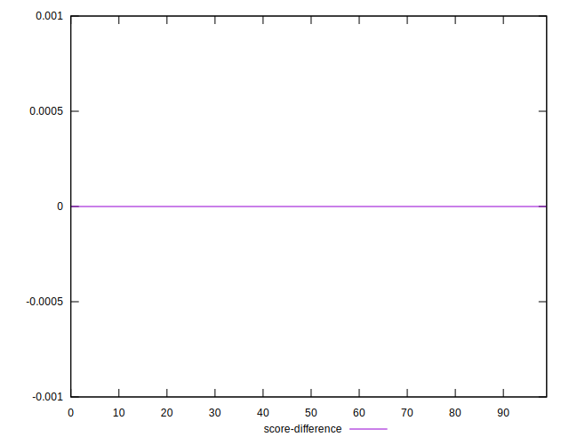
## P Score Difference


```yaml
p90min: -0.0036808770140833724
p90max: 0.004626165243276692
p90range: 0.008307042257360064
p90mean: 0.0005856232347605032
p90median: 0.0005722649666859425
p90stdev: 0.0025604800105756033
p90skewness: -0.06062221275998875
p90eccentricity: 1.0000000000000002
p90discretization: 1.1375
outlandishness: 0.13263309306761167
confidence: 0.0011190429407636525
p90confidence: 0.0010521527150595563

```

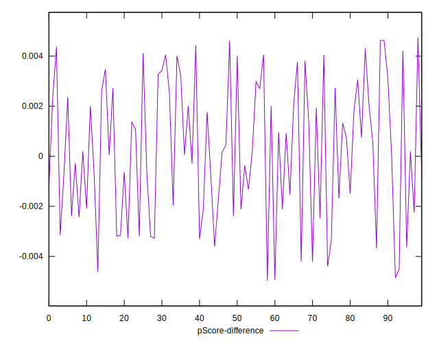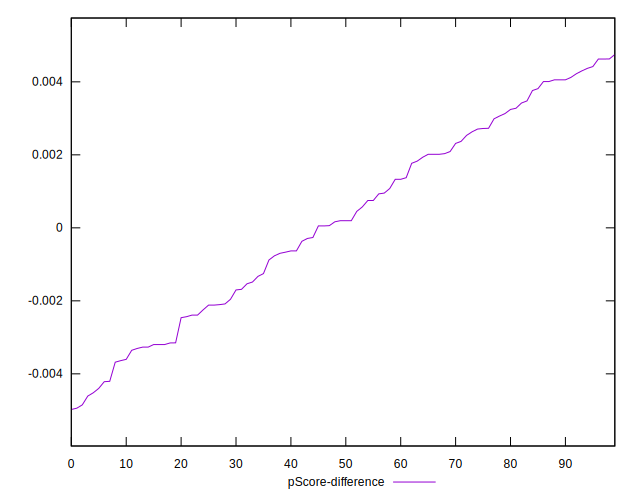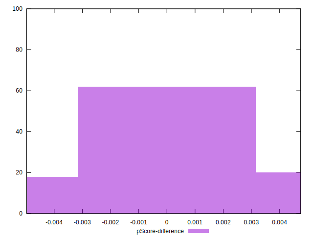