# //estimated-input-latency/samples/pages+cached+noexternal

[→ Parent](../..)


## Raw


```yaml
p90min: 56.800000000000004
p90max: 101.2
p90range: 44.4
p90mean: 71.5318681318681
p90median: 69.2
p90stdev: 9.51655829898956
p90skewness: 0.7533672052509153
p90eccentricity: 0.9999999999999996
p90discretization: 1.1375
outlandishness: 1.1768788824306762
confidence: 10.09674257873101
p90confidence: 3.9105451364384862

```

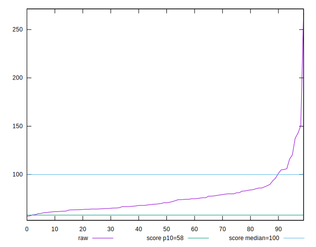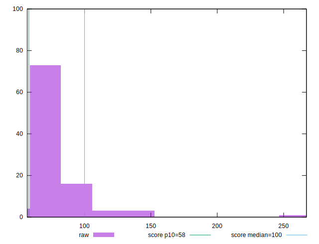
## Score


```yaml
p90min: 0.49
p90max: 0.91
p90range: 0.42000000000000004
p90mean: 0.7805494505494506
p90median: 0.81
p90stdev: 0.09152388311810634
p90skewness: -0.8770946303378344
p90eccentricity: 0.9999999999999996
p90discretization: 2.84375
outlandishness: 0.8912843243468342
confidence: 0.06651805917518261
p90confidence: 0.03760900367031628

```

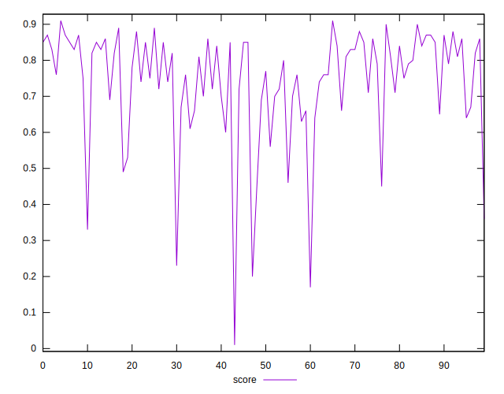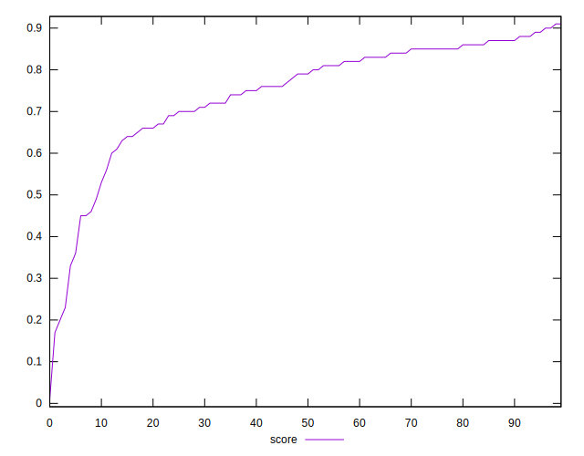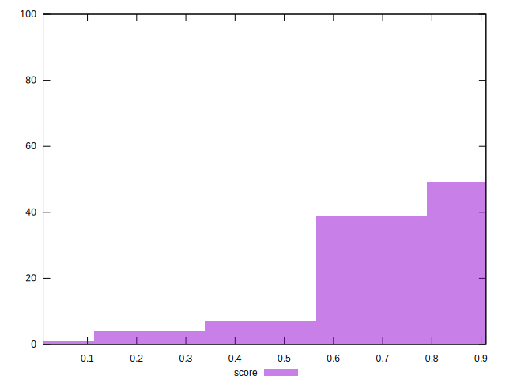
## Raw Estimate

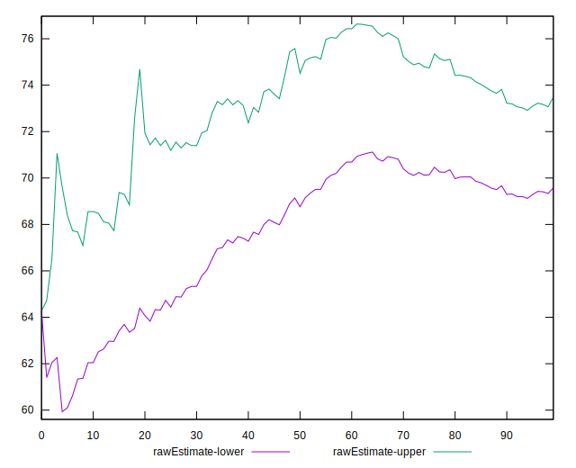
## Score Estimate

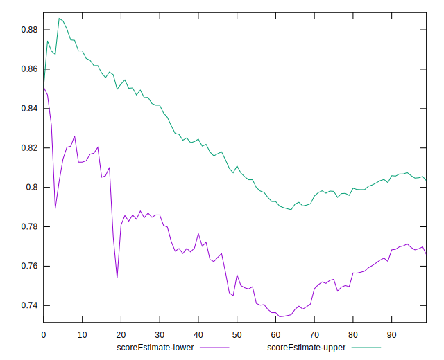
## P Score


```yaml
p90min: 0.48880560822979346
p90max: 0.9083622590117726
p90range: 0.4195566507819791
p90mean: 0.7805074561902835
p90median: 0.8068023930329455
p90stdev: 0.09127524063210125
p90skewness: -0.8830225251187362
p90eccentricity: 0.9999999999999999
p90discretization: 1.1375
outlandishness: 0.891138939785818
confidence: 0.06652249174021452
p90confidence: 0.037506831473833824

```

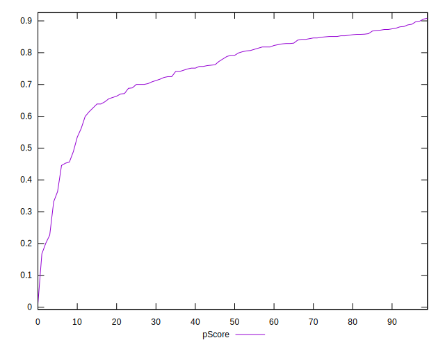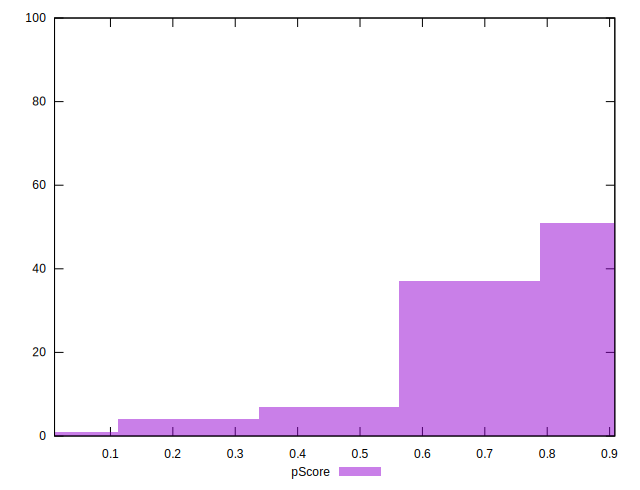
## Score Difference


```yaml
p90min: 0
p90max: 1.1102230246251565e-16
p90range: 1.1102230246251565e-16
p90mean: 7.320151810715318e-18
p90median: 0
p90stdev: 2.755205048392678e-17
p90skewness: 3.498178797883376
p90eccentricity: 1.0000000000000009
p90discretization: 45.5
outlandishness: 5.175624999999999
confidence: 1.5539727857965507e-17
p90confidence: 1.1321691480655113e-17

```

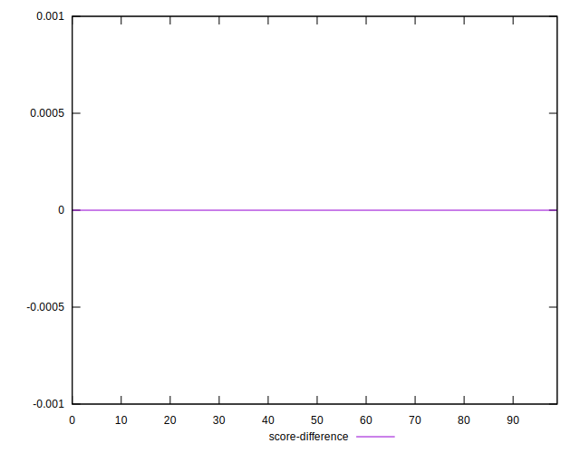
## P Score Difference


```yaml
p90min: -0.0045187215857036
p90max: 0.004213241125337497
p90range: 0.008731962711041097
p90mean: -0.0002615166029870474
p90median: -0.0002648153778327389
p90stdev: 0.0022814600492611385
p90skewness: 0.023727448336024193
p90eccentricity: 1.0000000000000002
p90discretization: 1.123456790123457
outlandishness: 0.14547647444339826
confidence: 0.0010217443190054822
p90confidence: 0.0009374978032304141

```

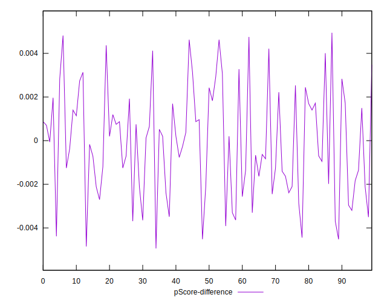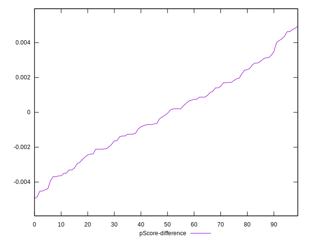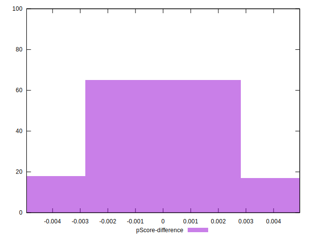