# //estimated-input-latency/samples/pages+cached

[→ Parent](../..)


## Raw


```yaml
p90min: 59.2
p90max: 158
p90range: 98.8
p90mean: 83.42197802197806
p90median: 78.80000000000001
p90stdev: 19.826258916083457
p90skewness: 1.4908979370558946
p90eccentricity: 1.0000000000000004
p90discretization: 1.1818181818181819
outlandishness: 1.6859952093483435
confidence: 43.163042483127185
p90confidence: 8.147008397593964

```

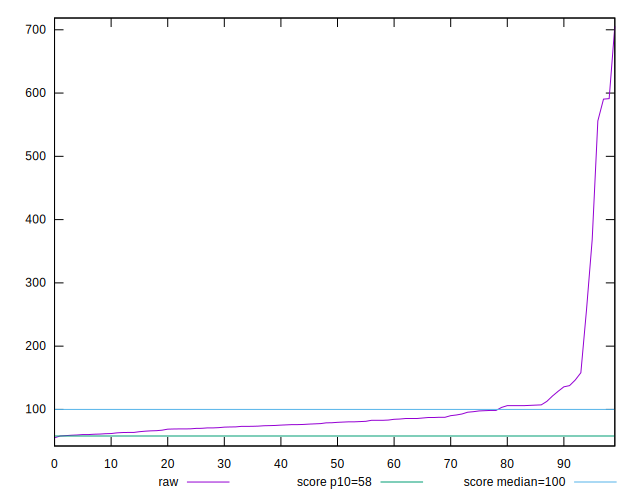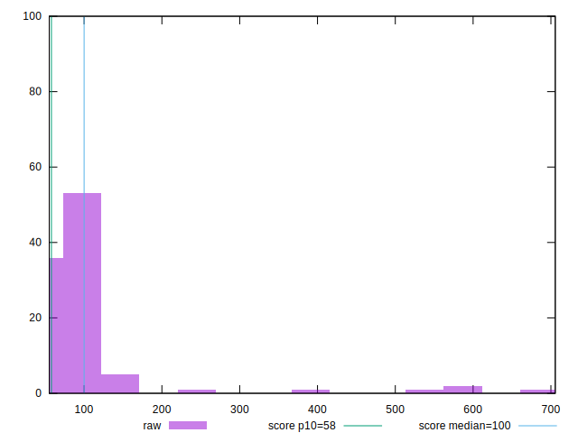
## Score


```yaml
p90min: 0.24
p90max: 0.92
p90range: 0.68
p90mean: 0.6960439560439565
p90median: 0.73
p90stdev: 0.15365781250099678
p90skewness: -0.8499368239770321
p90eccentricity: 0.9999999999999999
p90discretization: 2.2195121951219514
outlandishness: 0.8428074829641684
confidence: 0.09200480965106528
p90confidence: 0.06314108446278865

```

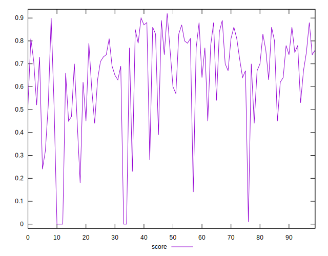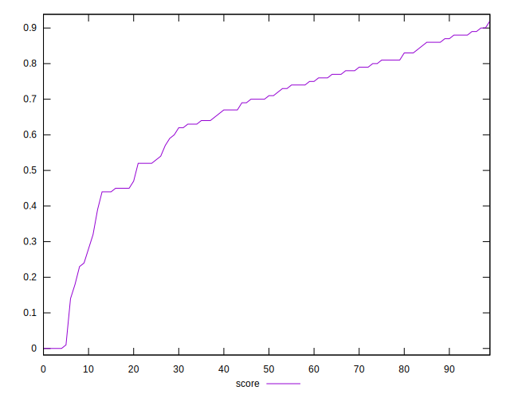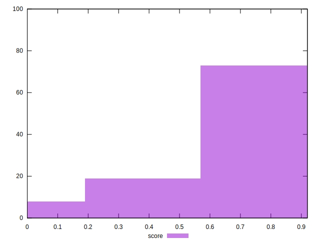
## Raw Estimate

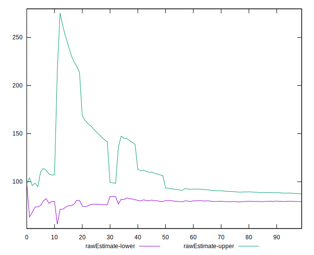
## Score Estimate

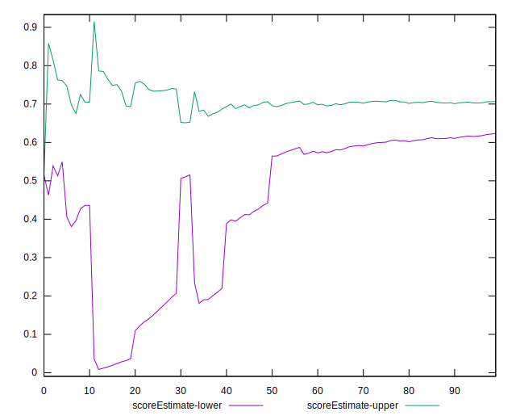
## P Score


```yaml
p90min: 0.23613636957125328
p90max: 0.9189375176189978
p90range: 0.6828011480477445
p90mean: 0.6954974699821581
p90median: 0.7327062117102235
p90stdev: 0.15402645667694298
p90skewness: -0.861090331896243
p90eccentricity: 0.9999999999999993
p90discretization: 1.1818181818181819
outlandishness: 0.842986682846257
confidence: 0.09197980006417916
p90confidence: 0.06329256776631387

```

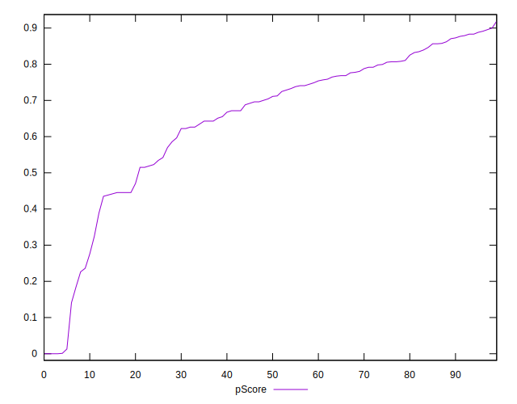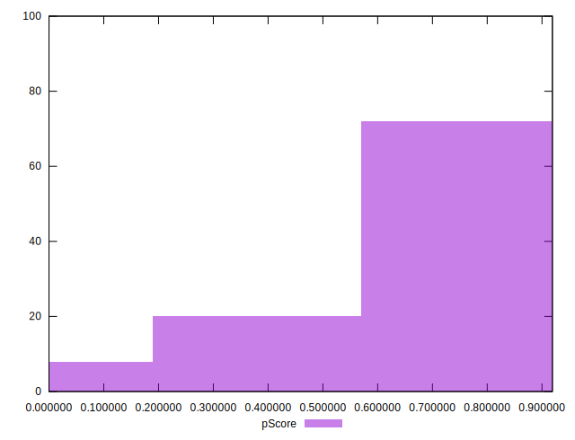
## Score Difference


```yaml
p90min: 0
p90max: 1.1102230246251565e-16
p90range: 1.1102230246251565e-16
p90mean: 1.8300379526788295e-18
p90median: 0
p90stdev: 1.2882681540550782e-17
p90skewness: 7.483640216131411
p90eccentricity: 1.0000000000000009
p90discretization: 30.333333333333332
outlandishness: 40.57689999999999
confidence: 1.3162534592701633e-17
p90confidence: 5.29375285265009e-18

```

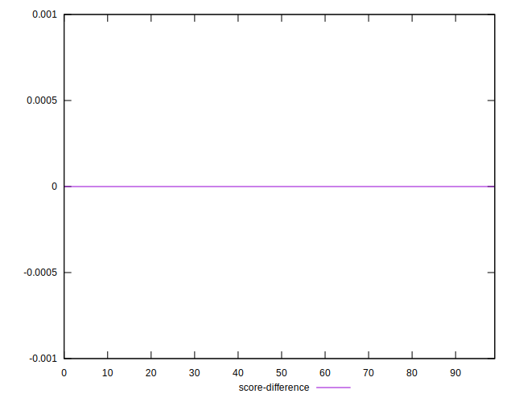
## P Score Difference


```yaml
p90min: -0.004965325701486334
p90max: 0.004051427171184008
p90range: 0.009016752872670342
p90mean: -0.0009310985002792616
p90median: -0.001062482381002261
p90stdev: 0.002575873528712397
p90skewness: 0.04786418540462441
p90eccentricity: 0.9999999999999999
p90discretization: 1.1818181818181819
outlandishness: 0.2170871276614964
confidence: 0.0011456085818229318
p90confidence: 0.0010584782211502308

```

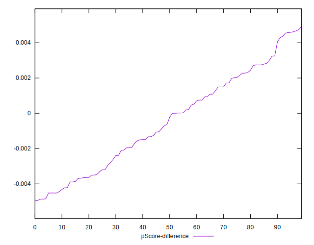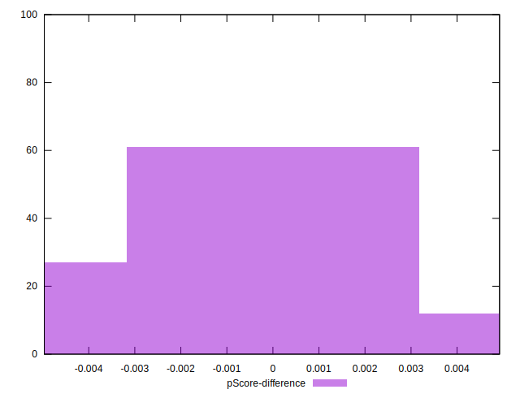