# //estimated-input-latency/samples/pages

[→ Parent](../..)


## Raw


```yaml
p90min: 60.26666666666668
p90max: 188.8000000000005
p90range: 128.53333333333381
p90mean: 112.11355311355304
p90median: 112.33333333333334
p90stdev: 29.032075216985223
p90skewness: 0.4821911321845652
p90eccentricity: 1.0000000000000009
p90discretization: 1.0340909090909092
outlandishness: 1.275603858343373
confidence: 26.618520249099305
p90confidence: 11.929863399518354

```

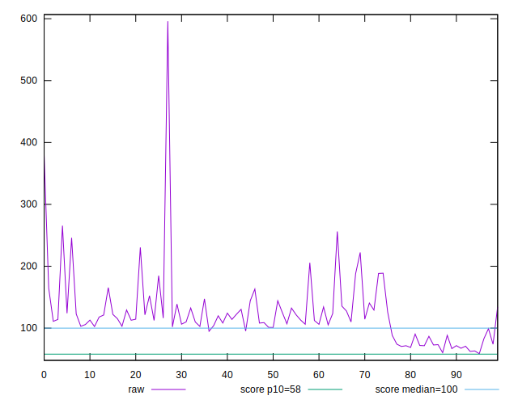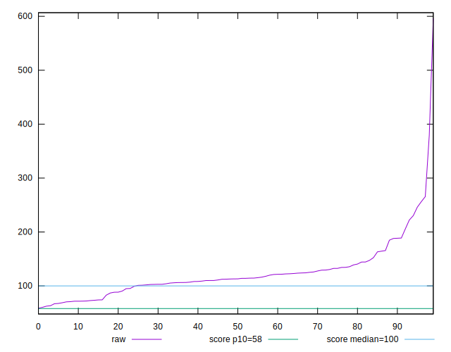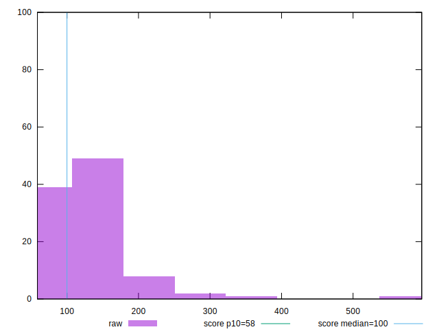
## Score


```yaml
p90min: 0.01
p90max: 0.8
p90range: 0.79
p90mean: 0.37824175824175843
p90median: 0.38
p90stdev: 0.2051833455454323
p90skewness: 0.29588855573019446
p90eccentricity: 1.0000000000000002
p90discretization: 1.9361702127659575
outlandishness: 1.1402727847392882
confidence: 0.09305168409862596
p90confidence: 0.08431396191689

```

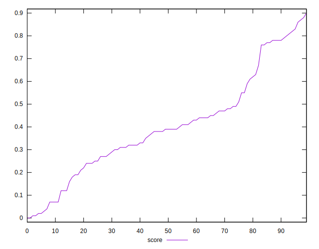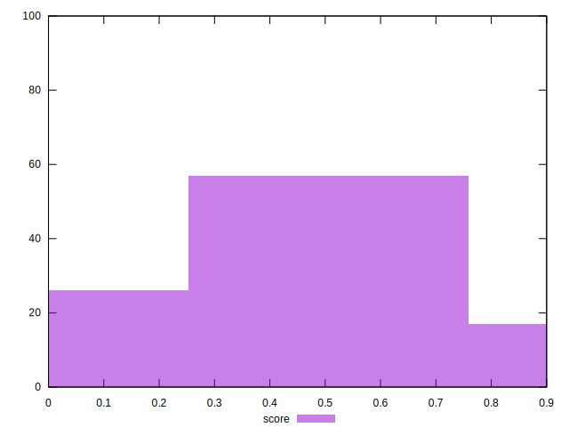
## Raw Estimate

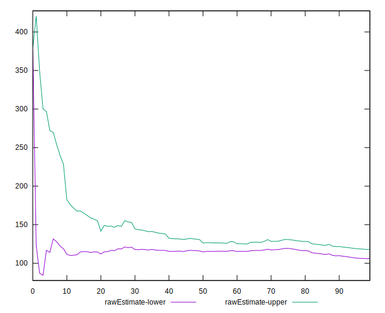
## Score Estimate

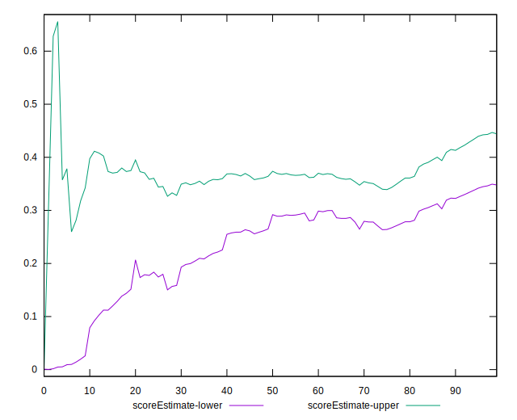
## P Score


```yaml
p90min: 0.010777536726675307
p90max: 0.7955200927037503
p90range: 0.7847425559770751
p90mean: 0.37877411891389706
p90median: 0.37841787001689436
p90stdev: 0.20492143831536777
p90skewness: 0.3028079719684648
p90eccentricity: 0.9999999999999999
p90discretization: 1.0340909090909092
outlandishness: 1.1395931453777464
confidence: 0.09290730413071857
p90confidence: 0.08420633897038476

```

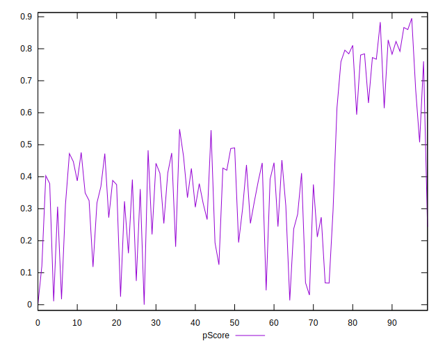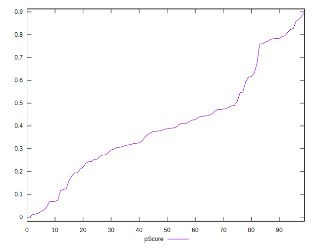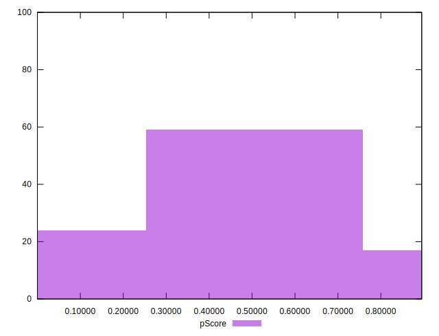
## Score Difference


```yaml
p90min: 0
p90max: 0
p90range: 0
p90mean: 0
p90median: 0
p90stdev: 0
p90skewness: .nan
p90eccentricity: .nan
p90discretization: 91
outlandishness: .inf
confidence: 8.080541292774457e-18
p90confidence: 0

```

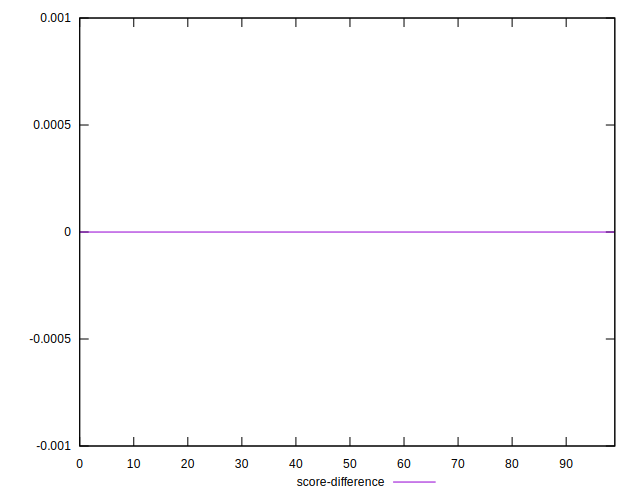
## P Score Difference


```yaml
p90min: -0.0038434268786609604
p90max: 0.004826973663219027
p90range: 0.008670400541879987
p90mean: 0.0009314676460662523
p90median: 0.0011186123699338246
p90stdev: 0.0025993890883939793
p90skewness: -0.26327238601469855
p90eccentricity: 0.9999999999999999
p90discretization: 1.0340909090909092
outlandishness: 0.23123875987339612
confidence: 0.0011440712389160948
p90confidence: 0.0010681412374061396

```

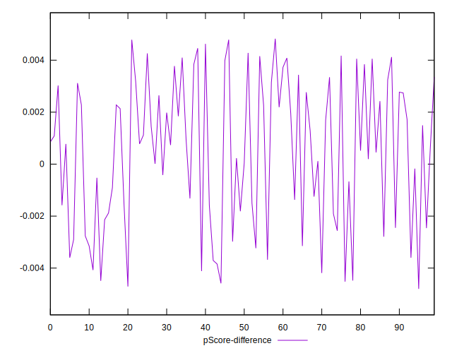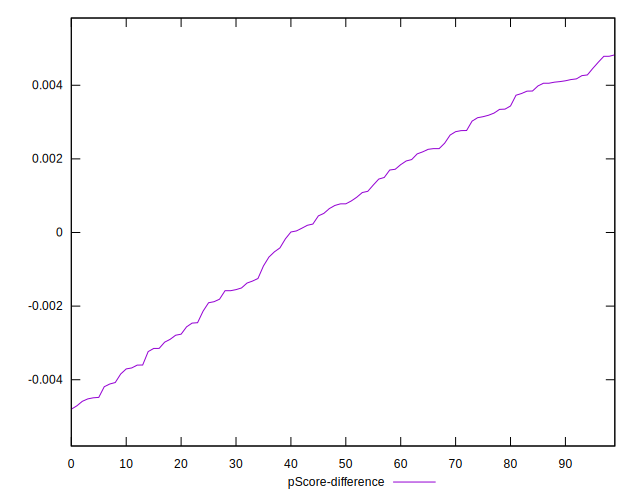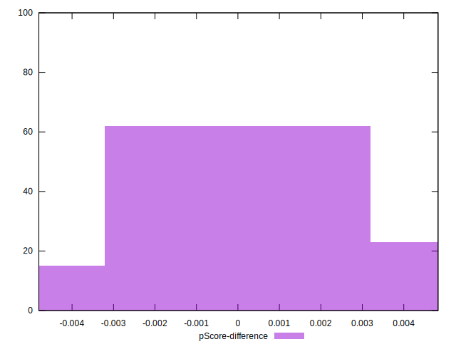