# //first-contentful-paint/samples/pages+cached+noexternal+nomedia+nocss+nojs

[→ Parent](../..)


## Raw


```yaml
p90min: 2224.6625
p90max: 4124.911999999999
p90range: 1900.2494999999994
p90mean: 2972.2419230769224
p90median: 3003.5629999999996
p90stdev: 472.4871516324801
p90skewness: -0.14282402887052373
p90eccentricity: 1.0000000000000002
p90discretization: 1
outlandishness: 1.1384588330343908
confidence: 344.22448154137965
p90confidence: 194.15447000858057

```

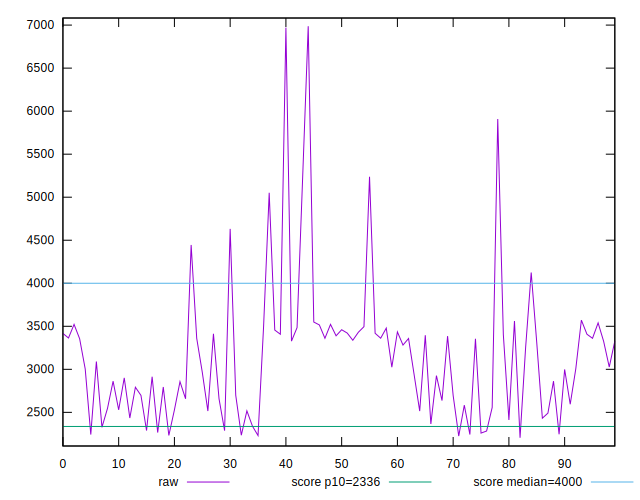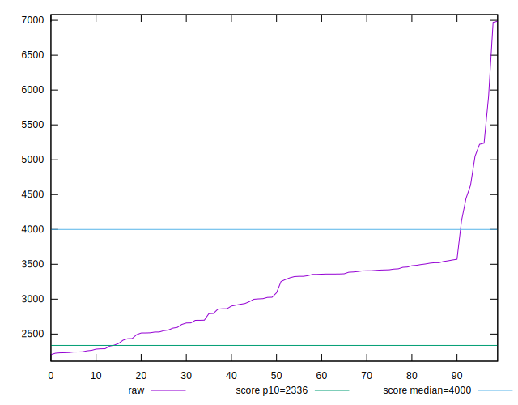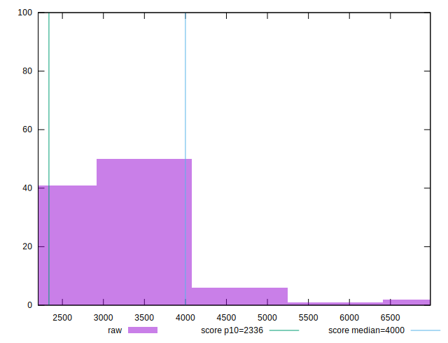
## Score


```yaml
p90min: 0.61
p90max: 0.92
p90range: 0.31000000000000005
p90mean: 0.7586813186813186
p90median: 0.75
p90stdev: 0.10961680298732573
p90skewness: 0.1408640923836626
p90eccentricity: 0.9999999999999992
p90discretization: 3.5
outlandishness: 0.8866742800787892
confidence: 0.07028009984797623
p90confidence: 0.04504374820459378

```

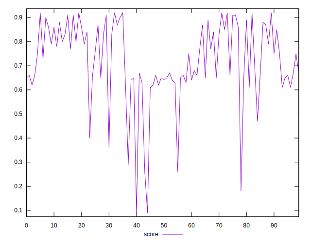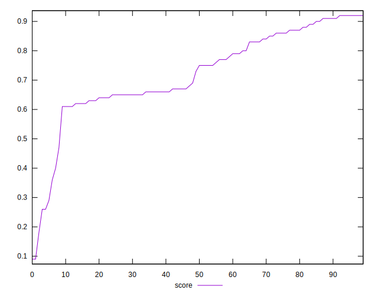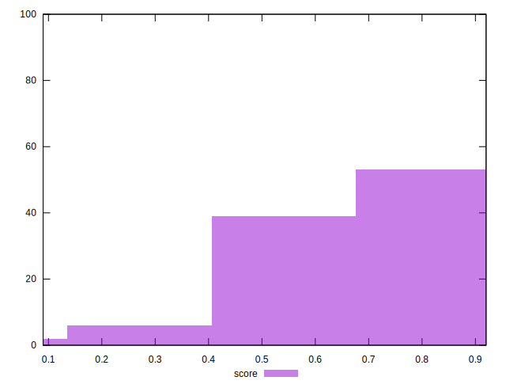
## Raw Estimate

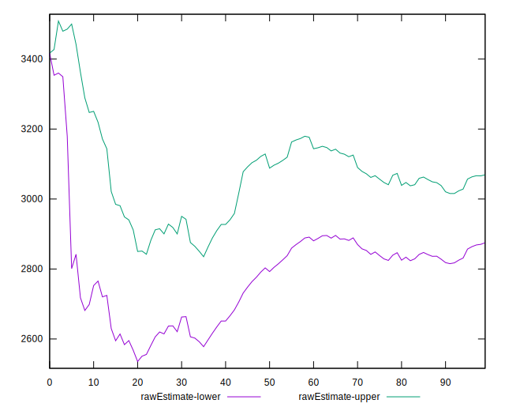
## Score Estimate

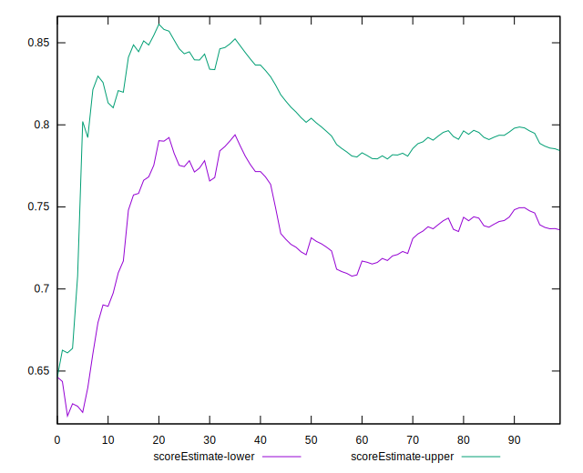
## P Score


```yaml
p90min: 0.6063914190413845
p90max: 0.9221273143871366
p90range: 0.3157358953457521
p90mean: 0.7583846571820064
p90median: 0.7538105462827926
p90stdev: 0.10928093218269641
p90skewness: 0.13554005685327472
p90eccentricity: 1.0000000000000002
p90discretization: 1
outlandishness: 0.8868932910011388
confidence: 0.07010403996810122
p90confidence: 0.04490573213825466

```

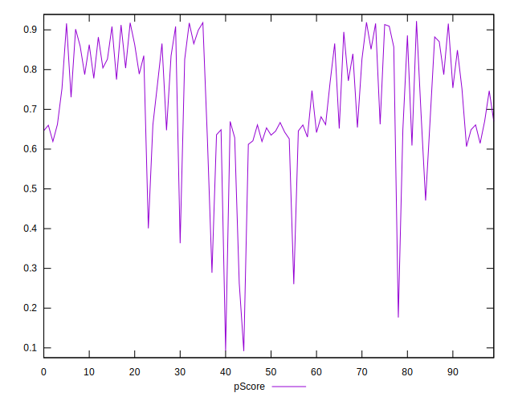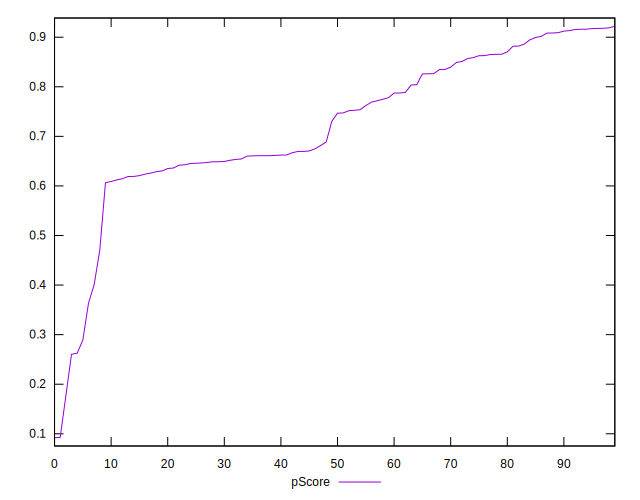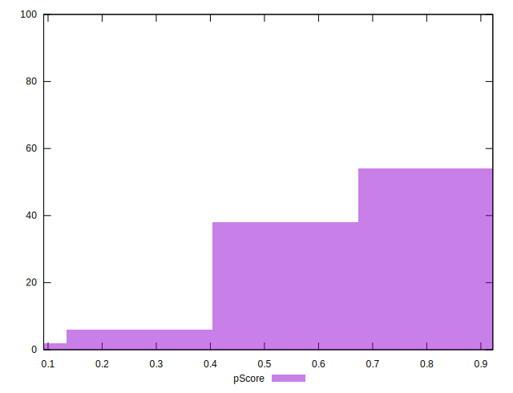
## Score Difference


```yaml
p90min: 0
p90max: 0
p90range: 0
p90mean: 0
p90median: 0
p90stdev: 0
p90skewness: .nan
p90eccentricity: .nan
p90discretization: 91
outlandishness: .inf
confidence: 9.680130628467232e-18
p90confidence: 0

```

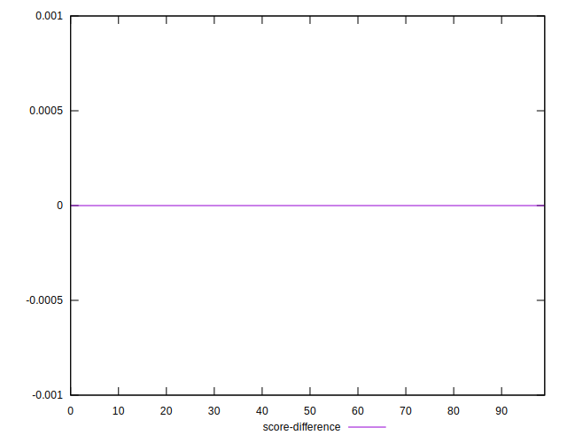
## P Score Difference


```yaml
p90min: -0.004479820585798655
p90max: 0.004320602088882186
p90range: 0.008800422674680841
p90mean: -0.0002547714904170029
p90median: -0.0003975519834550356
p90stdev: 0.002473734293105092
p90skewness: -0.06338916544266085
p90eccentricity: 1
p90discretization: 1
outlandishness: 0.5629621316126472
confidence: 0.0010856466061059714
p90confidence: 0.0010165071557193487

```

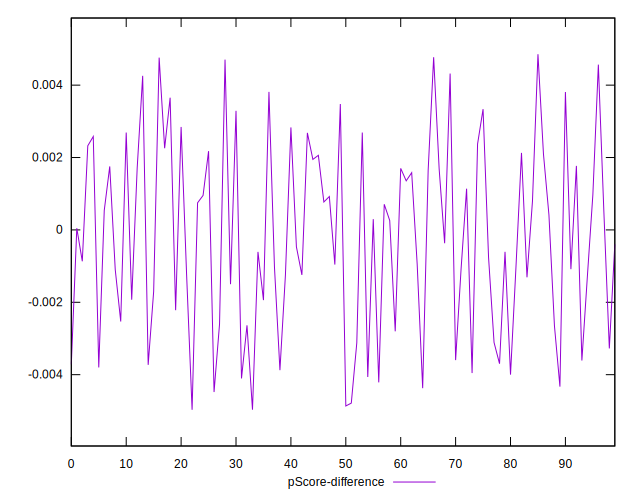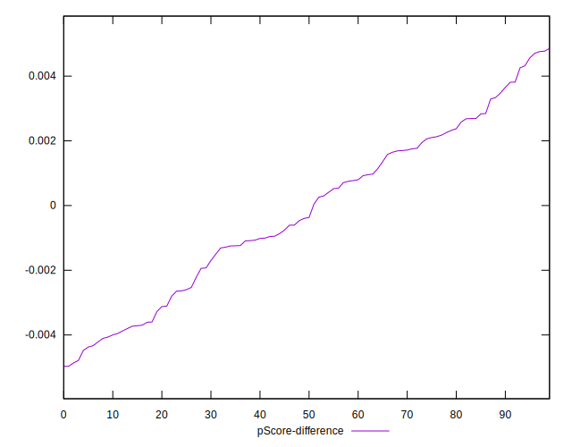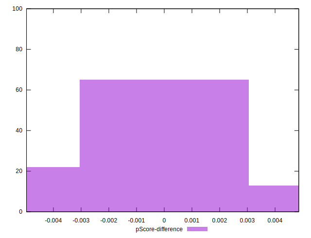