# //first-contentful-paint/samples/pages+cached+noexternal+nomedia+nocss

[→ Parent](../..)


## Raw


```yaml
p90min: 2187.0145
p90max: 4751.3295
p90range: 2564.3149999999996
p90mean: 3065.6725604395615
p90median: 3306.3585000000003
p90stdev: 532.5807604420653
p90skewness: 0.13474172514196153
p90eccentricity: 1.0000000000000002
p90discretization: 1
outlandishness: 1.170933112185116
confidence: 386.8410449149487
p90confidence: 218.84814205662678

```

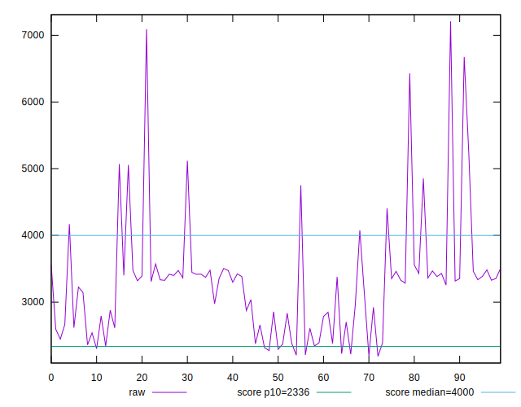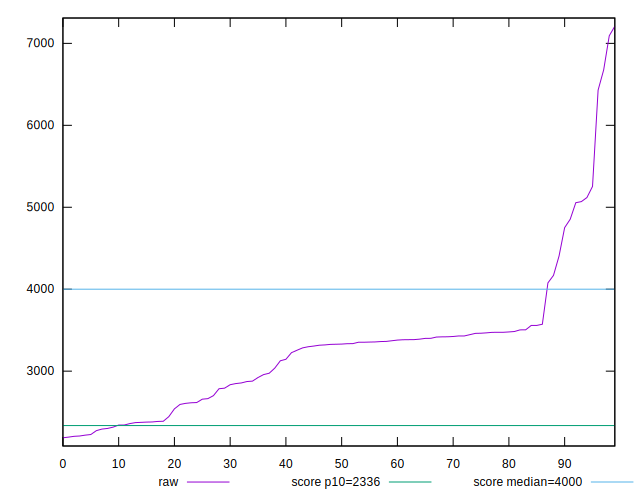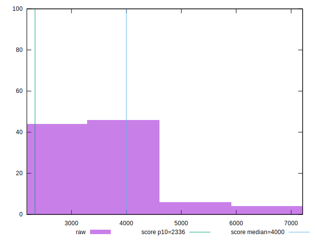
## Score


```yaml
p90min: 0.34
p90max: 0.92
p90range: 0.5800000000000001
p90mean: 0.7299999999999999
p90median: 0.68
p90stdev: 0.12563683928138034
p90skewness: -0.19881998461338138
p90eccentricity: 0.9999999999999992
p90discretization: 2.935483870967742
outlandishness: 0.8748655282416963
confidence: 0.07609928111821596
p90confidence: 0.051626703202298785

```

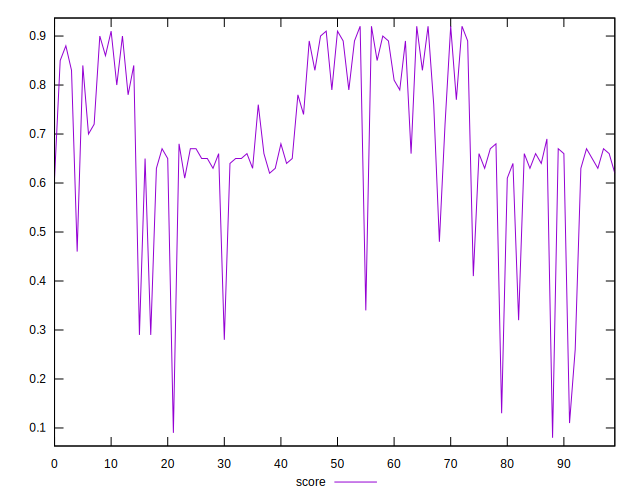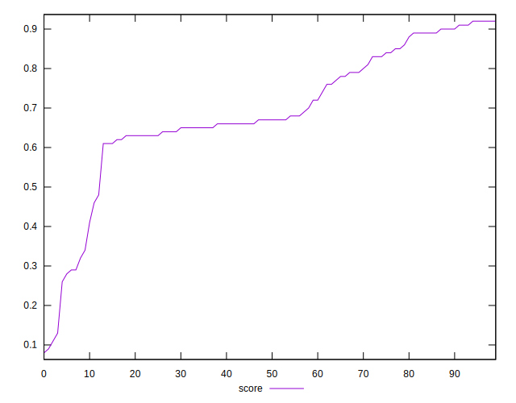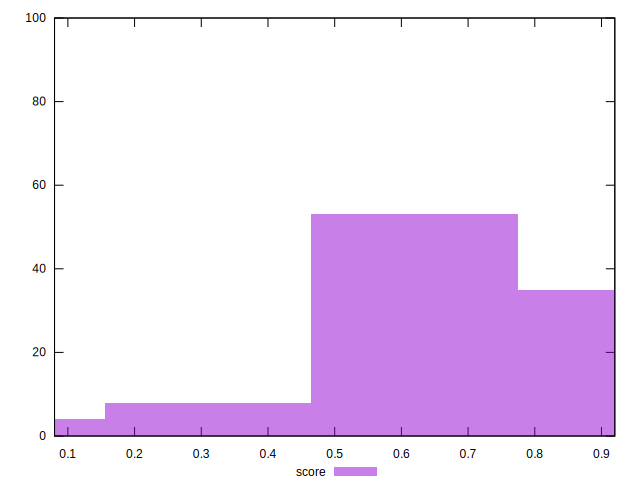
## Raw Estimate

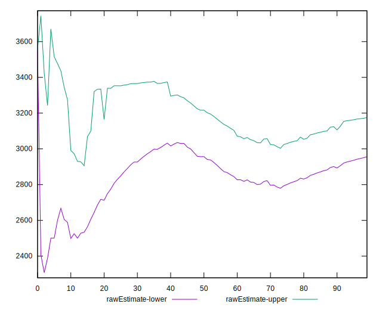
## Score Estimate

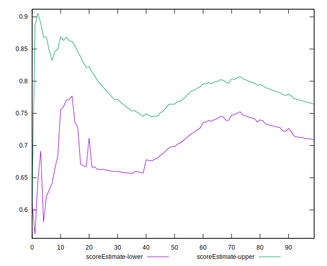
## P Score


```yaml
p90min: 0.34085299760073623
p90max: 0.9248649865095251
p90range: 0.5840119889087889
p90mean: 0.7306641243608545
p90median: 0.675006411148369
p90stdev: 0.12575016536336328
p90skewness: -0.19805665011114768
p90eccentricity: 1
p90discretization: 1
outlandishness: 0.8745630331322308
confidence: 0.07628026258133258
p90confidence: 0.05167327116781806

```

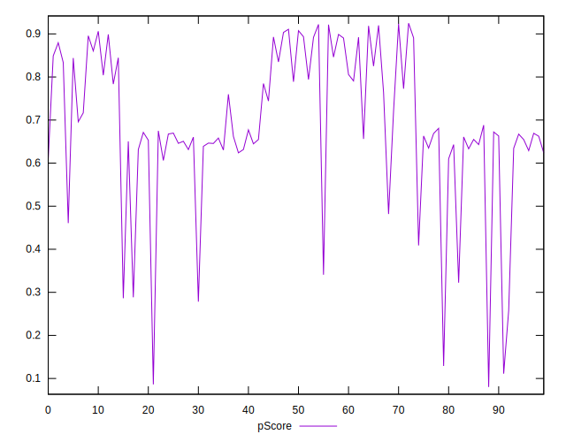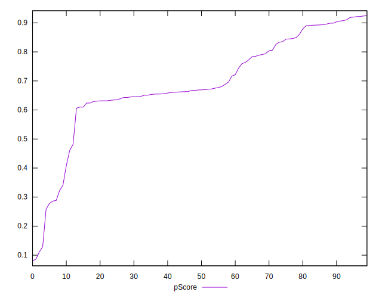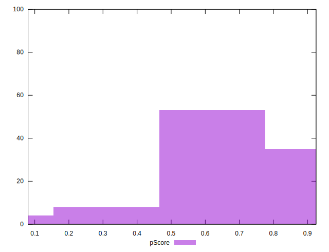
## Score Difference


```yaml
p90min: 0
p90max: 0
p90range: 0
p90mean: 0
p90median: 0
p90stdev: 0
p90skewness: .nan
p90eccentricity: .nan
p90discretization: 91
outlandishness: .inf
confidence: 9.680130628467232e-18
p90confidence: 0

```

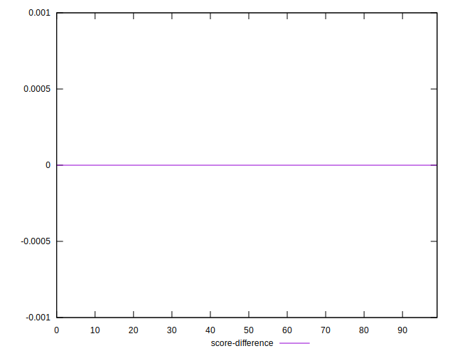
## P Score Difference


```yaml
p90min: -0.0038833726414605474
p90max: 0.004875857227636948
p90range: 0.008759229869097496
p90mean: 0.000892578663246198
p90median: 0.0007727606252261321
p90stdev: 0.0025162826762140373
p90skewness: -0.2068029336134023
p90eccentricity: 1.0000000000000002
p90discretization: 1
outlandishness: 0.3176016290213291
confidence: 0.0011150231226350993
p90confidence: 0.0010339911417784342

```

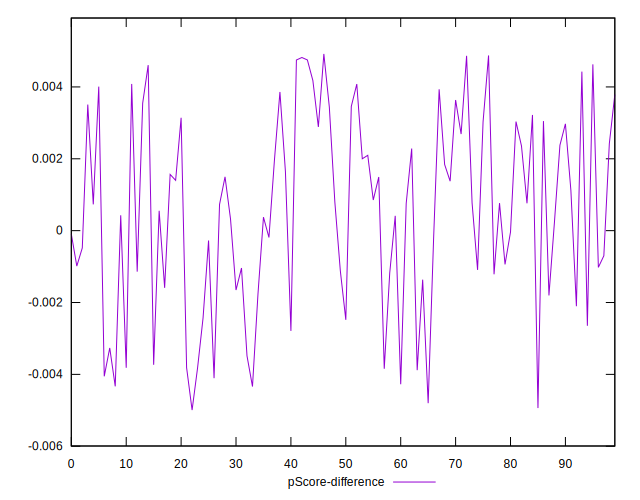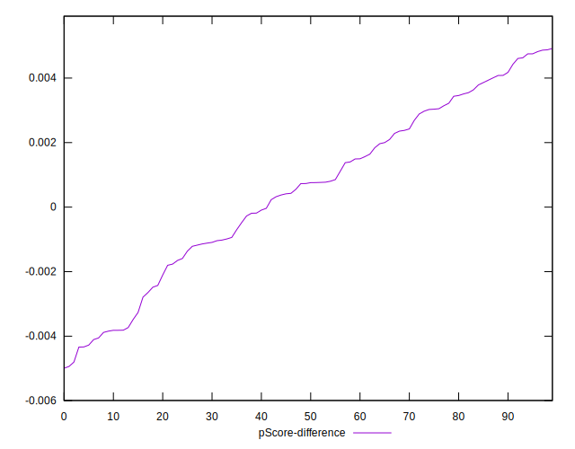