# //first-contentful-paint/samples/pages+cached+noexternal+nomedia

[→ Parent](../..)


## Raw


```yaml
p90min: 2053.962
p90max: 5138.5650000000005
p90range: 3084.6030000000005
p90mean: 3222.607137362637
p90median: 3309.3445
p90stdev: 656.4917478499585
p90skewness: 0.6327398138803031
p90eccentricity: 1.0000000000000007
p90discretization: 1
outlandishness: 1.1615542211370173
confidence: 403.83768492542276
p90confidence: 269.76565802567984

```

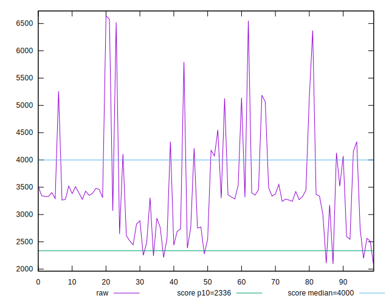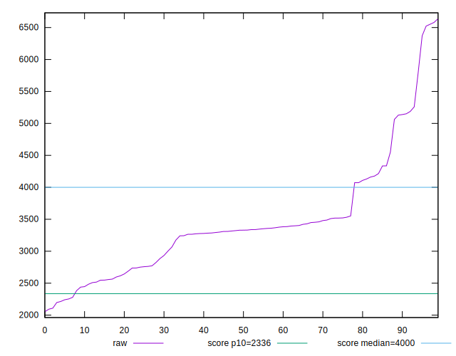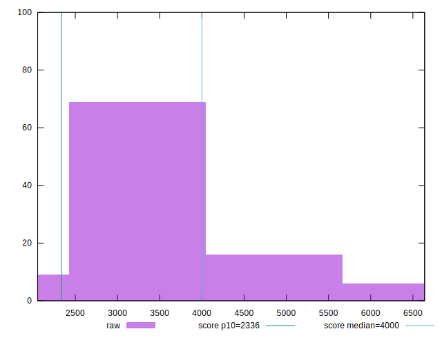
## Score


```yaml
p90min: 0.28
p90max: 0.94
p90range: 0.6599999999999999
p90mean: 0.6942857142857141
p90median: 0.67
p90stdev: 0.15314392323722742
p90skewness: -0.5776889465175686
p90eccentricity: 1.0000000000000002
p90discretization: 2.6
outlandishness: 0.8703047134583146
confidence: 0.0819384128936731
p90confidence: 0.06292991703250927

```

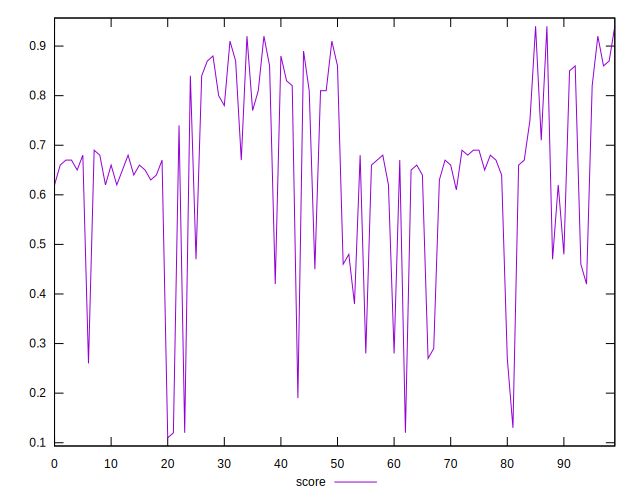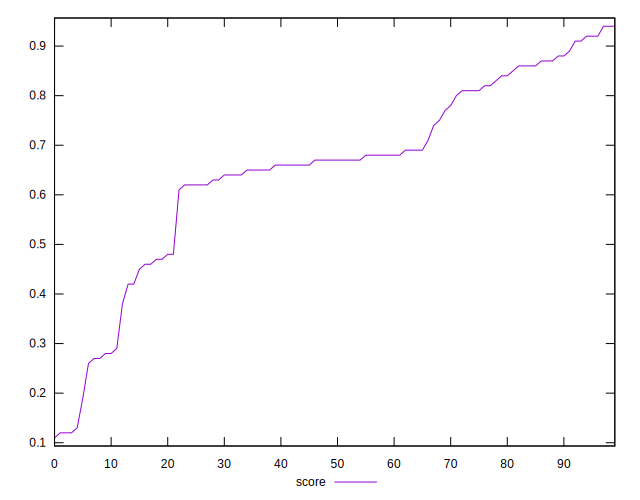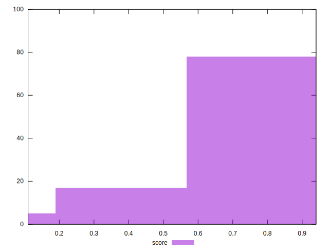
## Raw Estimate

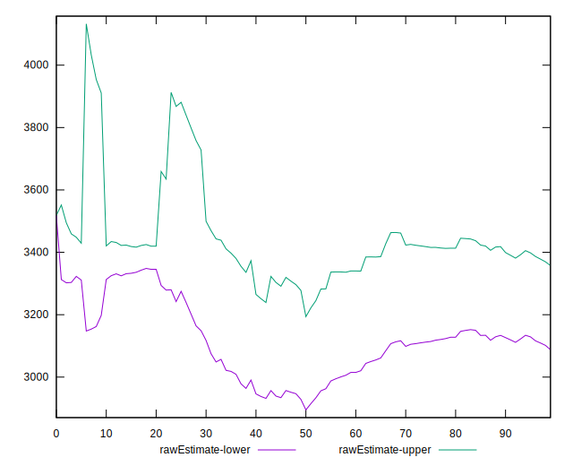
## Score Estimate

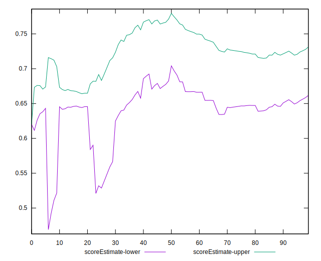
## P Score


```yaml
p90min: 0.2753136170720292
p90max: 0.9438719467839161
p90range: 0.6685583297118869
p90mean: 0.6941706028491061
p90median: 0.6742319075709909
p90stdev: 0.15300574486540233
p90skewness: -0.5867808717686782
p90eccentricity: 1.0000000000000002
p90discretization: 1
outlandishness: 0.8704091030436734
confidence: 0.08185172365426685
p90confidence: 0.06287313676143591

```

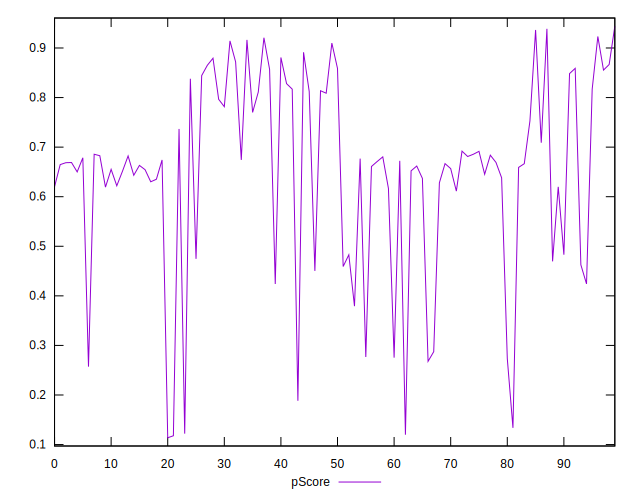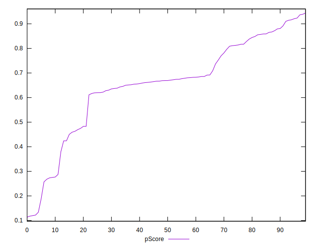
## Score Difference


```yaml
p90min: 0
p90max: 1.1102230246251565e-16
p90range: 1.1102230246251565e-16
p90mean: 2.4400506035717728e-18
p90median: 0
p90stdev: 1.404354585395732e-17
p90skewness: 6.2603694595659585
p90eccentricity: 0.999999999999995
p90discretization: 30.333333333333332
outlandishness: 25.050024999999998
confidence: 1.3264661553807666e-17
p90confidence: 5.77077533832529e-18

```

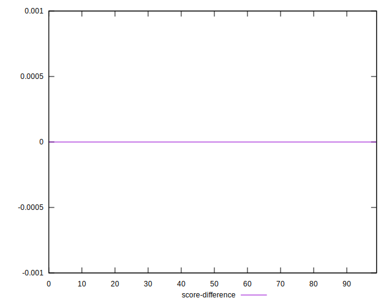
## P Score Difference


```yaml
p90min: -0.0043823246331009535
p90max: 0.0043699130145079534
p90range: 0.008752237647608907
p90mean: 0.00008618500666019414
p90median: 0.00001850085219656794
p90stdev: 0.002517805397057974
p90skewness: 0.04629957885329428
p90eccentricity: 1.0000000000000002
p90discretization: 1
outlandishness: 0.632645171906698
confidence: 0.0010920555192876326
p90confidence: 0.001034616858387667

```

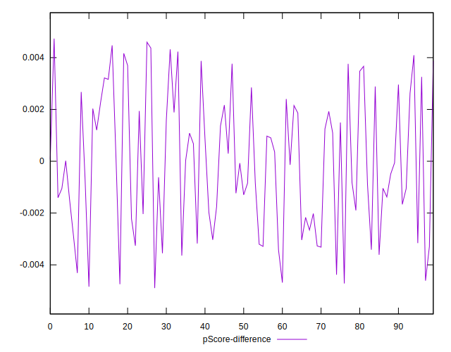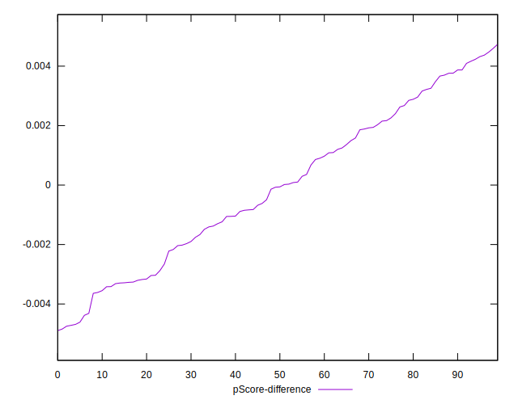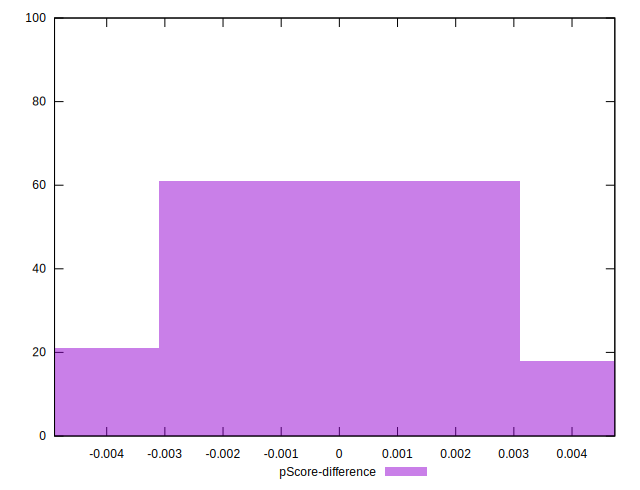