# //first-contentful-paint/samples/pages+cached+noexternal

[→ Parent](../..)


## Raw


```yaml
p90min: 2073.3050000000003
p90max: 3485.5694999999996
p90range: 1412.2644999999993
p90mean: 2853.2056208791205
p90median: 2771.3005000000003
p90stdev: 457.09598809200844
p90skewness: 0.04279985866182038
p90eccentricity: 1.0000000000000002
p90discretization: 1
outlandishness: 1.1405422560560334
confidence: 315.8933571455691
p90confidence: 187.82993146887384

```

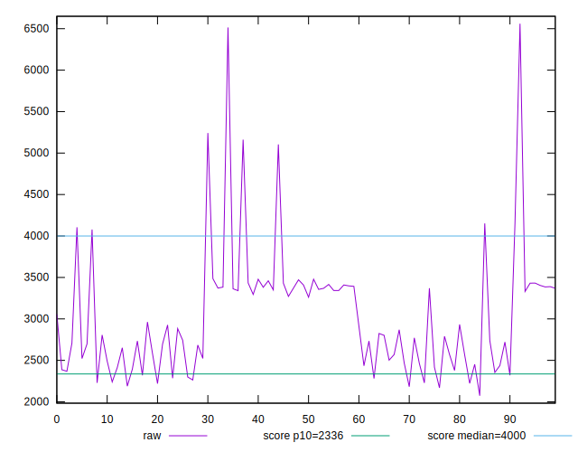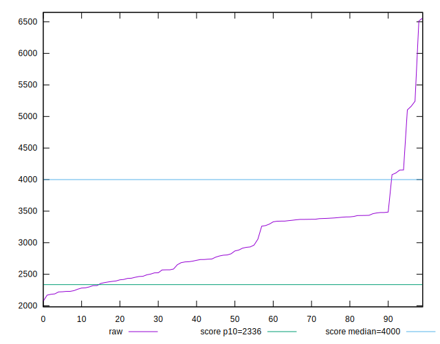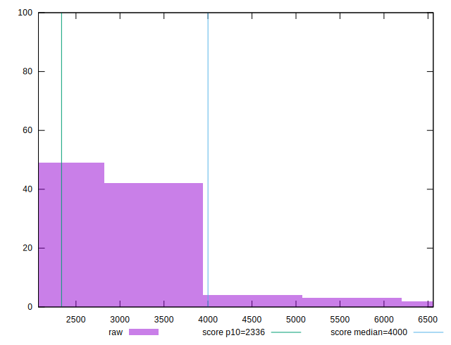
## Score


```yaml
p90min: 0.63
p90max: 0.94
p90range: 0.30999999999999994
p90mean: 0.7817582417582419
p90median: 0.81
p90stdev: 0.1067563046659052
p90skewness: -0.1521781912004544
p90eccentricity: 1.0000000000000002
p90discretization: 3.3703703703703702
outlandishness: 0.8977176258722852
confidence: 0.0669774612702938
p90confidence: 0.0438683119337091

```

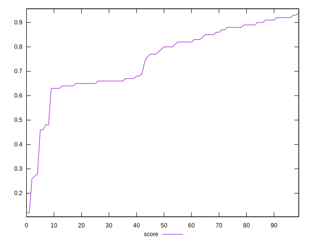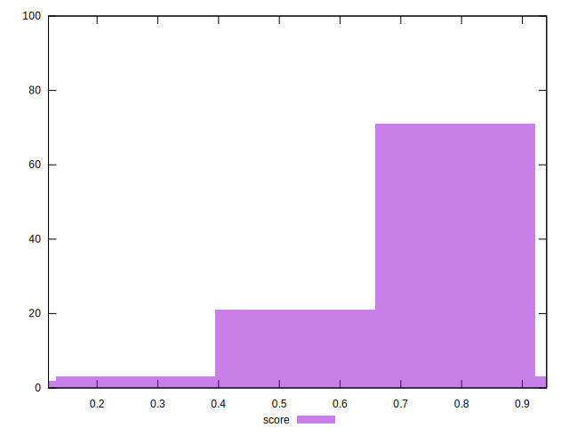
## Raw Estimate

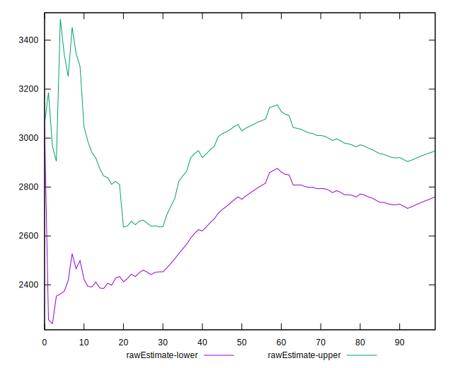
## Score Estimate

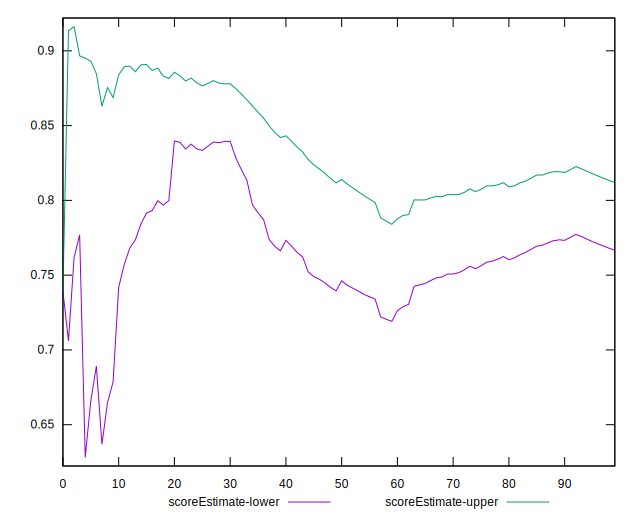
## P Score


```yaml
p90min: 0.6285482585029838
p90max: 0.9413022402760644
p90range: 0.31275398177308056
p90mean: 0.7815904059279091
p90median: 0.8090503126374627
p90stdev: 0.10683823726527727
p90skewness: -0.15409210822481392
p90eccentricity: 1.0000000000000002
p90discretization: 1
outlandishness: 0.8979773385417751
confidence: 0.0668923953870253
p90confidence: 0.04390197968605447

```

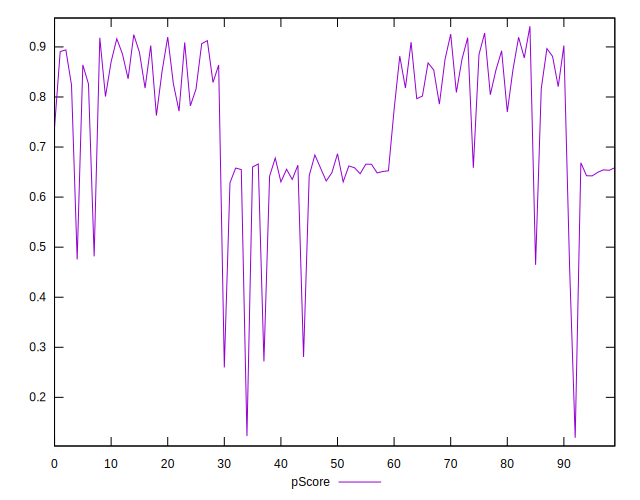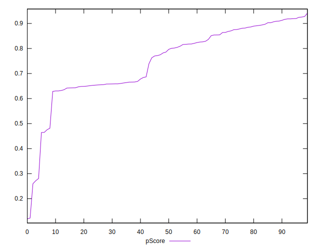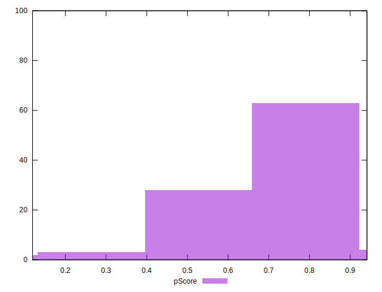
## Score Difference


```yaml
p90min: 0
p90max: 1.1102230246251565e-16
p90range: 1.1102230246251565e-16
p90mean: 2.4400506035717728e-18
p90median: 0
p90stdev: 1.627716772616167e-17
p90skewness: 6.520925694263964
p90eccentricity: 0.9999999999999966
p90discretization: 45.5
outlandishness: 25.050024999999998
confidence: 1.3616944344102389e-17
p90confidence: 6.688615472811599e-18

```

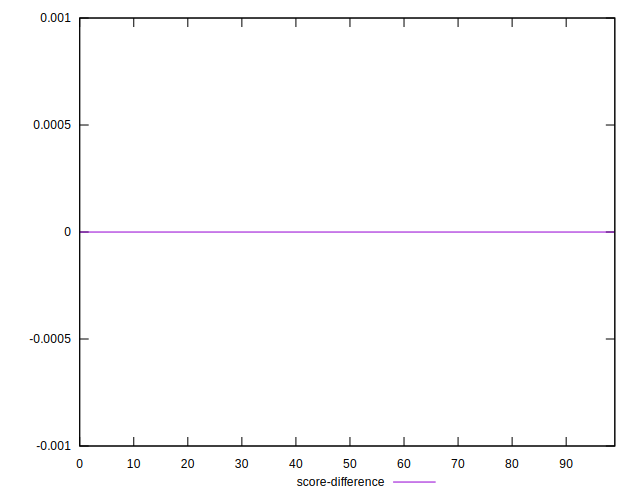
## P Score Difference


```yaml
p90min: -0.004412298068435572
p90max: 0.004469602453691213
p90range: 0.008881900522126784
p90mean: -0.00010687561638288447
p90median: -0.000329671611255411
p90stdev: 0.0026829781999614336
p90skewness: 0.018786216576381132
p90eccentricity: 1.0000000000000002
p90discretization: 1
outlandishness: 0.23589371334528325
confidence: 0.0011496814705168076
p90confidence: 0.0011024896839168944

```

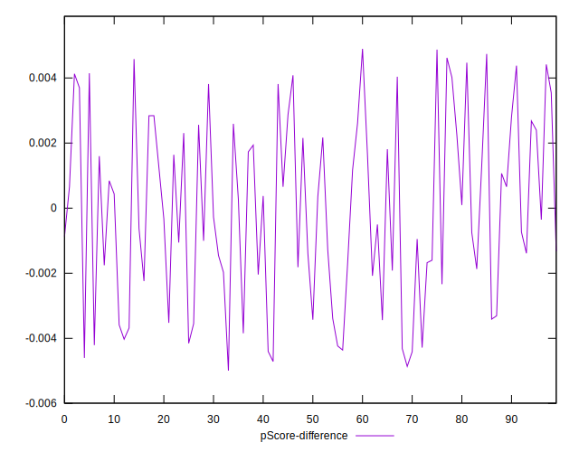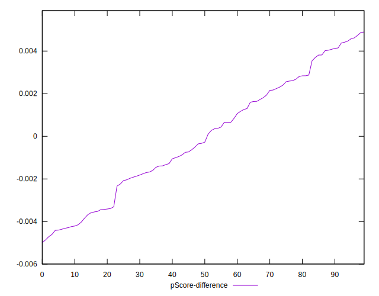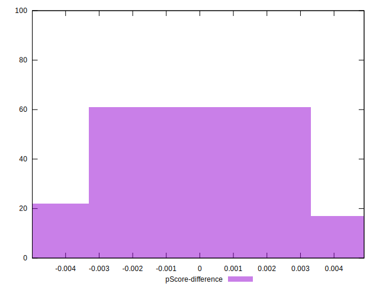