# //first-contentful-paint/samples/pages+cached

[→ Parent](../..)


## Raw


```yaml
p90min: 2112.602
p90max: 4417.865
p90range: 2305.263
p90mean: 3075.901857142857
p90median: 3320.0924999999997
p90stdev: 503.56134568998243
p90skewness: -0.19494199014805938
p90eccentricity: 1
p90discretization: 1
outlandishness: 1.1453535173409095
confidence: 335.9204964685832
p90confidence: 206.92348109667637

```

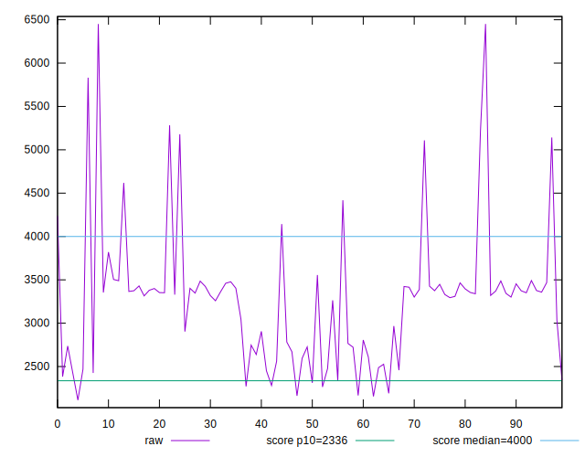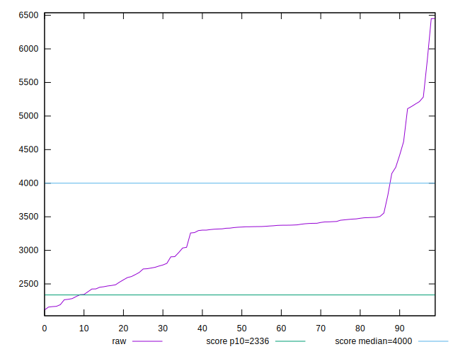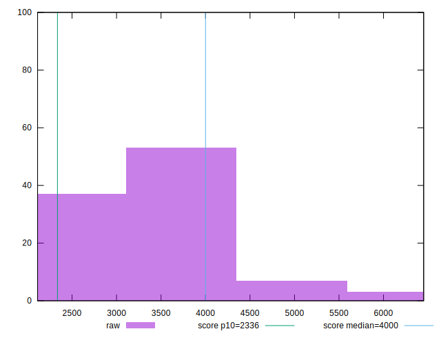
## Score


```yaml
p90min: 0.41
p90max: 0.94
p90range: 0.53
p90mean: 0.7280219780219777
p90median: 0.67
p90stdev: 0.1188980520013419
p90skewness: 0.101850074998561
p90eccentricity: 1.0000000000000002
p90discretization: 2.935483870967742
outlandishness: 0.8824624342920611
confidence: 0.07124547535849768
p90confidence: 0.048857600024919456

```

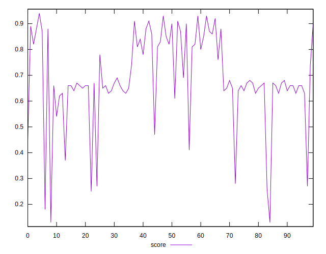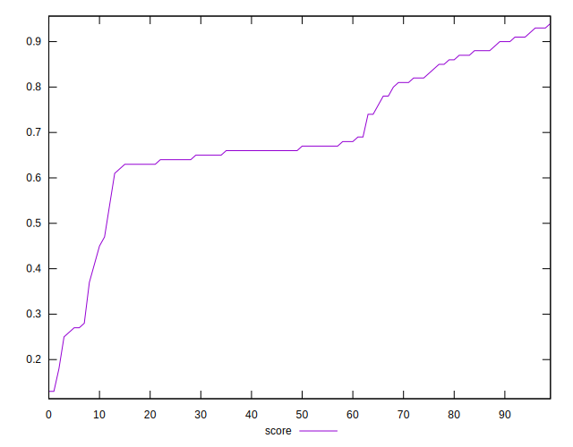
## Raw Estimate

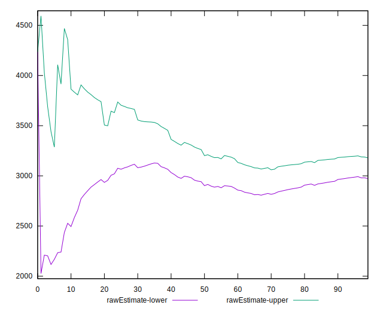
## Score Estimate

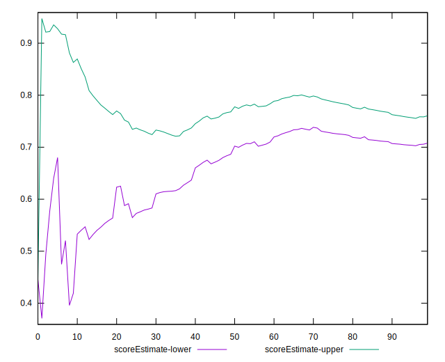
## P Score


```yaml
p90min: 0.40642487109434167
p90max: 0.9358777119981044
p90range: 0.5294528409037628
p90mean: 0.7280609207818275
p90median: 0.6714436954346261
p90stdev: 0.11921187146588426
p90skewness: 0.08910765932004816
p90eccentricity: 1.0000000000000002
p90discretization: 1
outlandishness: 0.8826286913064241
confidence: 0.07126056656946922
p90confidence: 0.04898655475227254

```

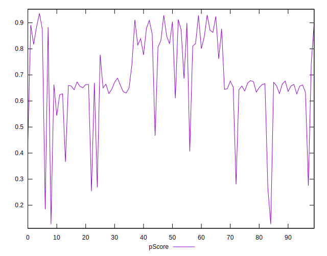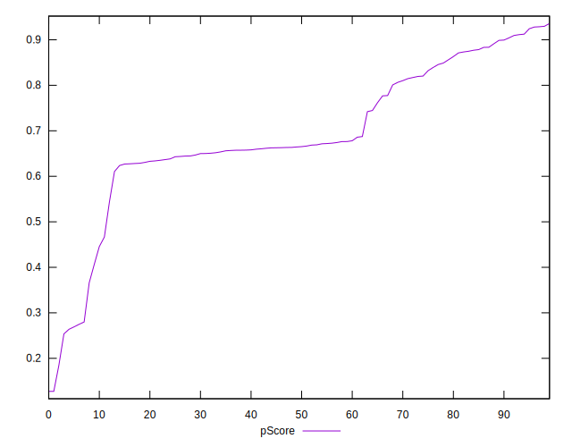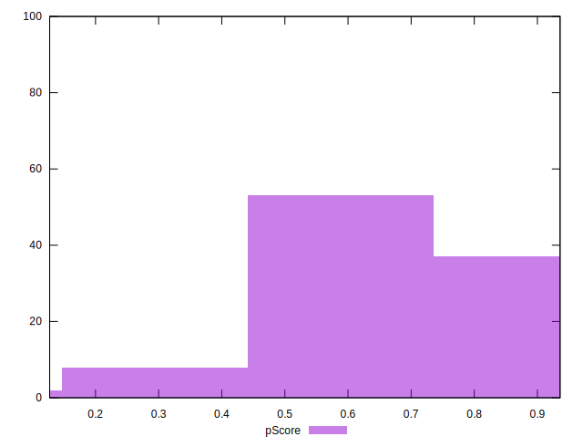
## Score Difference


```yaml
p90min: 0
p90max: 0
p90range: 0
p90mean: 0
p90median: 0
p90stdev: 0
p90skewness: .nan
p90eccentricity: .nan
p90discretization: 91
outlandishness: .inf
confidence: 1.1398570097566355e-17
p90confidence: 0

```

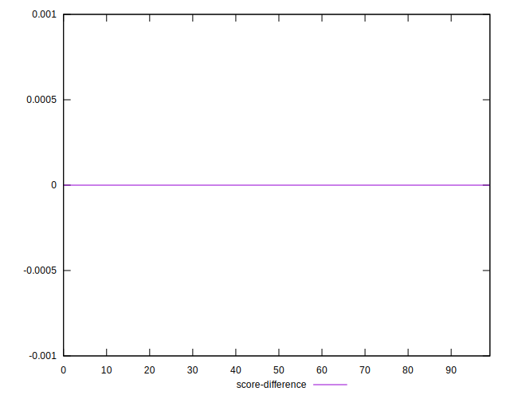
## P Score Difference


```yaml
p90min: -0.004122288001895513
p90max: 0.004504598923344927
p90range: 0.00862688692524044
p90mean: 0.000054571766281960556
p90median: -0.00008404211289353425
p90stdev: 0.0027229896713264674
p90skewness: 0.09124258515036741
p90eccentricity: 0.9999999999999999
p90discretization: 1
outlandishness: 3.4258277947495004
confidence: 0.0011565963069645367
p90confidence: 0.001118931201935535

```

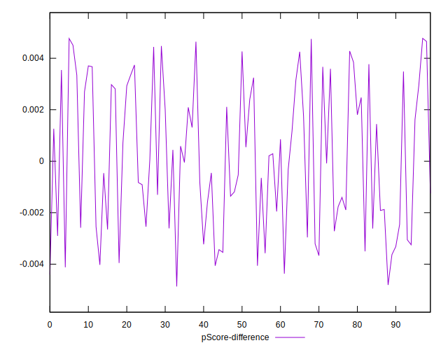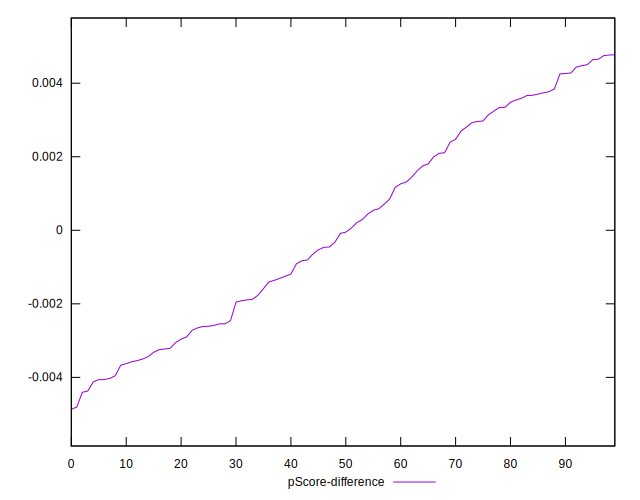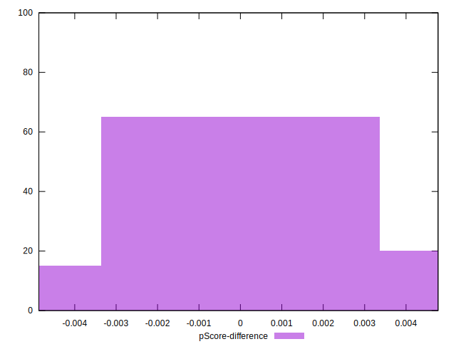