# //first-contentful-paint/samples/pages

[→ Parent](../..)


## Raw


```yaml
p90min: 2300.474
p90max: 4432.045
p90range: 2131.571
p90mean: 3316.074186813187
p90median: 3339.8885
p90stdev: 362.76714613705184
p90skewness: -0.08932013128269493
p90eccentricity: 1.0000000000000002
p90discretization: 1
outlandishness: 1.0302699737701702
confidence: 244.45156906155444
p90confidence: 149.06831381851043

```

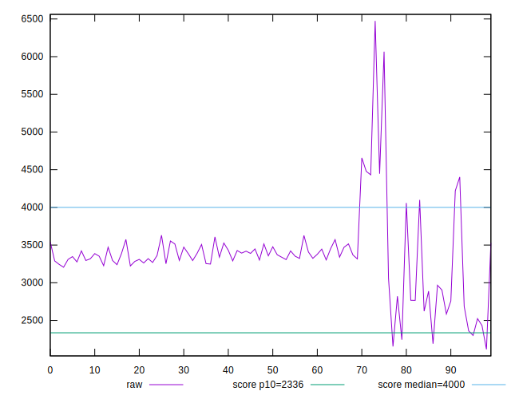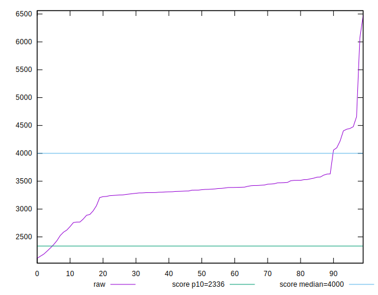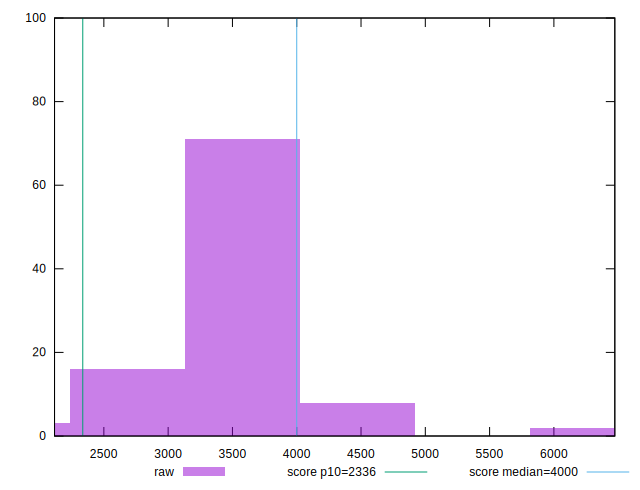
## Score


```yaml
p90min: 0.41
p90max: 0.92
p90range: 0.51
p90mean: 0.6771428571428572
p90median: 0.67
p90stdev: 0.08788461109069107
p90skewness: 0.443135300206031
p90eccentricity: 0.9999999999999988
p90discretization: 3.1379310344827585
outlandishness: 0.9572186726664174
confidence: 0.0522524339797521
p90confidence: 0.03611355362631263

```

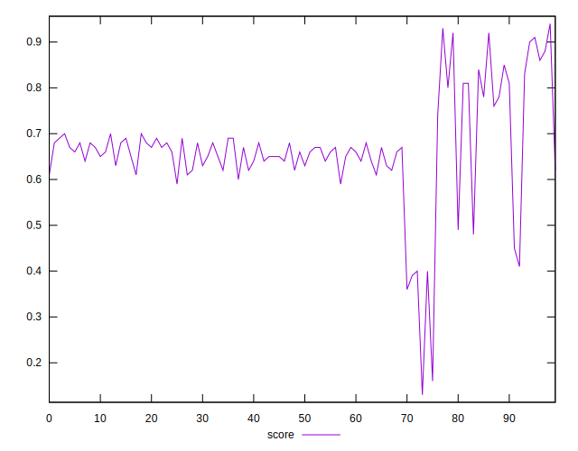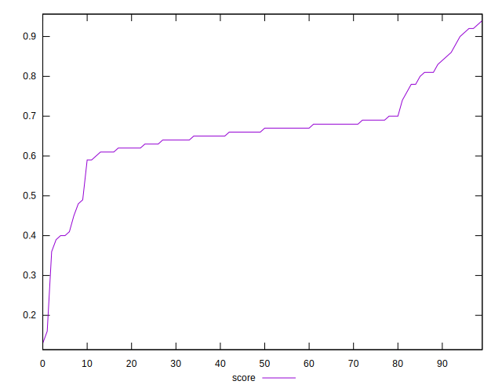
## Raw Estimate

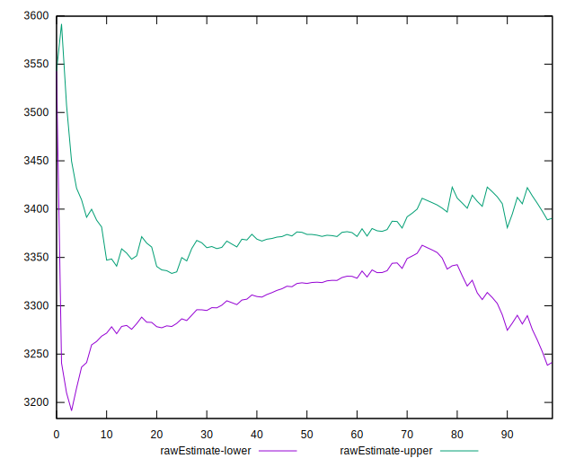
## Score Estimate

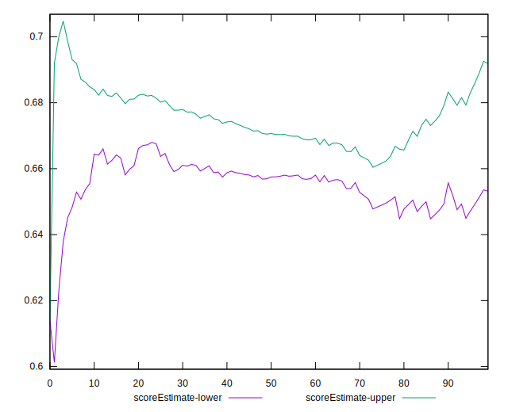
## P Score


```yaml
p90min: 0.4095504174691272
p90max: 0.9157653618578085
p90range: 0.5062149443886814
p90mean: 0.6772915118405933
p90median: 0.6663772356849322
p90stdev: 0.08777329002928949
p90skewness: 0.40507423198734716
p90eccentricity: 1
p90discretization: 1
outlandishness: 0.9572554514915129
confidence: 0.05223541859853409
p90confidence: 0.036067809564061415

```

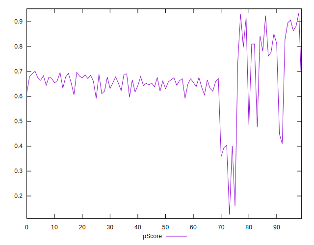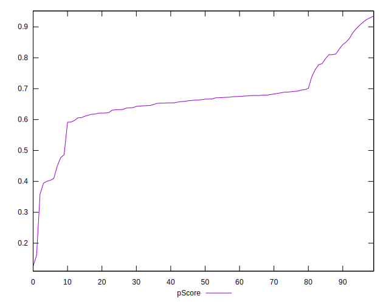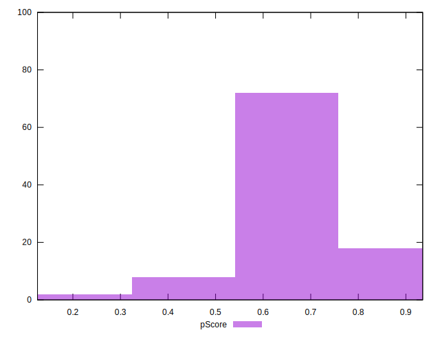
## Score Difference


```yaml
p90min: 0
p90max: 1.1102230246251565e-16
p90range: 1.1102230246251565e-16
p90mean: 3.0500632544647157e-18
p90median: 0
p90stdev: 1.7188939897330855e-17
p90skewness: 5.75426022289894
p90eccentricity: 0.9999999999999981
p90discretization: 30.333333333333332
outlandishness: 17.522596
confidence: 1.371223553006746e-17
p90confidence: 7.063280989218322e-18

```

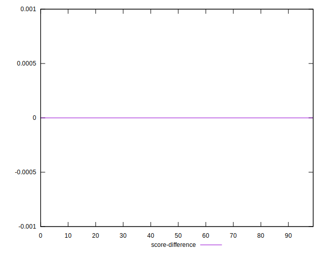
## P Score Difference


```yaml
p90min: -0.004214352380089603
p90max: 0.004428171045997131
p90range: 0.008642523426086735
p90mean: 0.00020806377746399285
p90median: 0.0006917148549980823
p90stdev: 0.0025868649398778426
p90skewness: -0.12445136774579187
p90eccentricity: 0.9999999999999999
p90discretization: 1
outlandishness: 0.577905435564243
confidence: 0.0011099115223084973
p90confidence: 0.0010629948129815645

```

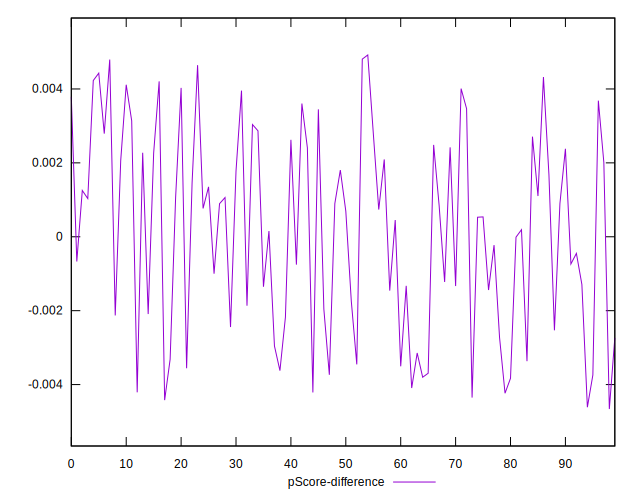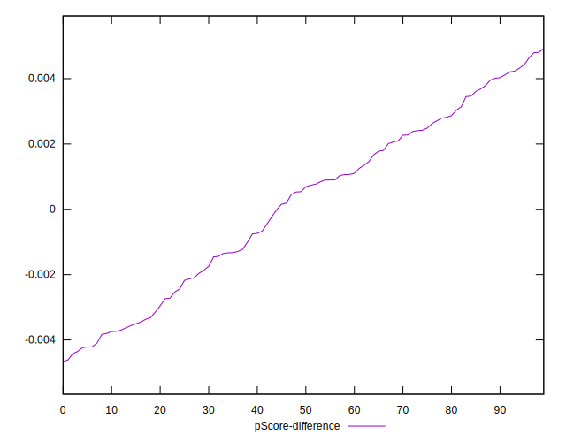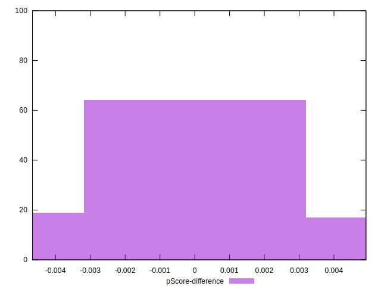