# //first-cpu-idle/samples/pages+cached+noexternal+nomedia+nocss+nojs

[→ Parent](../..)


## Raw


```yaml
p90min: 2553.4930000000004
p90max: 7777.219
p90range: 5223.726
p90mean: 4926.262967032966
p90median: 5021.913500000001
p90stdev: 1146.748208788846
p90skewness: 0.18572124774761484
p90eccentricity: 1.0000000000000009
p90discretization: 1
outlandishness: 1.1185450622508752
confidence: 779.9245399565971
p90confidence: 471.22189448205427

```

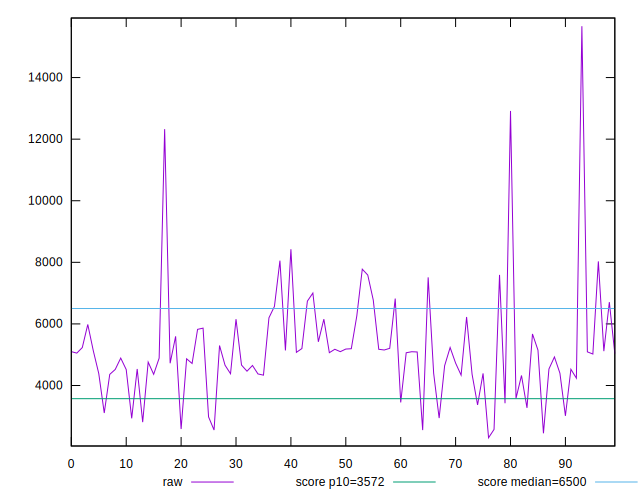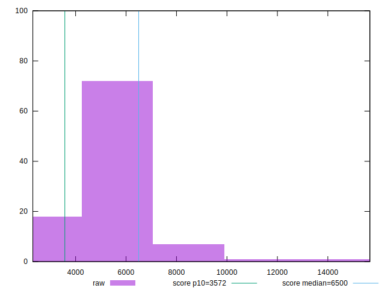
## Score


```yaml
p90min: 0.38
p90max: 0.99
p90range: 0.61
p90mean: 0.7375824175824173
p90median: 0.73
p90stdev: 0.14030845657893146
p90skewness: -0.1735835989766368
p90eccentricity: 1.0000000000000004
p90discretization: 2.5277777777777777
outlandishness: 0.8837848726011154
confidence: 0.07764272089393898
p90confidence: 0.05765556572423769

```

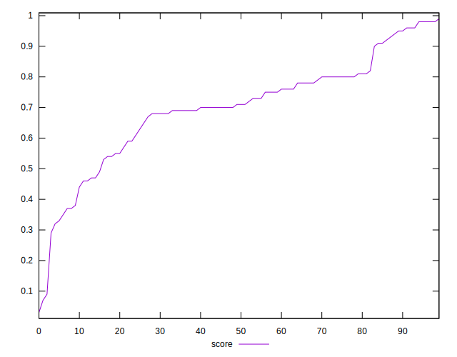
## Raw Estimate

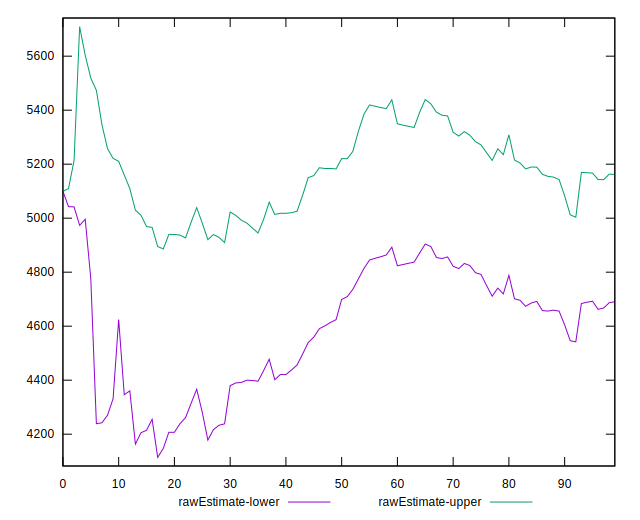
## Score Estimate

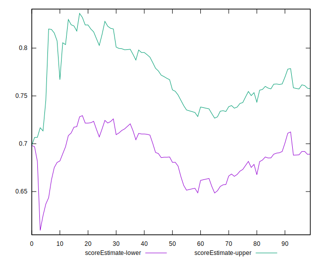
## P Score


```yaml
p90min: 0.3783778355481824
p90max: 0.9868399802472063
p90range: 0.6084621446990239
p90mean: 0.7376626828050264
p90median: 0.72895928145955
p90stdev: 0.14018387736372312
p90skewness: -0.18681673980325533
p90eccentricity: 0.9999999999999992
p90discretization: 1
outlandishness: 0.883639650975145
confidence: 0.07767627133085231
p90confidence: 0.05760437362003068

```

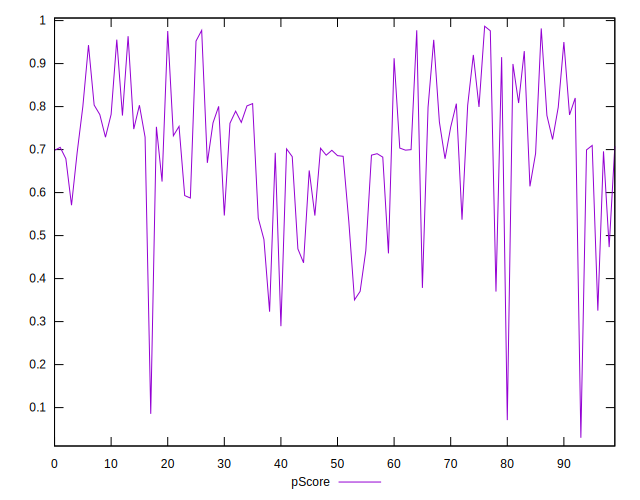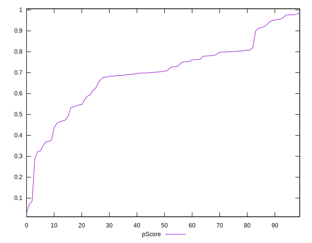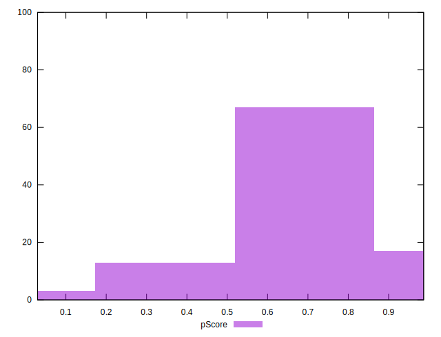
## Score Difference


```yaml
p90min: 0
p90max: 1.1102230246251565e-16
p90range: 1.1102230246251565e-16
p90mean: 1.6470341574109465e-17
p90median: 0
p90stdev: 3.81538409440491e-17
p90skewness: 1.9750867480090057
p90eccentricity: 0.9999999999999972
p90discretization: 30.333333333333332
outlandishness: 2.3002777777777776
confidence: 1.7778043145254057e-17
p90confidence: 1.567818033080731e-17

```

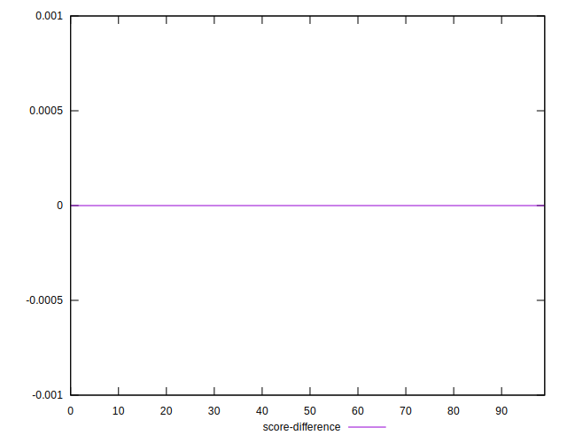
## P Score Difference


```yaml
p90min: -0.004285245591933995
p90max: 0.004269826083621031
p90range: 0.008555071675555026
p90mean: 0.00007032326972695693
p90median: -0.00010029479230577731
p90stdev: 0.0023457561132067825
p90skewness: -0.03578786266323522
p90eccentricity: 1.0000000000000002
p90discretization: 1
outlandishness: 0.06905419436895456
confidence: 0.0010332904483417006
p90confidence: 0.0009639183485846597

```

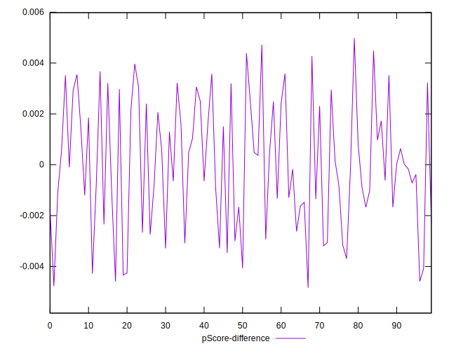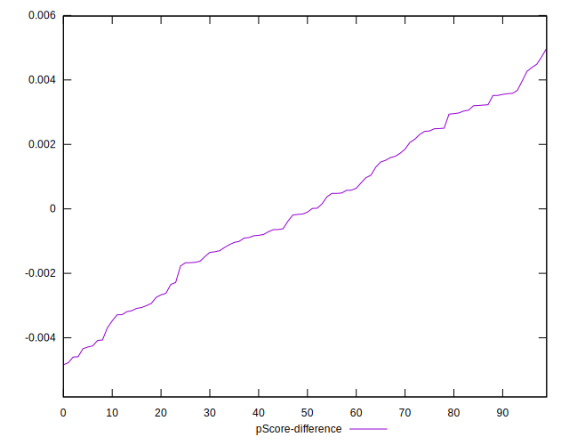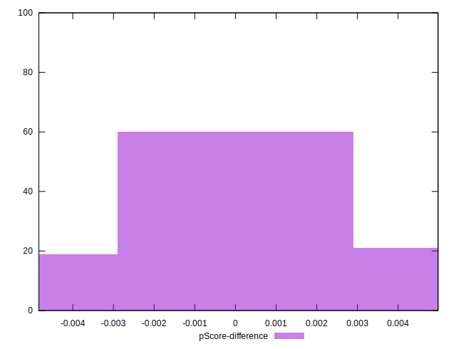