# //first-cpu-idle/samples/pages+cached+noexternal+nomedia+nocss

[→ Parent](../..)


## Raw


```yaml
p90min: 2848.0185
p90max: 7827.8139999999985
p90range: 4979.795499999998
p90mean: 5189.824483516482
p90median: 5108.0575
p90stdev: 969.9384698556871
p90skewness: 0.4768901090143469
p90eccentricity: 1
p90discretization: 1
outlandishness: 1.092099571179391
confidence: 692.8031003569413
p90confidence: 398.56721797642786

```

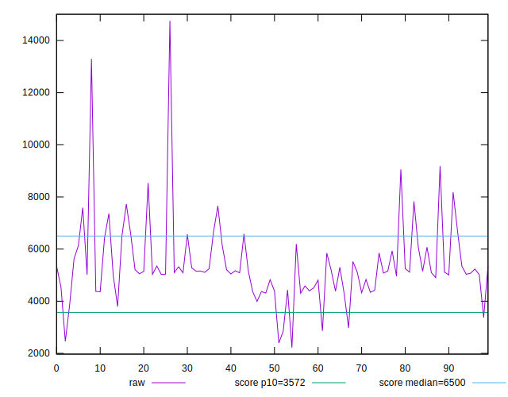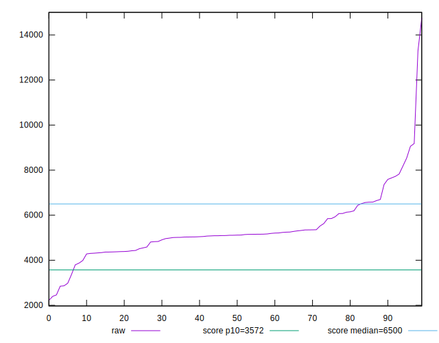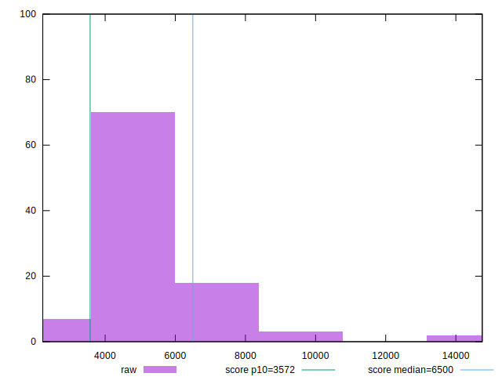
## Score


```yaml
p90min: 0.35
p90max: 0.96
p90range: 0.61
p90mean: 0.6850549450549454
p90median: 0.7
p90stdev: 0.12933790505624265
p90skewness: -0.5760478082453405
p90eccentricity: 0.9999999999999996
p90discretization: 2.5277777777777777
outlandishness: 0.9408906641232547
confidence: 0.07081602393986519
p90confidence: 0.053147545539497854

```

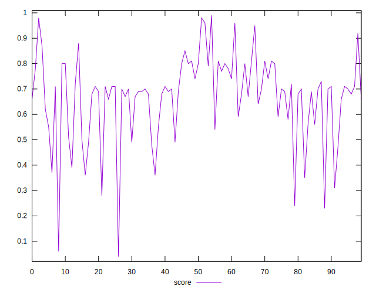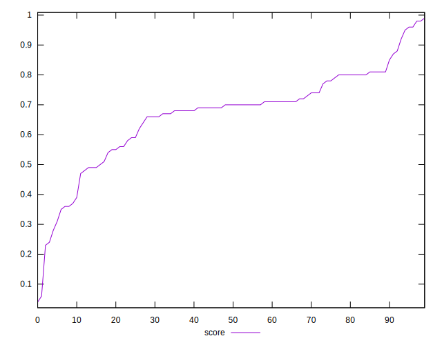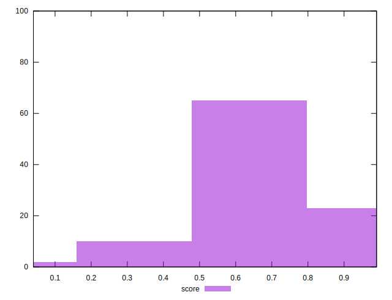
## Raw Estimate

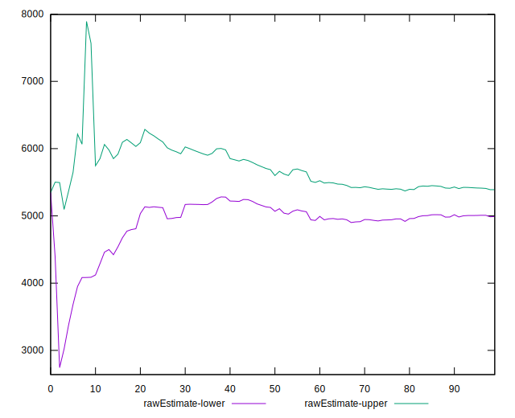
## Score Estimate

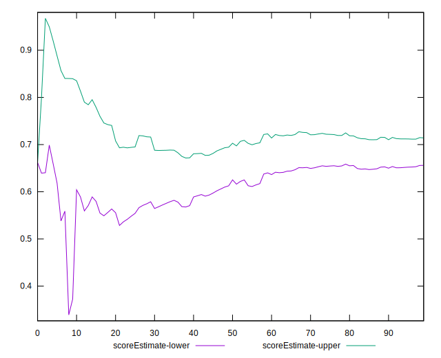
## P Score


```yaml
p90min: 0.35607039243833494
p90max: 0.9811419774473256
p90range: 0.6250715850089906
p90mean: 0.6916417260905684
p90median: 0.6985855762709892
p90stdev: 0.12806238148640217
p90skewness: -0.40708229896402925
p90eccentricity: 0.9999999999999999
p90discretization: 1
outlandishness: 0.9222204680242144
confidence: 0.07081840334342515
p90confidence: 0.052623407260117716

```

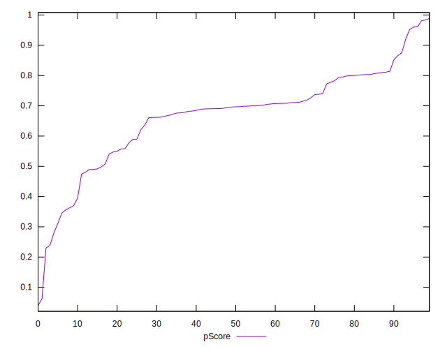
## Score Difference


```yaml
p90min: 0
p90max: 1.1102230246251565e-16
p90range: 1.1102230246251565e-16
p90mean: 1.2200253017858863e-17
p90median: 0
p90stdev: 3.373320319706944e-17
p90skewness: 2.491435619024877
p90eccentricity: 0.9999999999999983
p90discretization: 30.333333333333332
outlandishness: 2.9894410000000002
confidence: 1.6793285266148288e-17
p90confidence: 1.3861651403196662e-17

```

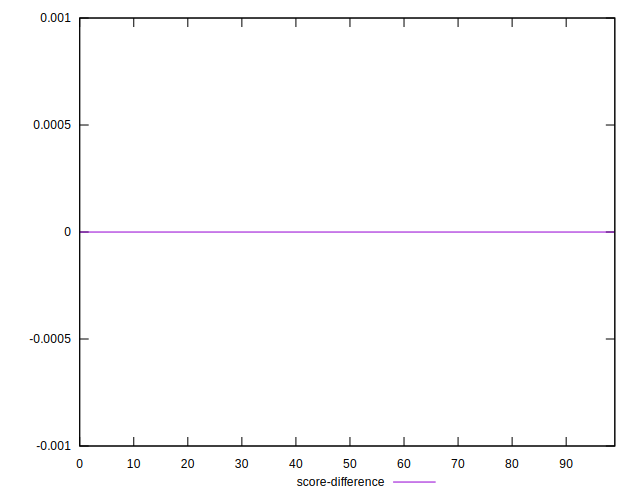
## P Score Difference


```yaml
p90min: -0.004400436541793118
p90max: 0.003676014296324359
p90range: 0.008076450838117477
p90mean: -0.00027245200093609784
p90median: -0.00011137049676637756
p90stdev: 0.0021209803711306364
p90skewness: -0.16088259757853554
p90eccentricity: 0.9999999999999999
p90discretization: 1
outlandishness: 1.2162427754574474
confidence: 0.0009679428248064465
p90confidence: 0.0008715534770261516

```

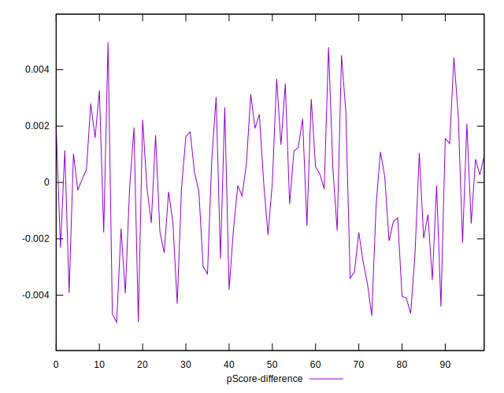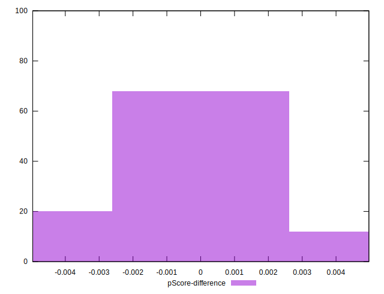