# //first-cpu-idle/samples/pages+cached+noexternal+nomedia

[→ Parent](../..)


## Raw


```yaml
p90min: 2765.576
p90max: 7482.983999999999
p90range: 4717.4079999999985
p90mean: 5087.847686813185
p90median: 5051.240000000001
p90stdev: 764.8006927523403
p90skewness: -0.038738331585341984
p90eccentricity: 0.9999999999999999
p90discretization: 1
outlandishness: 1.0681689546843356
confidence: 529.5674442695217
p90confidence: 314.2719810485487

```

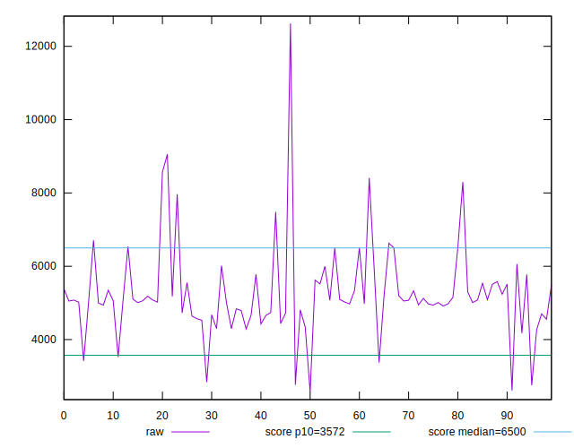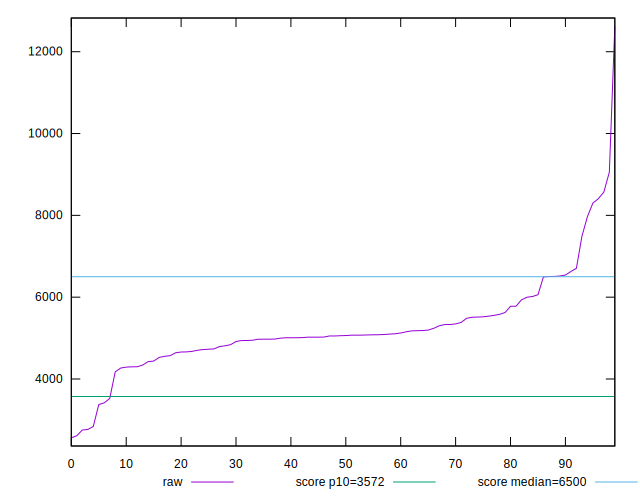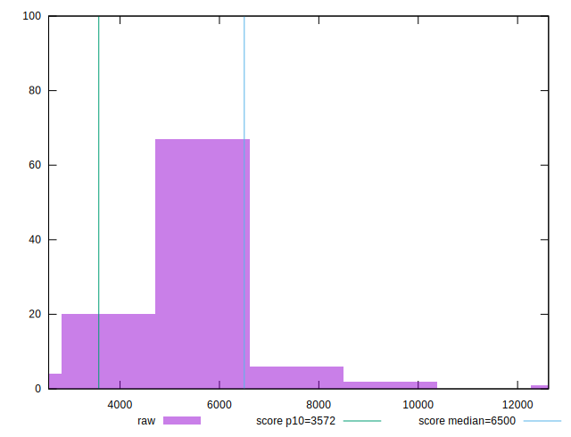
## Score


```yaml
p90min: 0.47
p90max: 0.97
p90range: 0.5
p90mean: 0.7043956043956043
p90median: 0.71
p90stdev: 0.10133405523272733
p90skewness: 0.10636688531848147
p90eccentricity: 1.0000000000000002
p90discretization: 2.84375
outlandishness: 0.9305627152995635
confidence: 0.06054068281257208
p90confidence: 0.04164020062673357

```

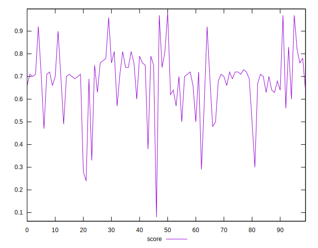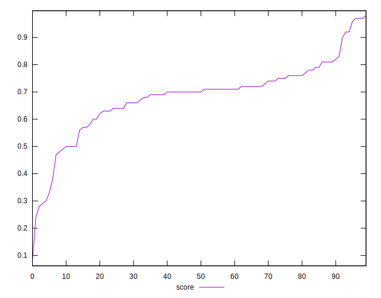
## Raw Estimate

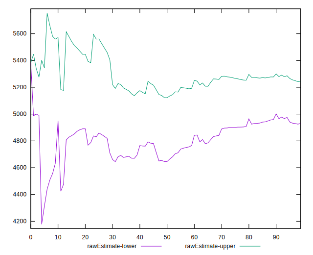
## Score Estimate

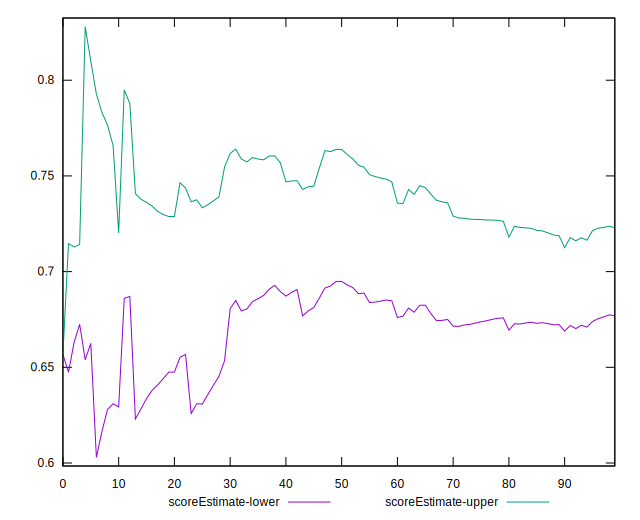
## P Score


```yaml
p90min: 0.4733309939076647
p90max: 0.9670578187825299
p90range: 0.49372682487486524
p90mean: 0.7045639952003427
p90median: 0.7053349393601036
p90stdev: 0.10119880669431315
p90skewness: 0.10116258718688649
p90eccentricity: 1.0000000000000004
p90discretization: 1
outlandishness: 0.9305271359799888
confidence: 0.06056434526165222
p90confidence: 0.04158462428311349

```

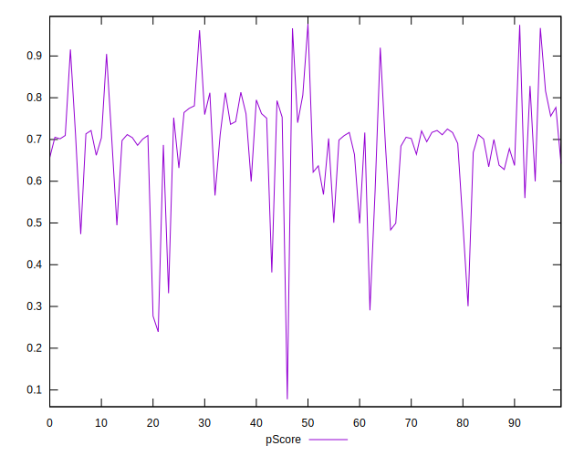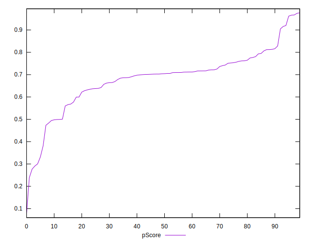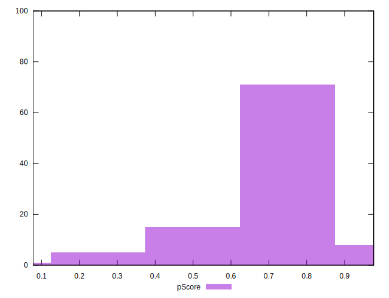
## Score Difference


```yaml
p90min: 0
p90max: 1.1102230246251565e-16
p90range: 1.1102230246251565e-16
p90mean: 1.4030290970537692e-17
p90median: 0
p90stdev: 3.6427512110127554e-17
p90skewness: 2.2483879484167963
p90eccentricity: 0.9999999999999996
p90discretization: 30.333333333333332
outlandishness: 2.63144820415879
confidence: 1.7433797960968424e-17
p90confidence: 1.4968797104930136e-17

```

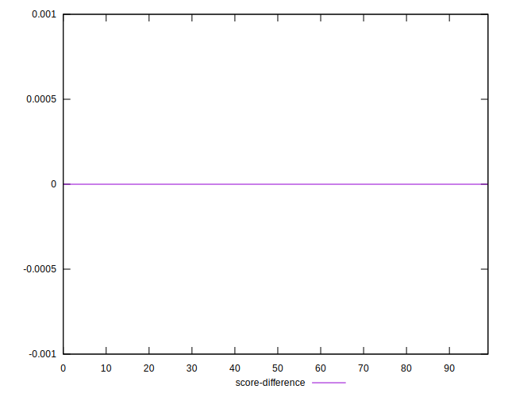
## P Score Difference


```yaml
p90min: -0.004264174554188815
p90max: 0.0045935712070162005
p90range: 0.008857745761205016
p90mean: 0.00010905868149691714
p90median: 0.0004547562017083173
p90stdev: 0.0025431525740569894
p90skewness: -0.035236434493604946
p90eccentricity: 1
p90discretization: 1
outlandishness: 1.877795538808637
confidence: 0.001098997382819575
p90confidence: 0.001045032523024164

```

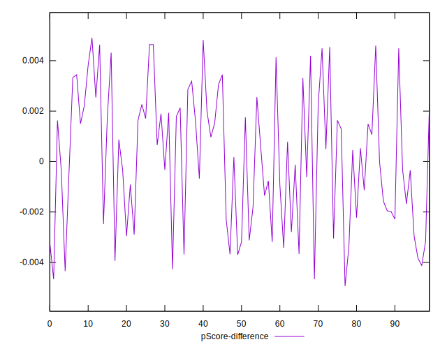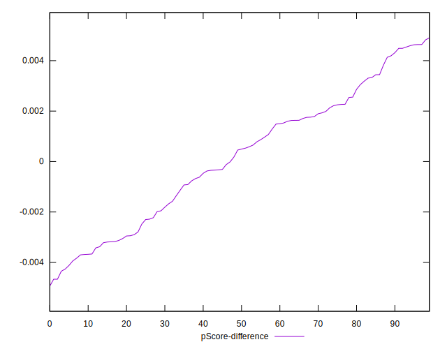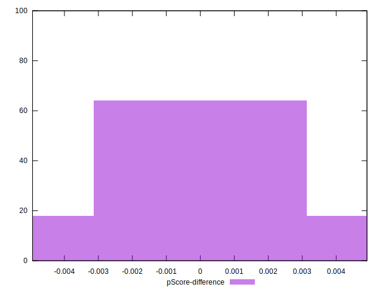