# //first-cpu-idle/samples/pages+cached+noexternal

[→ Parent](../..)


## Raw


```yaml
p90min: 2795.9880000000003
p90max: 6771.071999999998
p90range: 3975.083999999998
p90mean: 4882.330280219781
p90median: 4930.644
p90stdev: 700.8913714063502
p90skewness: -0.3349904983536212
p90eccentricity: 1.0000000000000004
p90discretization: 1
outlandishness: 0.9635885508807788
confidence: 406.3832531752978
p90confidence: 288.01035600400064

```

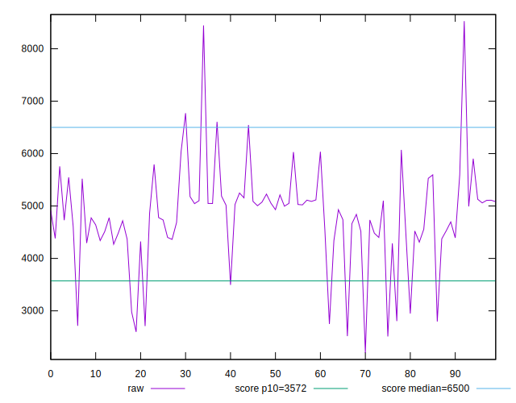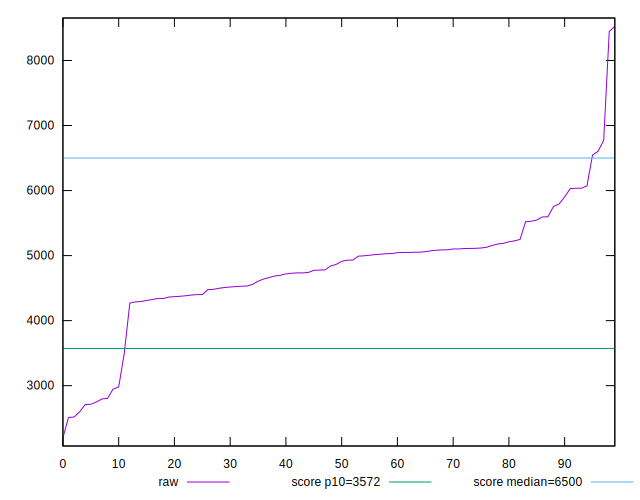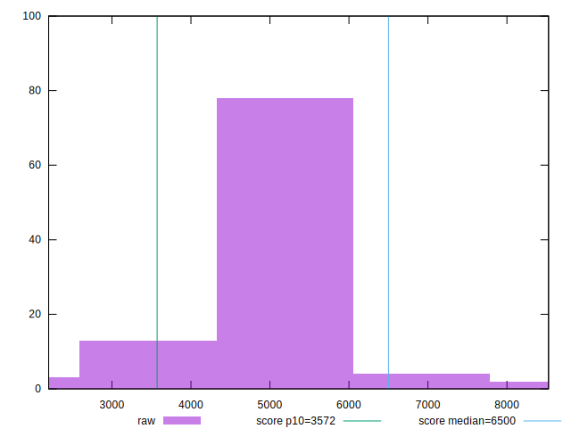
## Score


```yaml
p90min: 0.56
p90max: 0.97
p90range: 0.4099999999999999
p90mean: 0.7429670329670336
p90median: 0.73
p90stdev: 0.09097149058901872
p90skewness: 0.5586471968472103
p90eccentricity: 0.9999999999999999
p90discretization: 3.7916666666666665
outlandishness: 0.9802669350769138
confidence: 0.049572197043982635
p90confidence: 0.037382014474205416

```

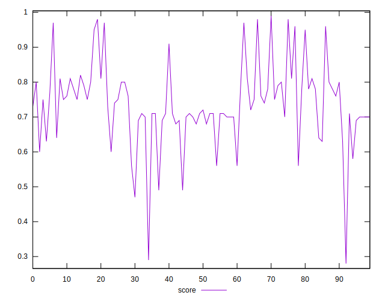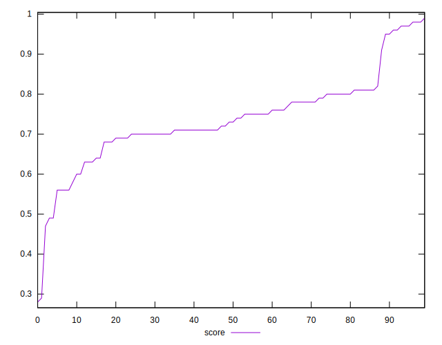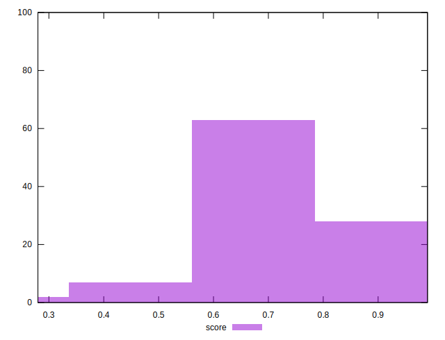
## Raw Estimate

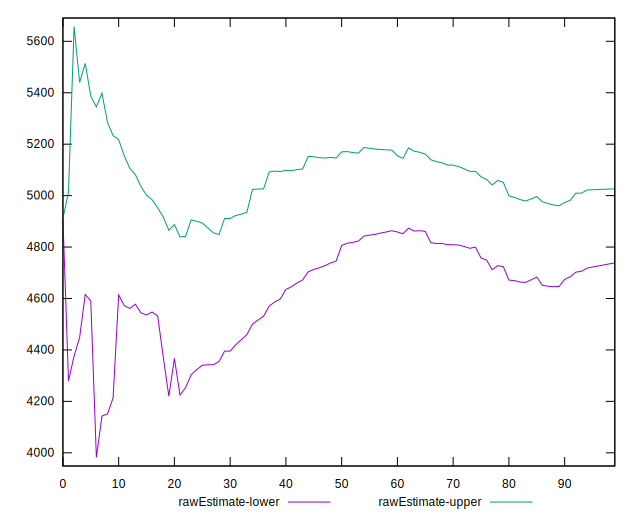
## Score Estimate

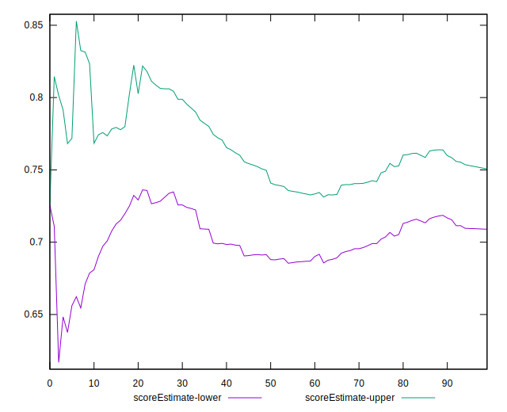
## P Score


```yaml
p90min: 0.5581107469359812
p90max: 0.9694938346922939
p90range: 0.4113830877563127
p90mean: 0.7427335826894399
p90median: 0.7325785760355066
p90stdev: 0.0913622548864269
p90skewness: 0.5822892304429844
p90eccentricity: 1
p90discretization: 1
outlandishness: 0.9799620217954641
confidence: 0.04967678192073666
p90confidence: 0.037542587380366754

```

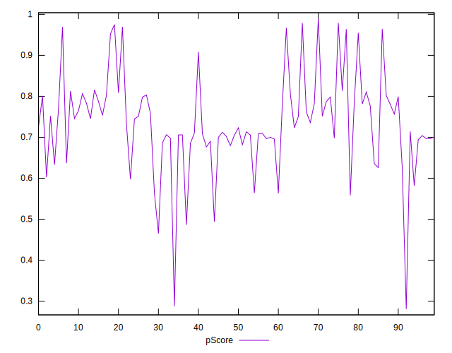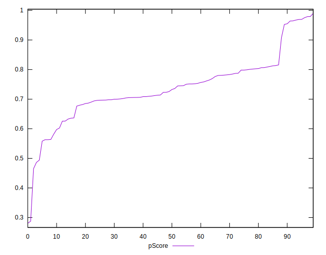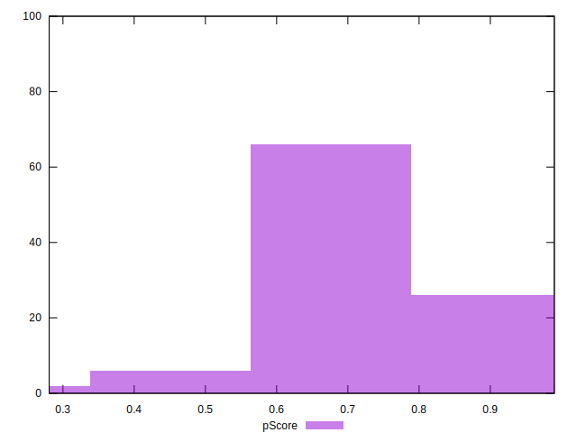
## Score Difference


```yaml
p90min: 0
p90max: 1.1102230246251565e-16
p90range: 1.1102230246251565e-16
p90mean: 1.159024036696592e-17
p90median: 0
p90stdev: 3.3445164005485246e-17
p90skewness: 2.586688266849889
p90eccentricity: 0.9999999999999984
p90discretization: 30.333333333333332
outlandishness: 3.140357063711911
confidence: 1.6758003733695967e-17
p90confidence: 1.3743290308317133e-17

```

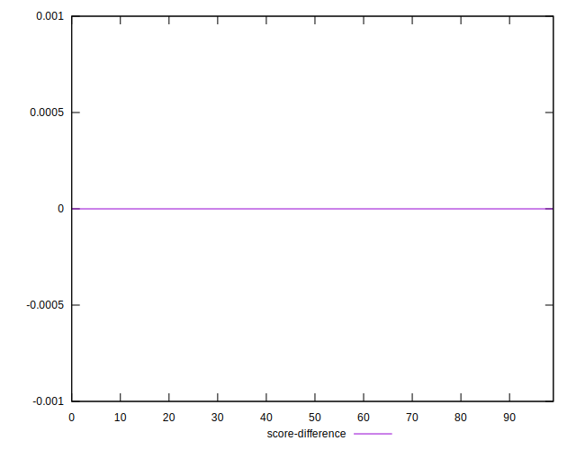
## P Score Difference


```yaml
p90min: -0.004764243683749614
p90max: 0.00410314893785757
p90range: 0.008867392621607184
p90mean: -0.00042588004064975706
p90median: -0.00042576556276496813
p90stdev: 0.0027522815507255837
p90skewness: 0.058884663729036696
p90eccentricity: 1.0000000000000002
p90discretization: 1
outlandishness: 0.6581946841257424
confidence: 0.0011756765928477113
p90confidence: 0.0011309678240968809

```

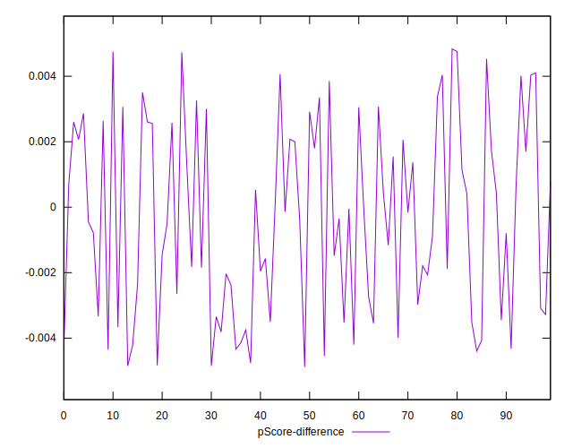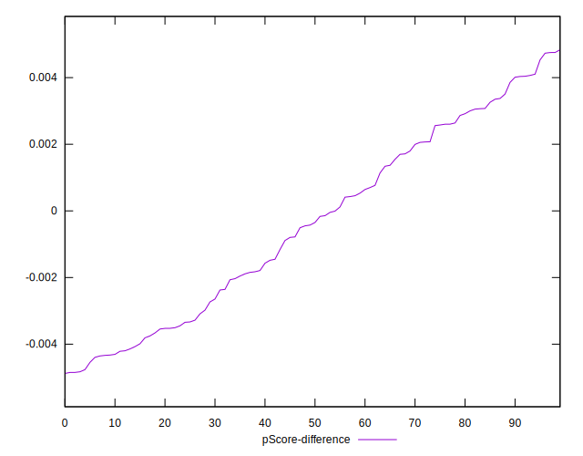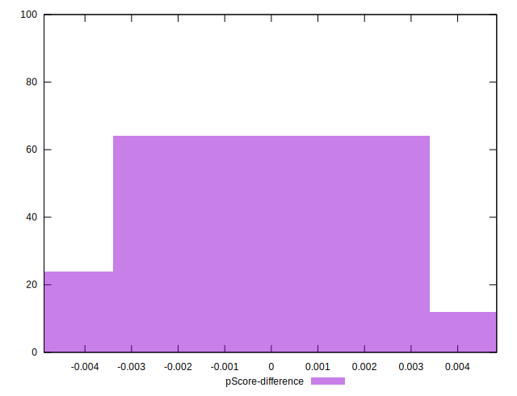