# //first-cpu-idle/samples/pages+cached

[→ Parent](../..)


## Raw


```yaml
p90min: 2750.451
p90max: 7765.133999999999
p90range: 5014.682999999999
p90mean: 5035.280939560438
p90median: 5083.518
p90stdev: 940.2977730260516
p90skewness: 0.051812776751807205
p90eccentricity: 1.0000000000000002
p90discretization: 1
outlandishness: 1.0831559376379416
confidence: 740.5235929101127
p90confidence: 386.3872597198715

```

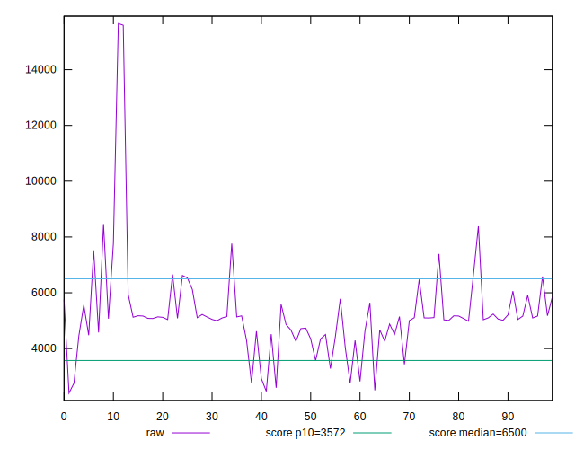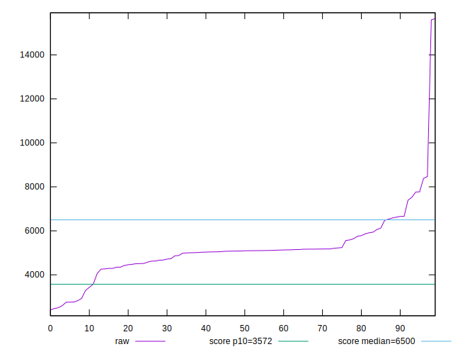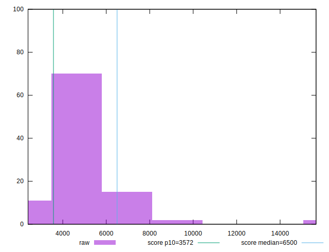
## Score


```yaml
p90min: 0.48
p90max: 0.98
p90range: 0.5
p90mean: 0.7242857142857144
p90median: 0.7
p90stdev: 0.11644121147593879
p90skewness: 0.3060540653383478
p90eccentricity: 1.0000000000000013
p90discretization: 3.033333333333333
outlandishness: 0.9075662616855154
confidence: 0.06827204753541105
p90confidence: 0.04784803485799971

```

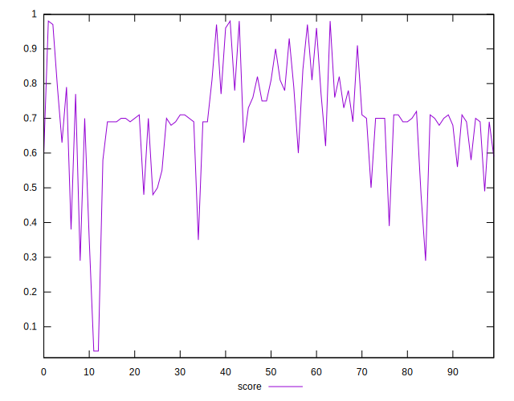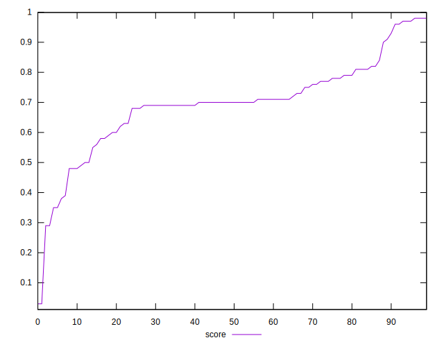
## Raw Estimate

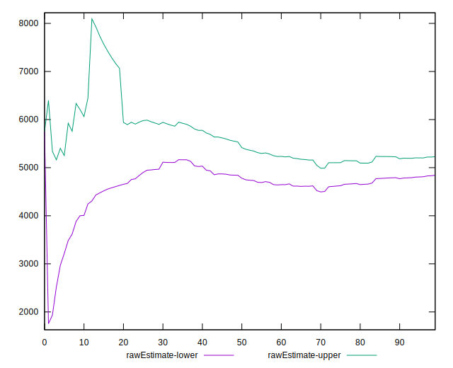
## Score Estimate


## P Score


```yaml
p90min: 0.4795643805834704
p90max: 0.9809755811908898
p90range: 0.5014112006074194
p90mean: 0.7241160635816435
p90median: 0.7018306962798729
p90stdev: 0.11627433097296955
p90skewness: 0.29596031228105874
p90eccentricity: 0.9999999999999997
p90discretization: 1
outlandishness: 0.9076824335829446
confidence: 0.06823975605417165
p90confidence: 0.0477794603041799

```

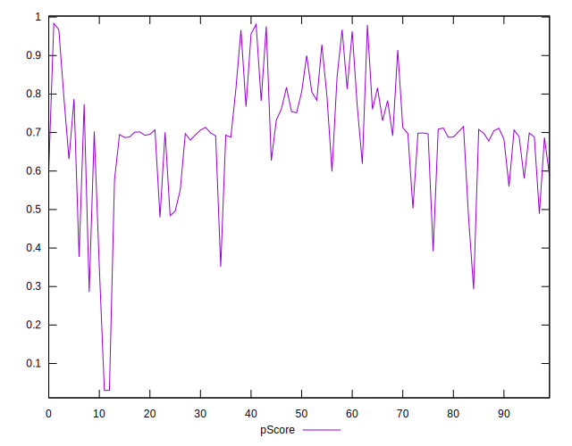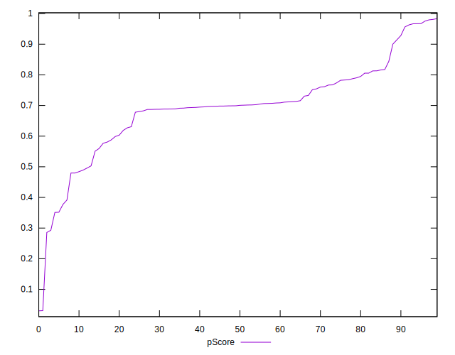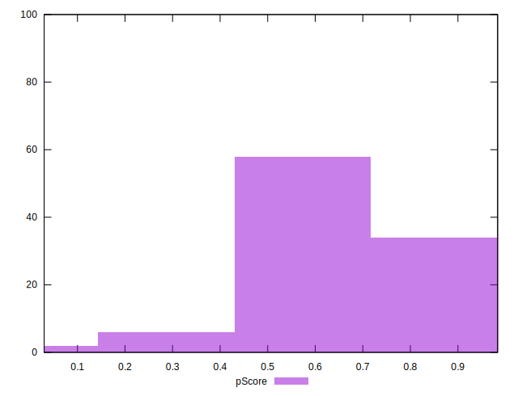
## Score Difference


```yaml
p90min: 0
p90max: 1.1102230246251565e-16
p90range: 1.1102230246251565e-16
p90mean: 2.8060581941075384e-17
p90median: 0
p90stdev: 4.7541867313254247e-17
p90skewness: 1.137494566708723
p90eccentricity: 0.9999999999999988
p90discretization: 30.333333333333332
outlandishness: 1.6029761814744803
confidence: 2.006642224485257e-17
p90confidence: 1.9535909113149723e-17

```

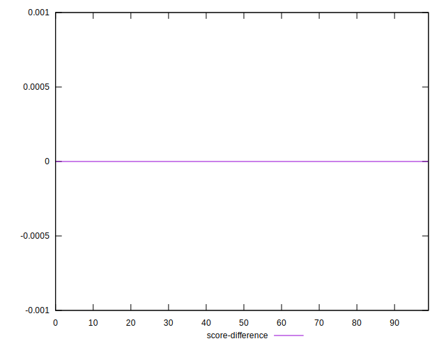
## P Score Difference


```yaml
p90min: -0.004330769836039305
p90max: 0.004099180113455891
p90range: 0.008429949949495197
p90mean: -0.00017997278962609666
p90median: -0.0002192247891035226
p90stdev: 0.0024349018952231926
p90skewness: 0.08526954142457982
p90eccentricity: 0.9999999999999997
p90discretization: 1
outlandishness: 0.42603266686037466
confidence: 0.001057347654522582
p90confidence: 0.0010005501427003216

```

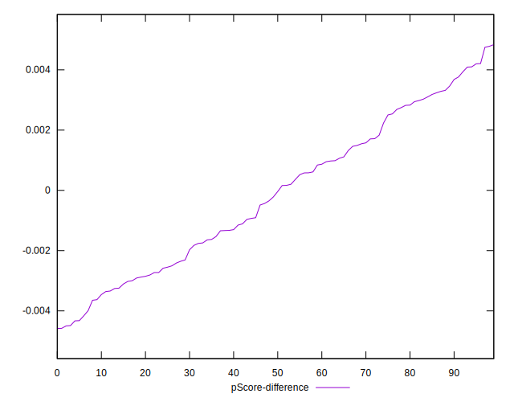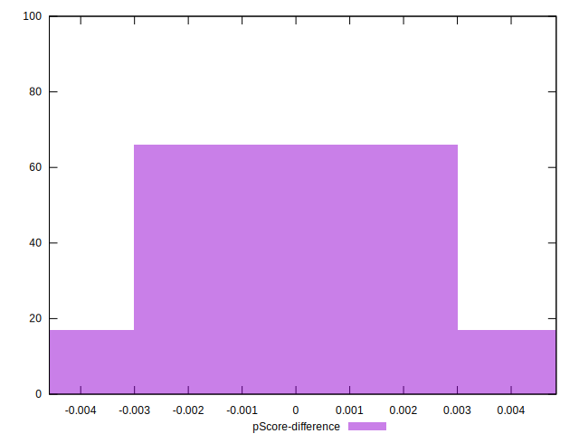