# //first-cpu-idle/samples/pages

[→ Parent](../..)


## Raw


```yaml
p90min: 3226.102
p90max: 6217.6709999999985
p90range: 2991.5689999999986
p90mean: 4581.95198901099
p90median: 4692.507
p90stdev: 1112.9472606113052
p90skewness: -0.06986180471827824
p90eccentricity: 1.0000000000000002
p90discretization: 1
outlandishness: 1.0993960739497415
confidence: 711.0394290404474
p90confidence: 457.3324053043616

```

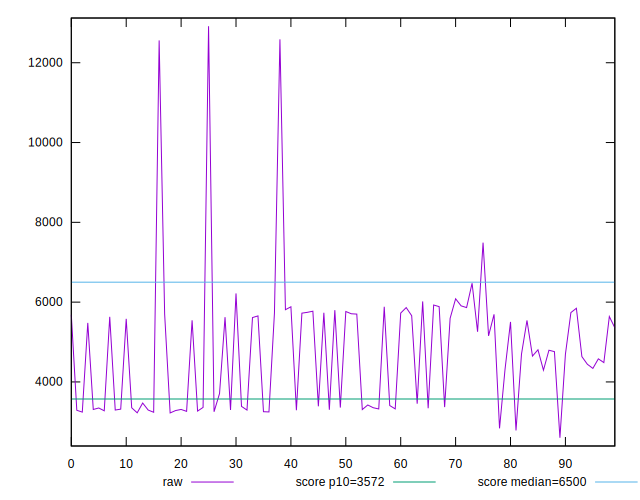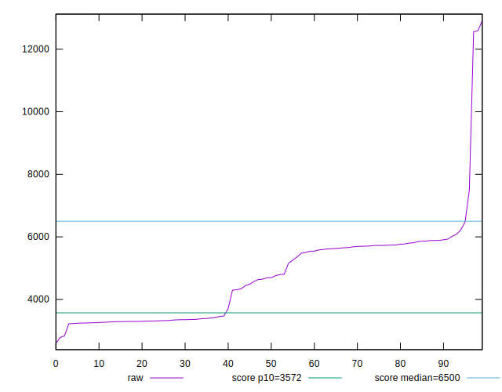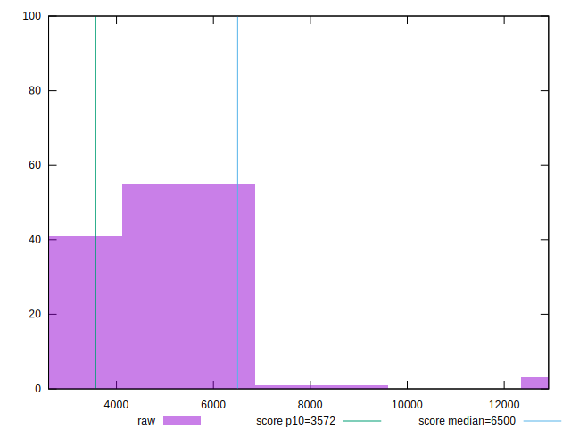
## Score


```yaml
p90min: 0.56
p90max: 0.93
p90range: 0.37
p90mean: 0.7651648351648355
p90median: 0.76
p90stdev: 0.14656778529578493
p90skewness: -0.013874431330811909
p90eccentricity: 0.9999999999999997
p90discretization: 4.136363636363637
outlandishness: 0.940114468202488
confidence: 0.07558795181741851
p90confidence: 0.060227649738440636

```

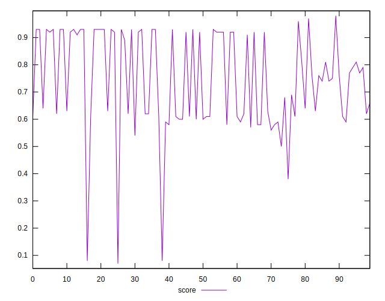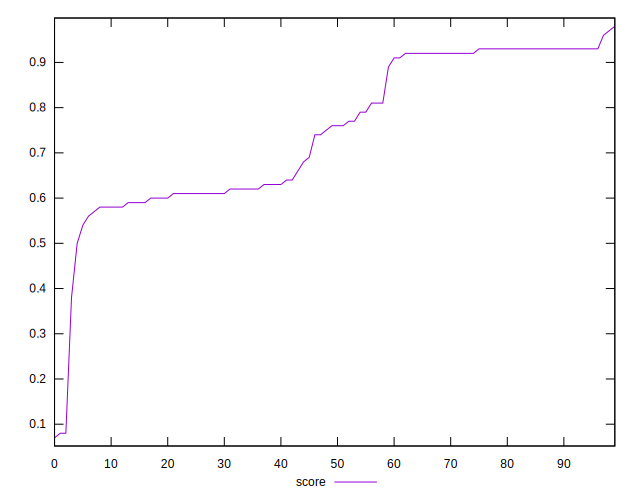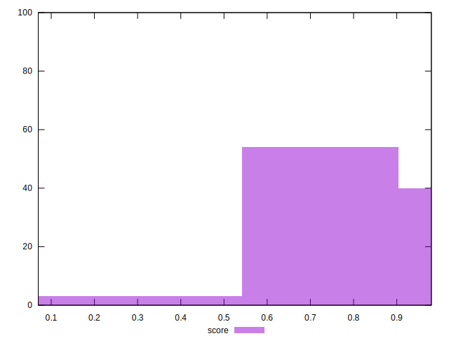
## Raw Estimate

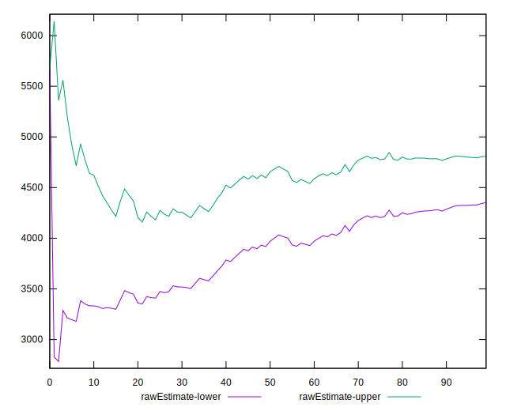
## Score Estimate

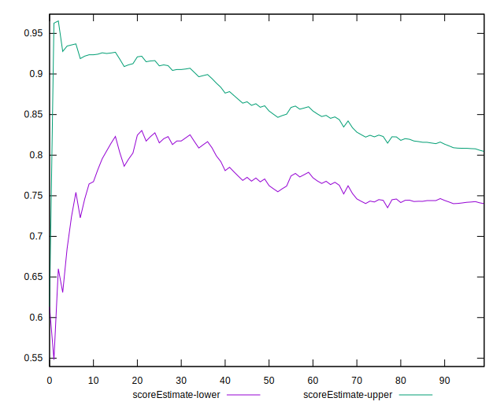
## P Score


```yaml
p90min: 0.5562951833336613
p90max: 0.9334351303891291
p90range: 0.3771399470554677
p90mean: 0.7647681783853103
p90median: 0.7635897841305642
p90stdev: 0.14641456181542553
p90skewness: -0.013924228986071617
p90eccentricity: 0.9999999999999997
p90discretization: 1
outlandishness: 0.9399970350695831
confidence: 0.07549794938727605
p90confidence: 0.060164687129787175

```

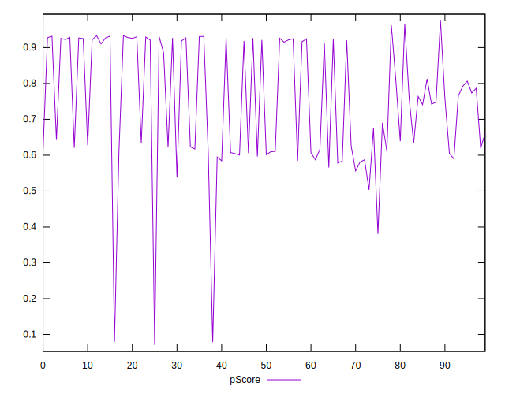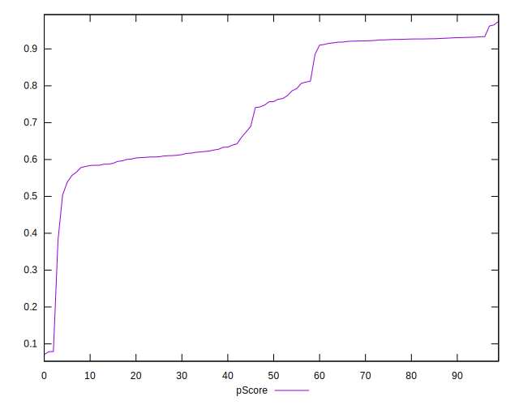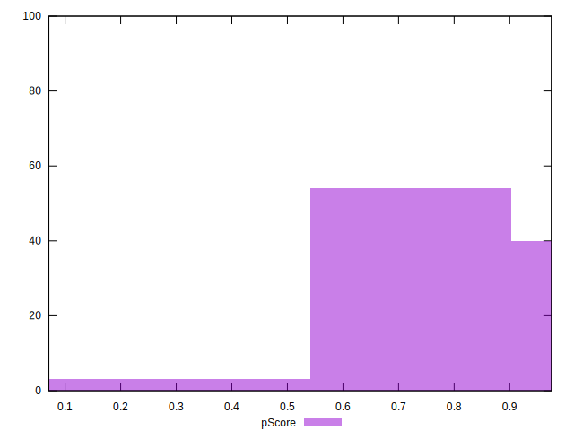
## Score Difference


```yaml
p90min: 0
p90max: 0
p90range: 0
p90mean: 0
p90median: 0
p90stdev: 0
p90skewness: .nan
p90eccentricity: .nan
p90discretization: 91
outlandishness: .inf
confidence: 6.092792000602807e-18
p90confidence: 0

```

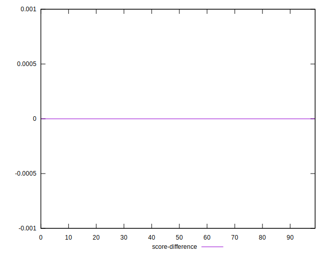
## P Score Difference


```yaml
p90min: -0.0048345786037117255
p90max: 0.003876543787914799
p90range: 0.008711122391626525
p90mean: -0.0006098263784225379
p90median: -0.0004917296637153568
p90stdev: 0.002602999995462684
p90skewness: 0.026341858988819876
p90eccentricity: 1.0000000000000007
p90discretization: 1
outlandishness: 0.49930037841801184
confidence: 0.0011277957238817944
p90confidence: 0.0010696250317183283

```

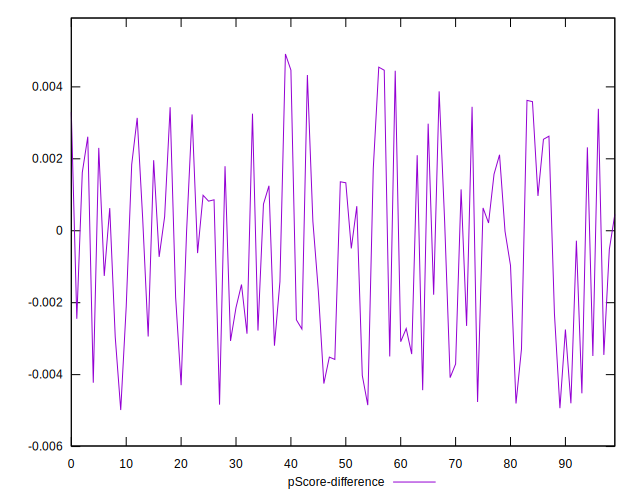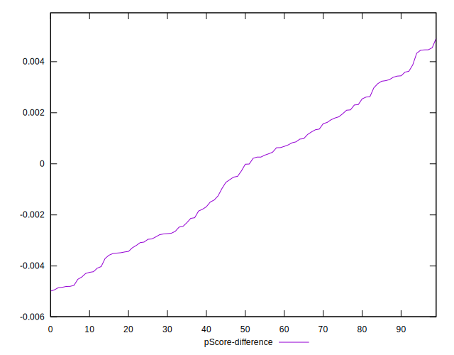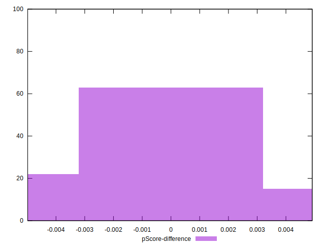