# //first-meaningful-paint/samples/pages+cached+noexternal+nomedia+nocss+nojs

[→ Parent](../..)


## Raw


```yaml
p90min: 2574.193
p90max: 6822.920999999999
p90range: 4248.727999999999
p90mean: 4773.91162087912
p90median: 4890.136
p90stdev: 953.0193842817415
p90skewness: -0.17939677219854766
p90eccentricity: 0.9999999999999993
p90discretization: 1
outlandishness: 0.9784723741731495
confidence: 464.9555397434797
p90confidence: 391.6148255541375

```

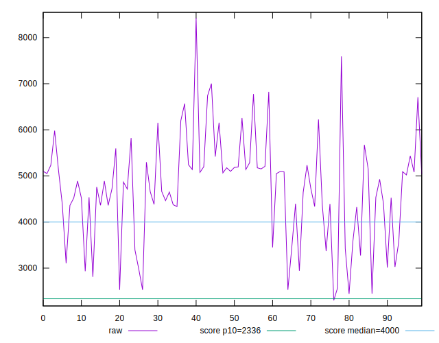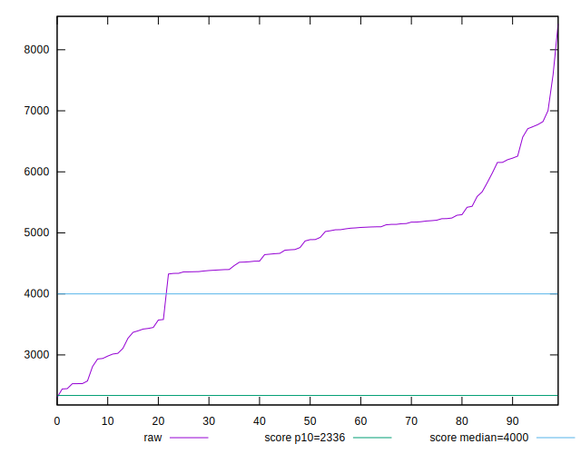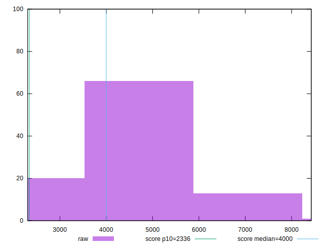
## Score


```yaml
p90min: 0.04
p90max: 0.77
p90range: 0.73
p90mean: 0.34186813186813186
p90median: 0.29
p90stdev: 0.16867233394119324
p90skewness: 0.8608005159916247
p90eccentricity: 1.0000000000000002
p90discretization: 2.3333333333333335
outlandishness: 1.286762429185807
confidence: 0.08531330367374834
p90confidence: 0.06931085319106356

```

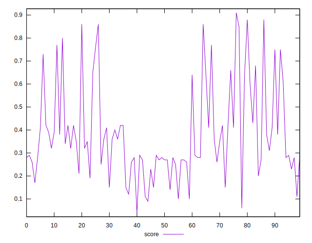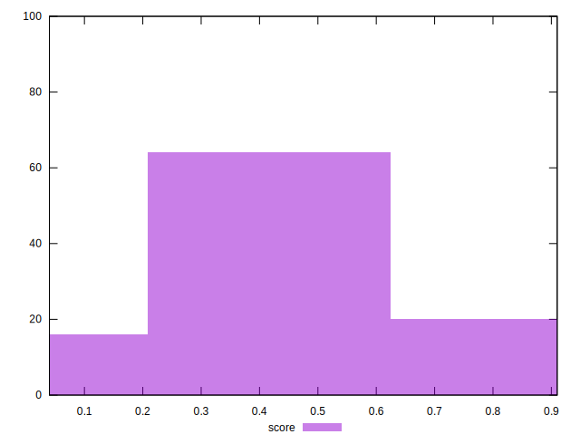
## Raw Estimate

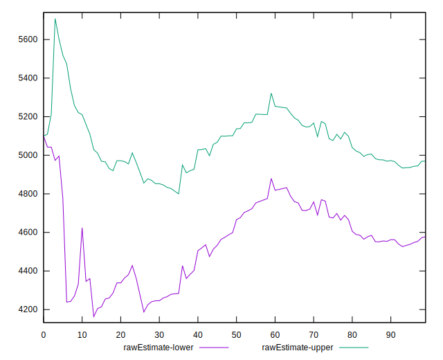
## Score Estimate

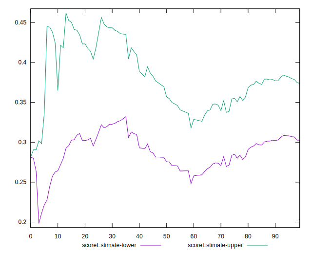
## P Score


```yaml
p90min: 0.037959437294505405
p90max: 0.7679885967465627
p90range: 0.7300291594520574
p90mean: 0.3417305090069483
p90median: 0.2917518763536415
p90stdev: 0.1684003710148201
p90skewness: 0.8634448706224916
p90eccentricity: 1.0000000000000002
p90discretization: 1
outlandishness: 1.2873681477729113
confidence: 0.08529593480257902
p90confidence: 0.06919909815677427

```

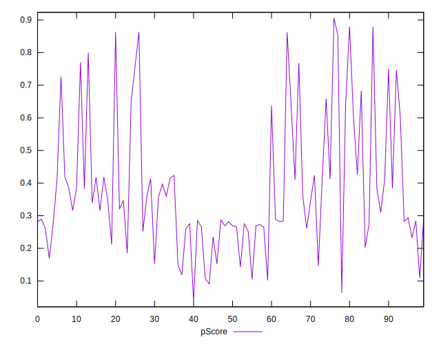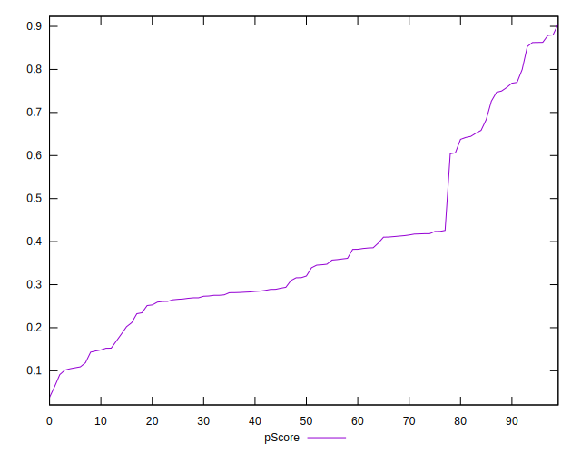
## Score Difference


```yaml
p90min: 0
p90max: 0
p90range: 0
p90mean: 0
p90median: 0
p90stdev: 0
p90skewness: .nan
p90eccentricity: .nan
p90discretization: 91
outlandishness: .inf
confidence: 5.903332266662039e-18
p90confidence: 0

```

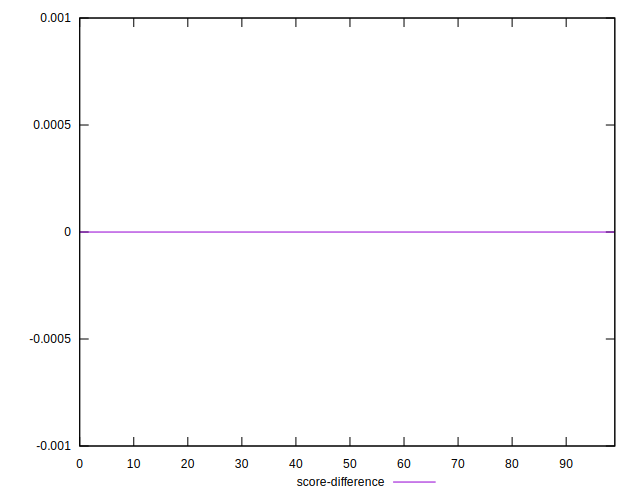
## P Score Difference


```yaml
p90min: -0.0045666573462594395
p90max: 0.004467997184611661
p90range: 0.0090346545308711
p90mean: 0.00008519449325813219
p90median: -0.000032165276593221215
p90stdev: 0.0026064645081923014
p90skewness: -0.10711619781785263
p90eccentricity: 1
p90discretization: 1
outlandishness: 0.5800688792919205
confidence: 0.001123249860028612
p90confidence: 0.001071048669653313

```

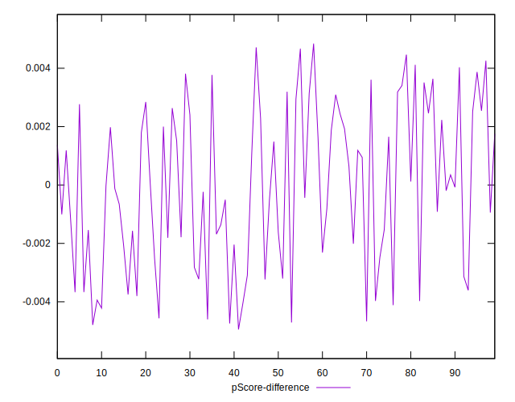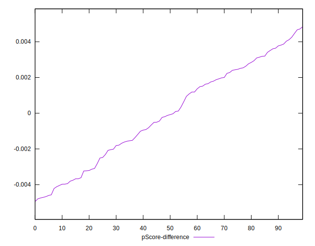