# //first-meaningful-paint/samples/pages+cached+noexternal+nomedia+nocss

[→ Parent](../..)


## Raw


```yaml
p90min: 2673.0874999999996
p90max: 6697.696
p90range: 4024.6085000000003
p90mean: 4983.933587912087
p90median: 5088.467500000001
p90stdev: 871.1551440332365
p90skewness: -0.6229764606128034
p90eccentricity: 1.0000000000000002
p90discretization: 1
outlandishness: 1.009505147568238
confidence: 493.0069688158601
p90confidence: 357.97516334705324

```

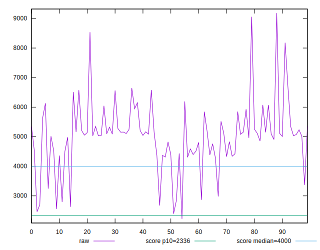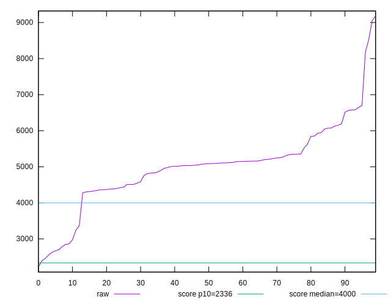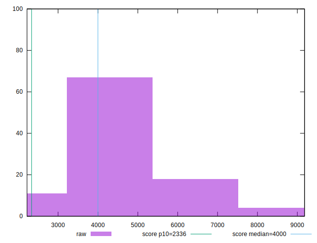
## Score


```yaml
p90min: 0.02
p90max: 0.79
p90range: 0.77
p90mean: 0.2896703296703297
p90median: 0.28
p90stdev: 0.1359254041498421
p90skewness: 1.119886997145193
p90eccentricity: 1
p90discretization: 2.676470588235294
outlandishness: 1.3776846097342492
confidence: 0.08087790847863197
p90confidence: 0.05585448135940485

```

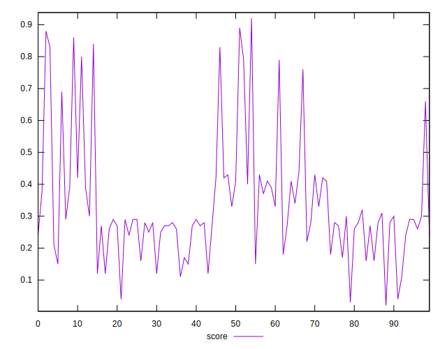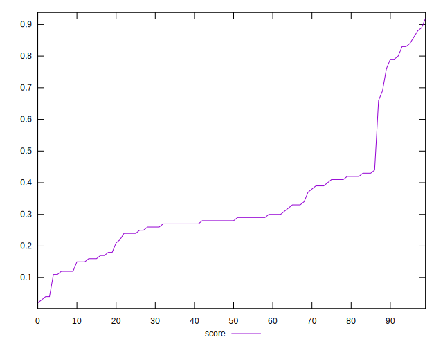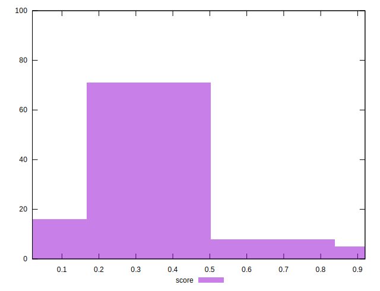
## Raw Estimate

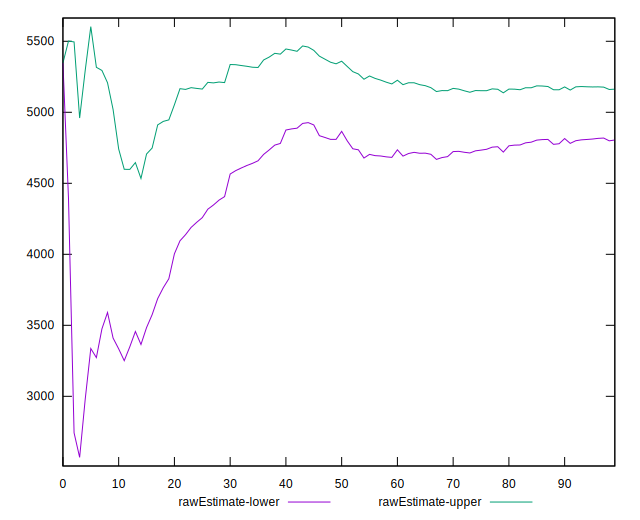
## Score Estimate

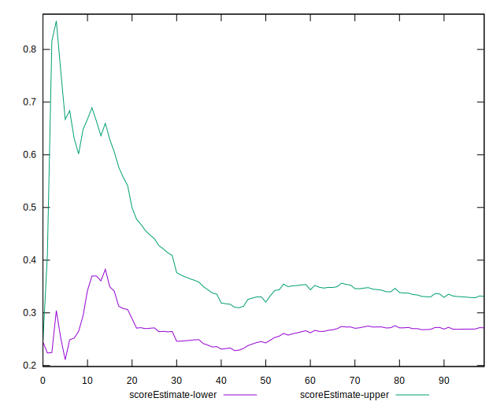
## P Score


```yaml
p90min: 0.02387243498287267
p90max: 0.7868992958867227
p90range: 0.76302686090385
p90mean: 0.29024110207992826
p90median: 0.2800704508145512
p90stdev: 0.1353058638557833
p90skewness: 1.109398860190177
p90eccentricity: 0.9999999999999997
p90discretization: 1
outlandishness: 1.3760482578302164
confidence: 0.08062502329419341
p90confidence: 0.055599899796654806

```

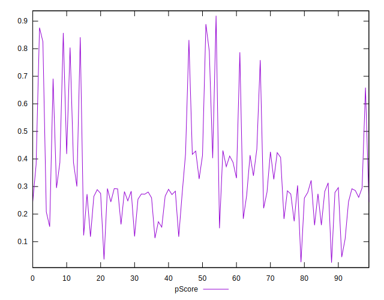
## Score Difference


```yaml
p90min: 0
p90max: 0
p90range: 0
p90mean: 0
p90median: 0
p90stdev: 0
p90skewness: .nan
p90eccentricity: .nan
p90discretization: 91
outlandishness: .inf
confidence: 8.427600696514448e-18
p90confidence: 0

```

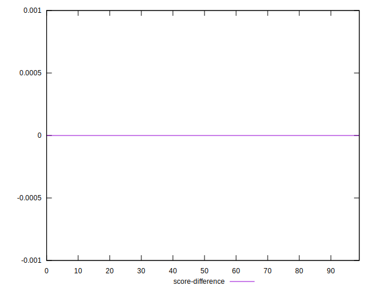
## P Score Difference


```yaml
p90min: -0.003958691311351292
p90max: 0.004954972966689619
p90range: 0.008913664278040911
p90mean: 0.0008582921290339123
p90median: 0.0011626858541706753
p90stdev: 0.0025345768255445383
p90skewness: -0.22392905880681954
p90eccentricity: 0.9999999999999997
p90discretization: 1
outlandishness: 0.29676786586381054
confidence: 0.0011223471503631738
p90confidence: 0.0010415085755440916

```

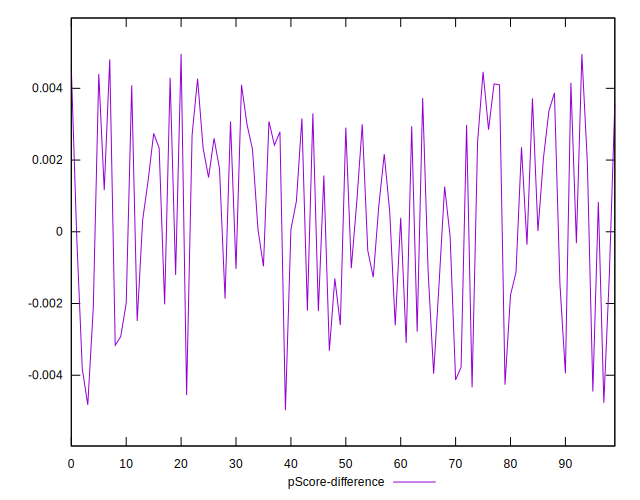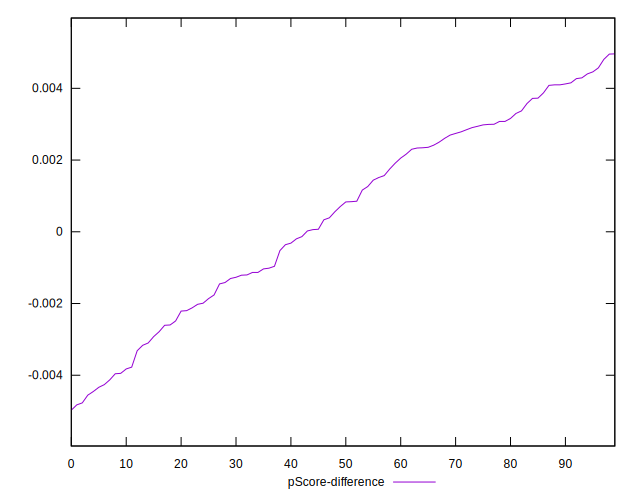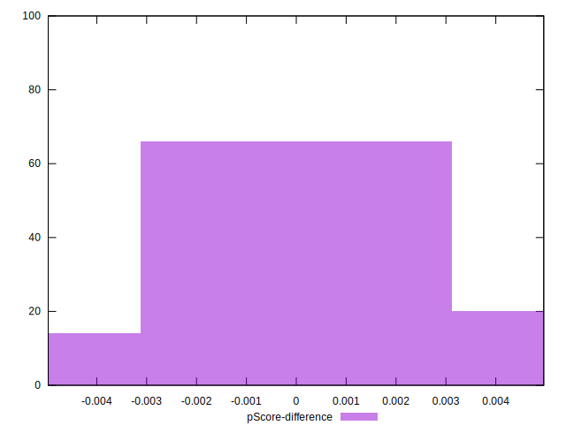