# //first-meaningful-paint/samples/pages+cached+noexternal+nomedia

[→ Parent](../..)


## Raw


```yaml
p90min: 2839.1094999999996
p90max: 7482.983999999999
p90range: 4643.874499999999
p90mean: 5120.487527472525
p90median: 5058.1935
p90stdev: 727.4649626119058
p90skewness: 0.1855449320552773
p90eccentricity: 0.9999999999999999
p90discretization: 1
outlandishness: 1.0271520899502262
confidence: 443.5458411237123
p90confidence: 298.92997889514845

```

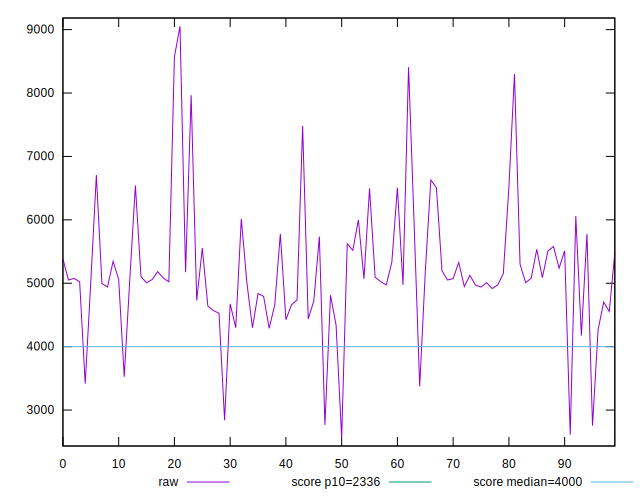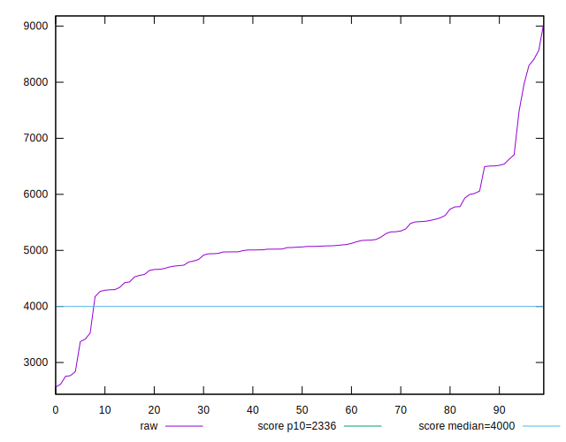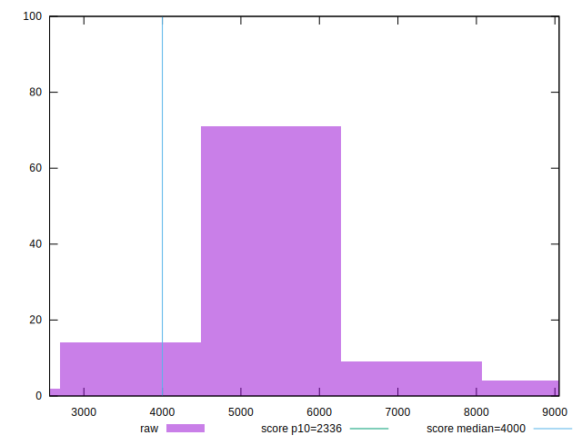
## Score


```yaml
p90min: 0.03
p90max: 0.46
p90range: 0.43000000000000005
p90mean: 0.26769230769230773
p90median: 0.29
p90stdev: 0.09497341355078136
p90skewness: -0.5287791127504576
p90eccentricity: 1
p90discretization: 2.935483870967742
outlandishness: 1.2922070955542344
confidence: 0.06449265586174824
p90confidence: 0.03902648507826656

```

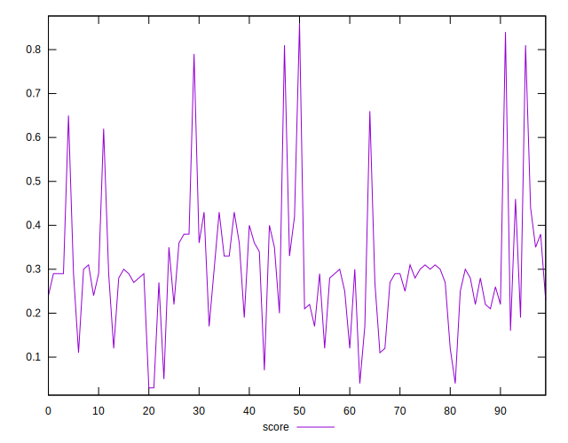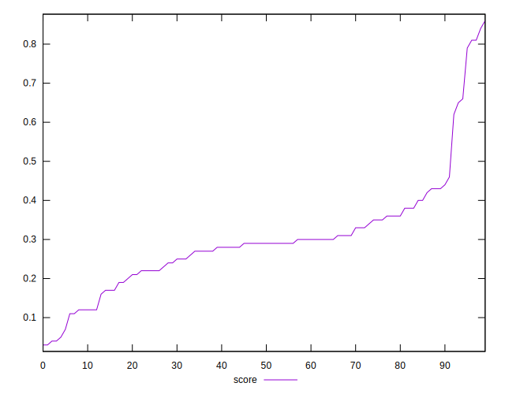
## Raw Estimate

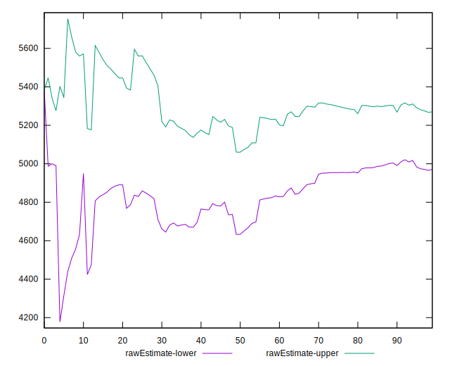
## Score Estimate

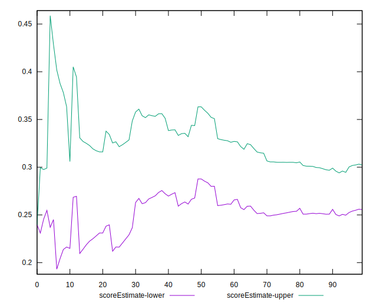
## P Score


```yaml
p90min: 0.03473427206703067
p90max: 0.4593354678145663
p90range: 0.42460119574753563
p90mean: 0.2676671932590508
p90median: 0.2857494248202916
p90stdev: 0.09472188284964896
p90skewness: -0.5047806757531809
p90eccentricity: 1.0000000000000002
p90discretization: 1
outlandishness: 1.2918697822712983
confidence: 0.0644937227028205
p90confidence: 0.03892312605612064

```

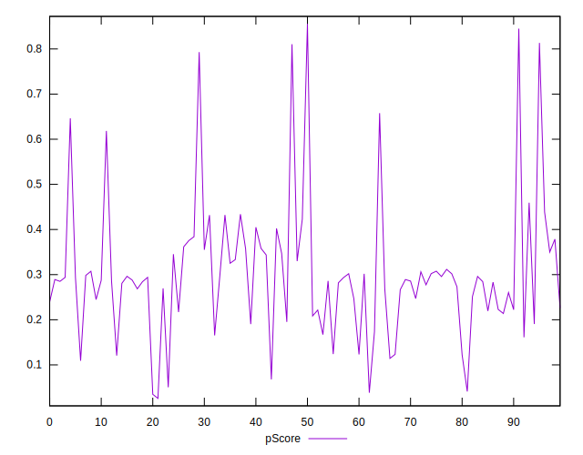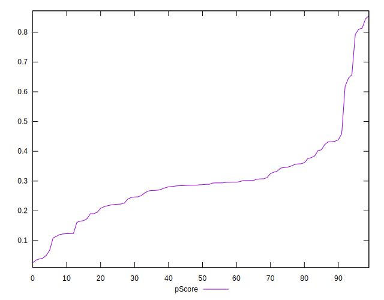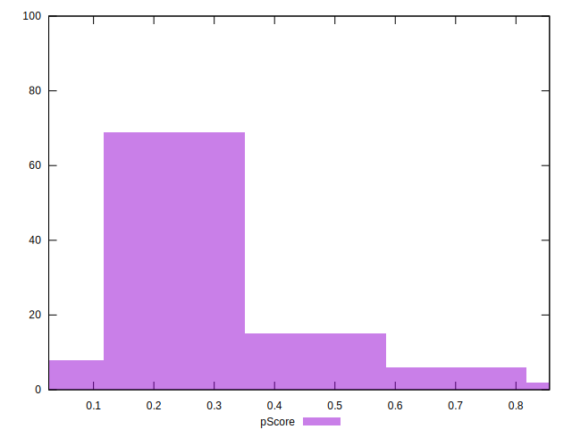
## Score Difference


```yaml
p90min: 0
p90max: 0
p90range: 0
p90mean: 0
p90median: 0
p90stdev: 0
p90skewness: .nan
p90eccentricity: .nan
p90discretization: 91
outlandishness: .inf
confidence: 3.711973057415535e-18
p90confidence: 0

```

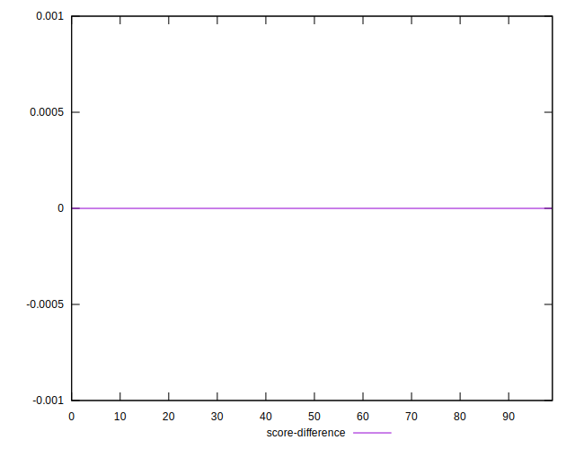
## P Score Difference


```yaml
p90min: -0.004618588113088656
p90max: 0.004443778310520119
p90range: 0.009062366423608775
p90mean: -0.000022289167062851467
p90median: -0.000005247139096331566
p90stdev: 0.002788165578851595
p90skewness: -0.027128572164772977
p90eccentricity: 0.9999999999999997
p90discretization: 1
outlandishness: 9.379979924887877
confidence: 0.0011889981393946867
p90confidence: 0.0011457132927059363

```

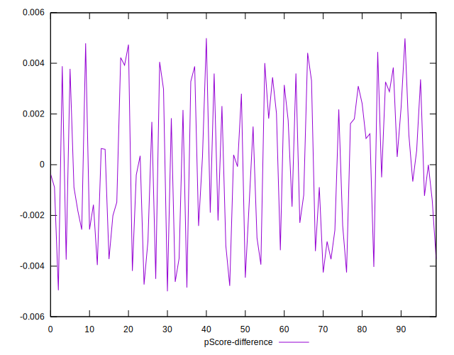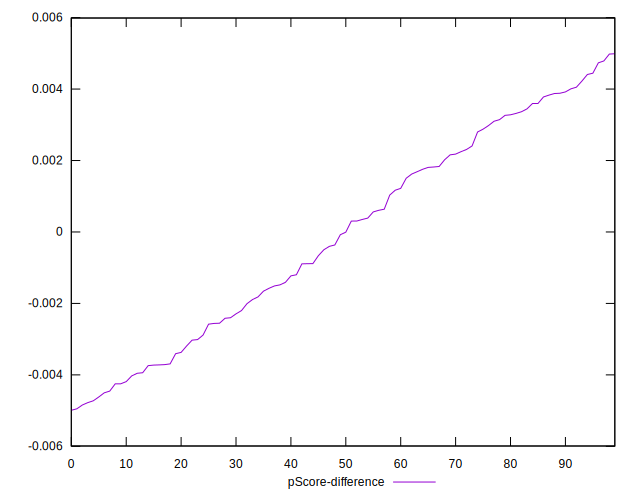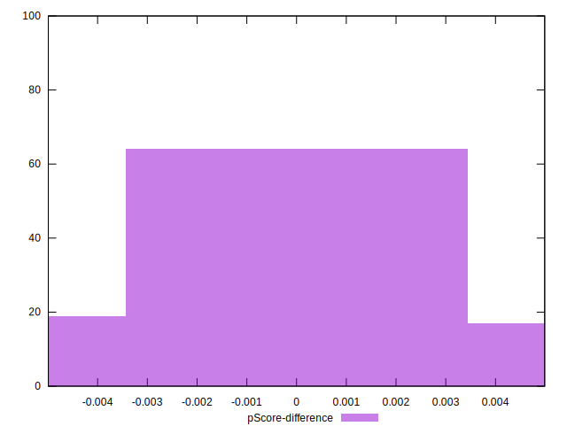