# //first-meaningful-paint/samples/pages+cached+noexternal

[→ Parent](../..)


## Raw


```yaml
p90min: 2753.8780000000006
p90max: 6694.504000000002
p90range: 3940.626000000001
p90mean: 4881.026126373628
p90median: 4930.644
p90stdev: 700.0595857824328
p90skewness: -0.3737646540430381
p90eccentricity: 0.9999999999999999
p90discretization: 1
outlandishness: 0.963305701969429
confidence: 406.84101713671043
p90confidence: 287.668558567997

```

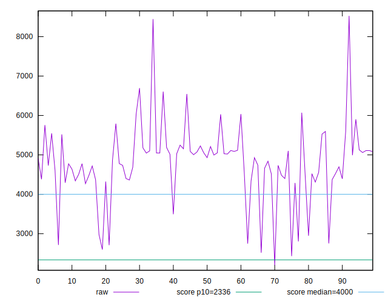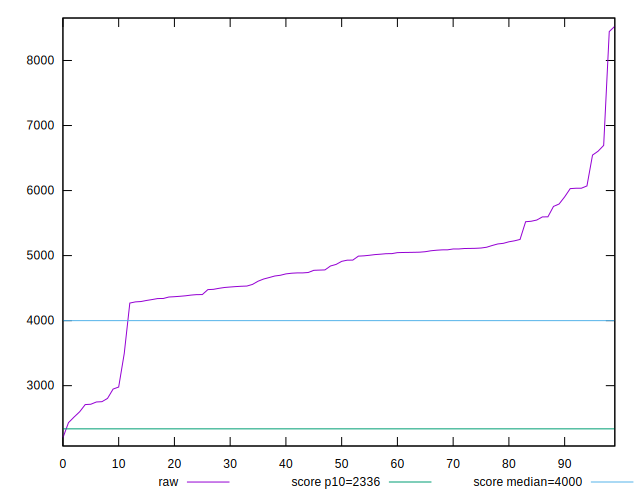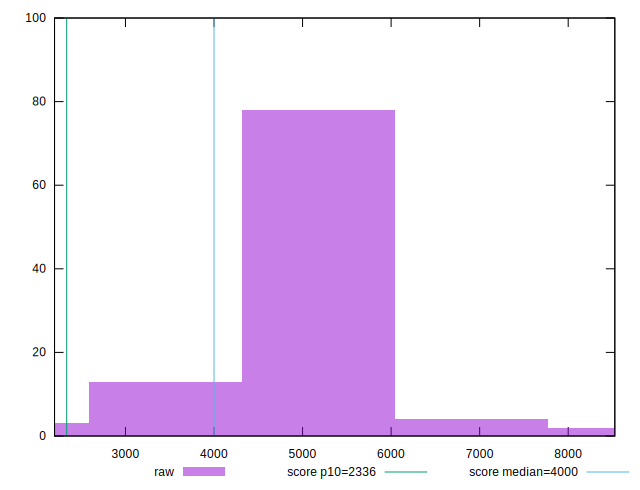
## Score


```yaml
p90min: 0.04
p90max: 0.77
p90range: 0.73
p90mean: 0.31670329670329667
p90median: 0.3
p90stdev: 0.11595807261470138
p90skewness: 0.9572713507309548
p90eccentricity: 1.0000000000000007
p90discretization: 3.25
outlandishness: 1.3209841265101872
confidence: 0.07332046871121456
p90confidence: 0.04764950338636076

```

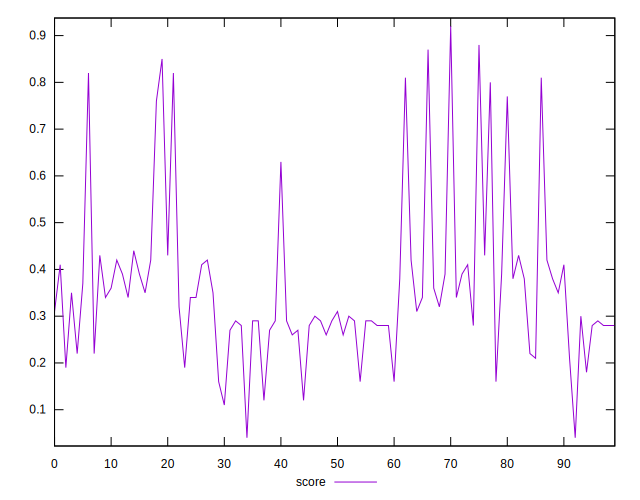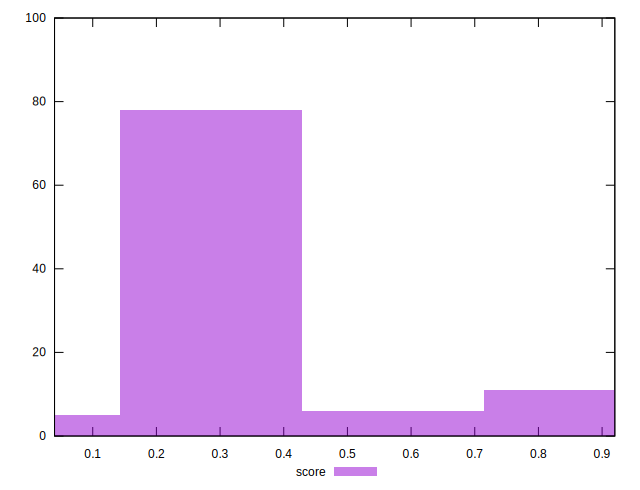
## Raw Estimate

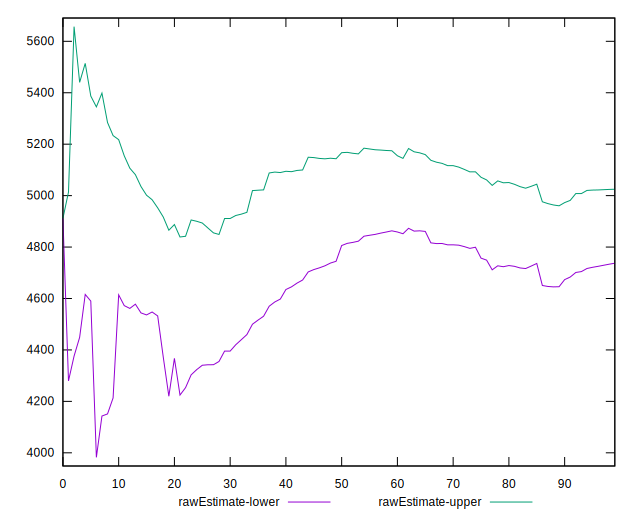
## Score Estimate

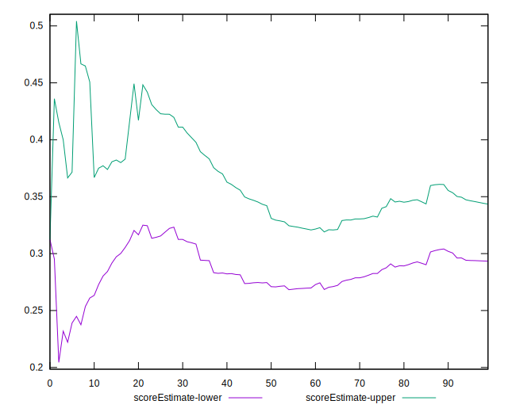
## P Score


```yaml
p90min: 0.035658611807630525
p90max: 0.7665122609324775
p90range: 0.730853649124847
p90mean: 0.31690023591147726
p90median: 0.2980789001261122
p90stdev: 0.11577056453439048
p90skewness: 0.9224268146035103
p90eccentricity: 1.0000000000000004
p90discretization: 1
outlandishness: 1.321554270084669
confidence: 0.07338280609831982
p90confidence: 0.04757245254629172

```

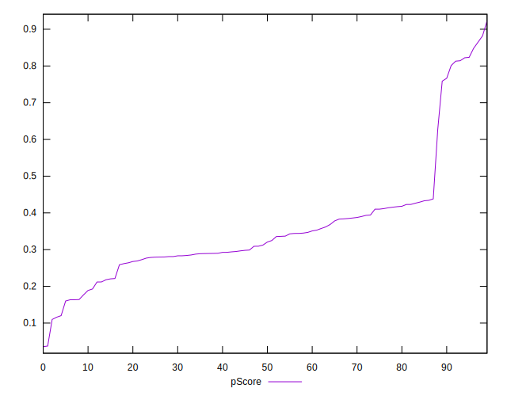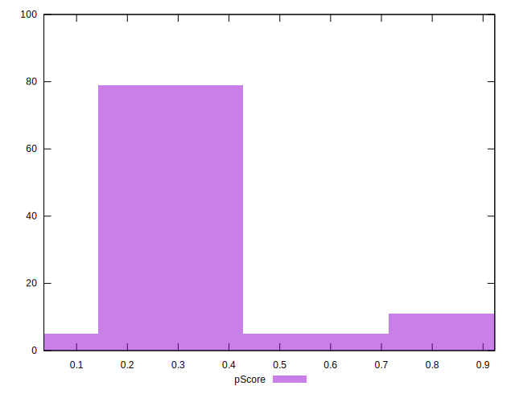
## Score Difference


```yaml
p90min: 0
p90max: 5.551115123125783e-17
p90range: 5.551115123125783e-17
p90mean: 6.100126508929432e-19
p90median: 0
p90stdev: 5.7870881350165325e-18
p90skewness: 9.381423725166233
p90eccentricity: 1.0000000000000022
p90discretization: 45.5
outlandishness: 119.24639999999997
confidence: 8.303075907792292e-18
p90confidence: 2.3780308646806364e-18

```

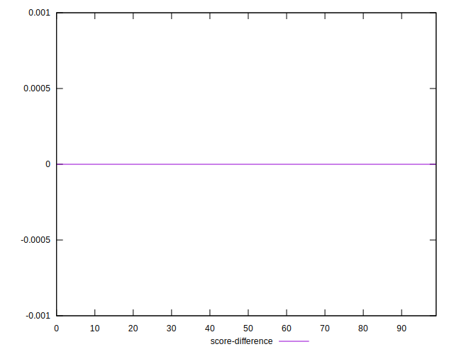
## P Score Difference


```yaml
p90min: -0.003995842658362225
p90max: 0.004240872614028279
p90range: 0.008236715272390505
p90mean: 0.0004802091621939201
p90median: 0.00016254667402060274
p90stdev: 0.0025278498775243
p90skewness: -0.09719675372375892
p90eccentricity: 1.0000000000000002
p90discretization: 1
outlandishness: 0.40325130031157347
confidence: 0.0011020628936030128
p90confidence: 0.001038744337356594

```

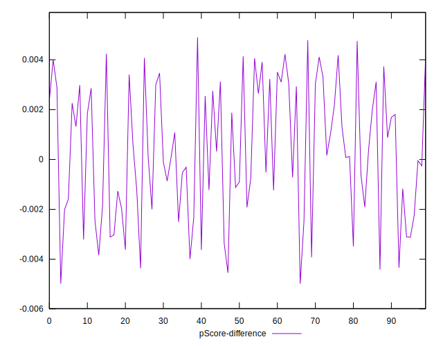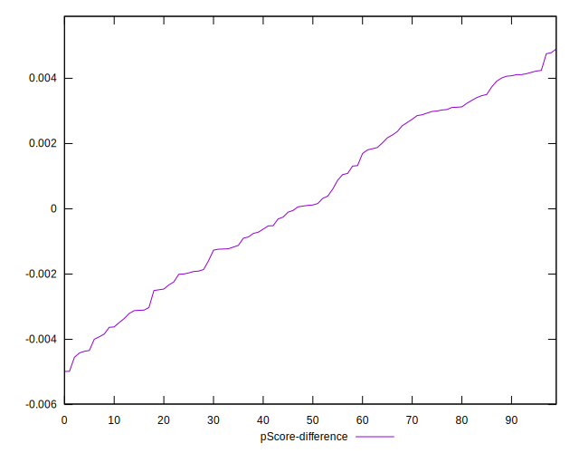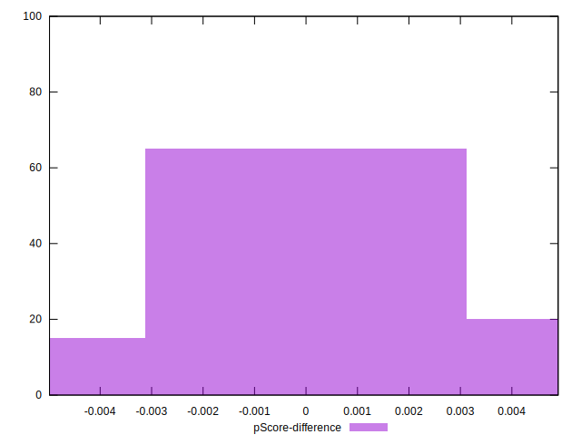