# //first-meaningful-paint/samples/pages+cached

[→ Parent](../..)


## Raw


```yaml
p90min: 2761.7865
p90max: 6729.033
p90range: 3967.2465
p90mean: 4975.350181318681
p90median: 5080.423
p90stdev: 826.3765641686807
p90skewness: -0.43805057723606633
p90eccentricity: 1.0000000000000002
p90discretization: 1
outlandishness: 0.980169585076695
confidence: 441.63200930393396
p90confidence: 339.5747446027526

```

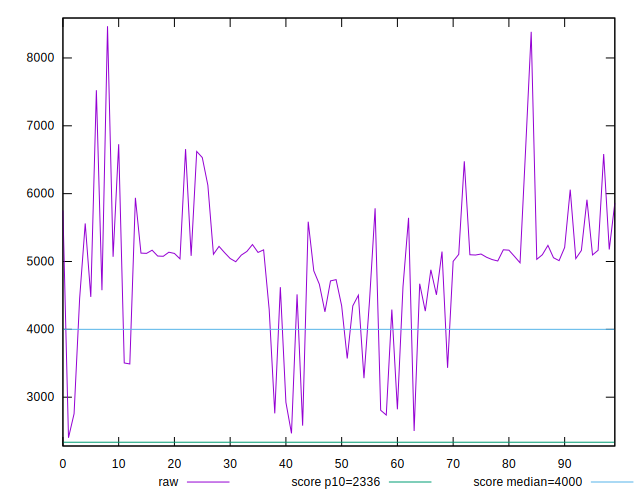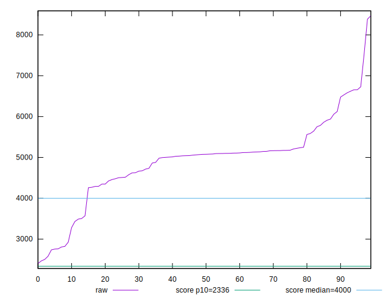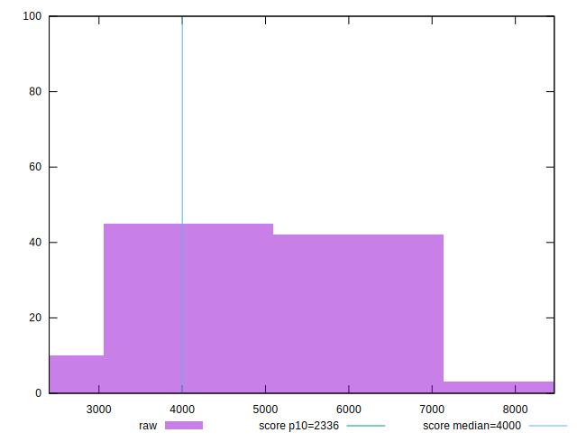
## Score


```yaml
p90min: 0.04
p90max: 0.77
p90range: 0.73
p90mean: 0.2991208791208792
p90median: 0.28
p90stdev: 0.13051586869666354
p90skewness: 1.0525997351141099
p90eccentricity: 0.9999999999999999
p90discretization: 2.757575757575758
outlandishness: 1.34963446704162
confidence: 0.07768062022995803
p90confidence: 0.053631594482426936

```

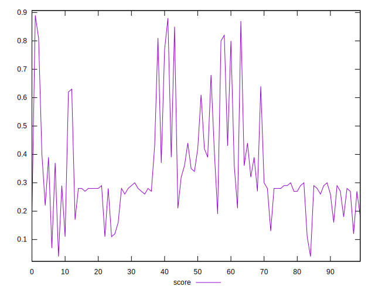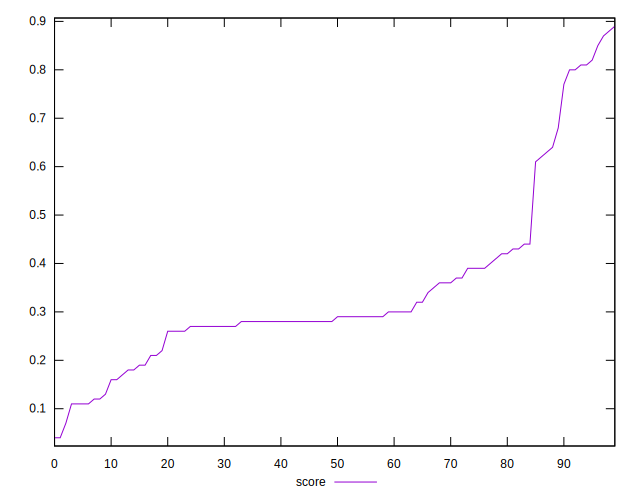
## Raw Estimate

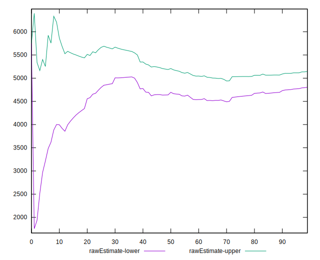
## Score Estimate

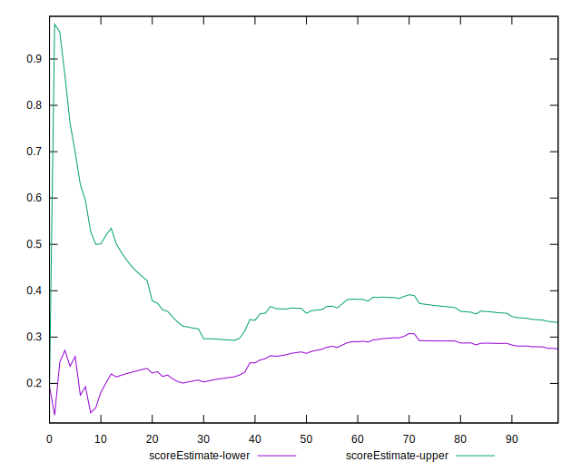
## P Score


```yaml
p90min: 0.03697691154387417
p90max: 0.7723535311350256
p90range: 0.7353766195911514
p90mean: 0.2990887606258315
p90median: 0.28207798732076705
p90stdev: 0.13082082382251614
p90skewness: 1.052520014133121
p90eccentricity: 0.9999999999999999
p90discretization: 1
outlandishness: 1.3490869067366076
confidence: 0.077673328588021
p90confidence: 0.053756906674793936

```

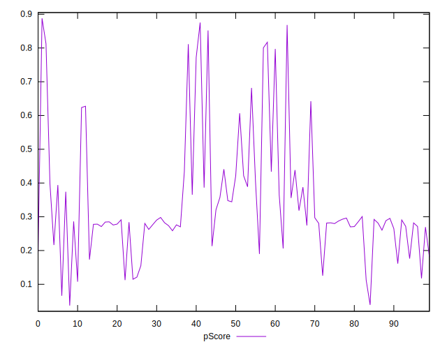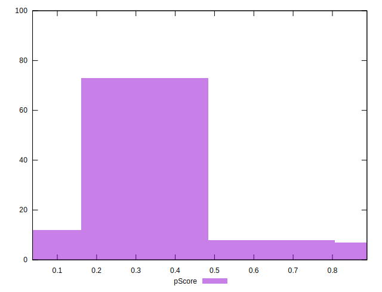
## Score Difference


```yaml
p90min: 0
p90max: 0
p90range: 0
p90mean: 0
p90median: 0
p90stdev: 0
p90skewness: .nan
p90eccentricity: .nan
p90discretization: 91
outlandishness: .inf
confidence: 5.258534703630926e-18
p90confidence: 0

```

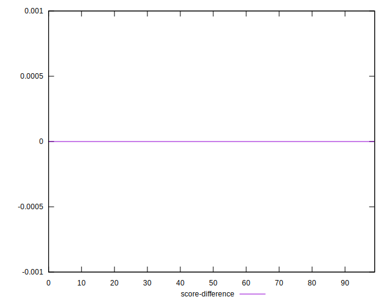
## P Score Difference


```yaml
p90min: -0.004645579622574725
p90max: 0.00427213328200704
p90range: 0.008917712904581765
p90mean: -0.0001672410544678349
p90median: 0.00031819898066320906
p90stdev: 0.00260942616665229
p90skewness: -0.07033931186349869
p90eccentricity: 0.9999999999999996
p90discretization: 1
outlandishness: 0.4155198753249457
confidence: 0.0011272585836868336
p90confidence: 0.0010722656746589704

```

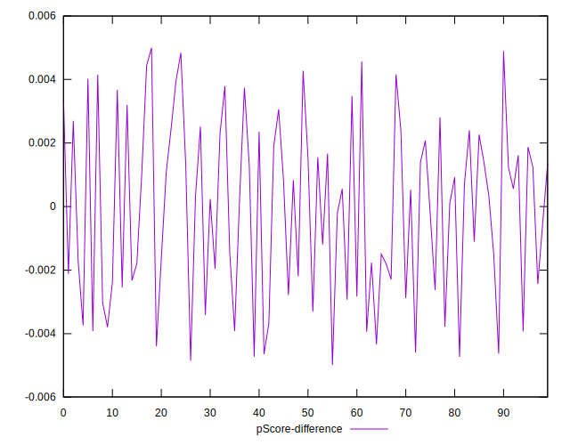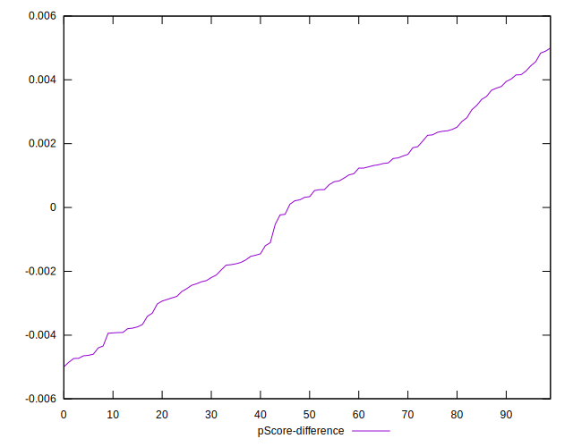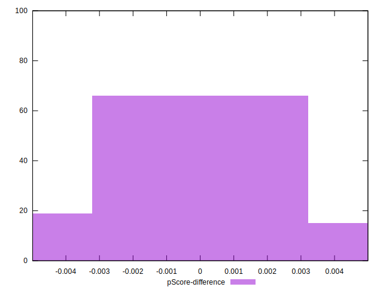