# //first-meaningful-paint/samples/pages

[→ Parent](../..)


## Raw


```yaml
p90min: 2600.416
p90max: 5639.157
p90range: 3038.741
p90mean: 3669.456840659341
p90median: 3389.437500000001
p90stdev: 649.1362381938357
p90skewness: 1.4873342819091802
p90eccentricity: 1.0000000000000002
p90discretization: 1
outlandishness: 1.122085257136182
confidence: 369.59527464503117
p90confidence: 266.74313122470085

```

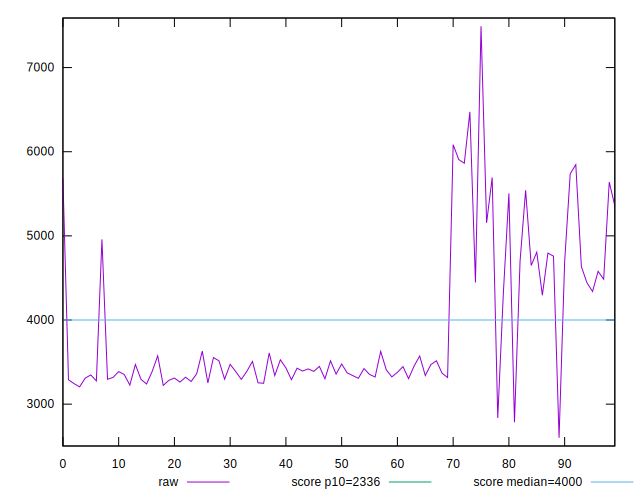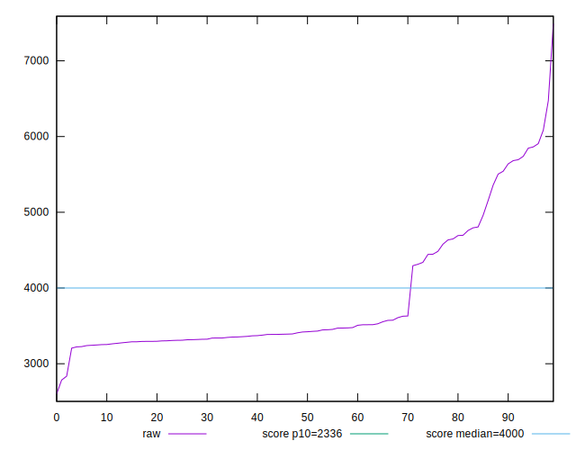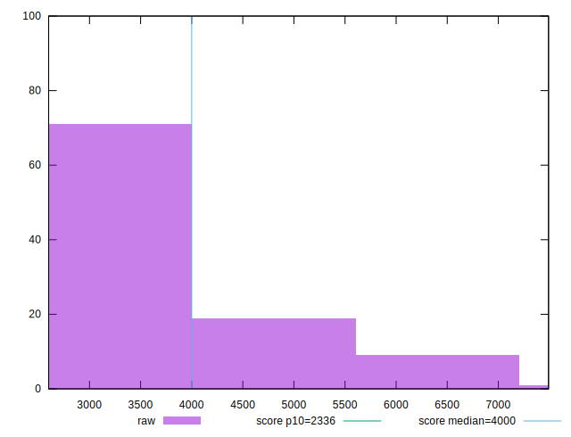
## Score


```yaml
p90min: 0.21
p90max: 0.85
p90range: 0.64
p90mean: 0.5913186813186814
p90median: 0.65
p90stdev: 0.14424649835739847
p90skewness: -1.2683866984037238
p90eccentricity: 1.0000000000000004
p90discretization: 3.1379310344827585
outlandishness: 0.87459514695843
confidence: 0.07219587928871429
p90confidence: 0.059273786265744866

```

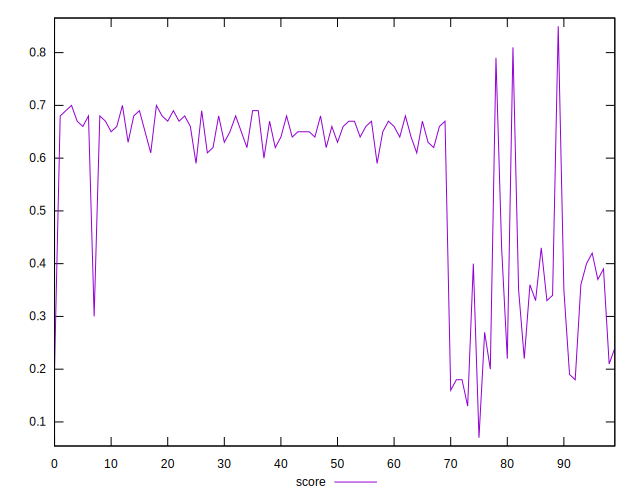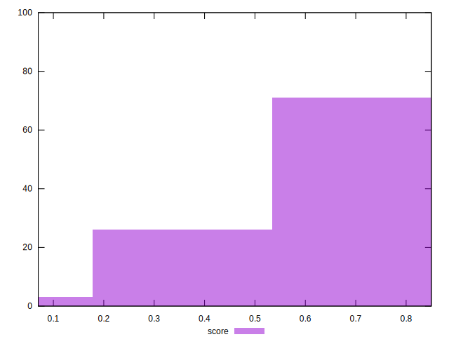
## Raw Estimate

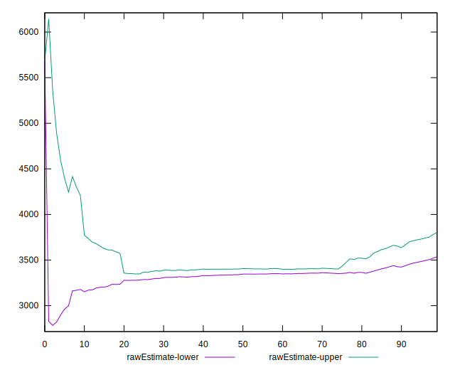
## Score Estimate

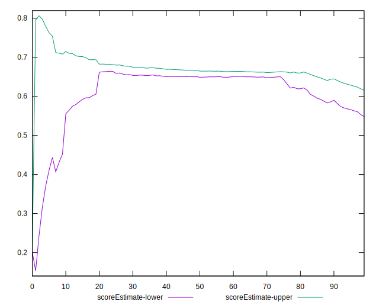
## P Score


```yaml
p90min: 0.20658749099897833
p90max: 0.8475660105496485
p90range: 0.6409785195506702
p90mean: 0.5918710627066682
p90median: 0.6534491239163354
p90stdev: 0.14370164828595833
p90skewness: -1.2757864187430679
p90eccentricity: 1.0000000000000002
p90discretization: 1
outlandishness: 0.8745183790890938
confidence: 0.07210675587281479
p90confidence: 0.059049896417123326

```

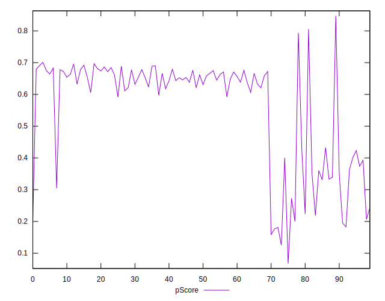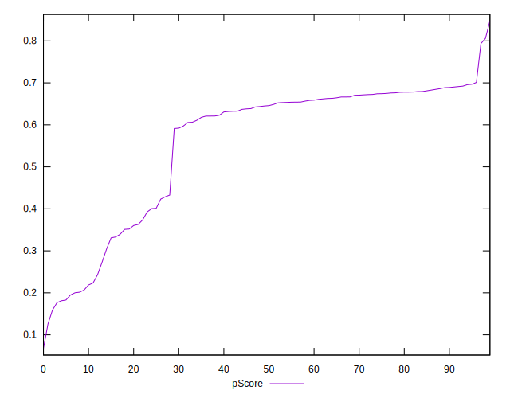
## Score Difference


```yaml
p90min: 0
p90max: 5.551115123125783e-17
p90range: 5.551115123125783e-17
p90mean: 1.2200253017858864e-18
p90median: 0
p90stdev: 8.138583863080836e-18
p90skewness: 6.520925694263966
p90eccentricity: 0.9999999999999964
p90discretization: 45.5
outlandishness: 82.80999999999999
confidence: 1.268813466457616e-17
p90confidence: 3.3443077364057997e-18

```

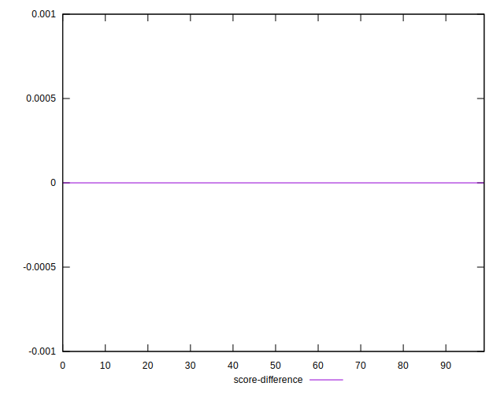
## P Score Difference


```yaml
p90min: -0.0038016840121672946
p90max: 0.0046436501032108835
p90range: 0.008445334115378178
p90mean: 0.0006589111979884811
p90median: 0.0010619361482234746
p90stdev: 0.0024740343514379746
p90skewness: -0.311951210590339
p90eccentricity: 0.9999999999999997
p90discretization: 1
outlandishness: 0.5582044161535143
confidence: 0.0010747348604257503
p90confidence: 0.0010166304557210337

```

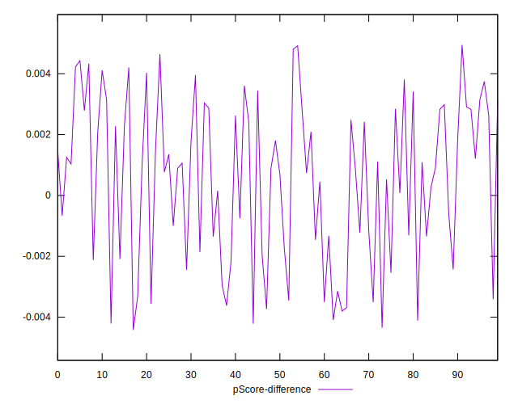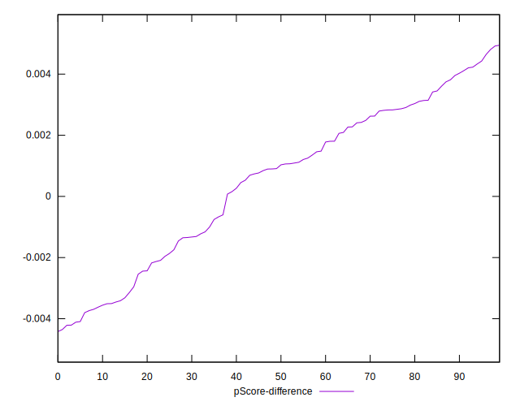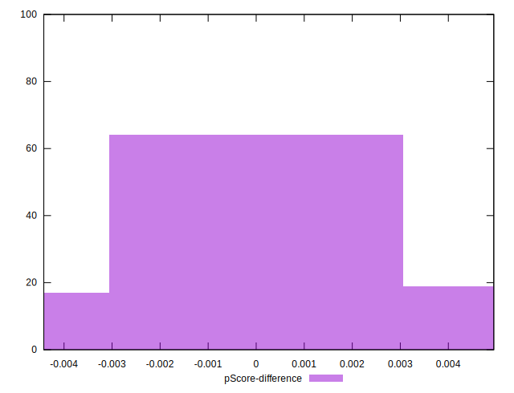