# //interactive/samples/pages+cached+noexternal+nomedia+nocss+nojs

[→ Parent](../..)


## Raw


```yaml
p90min: 14281.364999999998
p90max: 17450.907999999996
p90range: 3169.542999999998
p90mean: 16011.477142857144
p90median: 16344.786000000006
p90stdev: 869.0959608725458
p90skewness: -0.46904996912054825
p90eccentricity: 1.0000000000000004
p90discretization: 1
outlandishness: 0.9886828322129597
confidence: 390.69861333269
p90confidence: 357.12900358623665

```

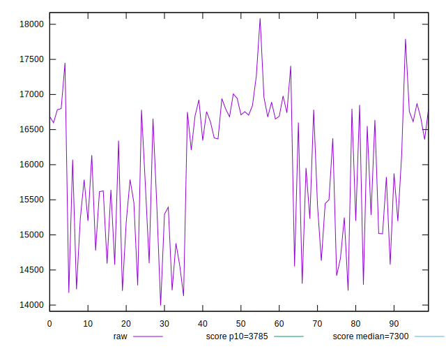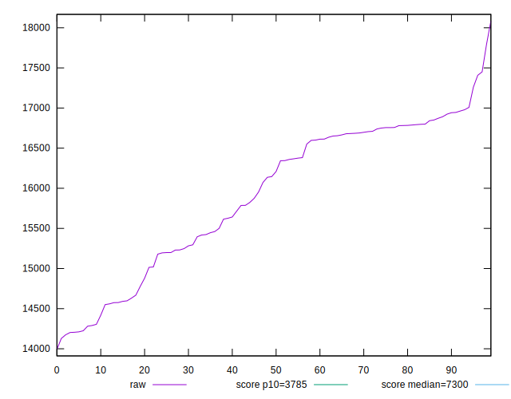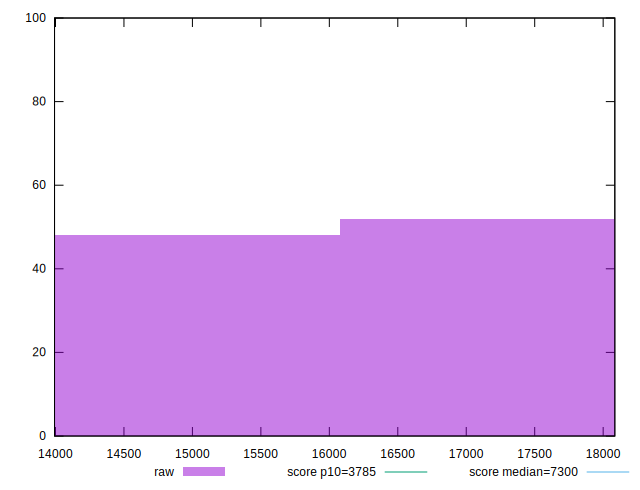
## Score


```yaml
p90min: 0.04
p90max: 0.09
p90range: 0.049999999999999996
p90mean: 0.06230769230769224
p90median: 0.06
p90stdev: 0.014756404687116068
p90skewness: 0.5632560365746019
p90eccentricity: 0.9999999999999978
p90discretization: 15.166666666666666
outlandishness: 1.1118530864197533
confidence: 0.006951768735211236
p90confidence: 0.006063703364970405

```

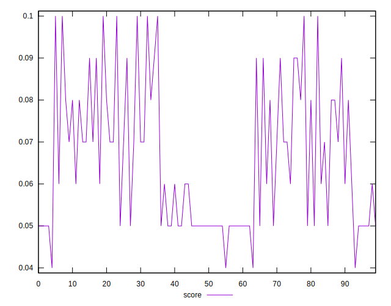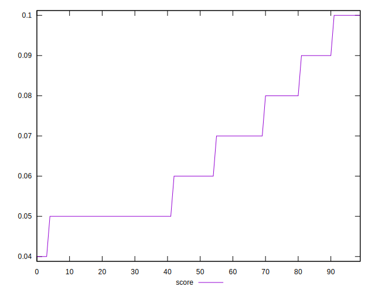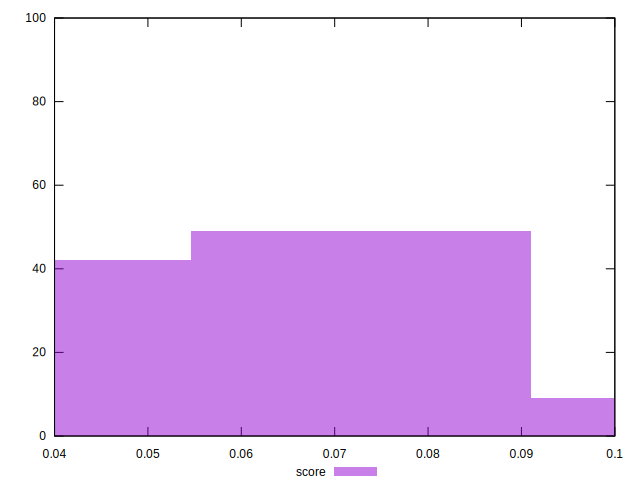
## Raw Estimate

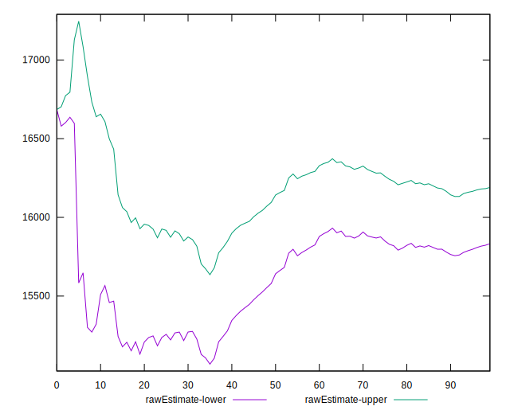
## Score Estimate

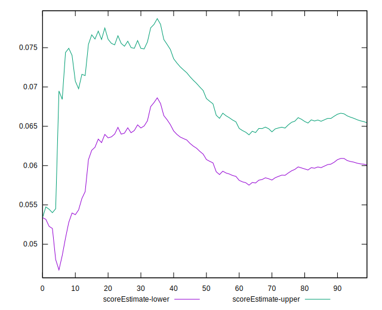
## P Score


```yaml
p90min: 0.038355814093253615
p90max: 0.09467120608298885
p90range: 0.05631539198973523
p90mean: 0.06295900390954591
p90median: 0.05759046490470299
p90stdev: 0.013650375915267353
p90skewness: 0.6371897602637489
p90eccentricity: 0.9999999999999997
p90discretization: 1
outlandishness: 1.1007729069240861
confidence: 0.006403438293952846
p90confidence: 0.00560921390579551

```

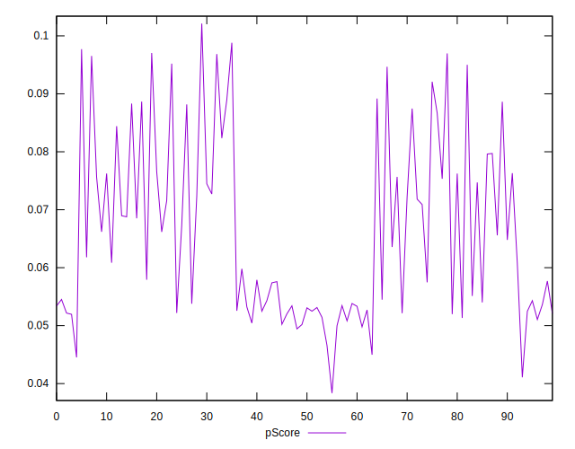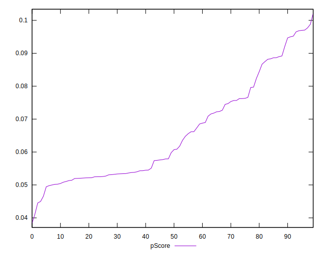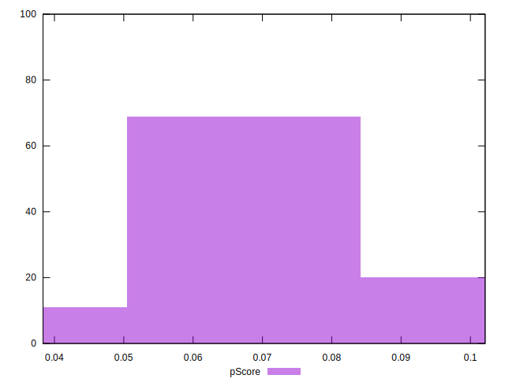
## Score Difference


```yaml
p90min: 0
p90max: 0
p90range: 0
p90mean: 0
p90median: 0
p90stdev: 0
p90skewness: .nan
p90eccentricity: .nan
p90discretization: 91
outlandishness: .nan
confidence: 0
p90confidence: 0

```


## P Score Difference


```yaml
p90min: -0.0038312116264768714
p90max: 0.004706646160511141
p90range: 0.008537857786988012
p90mean: 0.000639366062251183
p90median: 0.0010575615648679565
p90stdev: 0.002615552922226442
p90skewness: -0.18565363160806167
p90eccentricity: 0.9999999999999991
p90discretization: 1
outlandishness: 0.3085574648353115
confidence: 0.0011398754268693054
p90confidence: 0.0010747832817034405

```

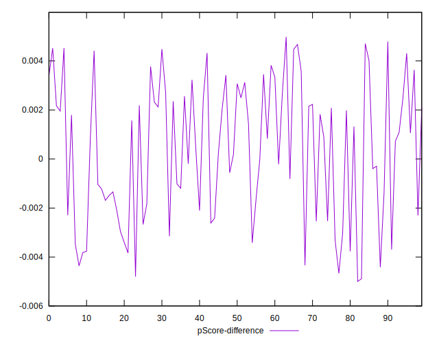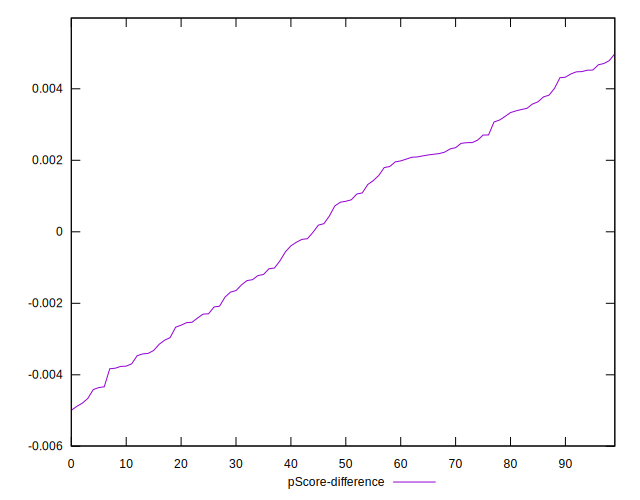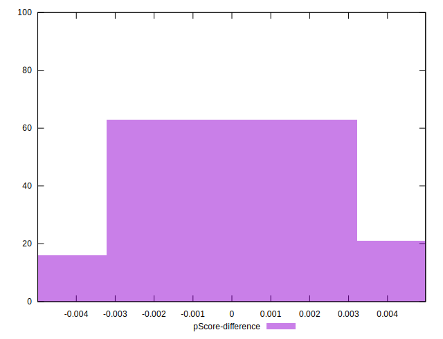