# //interactive/samples/pages+cached+noexternal+nomedia+nocss

[→ Parent](../..)


## Raw


```yaml
p90min: 14335.03
p90max: 17329.78
p90range: 2994.749999999998
p90mean: 16151.07585164835
p90median: 16521.287
p90stdev: 804.1055255137779
p90skewness: -0.8871133258812027
p90eccentricity: 0.9999999999999999
p90discretization: 1
outlandishness: 0.9828492849227273
confidence: 379.63540363552966
p90confidence: 330.4231270579294

```

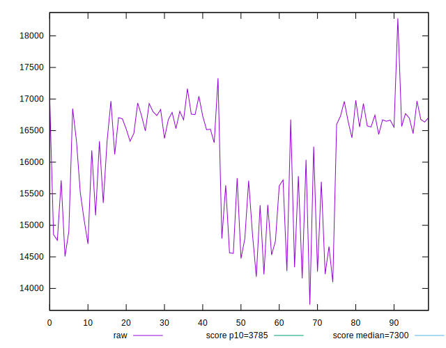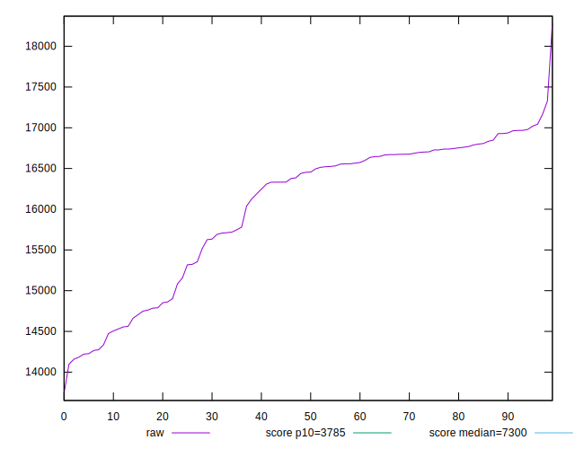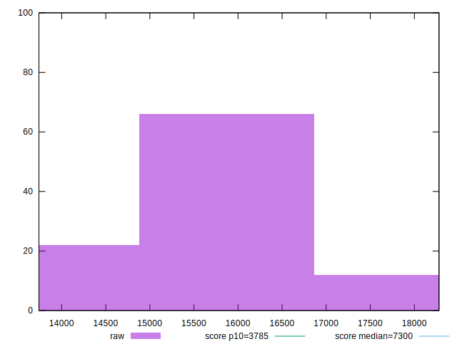
## Score


```yaml
p90min: 0.04
p90max: 0.09
p90range: 0.049999999999999996
p90mean: 0.06109890109890101
p90median: 0.06
p90stdev: 0.01321425715653399
p90skewness: 0.9119816812283512
p90eccentricity: 1.0000000000000004
p90discretization: 15.166666666666666
outlandishness: 1.1178878538895503
confidence: 0.0066157422274043115
p90confidence: 0.005430003939619468

```

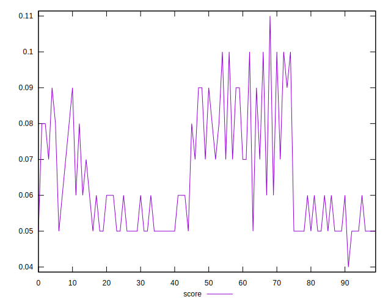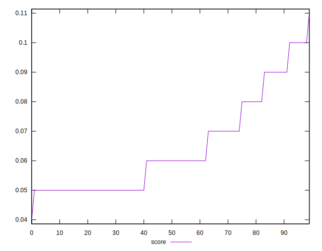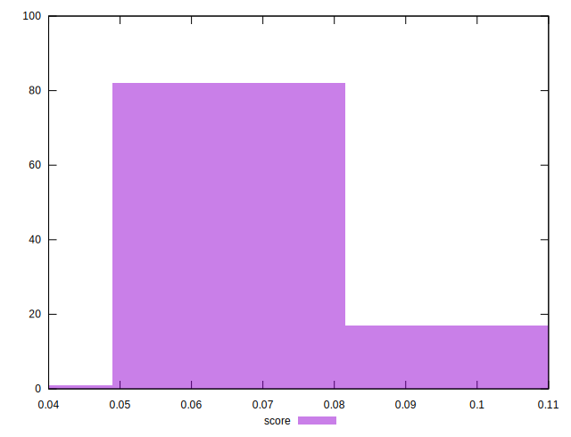
## Raw Estimate

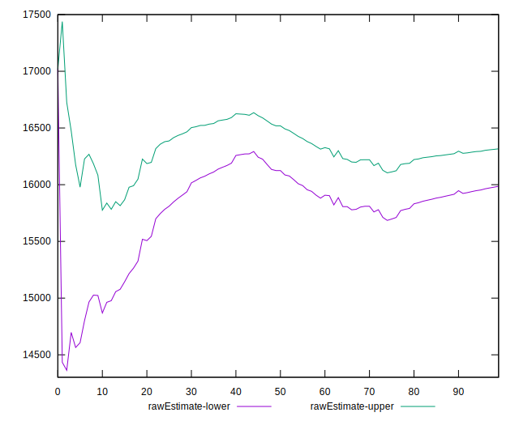
## Score Estimate

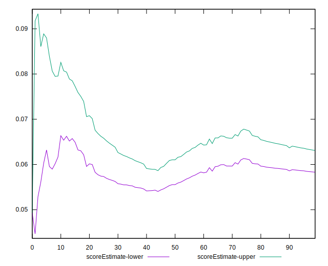
## P Score


```yaml
p90min: 0.036654922785000155
p90max: 0.09086341574322893
p90range: 0.05420849295822877
p90mean: 0.06126038858222019
p90median: 0.055462123398340446
p90stdev: 0.012769293336930405
p90skewness: 1.009606727142848
p90eccentricity: 1.0000000000000002
p90discretization: 1
outlandishness: 1.1107516372742132
confidence: 0.006322884316512359
p90confidence: 0.005247159360100978

```

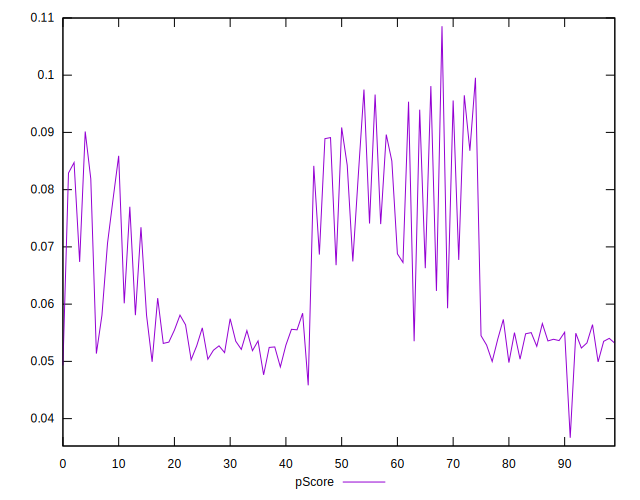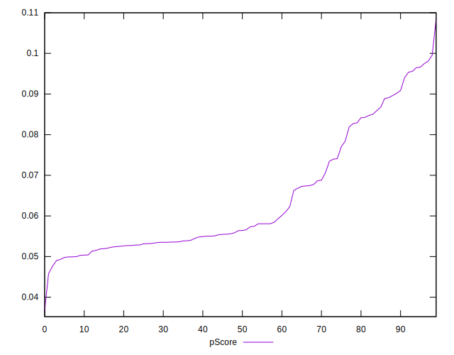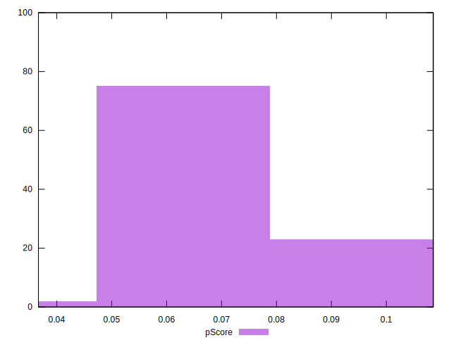
## Score Difference


```yaml
p90min: 0
p90max: 0
p90range: 0
p90mean: 0
p90median: 0
p90stdev: 0
p90skewness: .nan
p90eccentricity: .nan
p90discretization: 91
outlandishness: .nan
confidence: 0
p90confidence: 0

```


## P Score Difference


```yaml
p90min: -0.004537876601659552
p90max: 0.0044838712388618335
p90range: 0.009021747840521385
p90mean: 0.00012086798584706623
p90median: -0.000020910940469479056
p90stdev: 0.0027897703660213955
p90skewness: -0.05406658697652628
p90eccentricity: 1.0000000000000002
p90discretization: 1
outlandishness: 0.09033163286801167
confidence: 0.0011894722091325412
p90confidence: 0.0011463727320184184

```

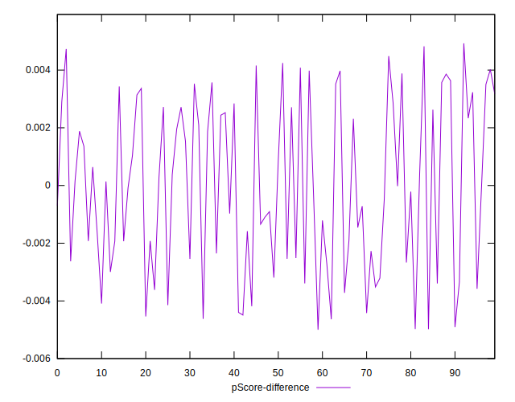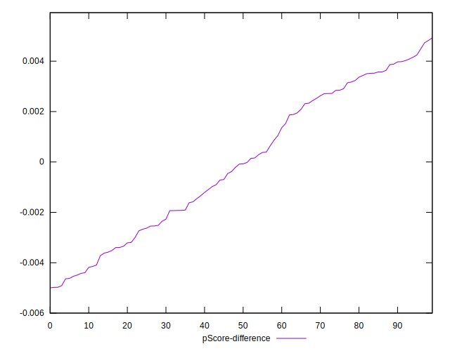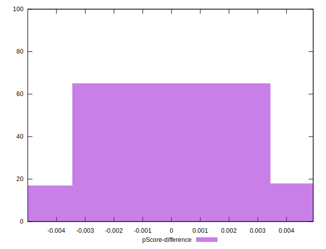