# //interactive/samples/pages+cached+noexternal+nomedia

[→ Parent](../..)


## Raw


```yaml
p90min: 14092.989000000001
p90max: 17404.290499999996
p90range: 3311.301499999994
p90mean: 15958.077236263742
p90median: 16396.032
p90stdev: 884.1662060173078
p90skewness: -0.7584394522182887
p90eccentricity: 1
p90discretization: 1
outlandishness: 0.9769896446620971
confidence: 403.16299289219023
p90confidence: 363.32167030504934

```

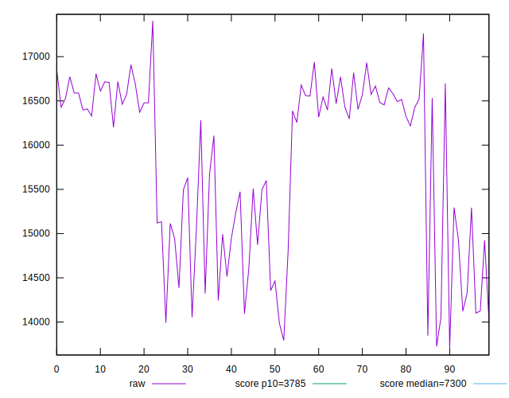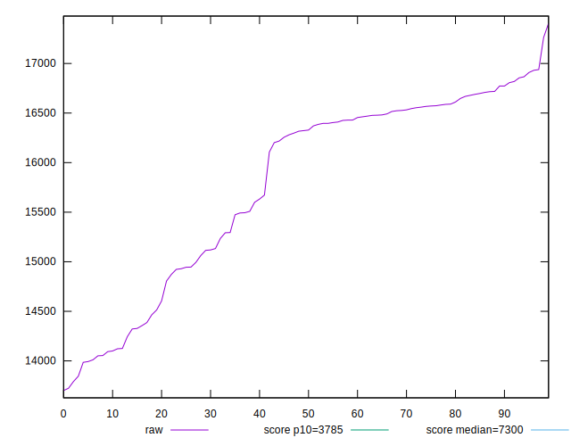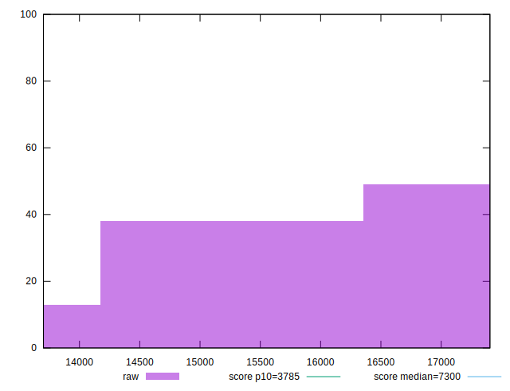
## Score


```yaml
p90min: 0.05
p90max: 0.1
p90range: 0.05
p90mean: 0.0652747252747252
p90median: 0.06
p90stdev: 0.014850216214850965
p90skewness: 0.8626495225715106
p90eccentricity: 1.0000000000000018
p90discretization: 15.166666666666666
outlandishness: 1.1109301953315418
confidence: 0.007105349281005868
p90confidence: 0.006102252407807082

```

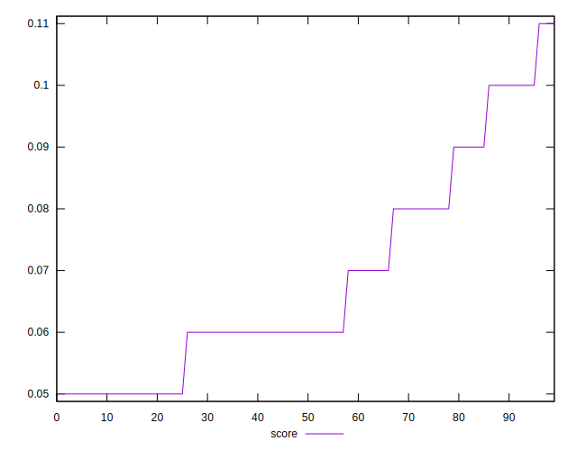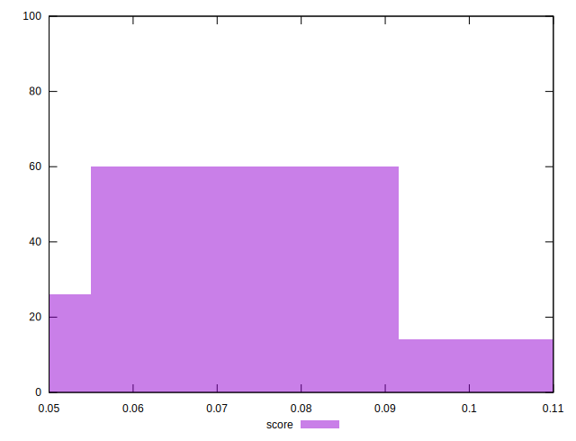
## Raw Estimate

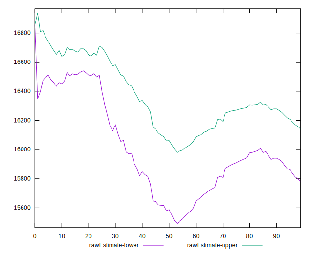
## Score Estimate

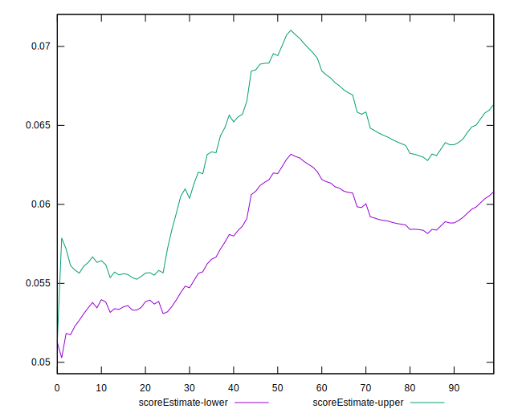
## P Score


```yaml
p90min: 0.045017164816701816
p90max: 0.09966674371978379
p90range: 0.054649578903081975
p90mean: 0.06509135597038708
p90median: 0.057193437153342186
p90stdev: 0.014913087859444748
p90skewness: 0.9768429067484609
p90eccentricity: 1.0000000000000002
p90discretization: 1
outlandishness: 1.1115305830449314
confidence: 0.007117652102447525
p90confidence: 0.006128087630611553

```

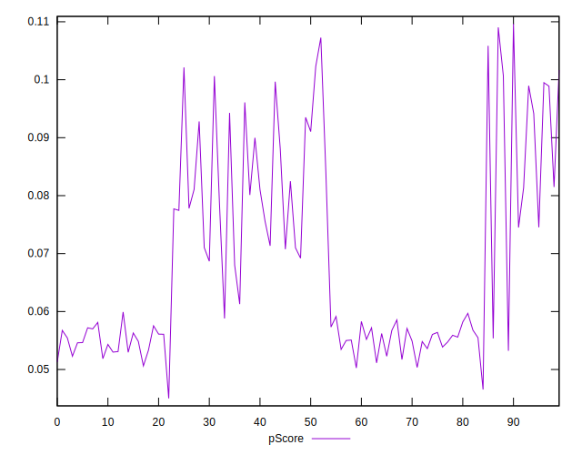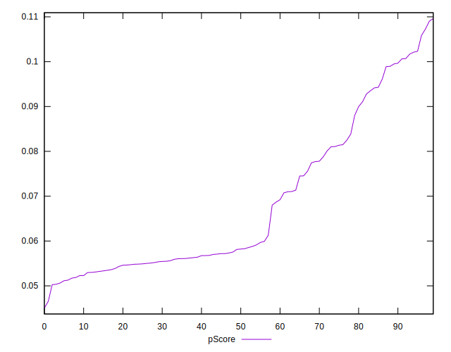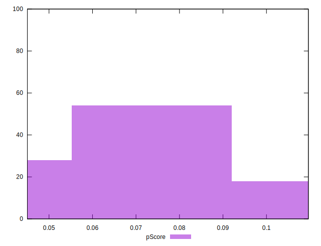
## Score Difference


```yaml
p90min: 0
p90max: 0
p90range: 0
p90mean: 0
p90median: 0
p90stdev: 0
p90skewness: .nan
p90eccentricity: .nan
p90discretization: 91
outlandishness: .nan
confidence: 0
p90confidence: 0

```


## P Score Difference


```yaml
p90min: -0.004802336598827228
p90max: 0.004534752138247555
p90range: 0.009337088737074783
p90mean: -0.00034202556065920947
p90median: -0.00033325628021621534
p90stdev: 0.0027062998362745493
p90skewness: 0.07782908002995072
p90eccentricity: 1
p90discretization: 1
outlandishness: 0.26100483422298476
confidence: 0.0011654891276053308
p90confidence: 0.001112073013161851

```

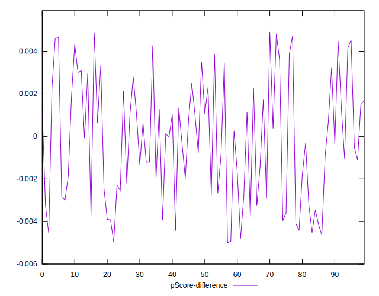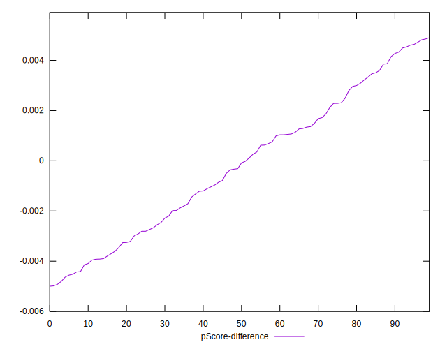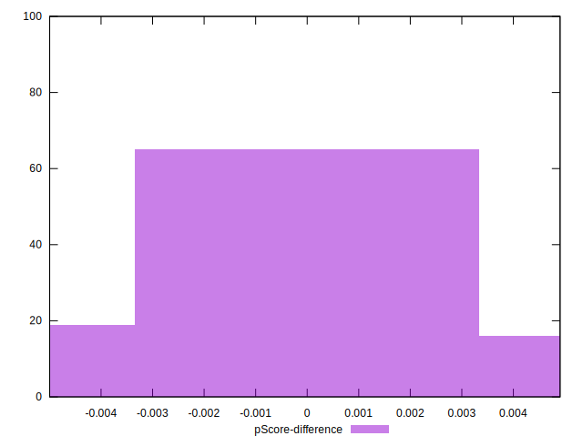