# //interactive/samples/pages+cached+noexternal

[→ Parent](../..)


## Raw


```yaml
p90min: 14085.3345
p90max: 16814.226000000002
p90range: 2728.8915000000015
p90mean: 15617.962879120876
p90median: 15509.510999999997
p90stdev: 906.2971179450674
p90skewness: -0.1545771785790724
p90eccentricity: 1.0000000000000002
p90discretization: 1
outlandishness: 0.9894377051150467
confidence: 391.3626543259961
p90confidence: 372.4157069604262

```

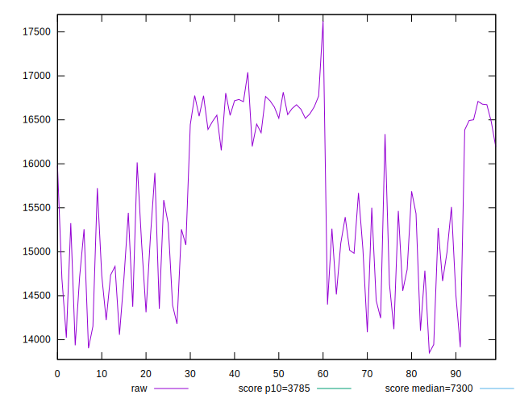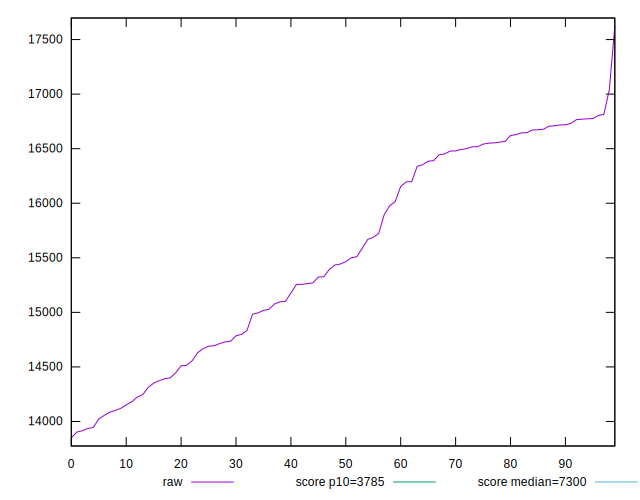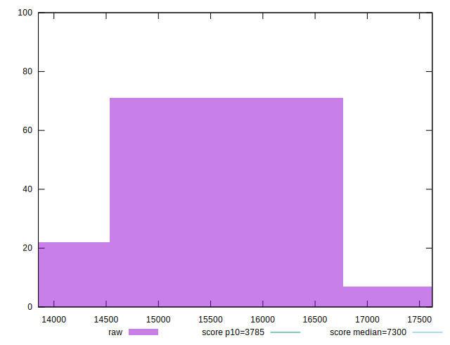
## Score


```yaml
p90min: 0.05
p90max: 0.1
p90range: 0.05
p90mean: 0.07021978021978016
p90median: 0.07
p90stdev: 0.016034168322611897
p90skewness: 0.2840978542719335
p90eccentricity: 0.9999999999999996
p90discretization: 15.166666666666666
outlandishness: 1.0630610367823363
confidence: 0.00697086203408534
p90confidence: 0.006588762132364978

```

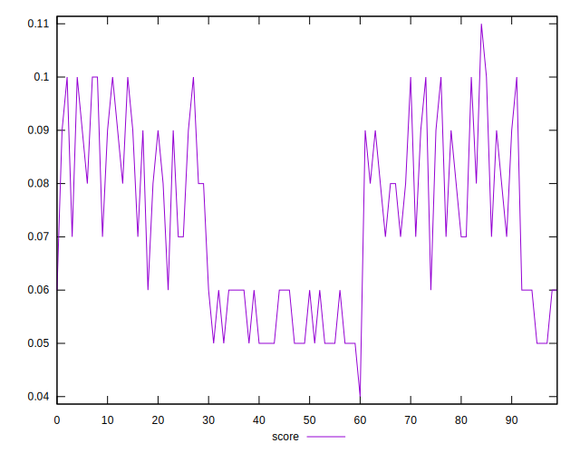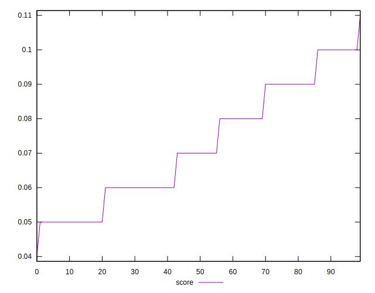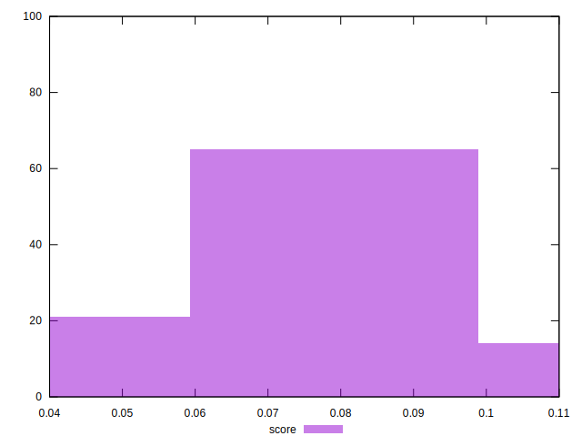
## Raw Estimate

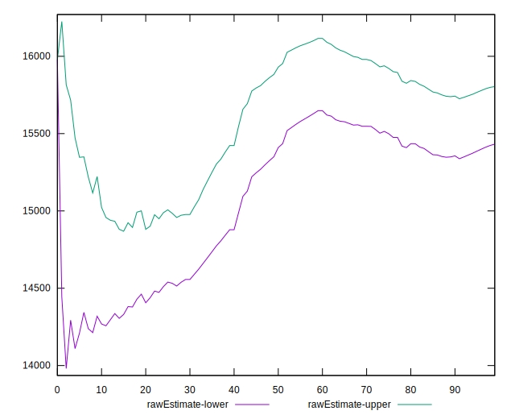
## Score Estimate

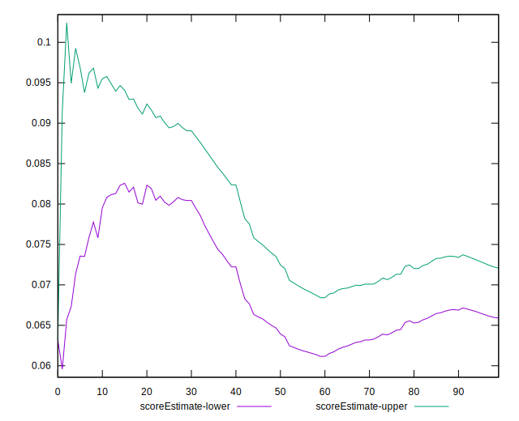
## P Score


```yaml
p90min: 0.04905791223114664
p90max: 0.09946143500285476
p90range: 0.05040352277170812
p90mean: 0.07008523057400882
p90median: 0.06940527943058872
p90stdev: 0.015391081329228134
p90skewness: 0.3519860841017029
p90eccentricity: 1.0000000000000002
p90discretization: 1
outlandishness: 1.0681392776809784
confidence: 0.006831483539953137
p90confidence: 0.006324504757453442

```

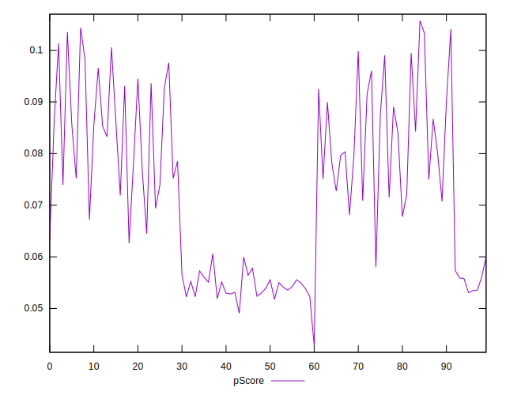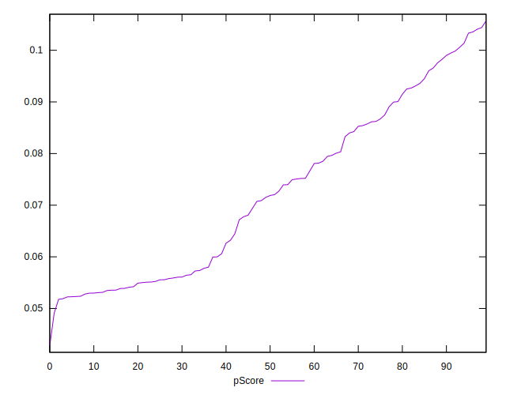
## Score Difference


```yaml
p90min: 0
p90max: 0
p90range: 0
p90mean: 0
p90median: 0
p90stdev: 0
p90skewness: .nan
p90eccentricity: .nan
p90discretization: 91
outlandishness: .nan
confidence: 0
p90confidence: 0

```


## P Score Difference


```yaml
p90min: -0.004717312318892414
p90max: 0.0044995583331704225
p90range: 0.009216870652062836
p90mean: 0.0003034658258390079
p90median: 0.0005755482427898528
p90stdev: 0.0029339657177613583
p90skewness: -0.22347301813783055
p90eccentricity: 1.0000000000000004
p90discretization: 1
outlandishness: 0.012305234623409976
confidence: 0.0012434540727347893
p90confidence: 0.001205625501110751

```

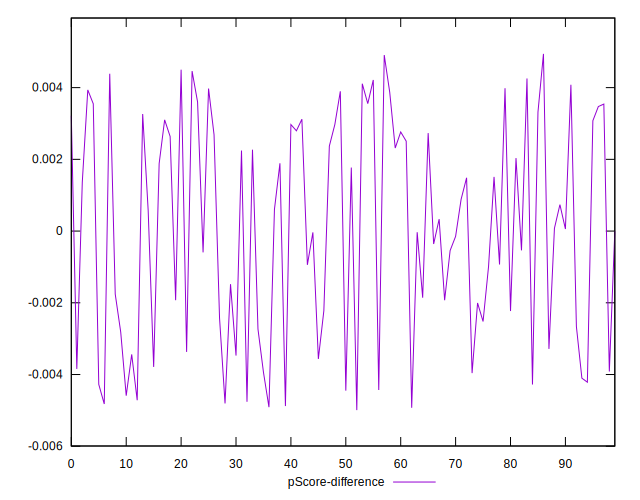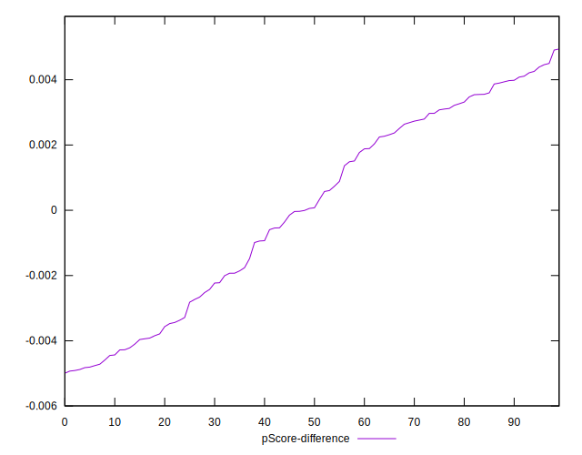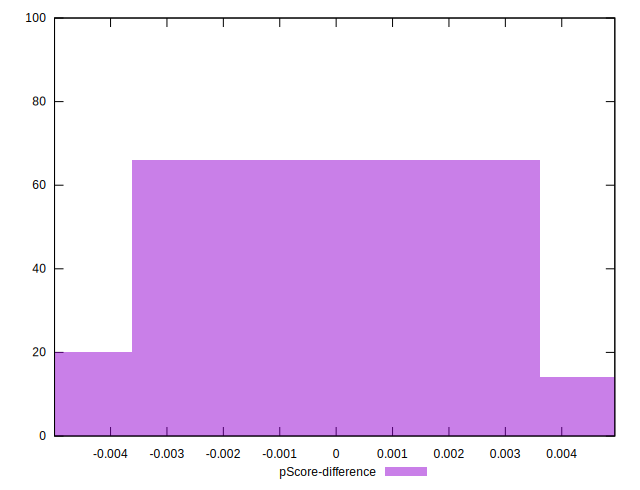