# //interactive/samples/pages+cached

[→ Parent](../..)


## Raw


```yaml
p90min: 14205.209000000003
p90max: 17688.538
p90range: 3483.328999999998
p90mean: 16055.744923076922
p90median: 16460.651
p90stdev: 892.8849923727271
p90skewness: -0.6362376384092615
p90eccentricity: 1.0000000000000002
p90discretization: 1
outlandishness: 0.9878424570297908
confidence: 406.8085343449966
p90confidence: 366.90439491058714

```

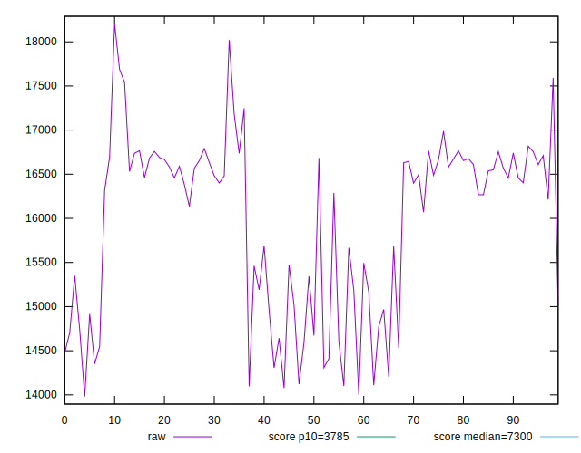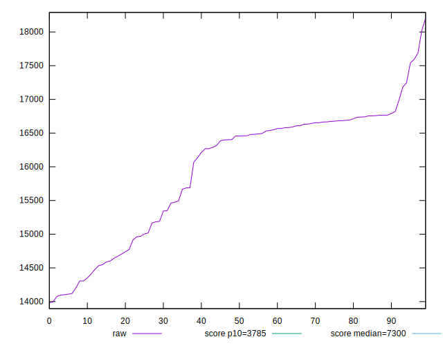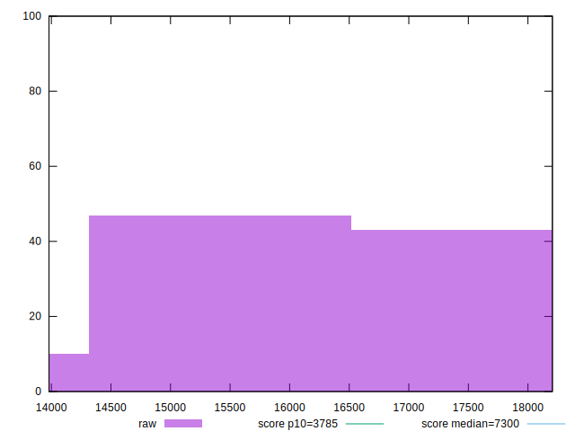
## Score


```yaml
p90min: 0.04
p90max: 0.09
p90range: 0.049999999999999996
p90mean: 0.06241758241758233
p90median: 0.06
p90stdev: 0.015070578231150565
p90skewness: 0.6832315117842457
p90eccentricity: 1.0000000000000004
p90discretization: 15.166666666666666
outlandishness: 1.0911420799444556
confidence: 0.006978792983911214
p90confidence: 0.006192803590705606

```

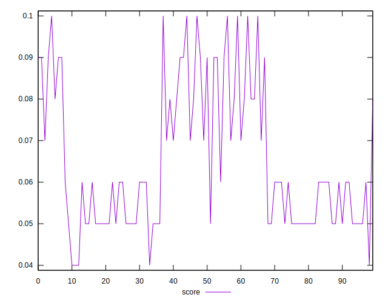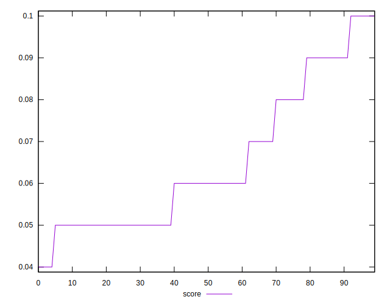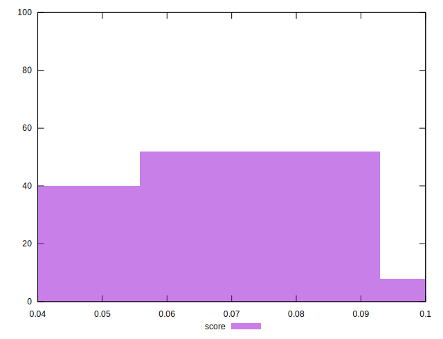
## Raw Estimate

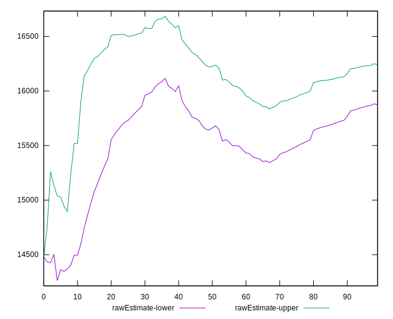
## Score Estimate

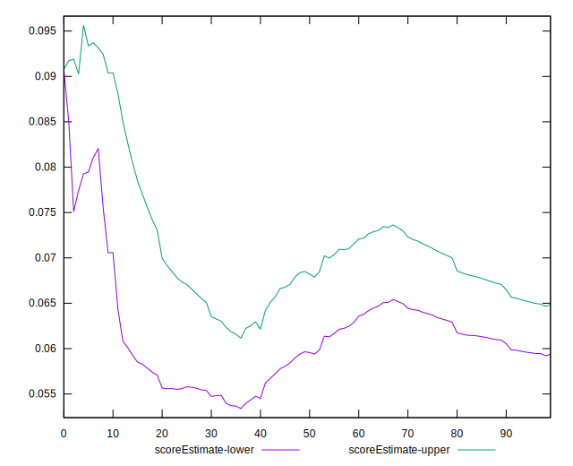
## P Score


```yaml
p90min: 0.03729478767263
p90max: 0.09459430820894926
p90range: 0.05729952053631926
p90mean: 0.06233359024094166
p90median: 0.056035147918037265
p90stdev: 0.014172336073689716
p90skewness: 0.8171453783009653
p90eccentricity: 1.0000000000000002
p90discretization: 1
outlandishness: 1.1094735116576684
confidence: 0.006731556548258119
p90confidence: 0.005823697828953936

```

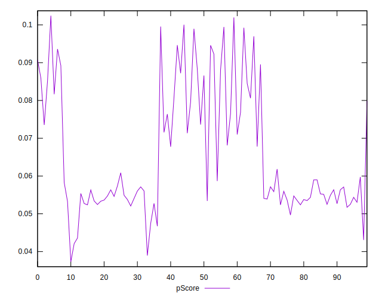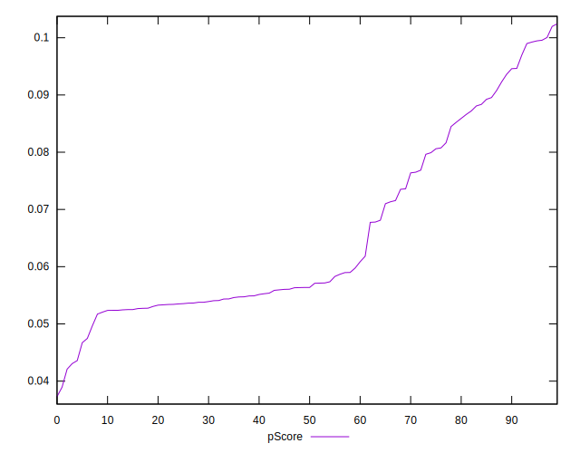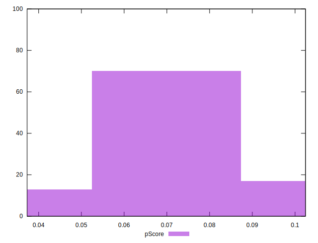
## Score Difference


```yaml
p90min: 0
p90max: 0
p90range: 0
p90mean: 0
p90median: 0
p90stdev: 0
p90skewness: .nan
p90eccentricity: .nan
p90discretization: 91
outlandishness: .nan
confidence: 0
p90confidence: 0

```


## P Score Difference


```yaml
p90min: -0.003964852081962733
p90max: 0.004732660219685755
p90range: 0.008697512301648488
p90mean: 0.0007382268401619947
p90median: 0.0013373833657426837
p90stdev: 0.002759555356407292
p90skewness: -0.23631622895422694
p90eccentricity: 0.9999999999999996
p90discretization: 1
outlandishness: 0.3831164664091725
confidence: 0.0011825317990228237
p90confidence: 0.0011339567770921064

```

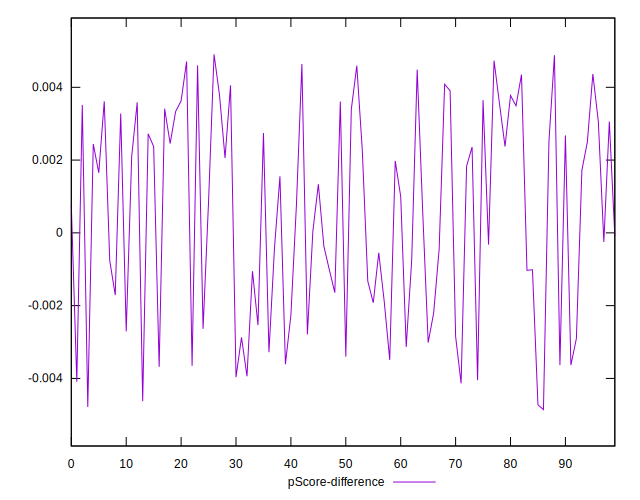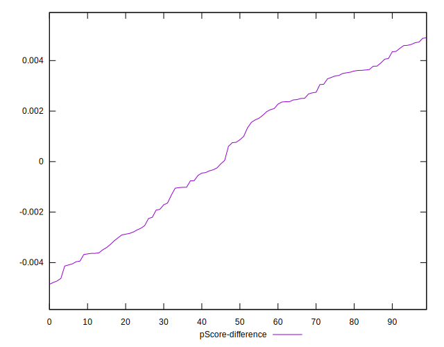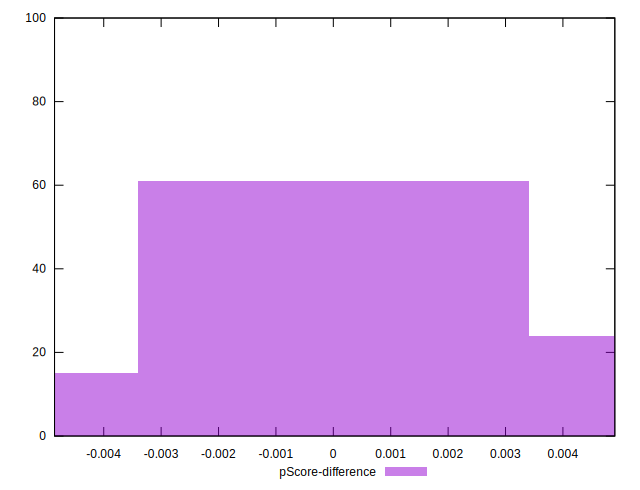