# //interactive/samples/pages

[→ Parent](../..)


## Raw


```yaml
p90min: 11810.271999999999
p90max: 15305.317000000003
p90range: 3495.0450000000037
p90mean: 13011.549637362643
p90median: 12677.373499999998
p90stdev: 866.9018333997303
p90skewness: 1.1281141436841908
p90eccentricity: 1
p90discretization: 1
outlandishness: 1.050362957451192
confidence: 563.9924419264207
p90confidence: 356.22739249450024

```

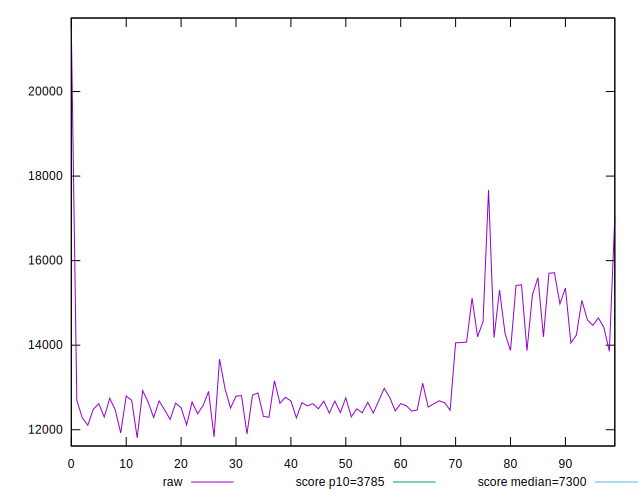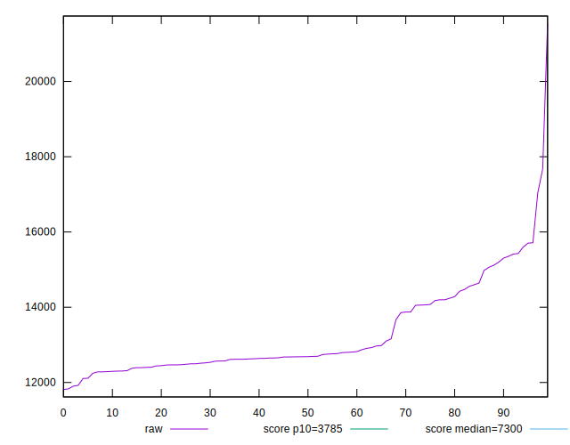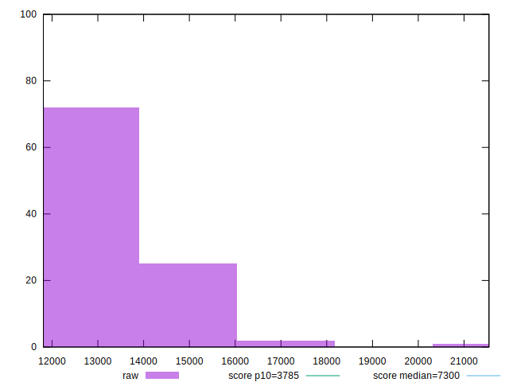
## Score


```yaml
p90min: 0.07
p90max: 0.17
p90range: 0.1
p90mean: 0.13263736263736267
p90median: 0.14
p90stdev: 0.024216748578734452
p90skewness: -0.8804821527569276
p90eccentricity: 1
p90discretization: 9.1
outlandishness: 0.9024212941766786
confidence: 0.012433032733196347
p90confidence: 0.009951148871223614

```

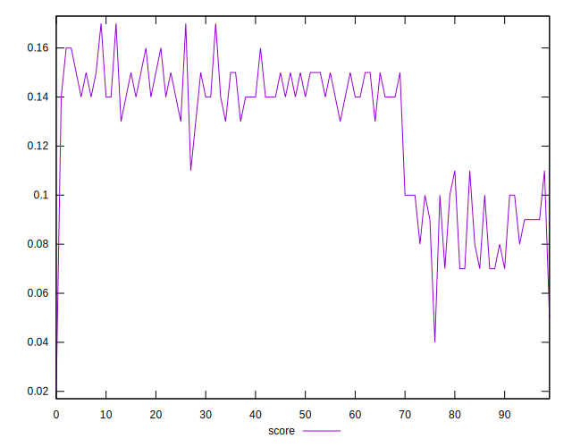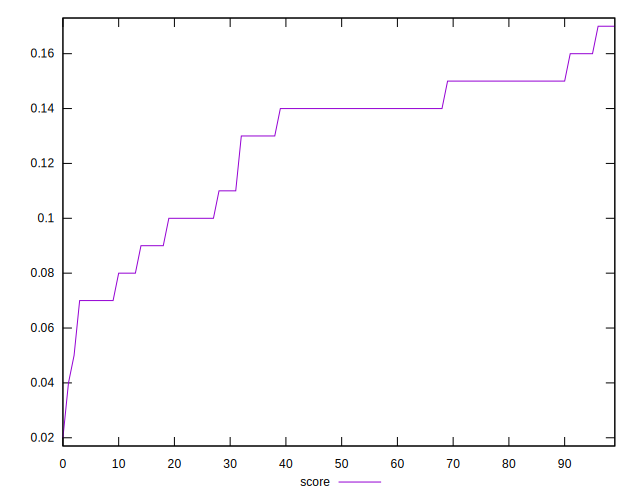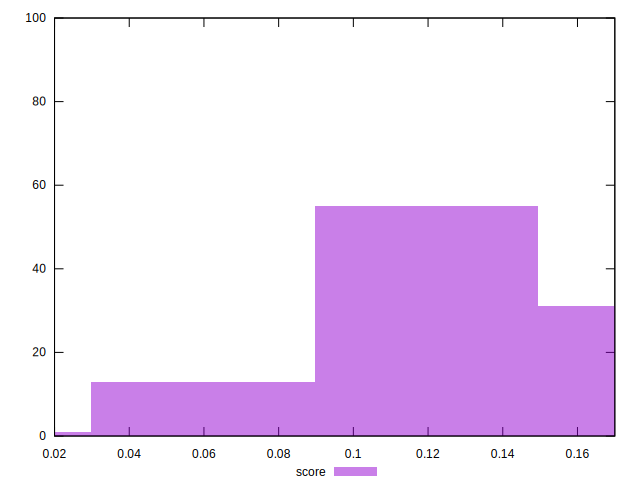
## Raw Estimate

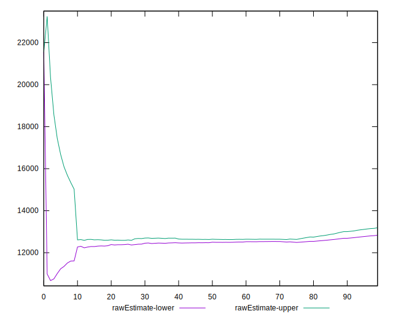
## Score Estimate

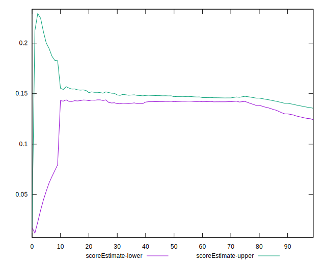
## P Score


```yaml
p90min: 0.0743041238436708
p90max: 0.17394880374839405
p90range: 0.09964467990472325
p90mean: 0.13245830523324098
p90median: 0.14076023212144684
p90stdev: 0.024842280845396785
p90skewness: -0.8530170837728214
p90eccentricity: 0.9999999999999999
p90discretization: 1
outlandishness: 0.9026373019298046
confidence: 0.012598986869059164
p90confidence: 0.01020819265598577

```

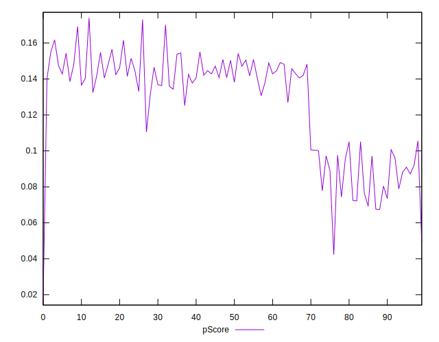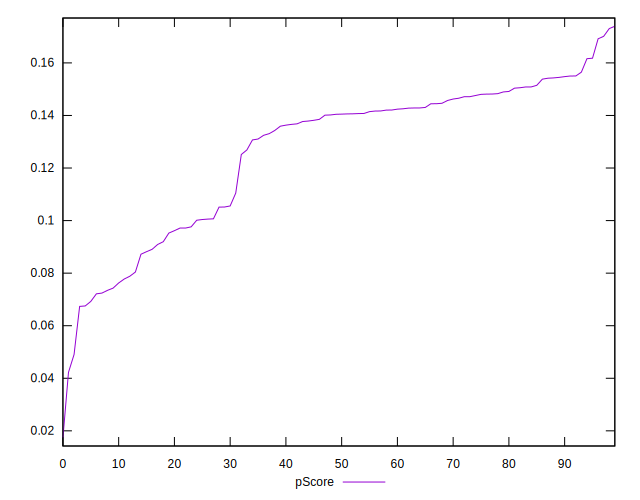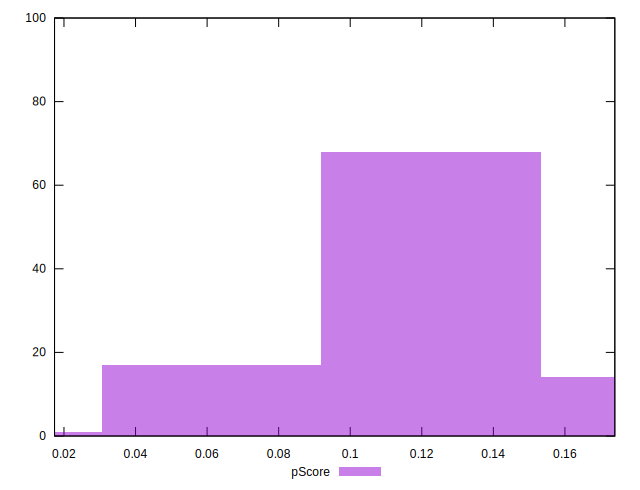
## Score Difference


```yaml
p90min: 0
p90max: 0
p90range: 0
p90mean: 0
p90median: 0
p90stdev: 0
p90skewness: .nan
p90eccentricity: .nan
p90discretization: 91
outlandishness: .nan
confidence: 0
p90confidence: 0

```


## P Score Difference


```yaml
p90min: -0.004749522379614263
p90max: 0.004454523096249885
p90range: 0.009204045475864148
p90mean: -0.00010271270303584943
p90median: 0.0004064528493645525
p90stdev: 0.0024816921116109464
p90skewness: 0.005311203297947927
p90eccentricity: 0.9999999999999999
p90discretization: 1
outlandishness: 2.278401472410453
confidence: 0.0010833711955101776
p90confidence: 0.001019777183336164

```

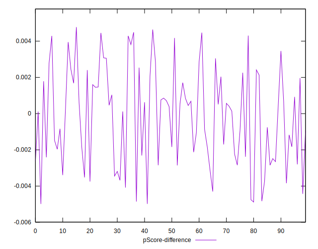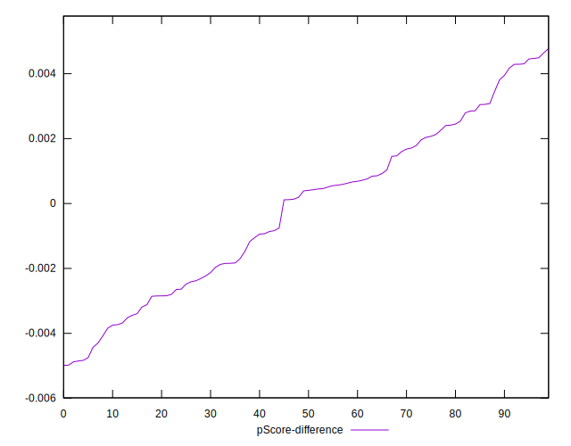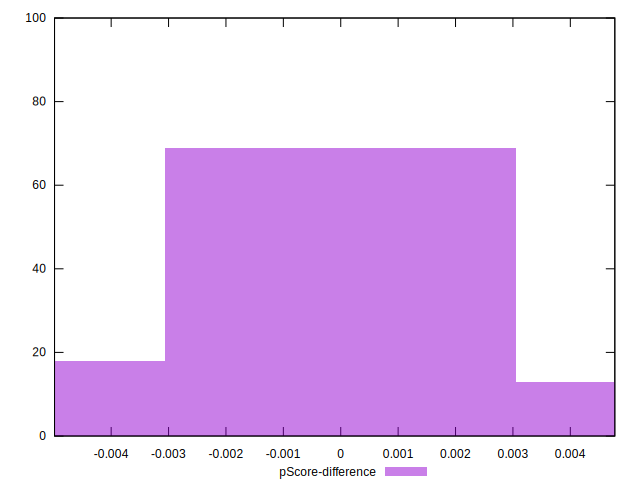