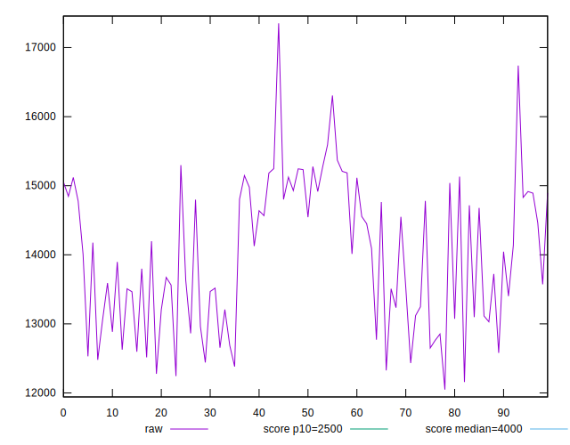
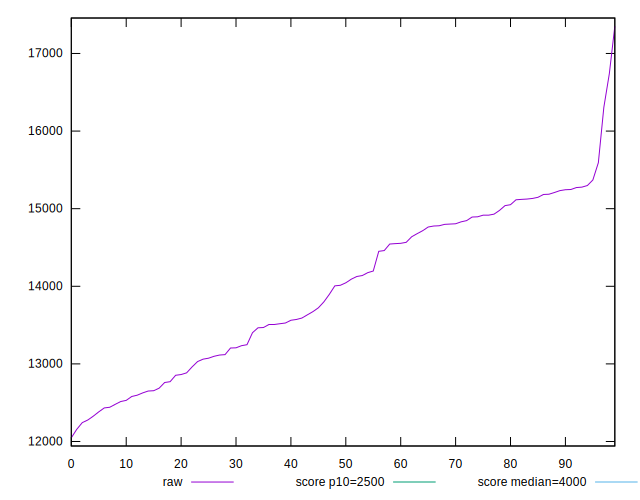
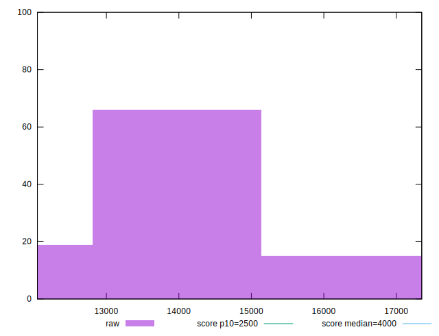
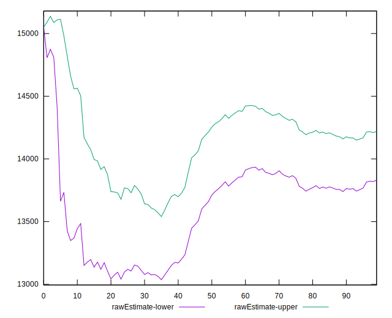
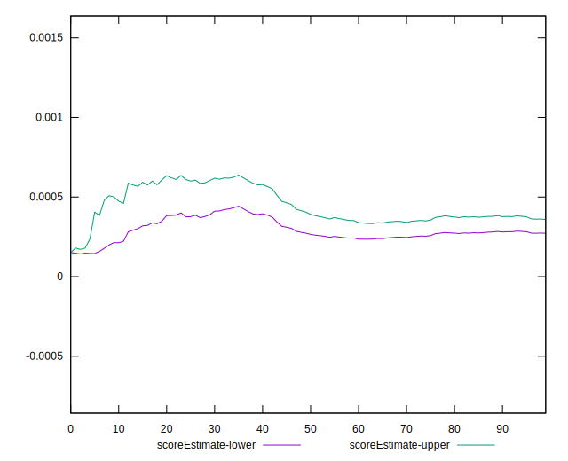
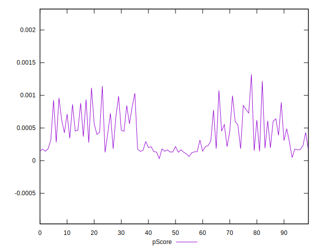
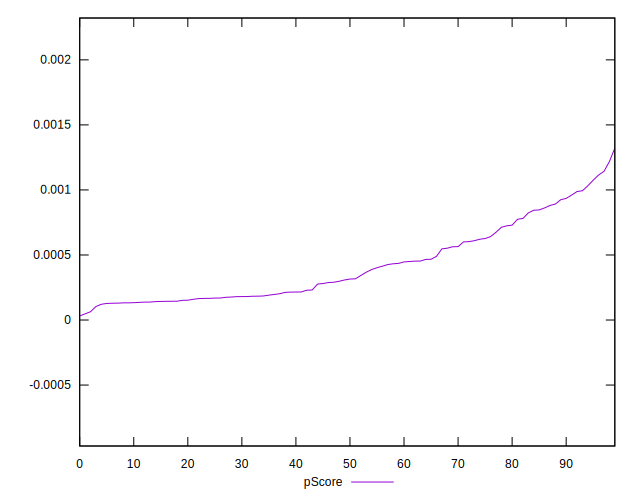
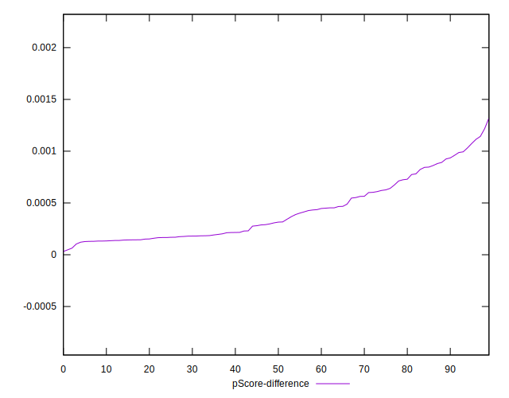
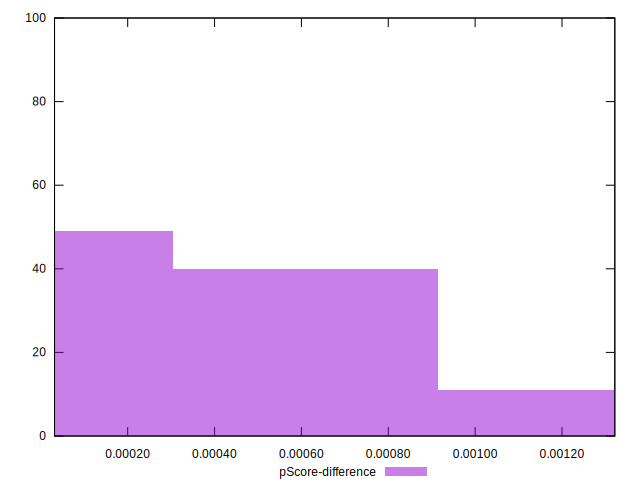

# //largest-contentful-paint/samples/pages+cached+noexternal+nomedia+nocss+nojs

[→ Parent](../..)


## Raw


```yaml
p90min: 12432.476999999999
p90max: 15592.589999999997
p90range: 3160.1129999999976
p90mean: 14024.589115384615
p90median: 14091.669999999998
p90stdev: 944.1285013744127
p90skewness: -0.15938094120490953
p90eccentricity: 0.9999999999999997
p90discretization: 1
outlandishness: 0.9965936187085398
confidence: 436.3291527822621
p90confidence: 387.9613830154012

```


## Score


```yaml
p90min: 0
p90max: 0
p90range: 0
p90mean: 0
p90median: 0
p90stdev: 0
p90skewness: .nan
p90eccentricity: .nan
p90discretization: 91
outlandishness: .nan
confidence: 0
p90confidence: 0

```


## Raw Estimate


## Score Estimate


## P Score


```yaml
p90min: 0.000031552180213501035
p90max: 0.0009350546260535331
p90range: 0.000903502445840032
p90mean: 0.00036330085166689683
p90median: 0.00028044025554835317
p90stdev: 0.0002468572654772266
p90skewness: 0.8050269480596545
p90eccentricity: 0.9999999999999996
p90discretization: 1
outlandishness: 1.3947857961032297
confidence: 0.00012415490571605458
p90confidence: 0.00010143861347531203

```


## Score Difference


```yaml
p90min: 0
p90max: 0
p90range: 0
p90mean: 0
p90median: 0
p90stdev: 0
p90skewness: .nan
p90eccentricity: .nan
p90discretization: 91
outlandishness: .nan
confidence: 0
p90confidence: 0

```


## P Score Difference


```yaml
p90min: 0.000031552180213501035
p90max: 0.0009350546260535331
p90range: 0.000903502445840032
p90mean: 0.00036330085166689683
p90median: 0.00028044025554835317
p90stdev: 0.0002468572654772266
p90skewness: 0.8050269480596545
p90eccentricity: 0.9999999999999996
p90discretization: 1
outlandishness: 1.3947857961032297
confidence: 0.00012415490571605458
p90confidence: 0.00010143861347531203

```

