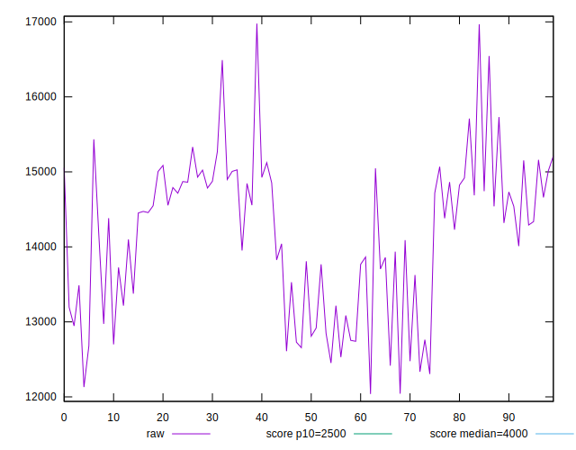
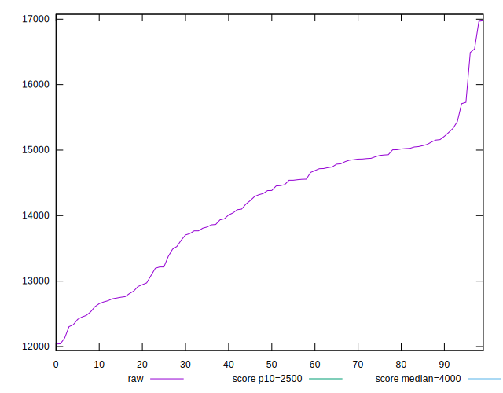
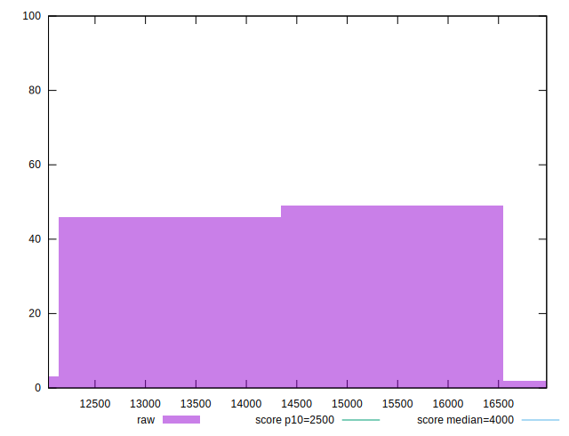
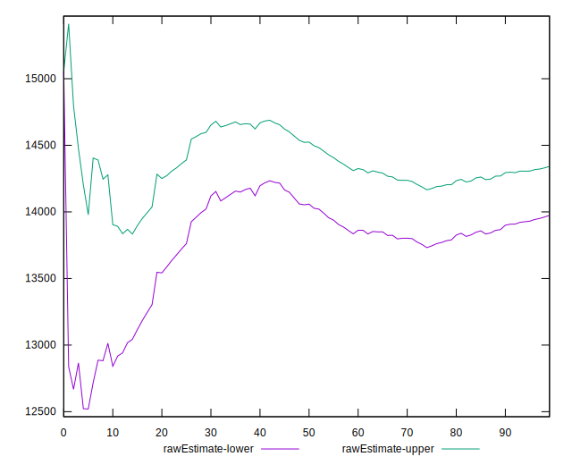
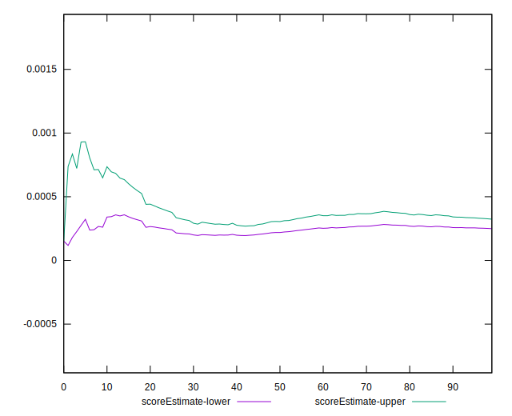
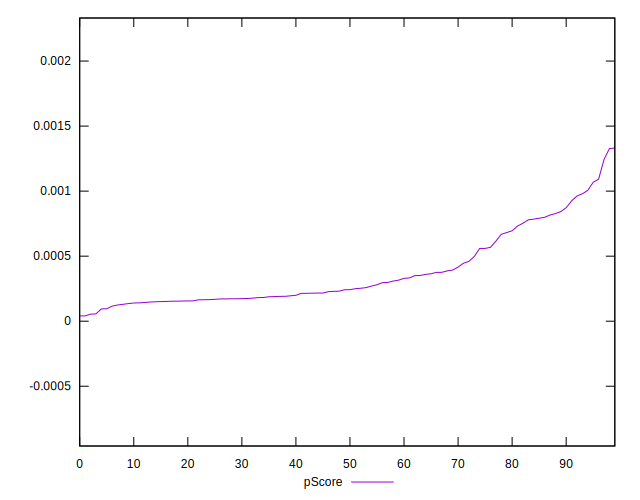
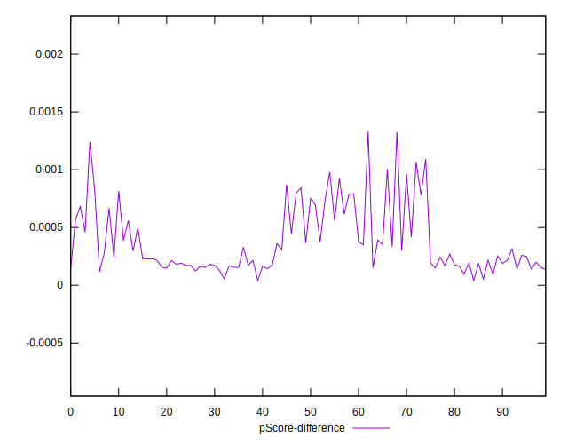
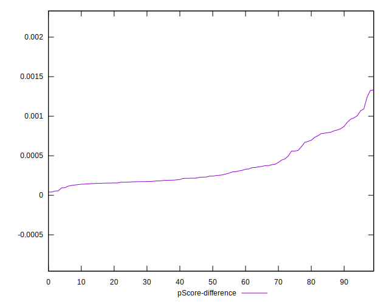
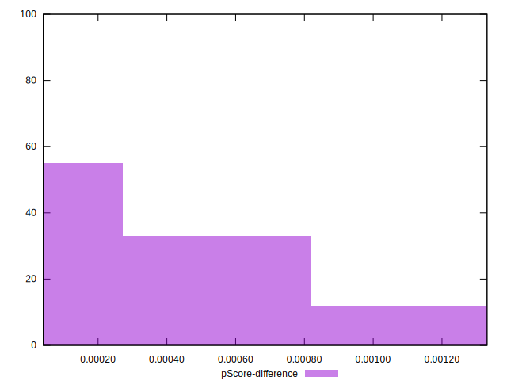

# //largest-contentful-paint/samples/pages+cached+noexternal+nomedia+nocss

[→ Parent](../..)


## Raw


```yaml
p90min: 12415.879
p90max: 15730.177
p90range: 3314.297999999999
p90mean: 14157.894098901095
p90median: 14382.992999999999
p90stdev: 894.5606850376373
p90skewness: -0.468365302021649
p90eccentricity: 1.0000000000000002
p90discretization: 1
outlandishness: 1.0005782523384283
confidence: 428.7504524835349
p90confidence: 367.59297071657056

```


## Score


```yaml
p90min: 0
p90max: 0
p90range: 0
p90mean: 0
p90median: 0
p90stdev: 0
p90skewness: .nan
p90eccentricity: .nan
p90discretization: 91
outlandishness: .nan
confidence: 0
p90confidence: 0

```


## Raw Estimate


## Score Estimate


## P Score


```yaml
p90min: 0.000040494830631288004
p90max: 0.0008724063962354811
p90range: 0.0008319115656041931
p90mean: 0.0003147884661963232
p90median: 0.0002166410743736913
p90stdev: 0.00022130426787796416
p90skewness: 1.1799834595156242
p90eccentricity: 0.9999999999999996
p90discretization: 1
outlandishness: 1.5021222781162742
confidence: 0.00012243649449068523
p90confidence: 0.00009093837301612942

```


## Score Difference


```yaml
p90min: 0
p90max: 0
p90range: 0
p90mean: 0
p90median: 0
p90stdev: 0
p90skewness: .nan
p90eccentricity: .nan
p90discretization: 91
outlandishness: .nan
confidence: 0
p90confidence: 0

```


## P Score Difference


```yaml
p90min: 0.000040494830631288004
p90max: 0.0008724063962354811
p90range: 0.0008319115656041931
p90mean: 0.0003147884661963232
p90median: 0.0002166410743736913
p90stdev: 0.00022130426787796416
p90skewness: 1.1799834595156242
p90eccentricity: 0.9999999999999996
p90discretization: 1
outlandishness: 1.5021222781162742
confidence: 0.00012243649449068523
p90confidence: 0.00009093837301612942

```

