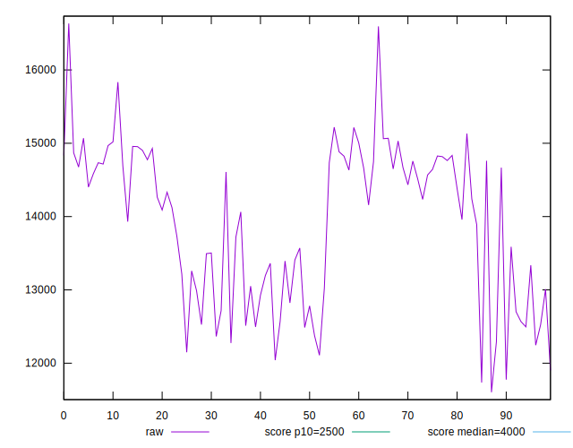
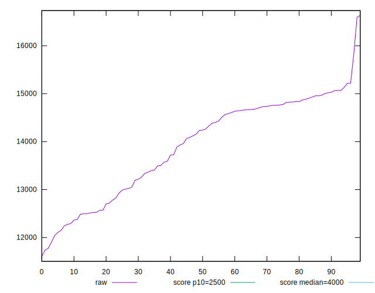
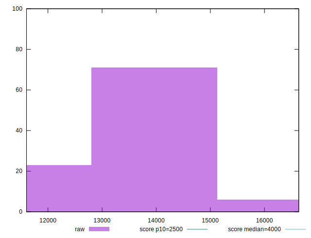
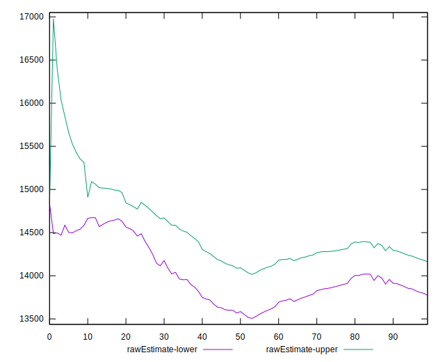
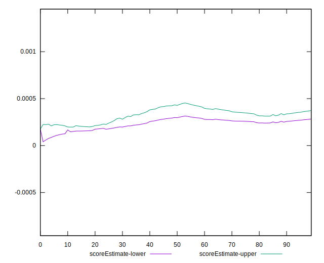
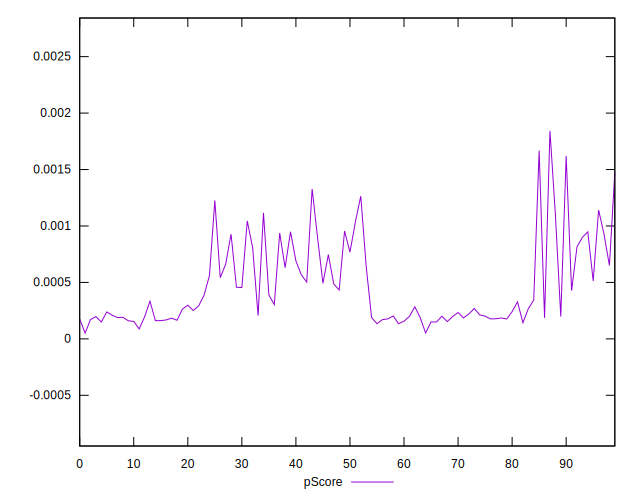
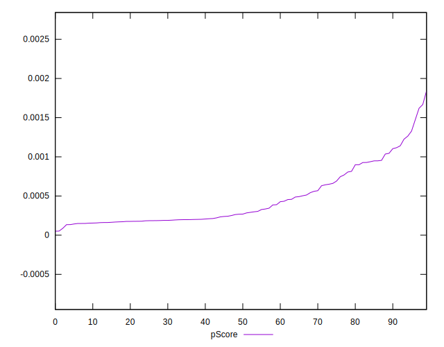
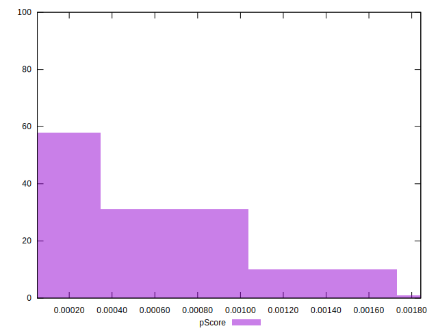
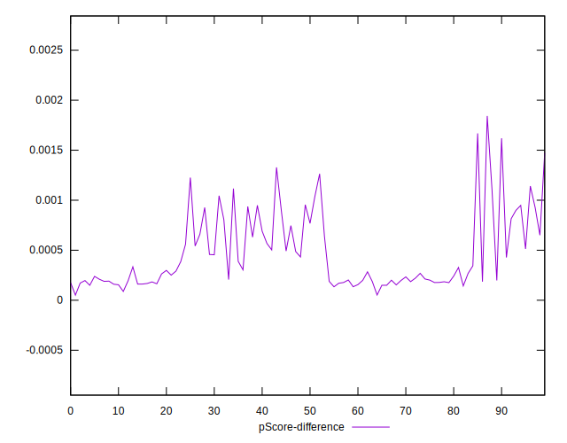
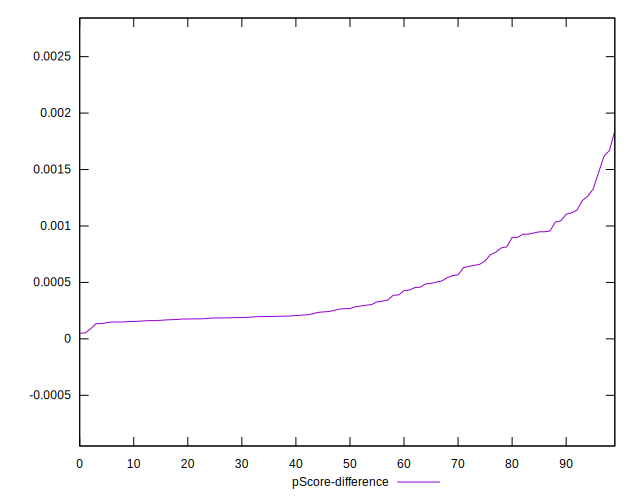

# //largest-contentful-paint/samples/pages+cached+noexternal+nomedia

[→ Parent](../..)


## Raw


```yaml
p90min: 12148.944999999996
p90max: 15219.483000000004
p90range: 3070.5380000000077
p90mean: 13968.785302197806
p90median: 14264.778999999997
p90stdev: 943.5728193452784
p90skewness: -0.48960976623149943
p90eccentricity: 1.0000000000000002
p90discretization: 1
outlandishness: 0.9921555403142407
confidence: 438.3150342939407
p90confidence: 387.733042097585

```


## Score


```yaml
p90min: 0
p90max: 0
p90range: 0
p90mean: 0
p90median: 0
p90stdev: 0
p90skewness: .nan
p90eccentricity: .nan
p90discretization: 91
outlandishness: .nan
confidence: 0
p90confidence: 0

```


## Raw Estimate


## Score Estimate


## P Score


```yaml
p90min: 0.00005100122936602114
p90max: 0.0011042564053258541
p90range: 0.001053255175959833
p90mean: 0.00038122601434048184
p90median: 0.00023876141341344637
p90stdev: 0.0002806774466846218
p90skewness: 1.0948957014145262
p90eccentricity: 1
p90discretization: 1
outlandishness: 1.5440179798459273
confidence: 0.0001584444667317702
p90confidence: 0.00011533600589165344

```


## Score Difference


```yaml
p90min: 0
p90max: 0
p90range: 0
p90mean: 0
p90median: 0
p90stdev: 0
p90skewness: .nan
p90eccentricity: .nan
p90discretization: 91
outlandishness: .nan
confidence: 0
p90confidence: 0

```


## P Score Difference


```yaml
p90min: 0.00005100122936602114
p90max: 0.0011042564053258541
p90range: 0.001053255175959833
p90mean: 0.00038122601434048184
p90median: 0.00023876141341344637
p90stdev: 0.0002806774466846218
p90skewness: 1.0948957014145262
p90eccentricity: 1
p90discretization: 1
outlandishness: 1.5440179798459273
confidence: 0.0001584444667317702
p90confidence: 0.00011533600589165344

```

