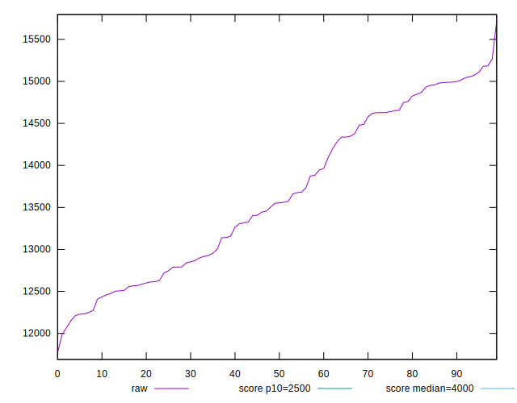
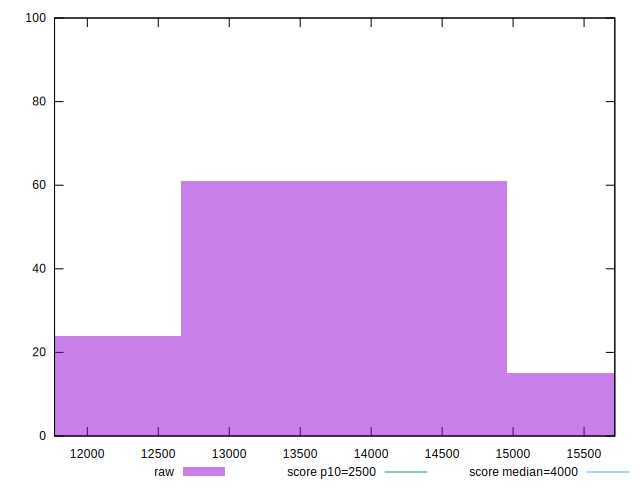
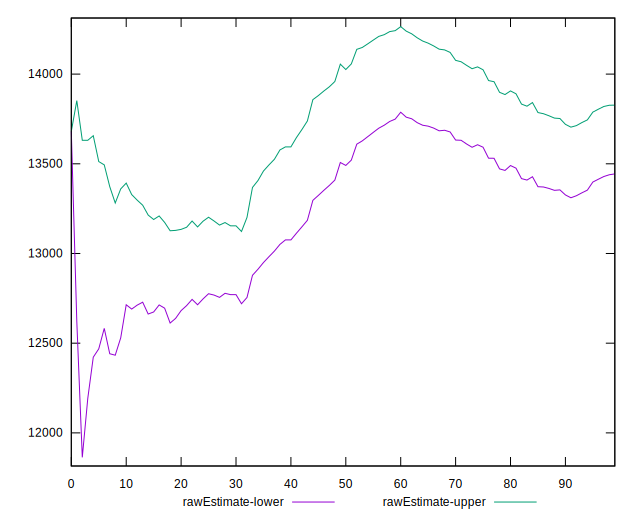
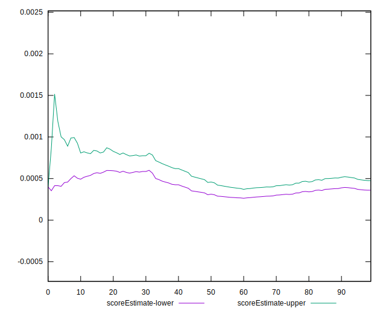
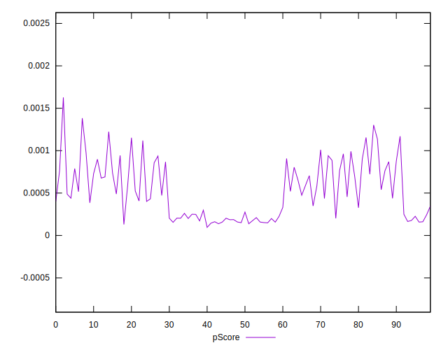
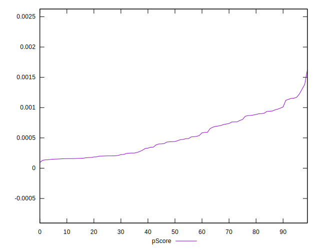
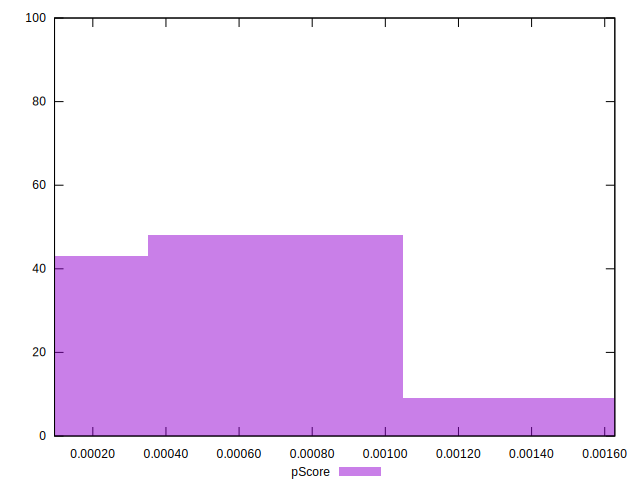
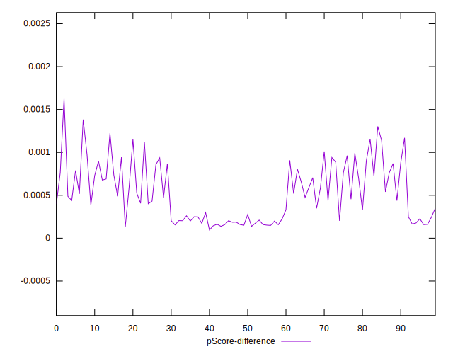
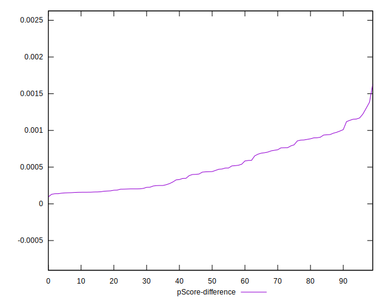
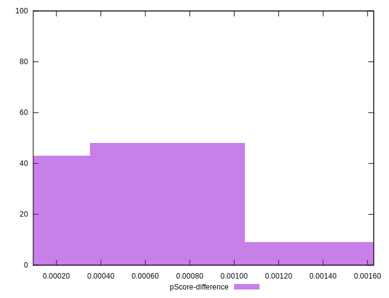

# //largest-contentful-paint/samples/pages+cached+noexternal

[→ Parent](../..)


## Raw


```yaml
p90min: 12212.267999999996
p90max: 15073.234499999999
p90range: 2860.9665000000023
p90mean: 13635.390582417585
p90median: 13549.292000000001
p90stdev: 932.8893299202227
p90skewness: 0.12169284546107138
p90eccentricity: 0.9999999999999997
p90discretization: 1
outlandishness: 1.0025168829489466
confidence: 399.7145918129827
p90confidence: 383.3429815001764

```


## Score


```yaml
p90min: 0
p90max: 0
p90range: 0
p90mean: 0
p90median: 0
p90stdev: 0
p90skewness: .nan
p90eccentricity: .nan
p90discretization: 91
outlandishness: .nan
confidence: 0
p90confidence: 0

```


## Raw Estimate


## Score Estimate


## P Score


```yaml
p90min: 0.00009528367533445659
p90max: 0.0010108039688161985
p90range: 0.0009155202934817419
p90mean: 0.00045698586088607985
p90median: 0.0004011962901445121
p90stdev: 0.00028347303231203414
p90skewness: 0.49180791139309055
p90eccentricity: 0.9999999999999999
p90discretization: 1
outlandishness: 1.337777575282322
confidence: 0.00013975364249153995
p90confidence: 0.00011648476823149375

```


## Score Difference


```yaml
p90min: 0
p90max: 0
p90range: 0
p90mean: 0
p90median: 0
p90stdev: 0
p90skewness: .nan
p90eccentricity: .nan
p90discretization: 91
outlandishness: .nan
confidence: 0
p90confidence: 0

```


## P Score Difference


```yaml
p90min: 0.00009528367533445659
p90max: 0.0010108039688161985
p90range: 0.0009155202934817419
p90mean: 0.00045698586088607985
p90median: 0.0004011962901445121
p90stdev: 0.00028347303231203414
p90skewness: 0.49180791139309055
p90eccentricity: 0.9999999999999999
p90discretization: 1
outlandishness: 1.337777575282322
confidence: 0.00013975364249153995
p90confidence: 0.00011648476823149375

```

