# //largest-contentful-paint/samples/pages+cached

[→ Parent](../..)


## Raw


```yaml
p90min: 12289.4415
p90max: 15378.925000000007
p90range: 3089.4835000000057
p90mean: 14079.488269230766
p90median: 14496.8225
p90stdev: 958.8071873169865
p90skewness: -0.5979807532643543
p90eccentricity: 0.9999999999999988
p90discretization: 1
outlandishness: 0.9975569918103648
confidence: 436.9767427163679
p90confidence: 393.9931501856954

```

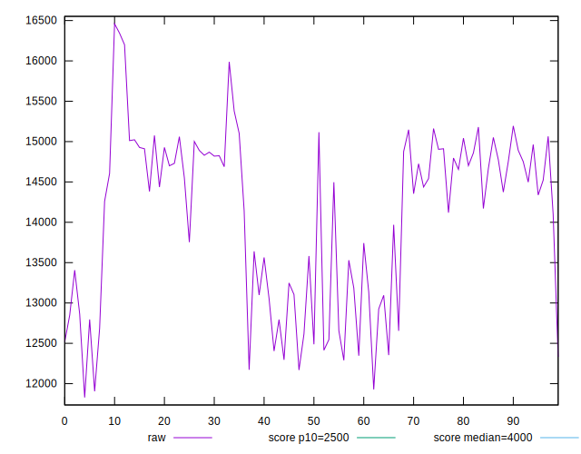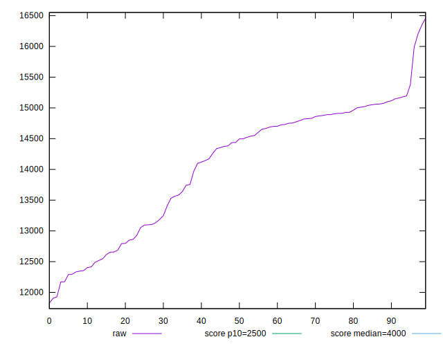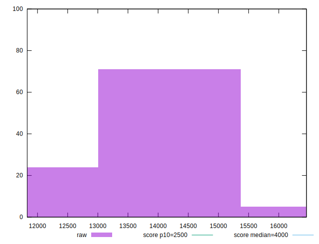
## Score


```yaml
p90min: 0
p90max: 0
p90range: 0
p90mean: 0
p90median: 0
p90stdev: 0
p90skewness: .nan
p90eccentricity: .nan
p90discretization: 91
outlandishness: .nan
confidence: 0
p90confidence: 0

```


## Raw Estimate

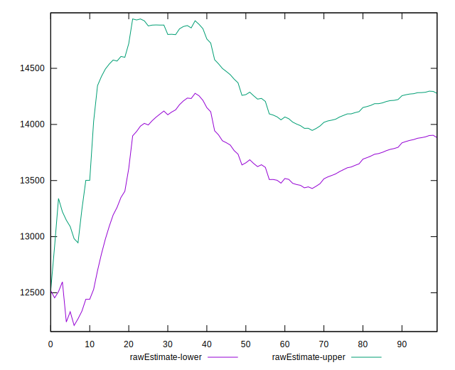
## Score Estimate

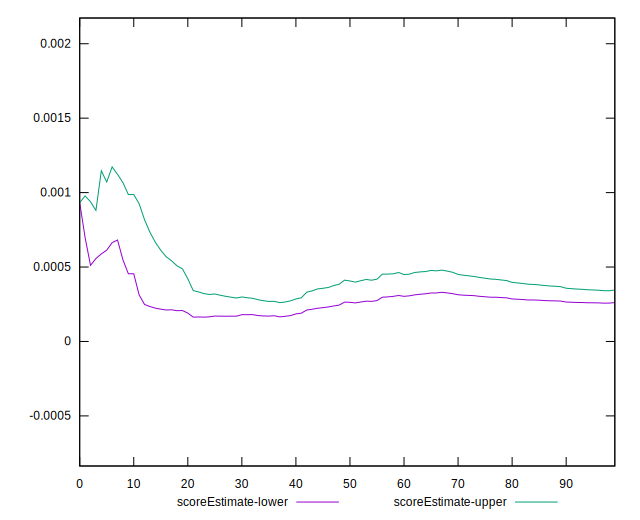
## P Score


```yaml
p90min: 0.00005737132390171151
p90max: 0.0010532762492050929
p90range: 0.0009959049253033814
p90mean: 0.00034600024481511887
p90median: 0.00021488379777828692
p90stdev: 0.0002665754643891039
p90skewness: 1.226504899335444
p90eccentricity: 1.0000000000000007
p90discretization: 1
outlandishness: 1.5232911436194168
confidence: 0.000143514284611497
p90confidence: 0.00010954121784462027

```

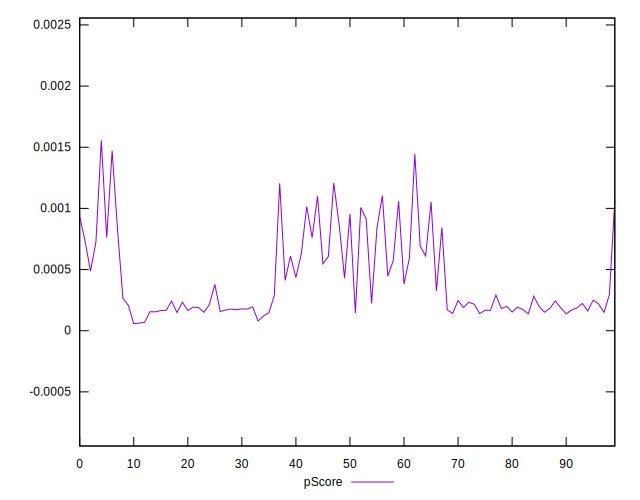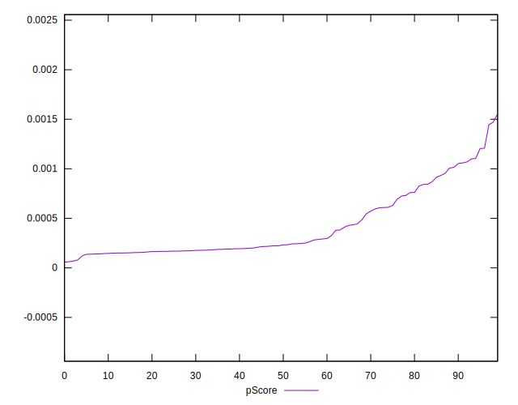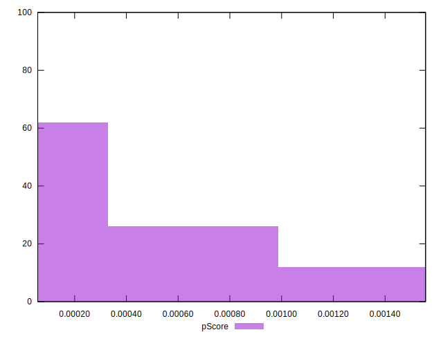
## Score Difference


```yaml
p90min: 0
p90max: 0
p90range: 0
p90mean: 0
p90median: 0
p90stdev: 0
p90skewness: .nan
p90eccentricity: .nan
p90discretization: 91
outlandishness: .nan
confidence: 0
p90confidence: 0

```


## P Score Difference


```yaml
p90min: 0.00005737132390171151
p90max: 0.0010532762492050929
p90range: 0.0009959049253033814
p90mean: 0.00034600024481511887
p90median: 0.00021488379777828692
p90stdev: 0.0002665754643891039
p90skewness: 1.226504899335444
p90eccentricity: 1.0000000000000007
p90discretization: 1
outlandishness: 1.5232911436194168
confidence: 0.000143514284611497
p90confidence: 0.00010954121784462027

```

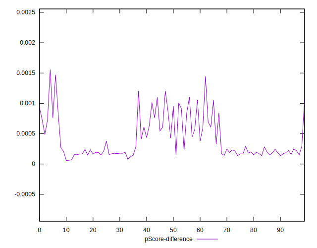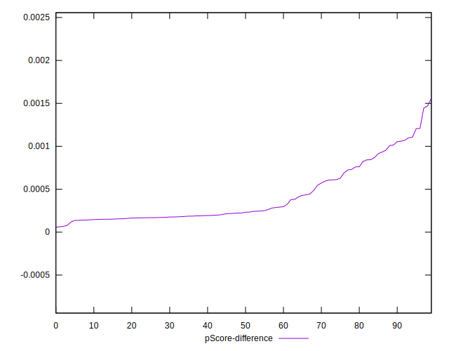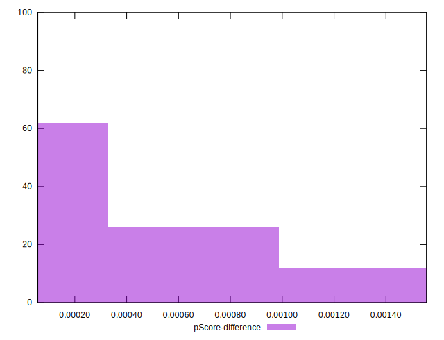