# //largest-contentful-paint/samples/pages

[→ Parent](../..)


## Raw


```yaml
p90min: 12405.125
p90max: 15693.6015
p90range: 3288.4765000000007
p90mean: 14494.637170329672
p90median: 14804.958
p90stdev: 815.0537655287368
p90skewness: -1.2117405547647768
p90eccentricity: 1.0000000000000002
p90discretization: 1
outlandishness: 0.9823456401418915
confidence: 434.57441671962806
p90confidence: 334.92197899556777

```

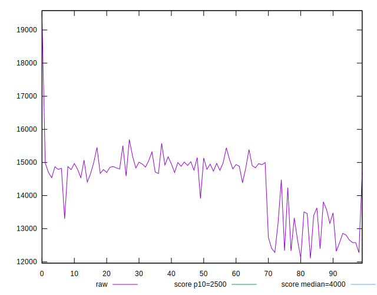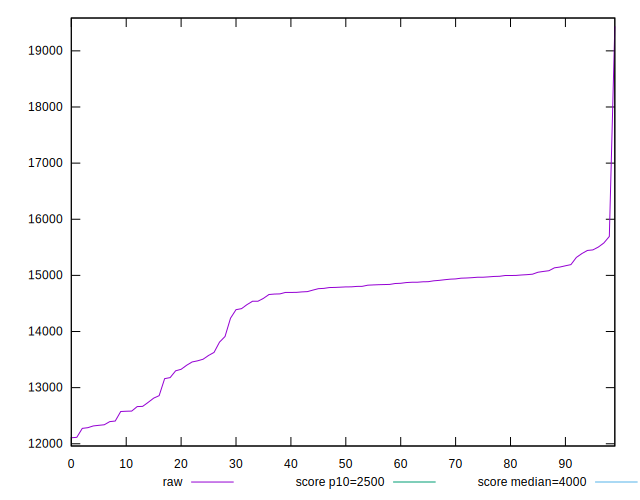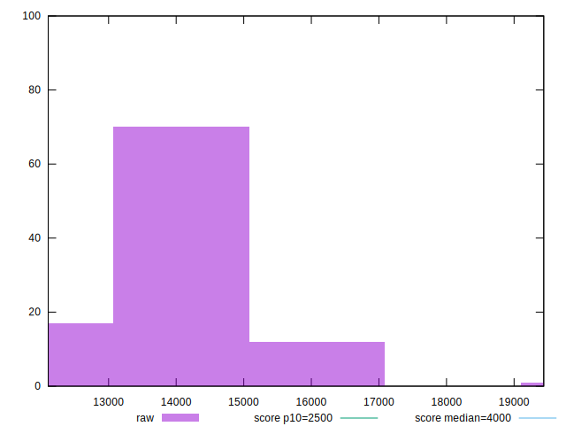
## Score


```yaml
p90min: 0
p90max: 0
p90range: 0
p90mean: 0
p90median: 0
p90stdev: 0
p90skewness: .nan
p90eccentricity: .nan
p90discretization: 91
outlandishness: .nan
confidence: 0
p90confidence: 0

```


## Raw Estimate

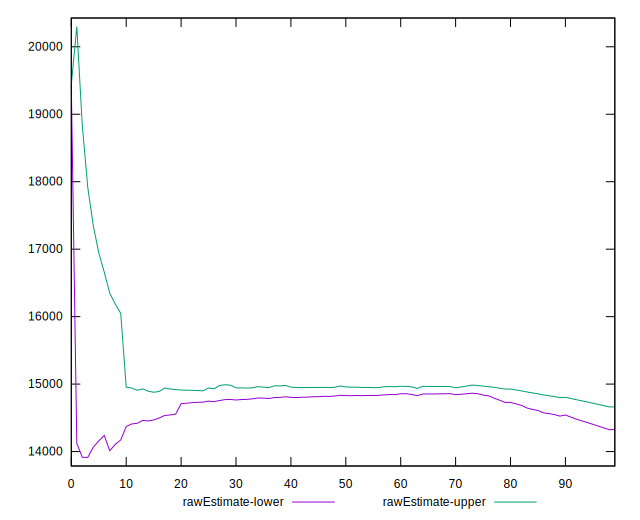
## Score Estimate

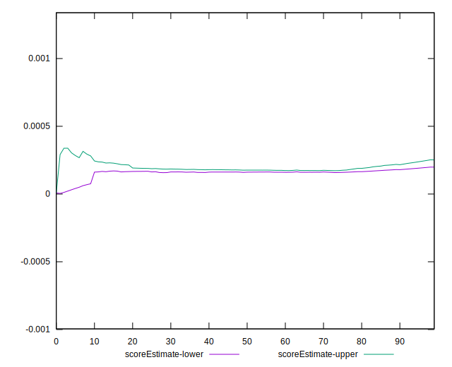
## P Score


```yaml
p90min: 0.000008139361764247788
p90max: 0.0008946526173769231
p90range: 0.0008865132556126754
p90mean: 0.00026572458430476164
p90median: 0.0001771275131294825
p90stdev: 0.0002066280826014808
p90skewness: 1.8842043900486711
p90eccentricity: 0.9999999999999997
p90discretization: 1
outlandishness: 1.654975165080178
confidence: 0.00012278005645255147
p90confidence: 0.00008490763341980755

```

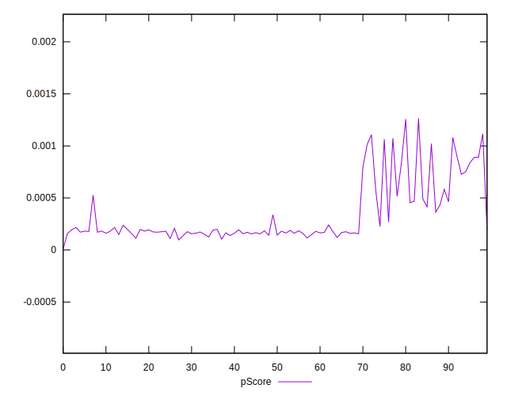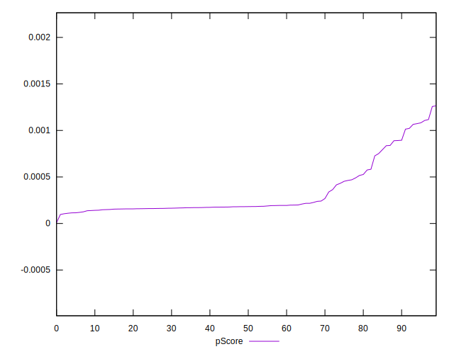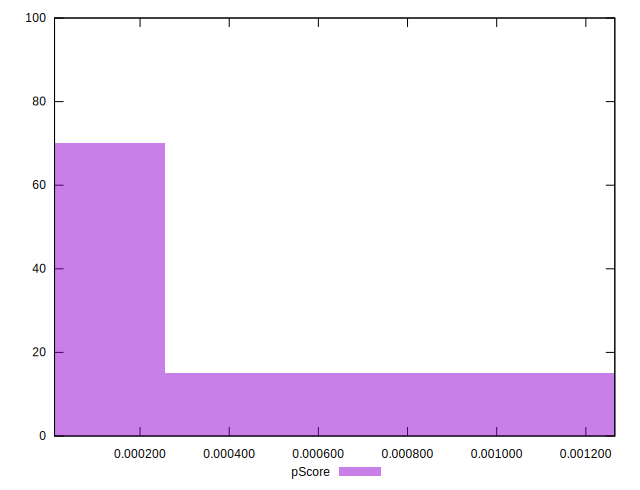
## Score Difference


```yaml
p90min: 0
p90max: 0
p90range: 0
p90mean: 0
p90median: 0
p90stdev: 0
p90skewness: .nan
p90eccentricity: .nan
p90discretization: 91
outlandishness: .nan
confidence: 0
p90confidence: 0

```


## P Score Difference


```yaml
p90min: 0.000008139361764247788
p90max: 0.0008946526173769231
p90range: 0.0008865132556126754
p90mean: 0.00026572458430476164
p90median: 0.0001771275131294825
p90stdev: 0.0002066280826014808
p90skewness: 1.8842043900486711
p90eccentricity: 0.9999999999999997
p90discretization: 1
outlandishness: 1.654975165080178
confidence: 0.00012278005645255147
p90confidence: 0.00008490763341980755

```

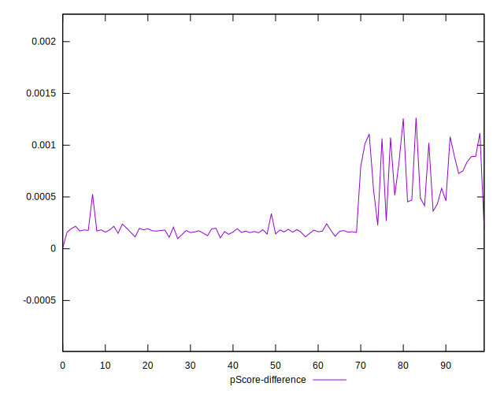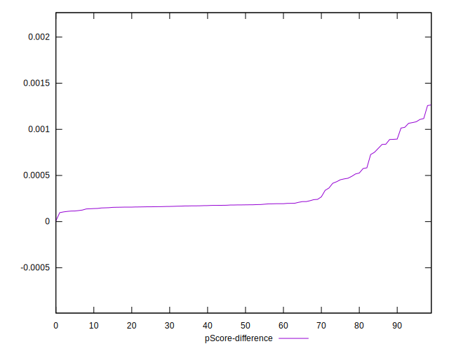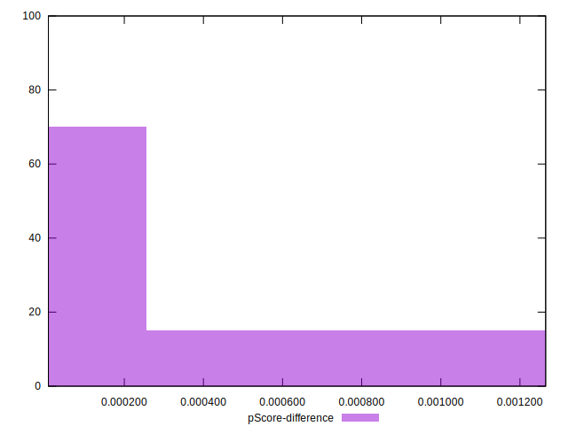