# //mainthread-work-breakdown/samples/pages+cached+noexternal+nomedia+nocss+nojs

[→ Parent](../..)


## Raw


```yaml
p90min: 3319.7599999999966
p90max: 4856.499999999993
p90range: 1536.7399999999961
p90mean: 3798.1388571428533
p90median: 3642.379999999997
p90stdev: 414.9584956028485
p90skewness: 1.1726965122868482
p90eccentricity: 0.9999999999999992
p90discretization: 1
outlandishness: 1.096078327508389
confidence: 283.8233442397059
p90confidence: 170.51478862645672

```

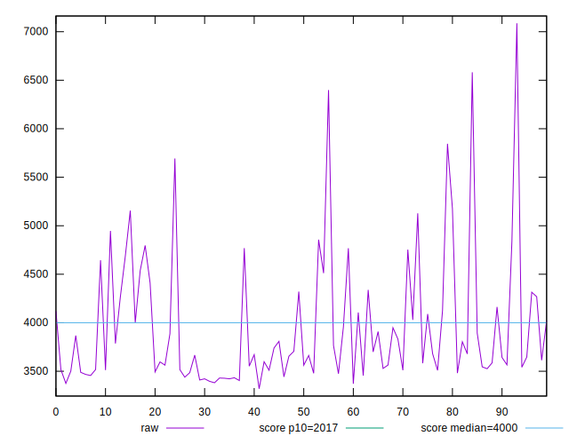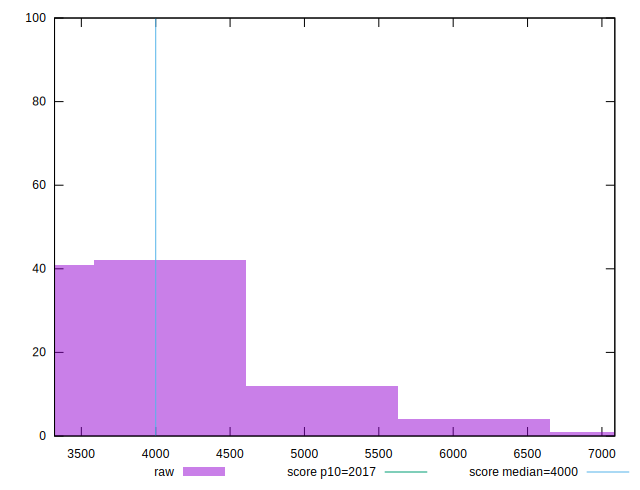
## Score


```yaml
p90min: 0.36
p90max: 0.64
p90range: 0.28
p90mean: 0.542747252747253
p90median: 0.57
p90stdev: 0.07661902231407478
p90skewness: -1.0400394572523823
p90eccentricity: 1.0000000000000002
p90discretization: 3.5
outlandishness: 0.9070219489720326
confidence: 0.04388812344420345
p90confidence: 0.03148429670217978

```


## Raw Estimate

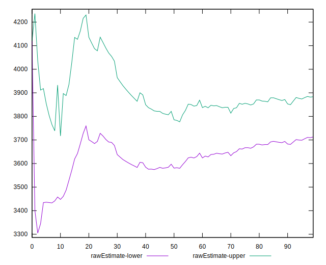
## Score Estimate

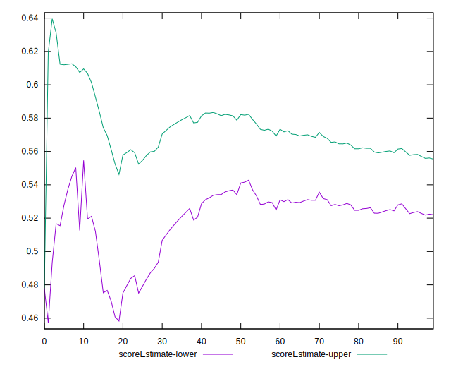
## P Score


```yaml
p90min: 0.35824176291601334
p90max: 0.6364164667252281
p90range: 0.2781747038092148
p90mean: 0.5424357670867566
p90median: 0.5695788352585767
p90stdev: 0.07633724375893036
p90skewness: -1.0357069493704663
p90eccentricity: 1.0000000000000002
p90discretization: 1
outlandishness: 0.9070473380600783
confidence: 0.04379480650388423
p90confidence: 0.03136850822868409

```

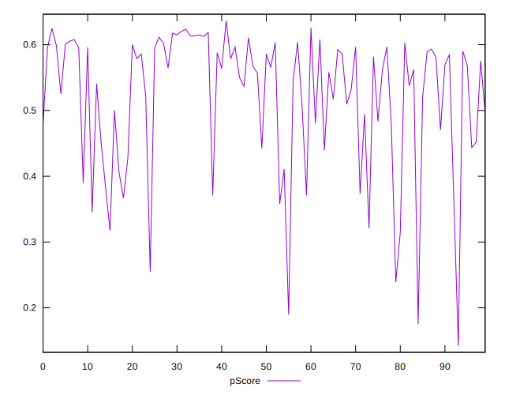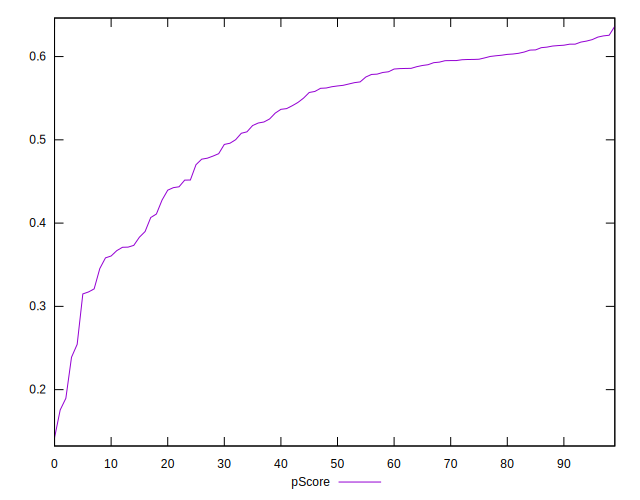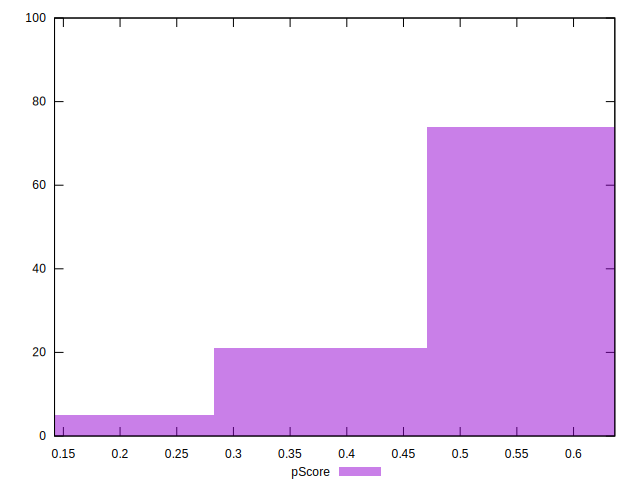
## Score Difference


```yaml
p90min: 0
p90max: 0
p90range: 0
p90mean: 0
p90median: 0
p90stdev: 0
p90skewness: .nan
p90eccentricity: .nan
p90discretization: 91
outlandishness: .inf
confidence: 9.374482588239097e-18
p90confidence: 0

```

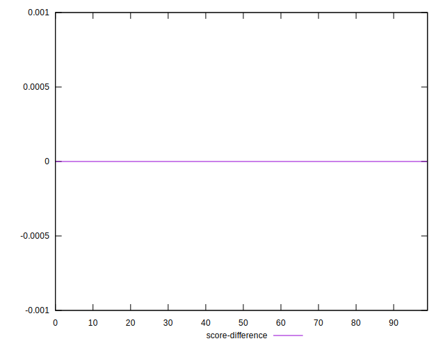
## P Score Difference


```yaml
p90min: -0.004960208868451943
p90max: 0.003934199047118558
p90range: 0.008894407915570501
p90mean: -0.0006814593874967822
p90median: -0.0004211647414232855
p90stdev: 0.002654962433425454
p90skewness: 0.022380142853217273
p90eccentricity: 1.0000000000000004
p90discretization: 1
outlandishness: 0.18037722464824502
confidence: 0.0011635964994387842
p90confidence: 0.0010909774421873917

```

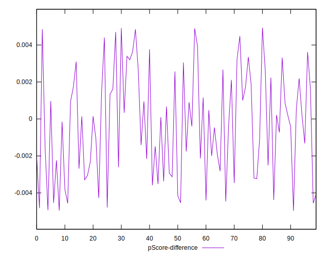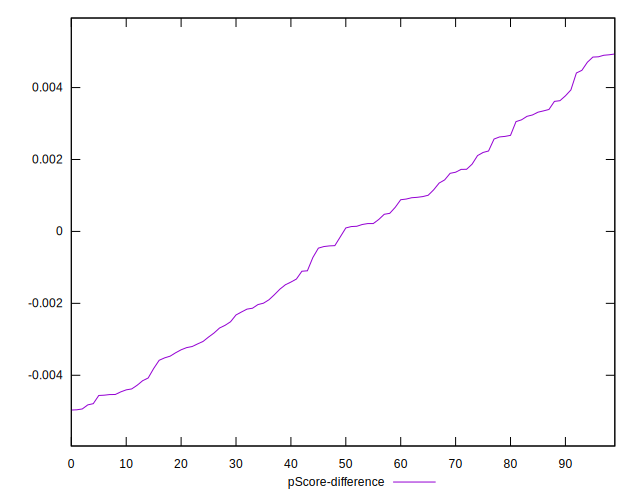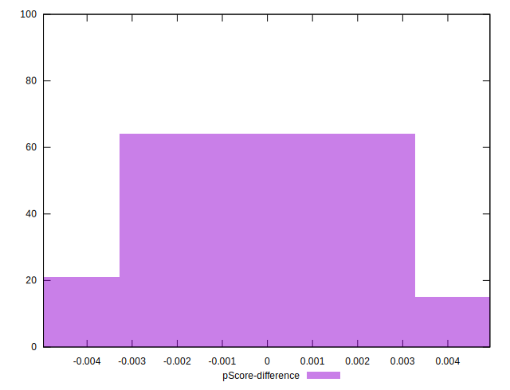