# //mainthread-work-breakdown/samples/pages+cached+noexternal+nomedia+nocss

[→ Parent](../..)


## Raw


```yaml
p90min: 3295.423999999998
p90max: 4526.371999999995
p90range: 1230.9479999999967
p90mean: 3680.4694505494485
p90median: 3611.659999999998
p90stdev: 244.89804201373164
p90skewness: 1.087660090501245
p90eccentricity: 1
p90discretization: 1
outlandishness: 1.0881182594480707
confidence: 239.6386155441469
p90confidence: 100.63352916377244

```

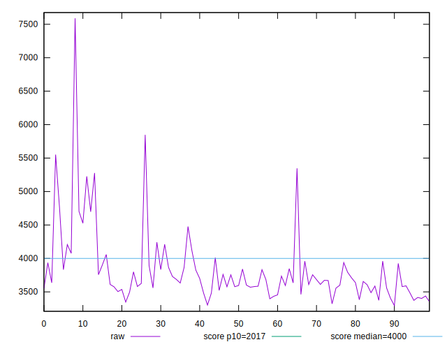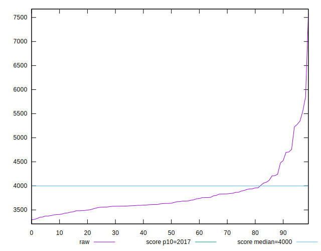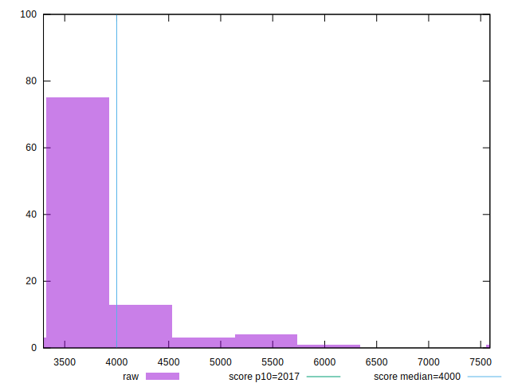
## Score


```yaml
p90min: 0.41
p90max: 0.64
p90range: 0.23000000000000004
p90mean: 0.5635164835164834
p90median: 0.58
p90stdev: 0.04742544470236163
p90skewness: -0.8760015433386575
p90eccentricity: 0.9999999999999999
p90discretization: 4.55
outlandishness: 0.9162387091548403
confidence: 0.03608386848517586
p90confidence: 0.019488068721645435

```

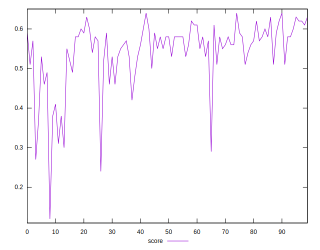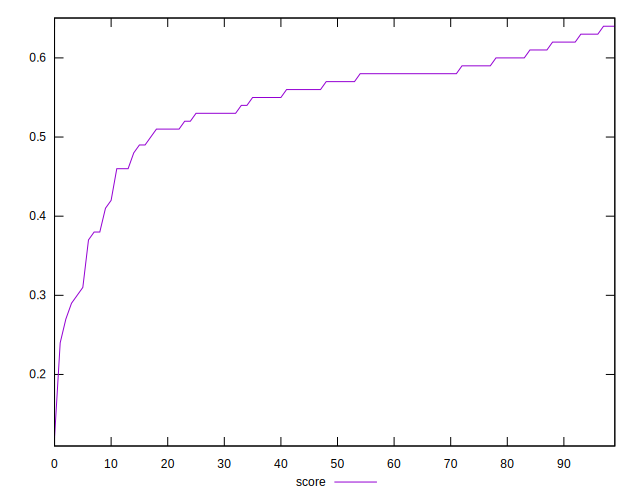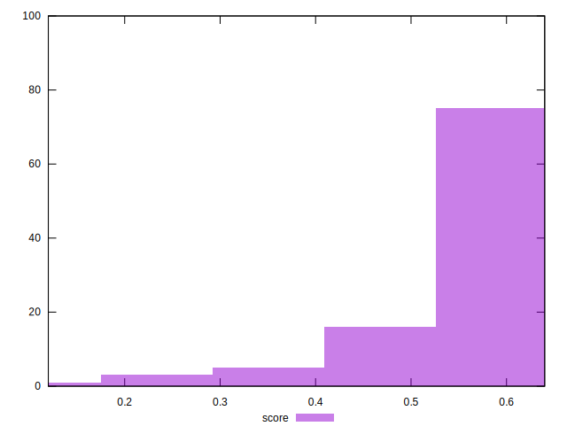
## Raw Estimate

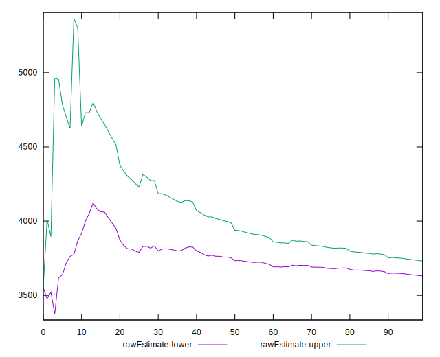
## Score Estimate

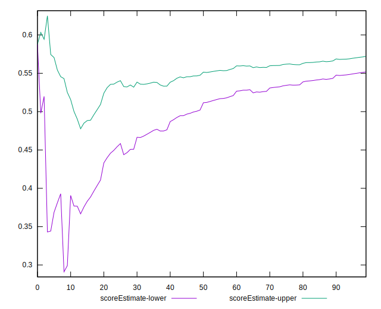
## P Score


```yaml
p90min: 0.40850326724935676
p90max: 0.6415735755373582
p90range: 0.2330703082880014
p90mean: 0.563128331424352
p90median: 0.5757980400878191
p90stdev: 0.04758365744031164
p90skewness: -0.9102006502945108
p90eccentricity: 1
p90discretization: 1
outlandishness: 0.9163976291060352
confidence: 0.03610389780088341
p90confidence: 0.01955308151655233

```

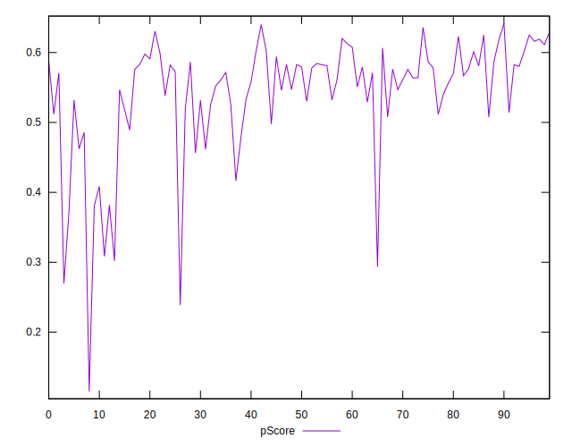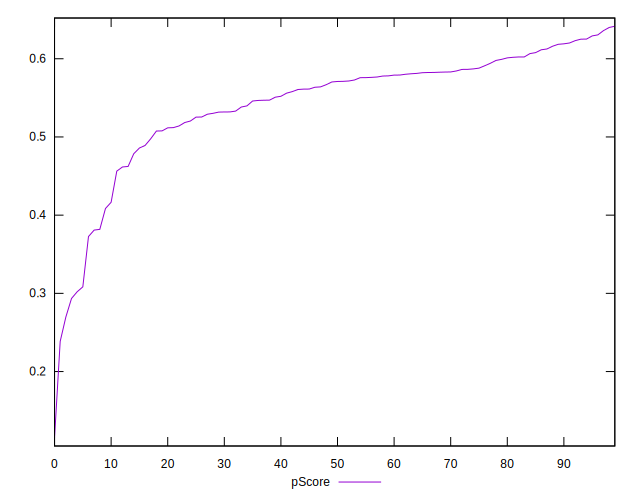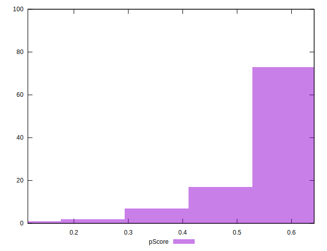
## Score Difference


```yaml
p90min: 0
p90max: 0
p90range: 0
p90mean: 0
p90median: 0
p90stdev: 0
p90skewness: .nan
p90eccentricity: .nan
p90discretization: 91
outlandishness: .inf
confidence: 1.0505807952691231e-17
p90confidence: 0

```

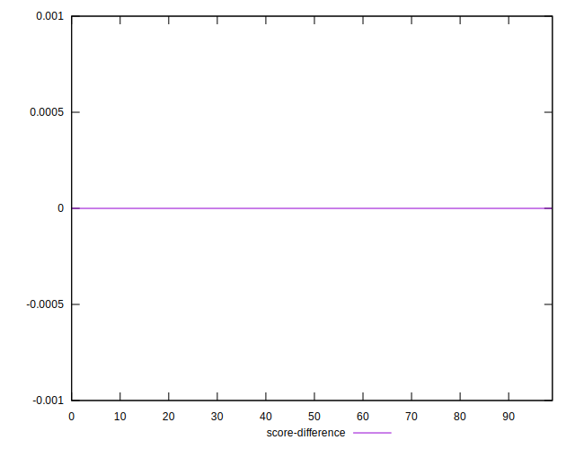
## P Score Difference


```yaml
p90min: -0.004201959912180864
p90max: 0.003556162236626026
p90range: 0.00775812214880689
p90mean: -0.0002804302593791226
p90median: 0.00015877548199794145
p90stdev: 0.0023161551196814937
p90skewness: -0.17770263996140614
p90eccentricity: 1
p90discretization: 1
outlandishness: 1.3414397859326956
confidence: 0.0010114965911395778
p90confidence: 0.0009517547052140987

```

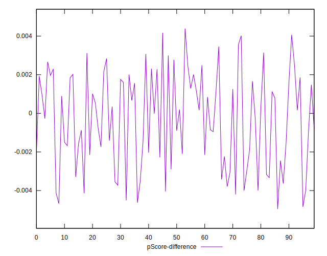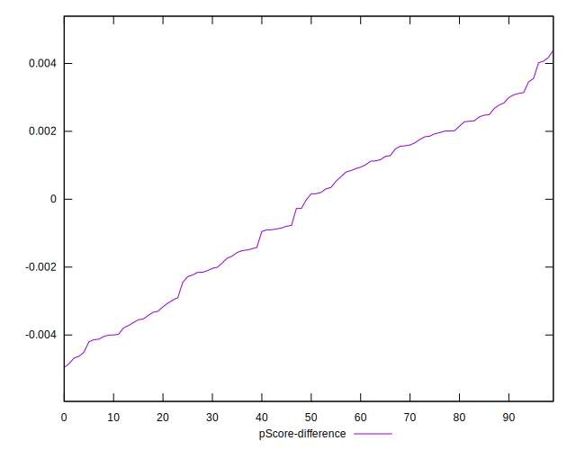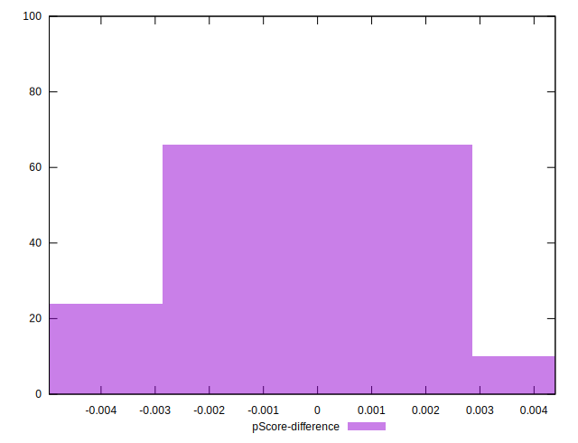