# //mainthread-work-breakdown/samples/pages+cached+noexternal+nomedia

[→ Parent](../..)


## Raw


```yaml
p90min: 3273.107999999998
p90max: 3764.9719999999993
p90range: 491.8640000000014
p90mean: 3449.228879120877
p90median: 3438.2520000000004
p90stdev: 98.36092691902604
p90skewness: 0.6886152339180397
p90eccentricity: 1.0000000000000002
p90discretization: 1
outlandishness: 1.0319980645661266
confidence: 90.08666045181144
p90confidence: 40.41848242758351

```

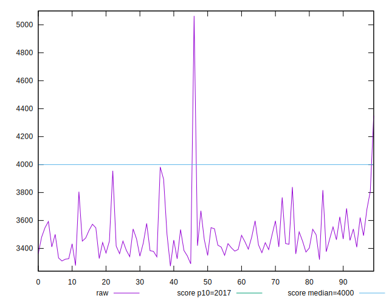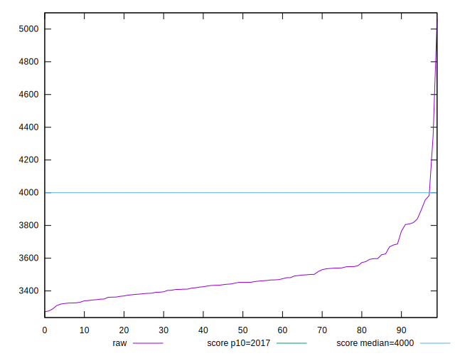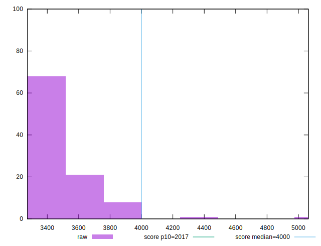
## Score


```yaml
p90min: 0.55
p90max: 0.65
p90range: 0.09999999999999998
p90mean: 0.6094505494505493
p90median: 0.61
p90stdev: 0.02087969924010988
p90skewness: -0.571727381670659
p90eccentricity: 0.9999999999999992
p90discretization: 8.272727272727273
outlandishness: 0.9659990491615286
confidence: 0.016982836284252345
p90confidence: 0.008579888206262432

```

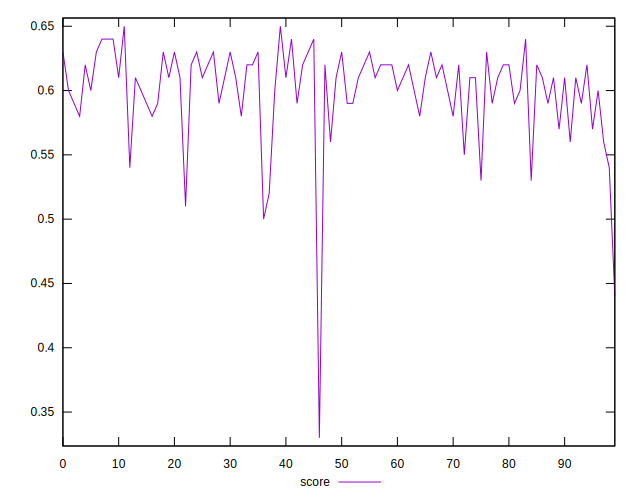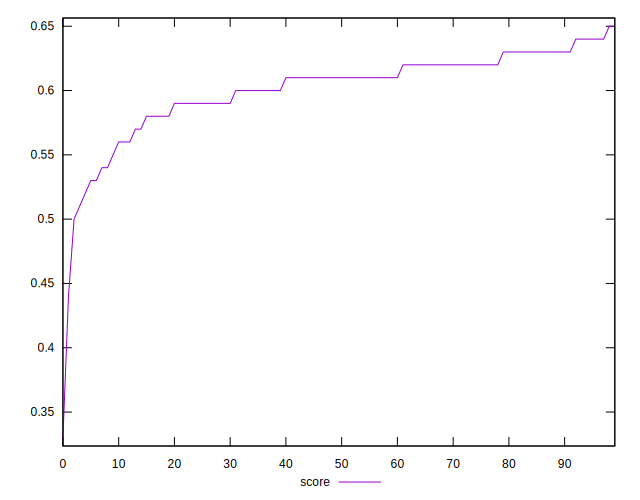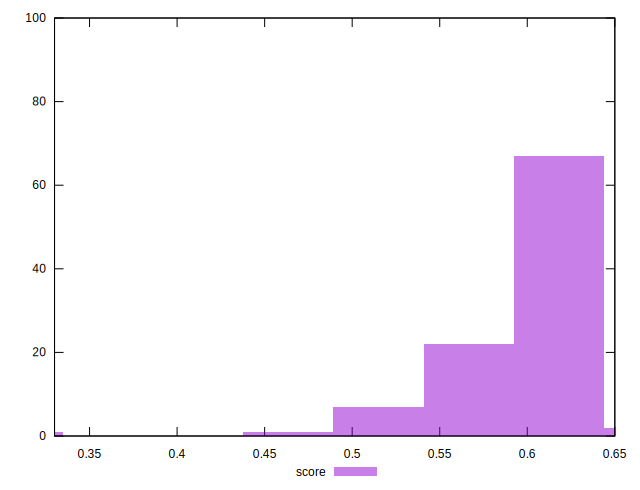
## Raw Estimate

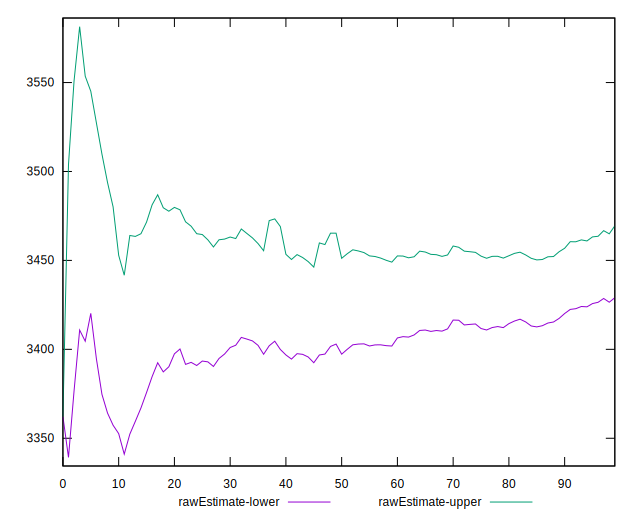
## Score Estimate

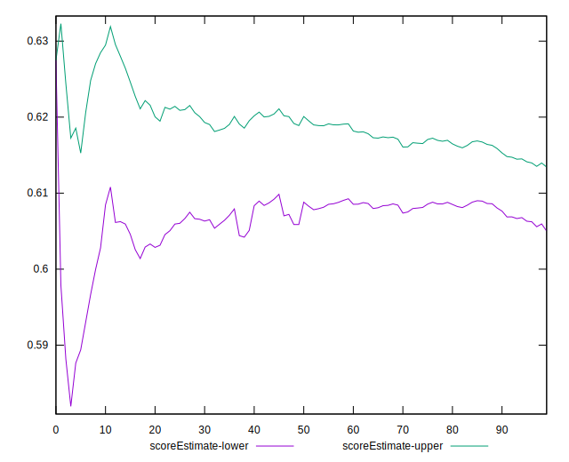
## P Score


```yaml
p90min: 0.5451201294635803
p90max: 0.6463134047021725
p90range: 0.10119327523859212
p90mean: 0.6093650674846885
p90median: 0.6115085612363904
p90stdev: 0.02037089099472305
p90skewness: -0.6474974755131422
p90eccentricity: 1.0000000000000002
p90discretization: 1
outlandishness: 0.965942482332777
confidence: 0.016923572225886696
p90confidence: 0.008370808668590968

```

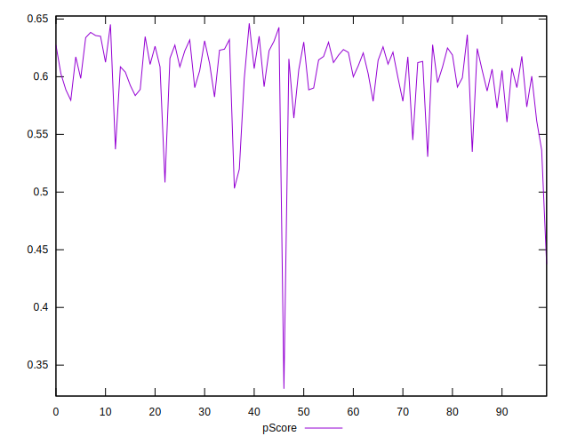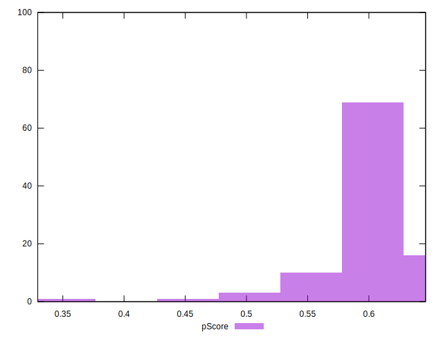
## Score Difference


```yaml
p90min: 0
p90max: 0
p90range: 0
p90mean: 0
p90median: 0
p90stdev: 0
p90skewness: .nan
p90eccentricity: .nan
p90discretization: 91
outlandishness: .inf
confidence: 6.092792000602806e-18
p90confidence: 0

```

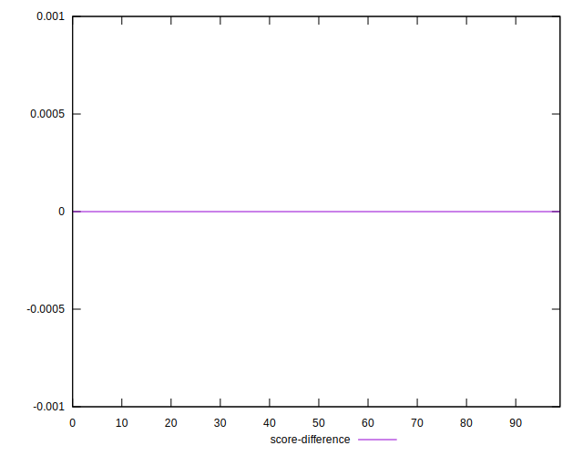
## P Score Difference


```yaml
p90min: -0.0046117191898388255
p90max: 0.004437262231636874
p90range: 0.0090489814214757
p90mean: -0.0001609731432654113
p90median: -0.0001109668183514323
p90stdev: 0.002541569344521703
p90skewness: 0.031048467912303267
p90eccentricity: 1.0000000000000004
p90discretization: 1
outlandishness: 0.39798841959989056
confidence: 0.001109490359721913
p90confidence: 0.001044381942177122

```

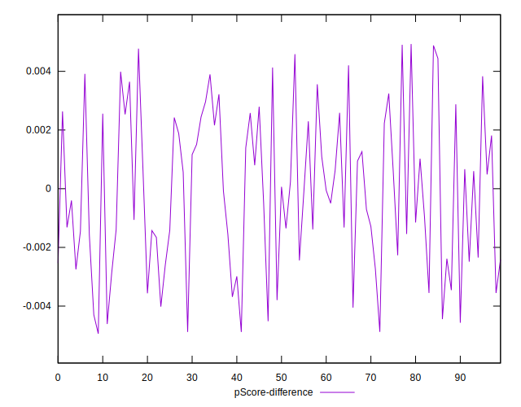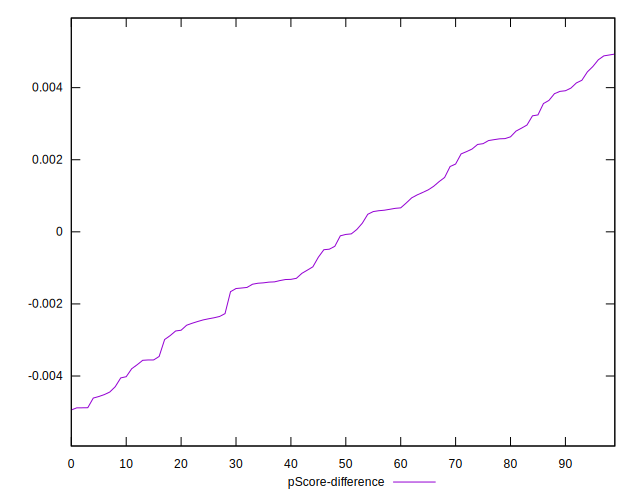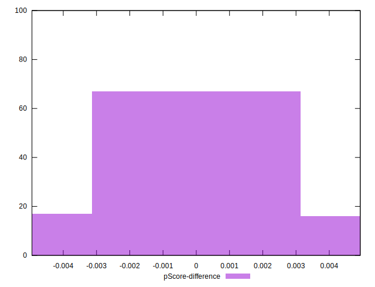