# //mainthread-work-breakdown/samples/pages+cached+noexternal

[→ Parent](../..)


## Raw


```yaml
p90min: 3272.819999999998
p90max: 3588.775999999999
p90range: 315.95600000000104
p90mean: 3394.981274725273
p90median: 3393.74
p90stdev: 72.70310689766208
p90skewness: 0.5311617736744071
p90eccentricity: 0.9999999999999999
p90discretization: 1
outlandishness: 1.022687152907393
confidence: 89.08599876768858
p90confidence: 29.875168327693245

```

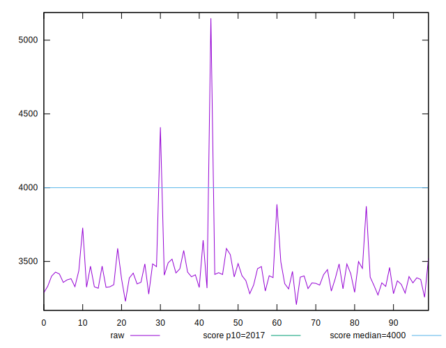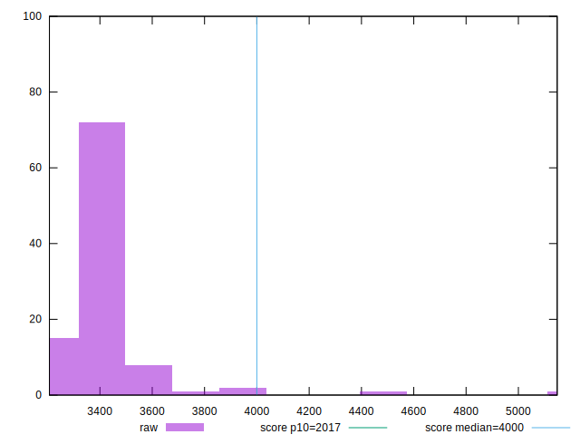
## Score


```yaml
p90min: 0.58
p90max: 0.65
p90range: 0.07000000000000006
p90mean: 0.6205494505494507
p90median: 0.62
p90stdev: 0.015361049454950822
p90skewness: -0.5287687261310204
p90eccentricity: 1.0000000000000002
p90discretization: 11.375
outlandishness: 0.9774090215882423
confidence: 0.01639237763436263
p90confidence: 0.00631216405651891

```

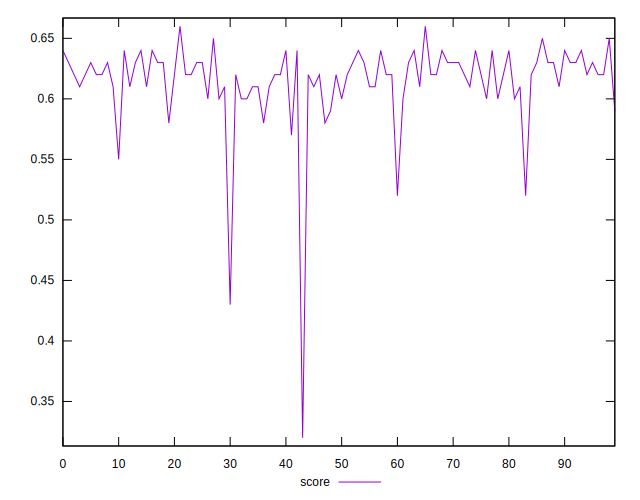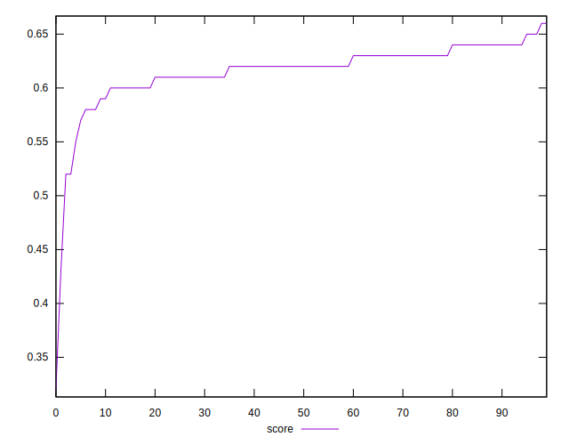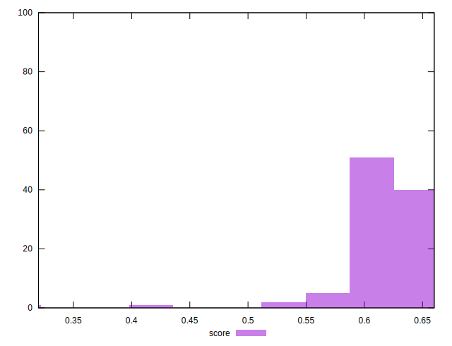
## Raw Estimate

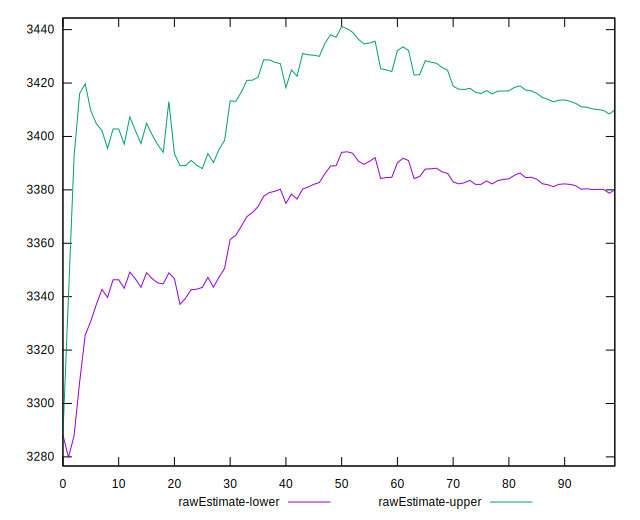
## Score Estimate

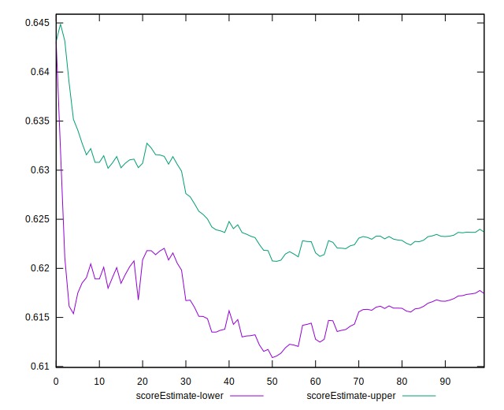
## P Score


```yaml
p90min: 0.5804530612743035
p90max: 0.6463746390998691
p90range: 0.06592157782556562
p90mean: 0.620633605340567
p90median: 0.6208230230876559
p90stdev: 0.015208967349731978
p90skewness: -0.5081627526545295
p90eccentricity: 0.9999999999999999
p90discretization: 1
outlandishness: 0.9773454776897682
confidence: 0.016392669034914542
p90confidence: 0.006249670461858203

```

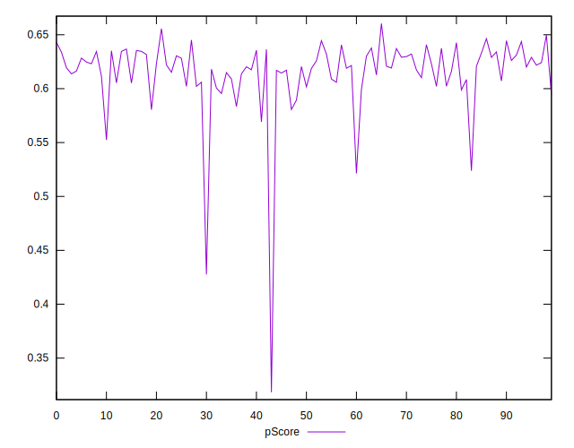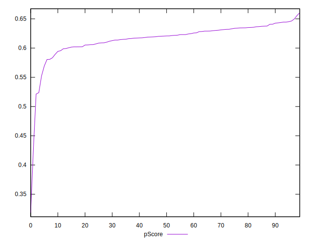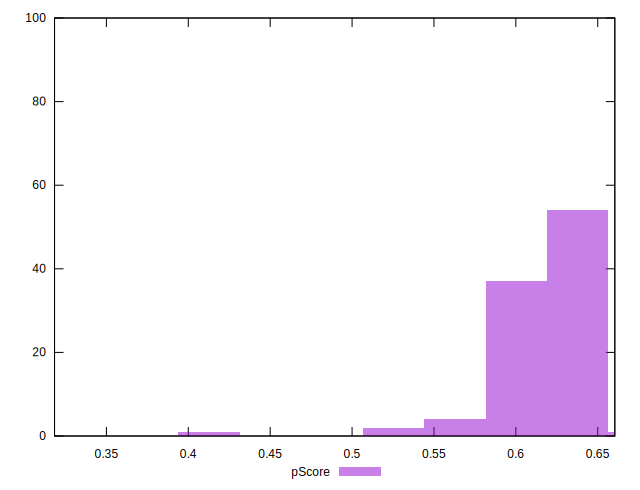
## Score Difference


```yaml
p90min: 0
p90max: 0
p90range: 0
p90mean: 0
p90median: 0
p90stdev: 0
p90skewness: .nan
p90eccentricity: .nan
p90discretization: 91
outlandishness: .inf
confidence: 4.330179641073933e-18
p90confidence: 0

```

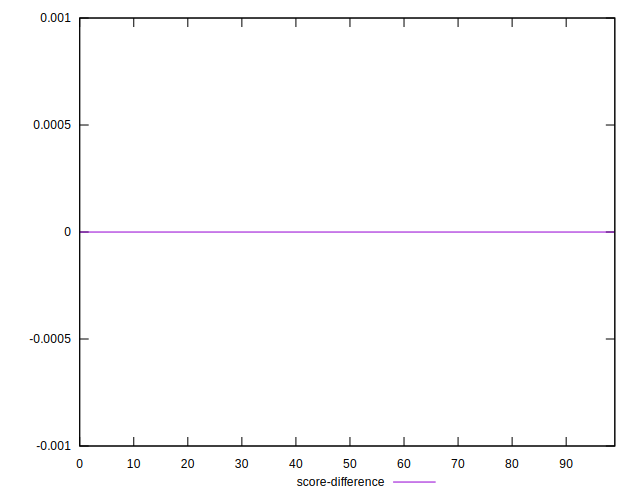
## P Score Difference


```yaml
p90min: -0.0043851018922672624
p90max: 0.004639398117630811
p90range: 0.009024500009898073
p90mean: 0.0003278952502030999
p90median: 0.0004530612743035567
p90stdev: 0.002626655835425216
p90skewness: -0.07000716254967297
p90eccentricity: 1.0000000000000002
p90discretization: 1
outlandishness: 0.037212945657806314
confidence: 0.0011362136802546866
p90confidence: 0.001079345691962029

```

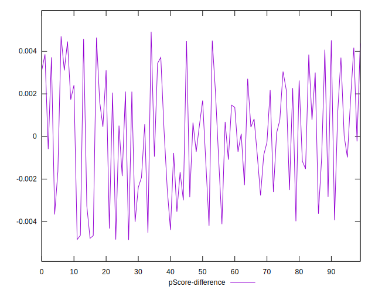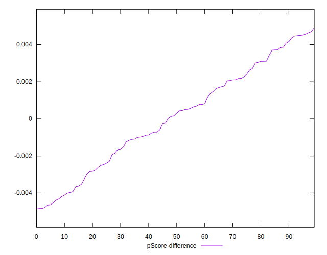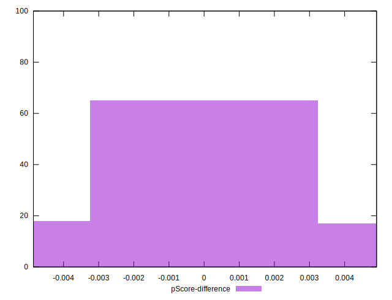