# //mainthread-work-breakdown/samples/pages+cached

[→ Parent](../..)


## Raw


```yaml
p90min: 3243.1159999999977
p90max: 4086.6359999999995
p90range: 843.5200000000018
p90mean: 3483.7522637362604
p90median: 3417.751999999997
p90stdev: 184.4620282438706
p90skewness: 1.0564271810507389
p90eccentricity: 0.9999999999999999
p90discretization: 1
outlandishness: 1.1051536923657288
confidence: 287.4110544085652
p90confidence: 75.79915603346217

```

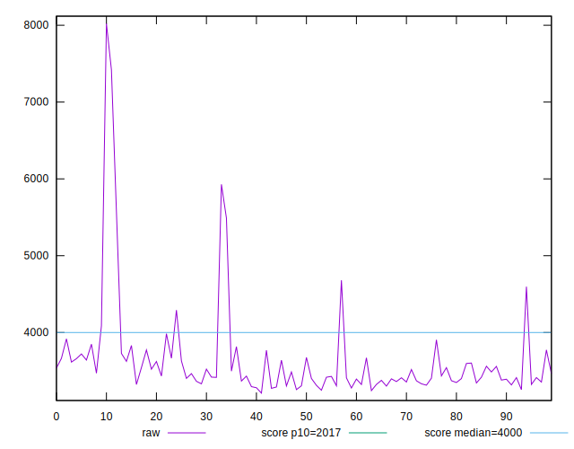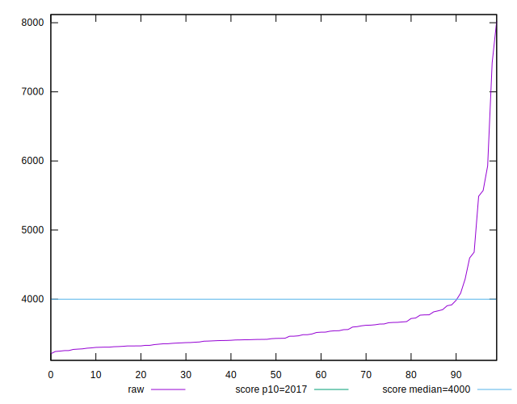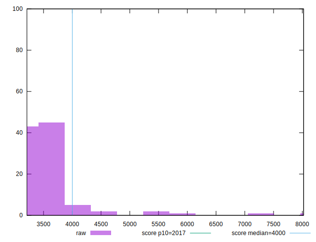
## Score


```yaml
p90min: 0.5
p90max: 0.66
p90range: 0.16000000000000003
p90mean: 0.604945054945055
p90median: 0.62
p90stdev: 0.036385410262109674
p90skewness: -0.8434464926083769
p90eccentricity: 0.9999999999999999
p90discretization: 5.6875
outlandishness: 0.911638183621363
confidence: 0.0397138037894742
p90confidence: 0.014951496609117543

```

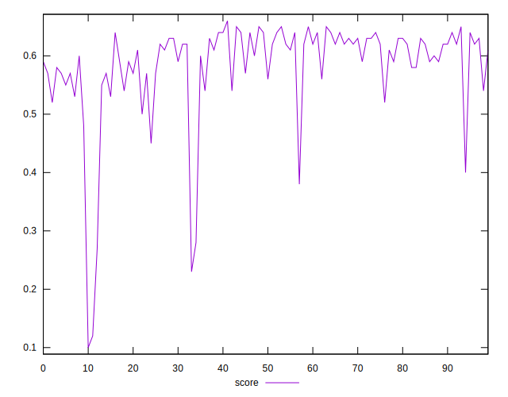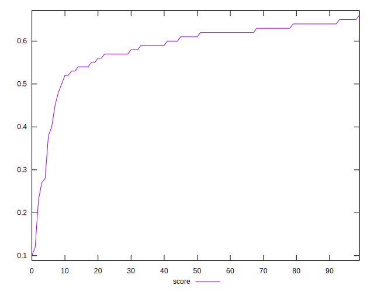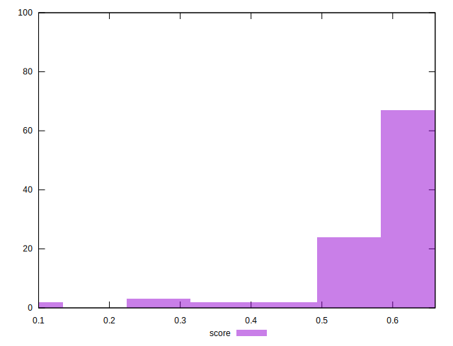
## Raw Estimate

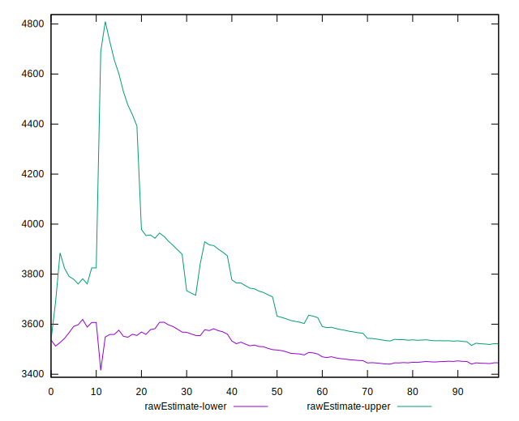
## Score Estimate


## P Score


```yaml
p90min: 0.5029178848140741
p90max: 0.6595516306894946
p90range: 0.15663374587542056
p90mean: 0.6045373287219705
p90median: 0.6161749134945009
p90stdev: 0.03587352827563888
p90skewness: -0.8517800530669019
p90eccentricity: 0.9999999999999996
p90discretization: 1
outlandishness: 0.9116426456626144
confidence: 0.0396523260874444
p90confidence: 0.014741154009436652

```

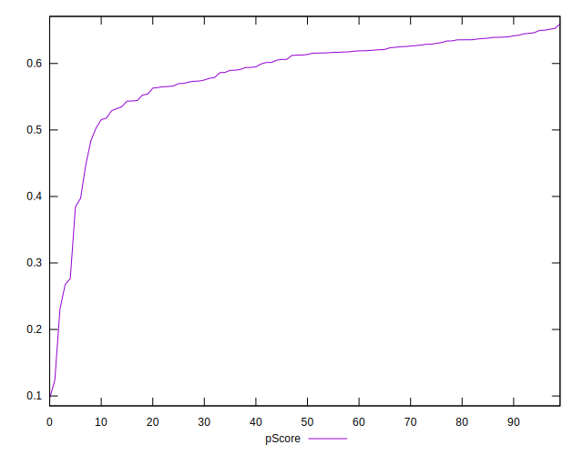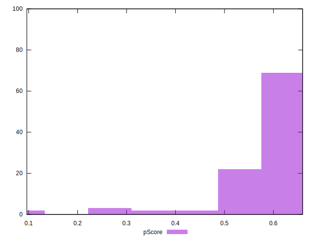
## Score Difference


```yaml
p90min: 0
p90max: 0
p90range: 0
p90mean: 0
p90median: 0
p90stdev: 0
p90skewness: .nan
p90eccentricity: .nan
p90discretization: 91
outlandishness: .inf
confidence: 1.180666453332407e-17
p90confidence: 0

```

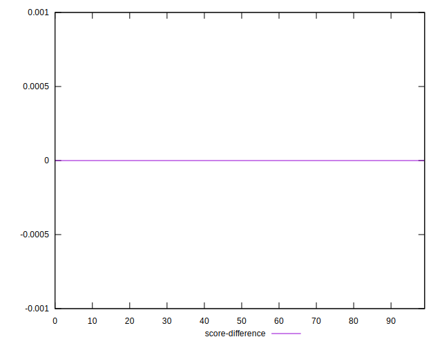
## P Score Difference


```yaml
p90min: -0.004763409014372999
p90max: 0.004048632659947482
p90range: 0.008812041674320481
p90mean: -0.000564581713556907
p90median: -0.0006737443666530174
p90stdev: 0.0028411034029607457
p90skewness: 0.13542423636921655
p90eccentricity: 1.0000000000000004
p90discretization: 1
outlandishness: 0.47200730074467584
confidence: 0.0012060150119006434
p90confidence: 0.0011674665089527864

```

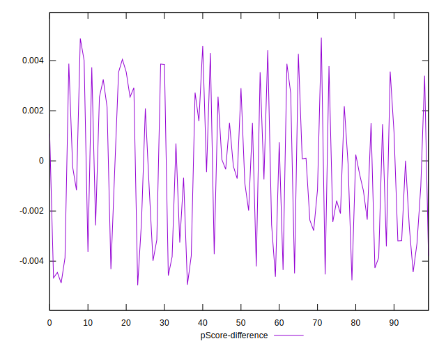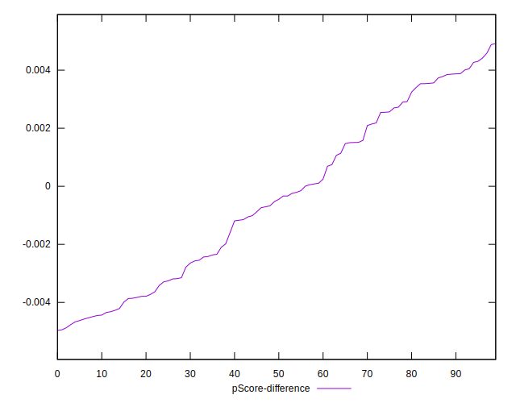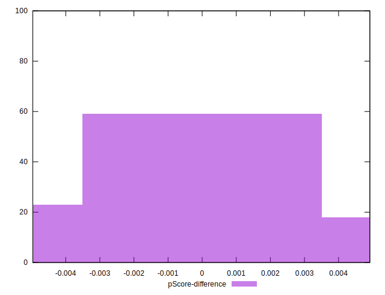