# //mainthread-work-breakdown/samples/pages

[→ Parent](../..)


## Raw


```yaml
p90min: 3243.579999999999
p90max: 4438.4959999999965
p90range: 1194.9159999999974
p90mean: 3622.9838241758207
p90median: 3572.675999999999
p90stdev: 211.68064437943292
p90skewness: 1.5083435871301742
p90eccentricity: 0.9999999999999996
p90discretization: 1
outlandishness: 1.0758819215219786
confidence: 221.7532440608975
p90confidence: 86.98383263664255

```

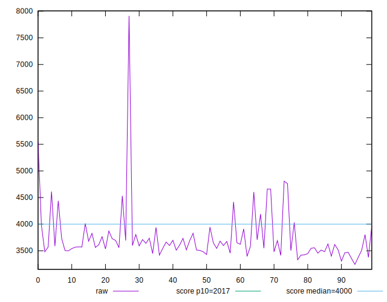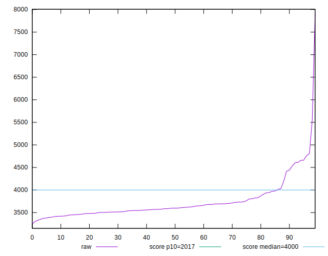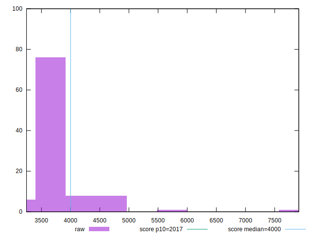
## Score


```yaml
p90min: 0.42
p90max: 0.65
p90range: 0.23000000000000004
p90mean: 0.5745054945054947
p90median: 0.58
p90stdev: 0.04130465041172222
p90skewness: -1.321416290685306
p90eccentricity: 1
p90discretization: 4.55
outlandishness: 0.9292178195479694
confidence: 0.032084939680024016
p90confidence: 0.01697291128842271

```

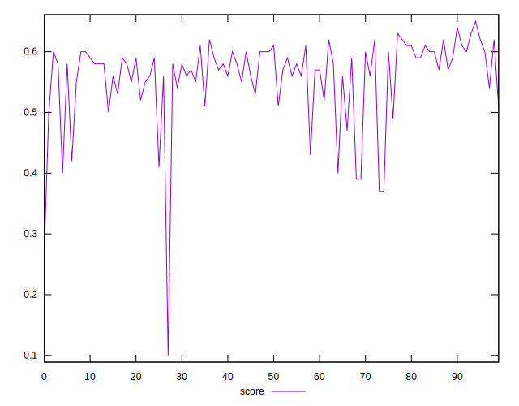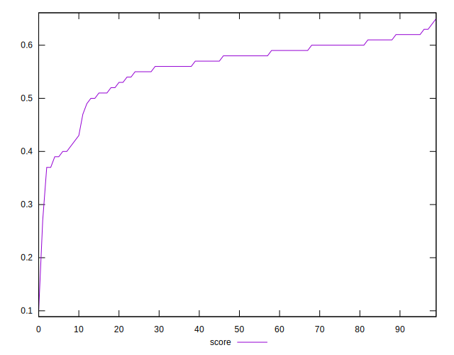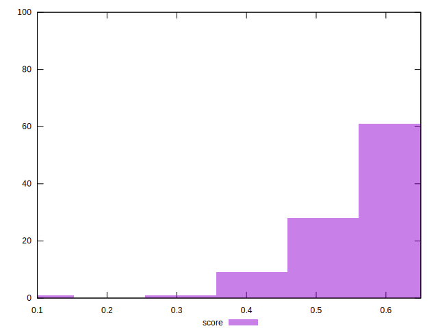
## Raw Estimate

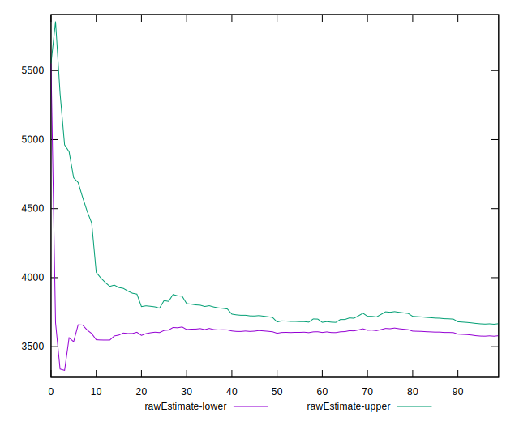
## Score Estimate

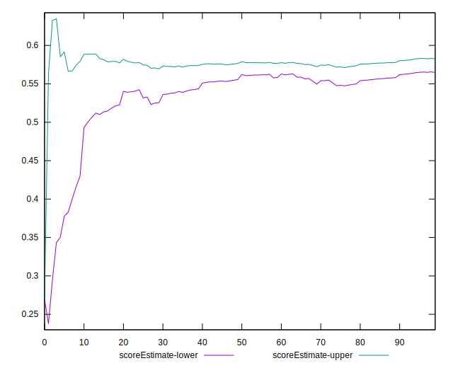
## P Score


```yaml
p90min: 0.4228134943053966
p90max: 0.6525997031826996
p90range: 0.22978620887730294
p90mean: 0.5743802107596953
p90median: 0.5837391708997304
p90stdev: 0.04140363161021223
p90skewness: -1.3127952069781827
p90eccentricity: 1
p90discretization: 1
outlandishness: 0.9286330602602889
confidence: 0.03222157980954288
p90confidence: 0.017013584652909364

```

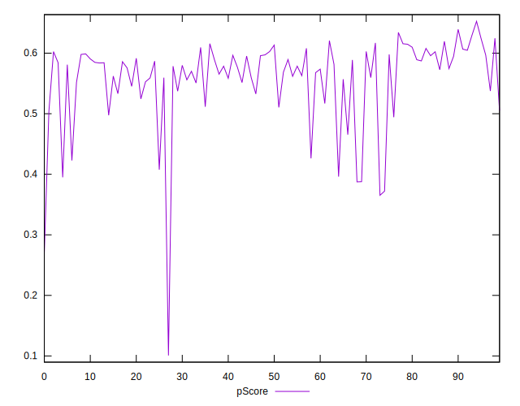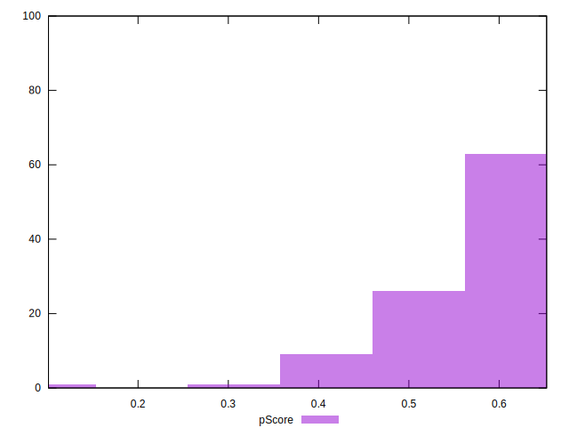
## Score Difference


```yaml
p90min: 0
p90max: 0
p90range: 0
p90mean: 0
p90median: 0
p90stdev: 0
p90skewness: .nan
p90eccentricity: .nan
p90discretization: 91
outlandishness: .inf
confidence: 1.1398570097566358e-17
p90confidence: 0

```

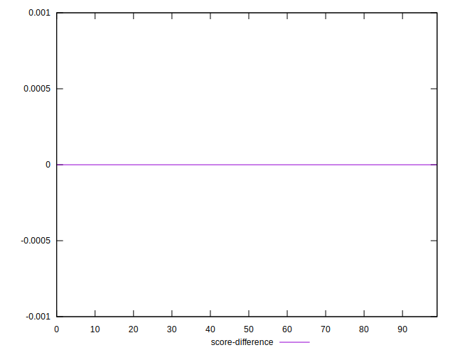
## P Score Difference


```yaml
p90min: -0.0048231147677426645
p90max: 0.004221594386596306
p90range: 0.00904470915433897
p90mean: -0.0005730712675910492
p90median: -0.0007225792744619541
p90stdev: 0.0027001174868866596
p90skewness: 0.18178632912474021
p90eccentricity: 0.9999999999999999
p90discretization: 1
outlandishness: 0.26500951512075077
confidence: 0.0011660570344478615
p90confidence: 0.0011095325615015968

```

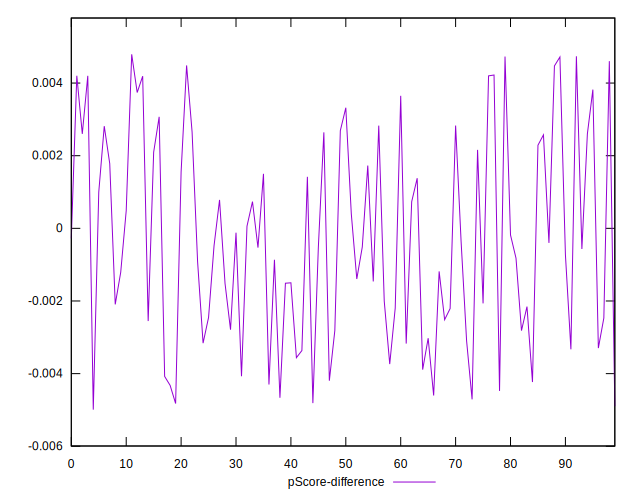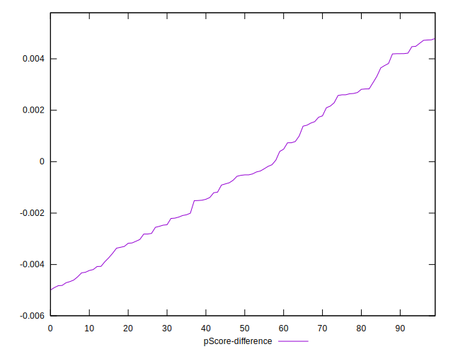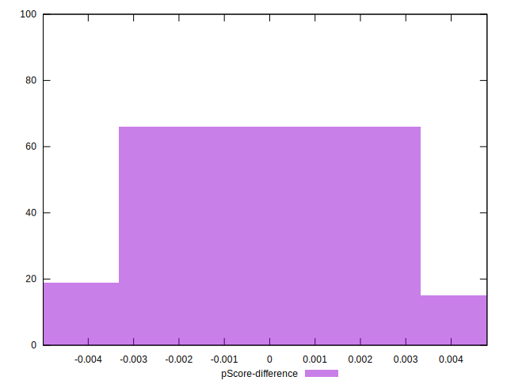