# //max-potential-fid/samples/pages+cached+noexternal+nomedia+nocss+nojs

[→ Parent](../..)


## Raw


```yaml
p90min: 442
p90max: 778
p90range: 336
p90mean: 528.1318681318681
p90median: 496
p90stdev: 81.42956354781101
p90skewness: 1.441748724181635
p90eccentricity: 1.0000000000000002
p90discretization: 1.2297297297297298
outlandishness: 1.199753287835344
confidence: 75.18725295769377
p90confidence: 33.46104481154839

```

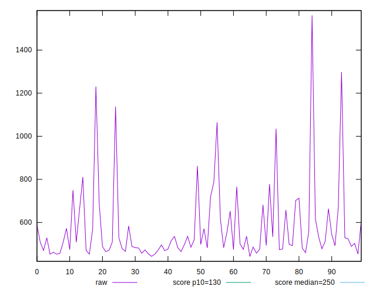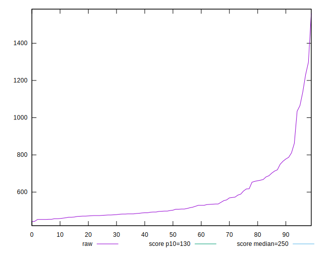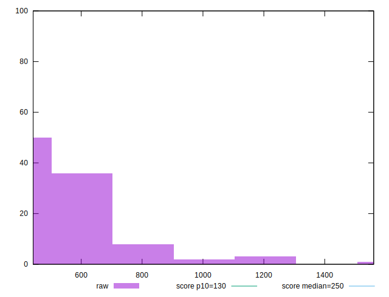
## Score


```yaml
p90min: 0.01
p90max: 0.13
p90range: 0.12000000000000001
p90mean: 0.08098901098901091
p90median: 0.09
p90stdev: 0.032004633766664806
p90skewness: -0.6488531688031371
p90eccentricity: 1.0000000000000004
p90discretization: 7
outlandishness: 0.8348553765034458
confidence: 0.014812971607278819
p90confidence: 0.01315134747117716

```

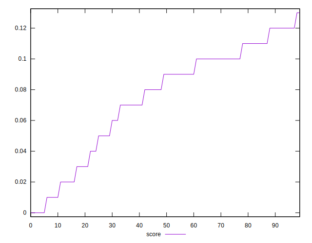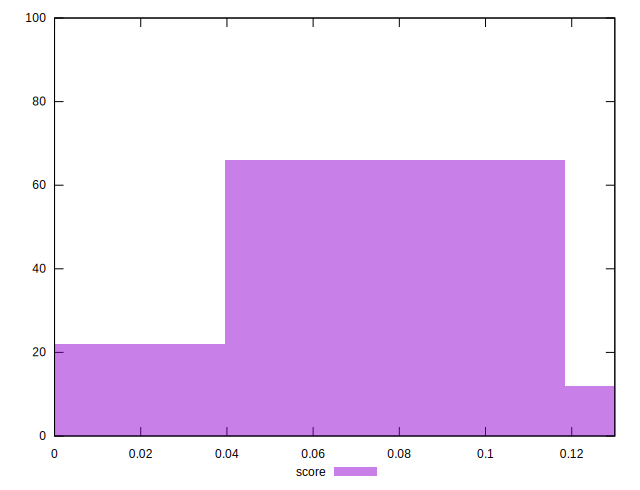
## Raw Estimate

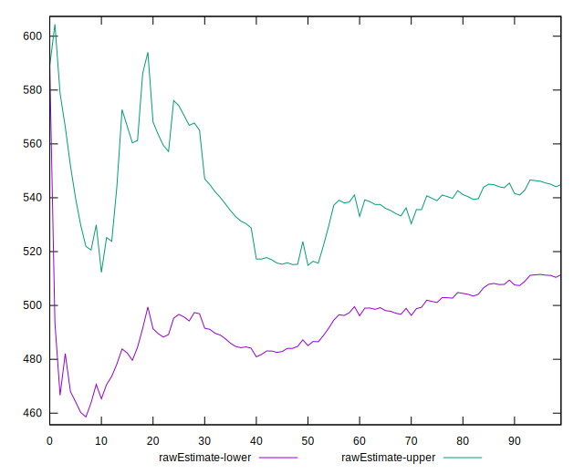
## Score Estimate

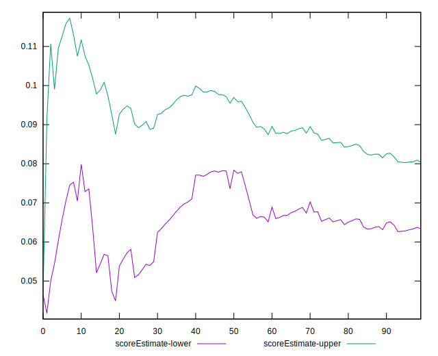
## P Score


```yaml
p90min: 0.013044937842373039
p90max: 0.13204463194839522
p90range: 0.11899969410602218
p90mean: 0.08127178388286099
p90median: 0.08968880625091713
p90stdev: 0.032126963783535314
p90skewness: -0.6265292658323406
p90eccentricity: 1.0000000000000002
p90discretization: 1.2297297297297298
outlandishness: 0.836765993421437
confidence: 0.01480433107673293
p90confidence: 0.013201615334566819

```

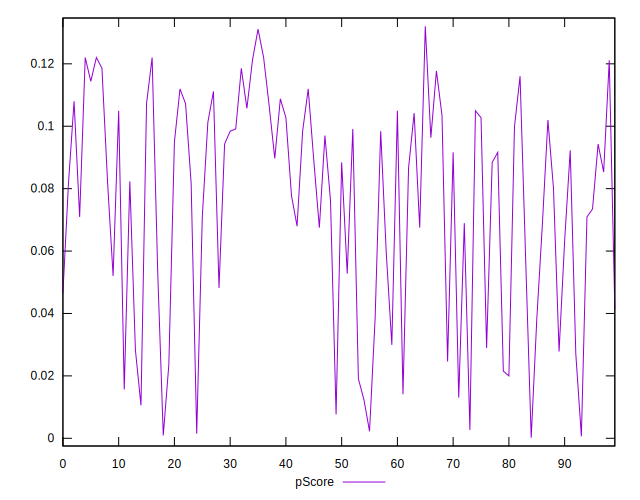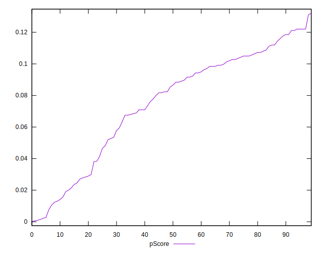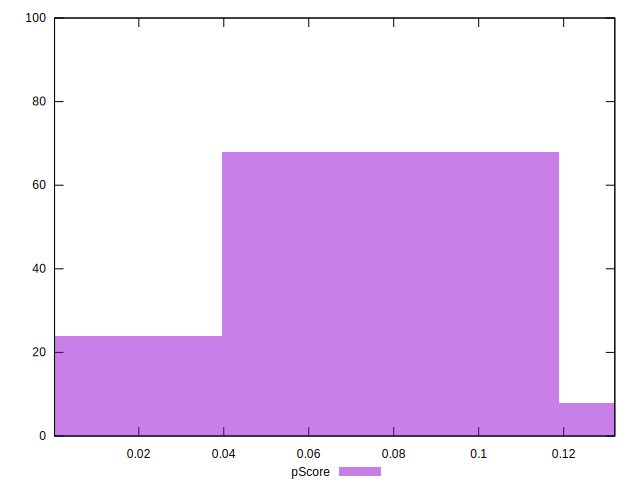
## Score Difference


```yaml
p90min: 0
p90max: 0
p90range: 0
p90mean: 0
p90median: 0
p90stdev: 0
p90skewness: .nan
p90eccentricity: .nan
p90discretization: 91
outlandishness: .nan
confidence: 0
p90confidence: 0

```


## P Score Difference


```yaml
p90min: -0.0038574734060059374
p90max: 0.004389912683275418
p90range: 0.008247386089281356
p90mean: 0.0002981256423619609
p90median: 0.0006233800102497522
p90stdev: 0.002239472675503852
p90skewness: -0.019330590116352804
p90eccentricity: 0.9999999999999996
p90discretization: 1.1973684210526316
outlandishness: 1.3259748574062997
confidence: 0.0009972156358879667
p90confidence: 0.0009202443471930758

```

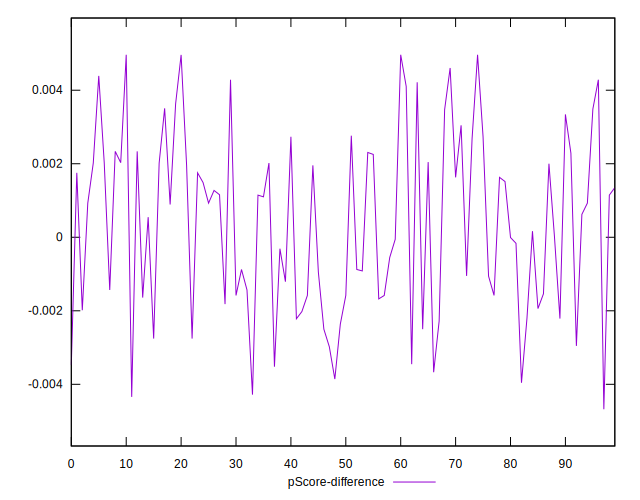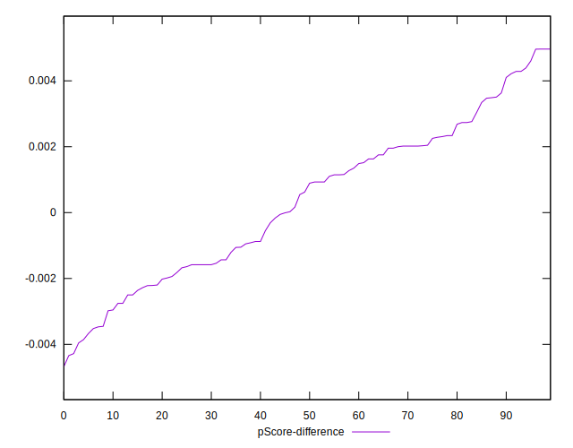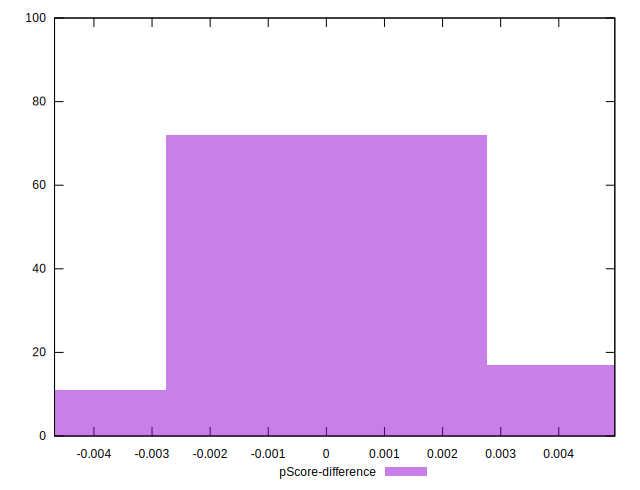