# //max-potential-fid/samples/pages+cached+noexternal+nomedia+nocss

[→ Parent](../..)


## Raw


```yaml
p90min: 442
p90max: 706
p90range: 264
p90mean: 533.7362637362637
p90median: 524
p90stdev: 62.91208503287094
p90skewness: 0.6866649519566633
p90eccentricity: 1.0000000000000007
p90discretization: 1.2465753424657535
outlandishness: 1.137902961373266
confidence: 61.89546092520982
p90confidence: 25.851840593948737

```

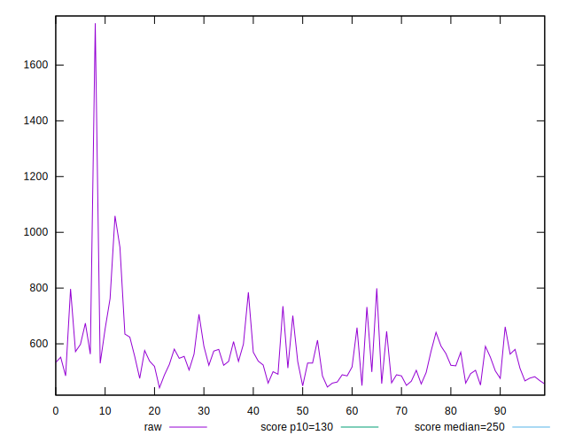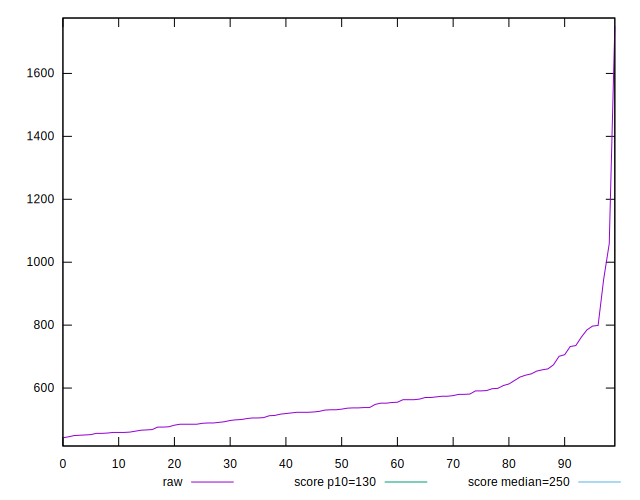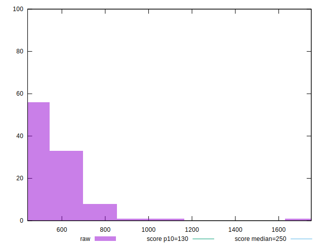
## Score


```yaml
p90min: 0.01
p90max: 0.12
p90range: 0.11
p90mean: 0.07153846153846152
p90median: 0.07
p90stdev: 0.029236552348687272
p90skewness: 0.01700092528477048
p90eccentricity: 1
p90discretization: 7.583333333333333
outlandishness: 0.9383984391259101
confidence: 0.013249762438974133
p90confidence: 0.012013887163968506

```

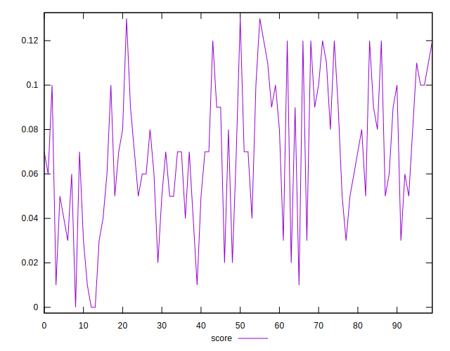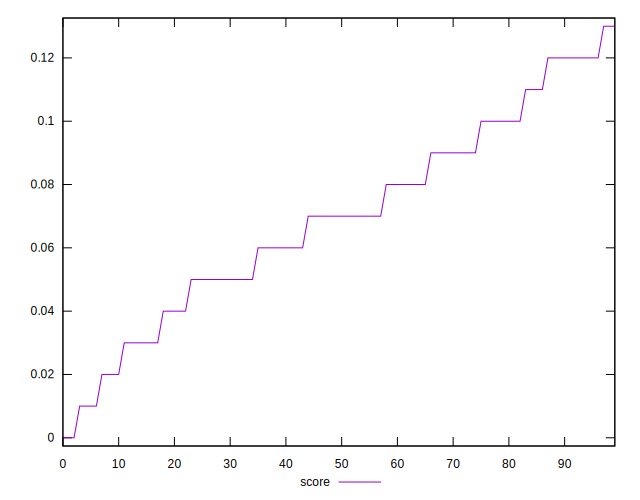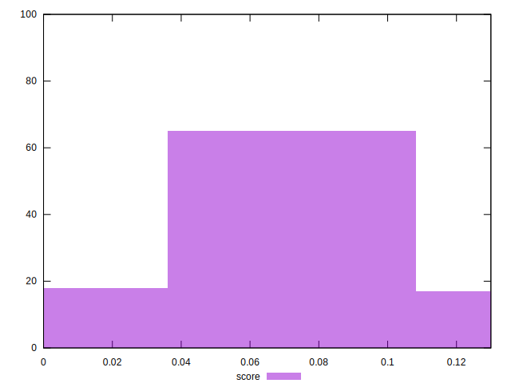
## Raw Estimate

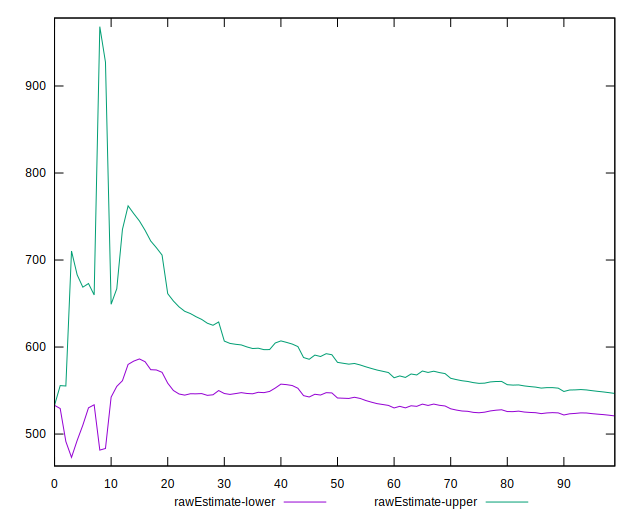
## Score Estimate

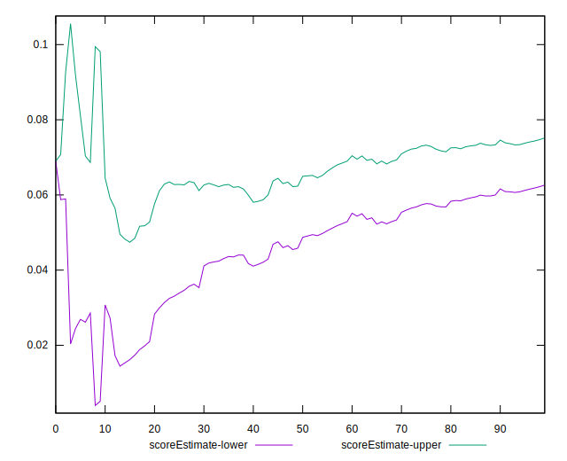
## P Score


```yaml
p90min: 0.014475713563806114
p90max: 0.12467453517163446
p90range: 0.11019882160782835
p90mean: 0.0714821616950344
p90median: 0.06993119722960445
p90stdev: 0.029350168100644333
p90skewness: 0.03663306591239692
p90eccentricity: 1.0000000000000002
p90discretization: 1.2465753424657535
outlandishness: 0.9409832640323599
confidence: 0.013171669884170095
p90confidence: 0.012060574160704024

```

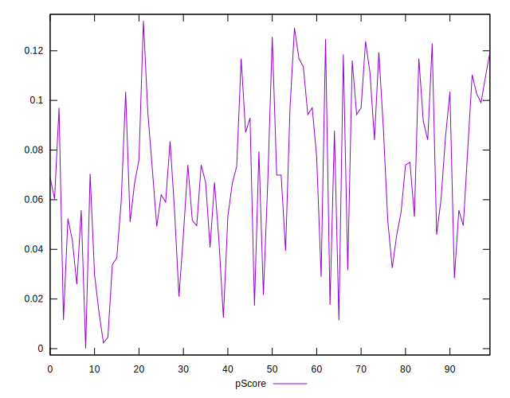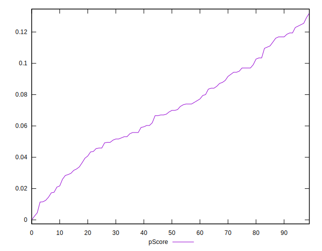
## Score Difference


```yaml
p90min: 0
p90max: 0
p90range: 0
p90mean: 0
p90median: 0
p90stdev: 0
p90skewness: .nan
p90eccentricity: .nan
p90discretization: 91
outlandishness: .nan
confidence: 0
p90confidence: 0

```


## P Score Difference


```yaml
p90min: -0.004193580079543124
p90max: 0.004285432999558775
p90range: 0.0084790130791019
p90mean: 0.00009725112105680456
p90median: -0.0000688027703955596
p90stdev: 0.0026577895073535223
p90skewness: -0.037466741573043444
p90eccentricity: 1
p90discretization: 1.2465753424657535
outlandishness: 0.17570357504757816
confidence: 0.0011366982806905969
p90confidence: 0.0010921391437030473

```

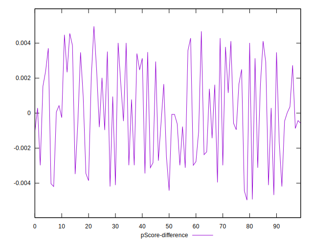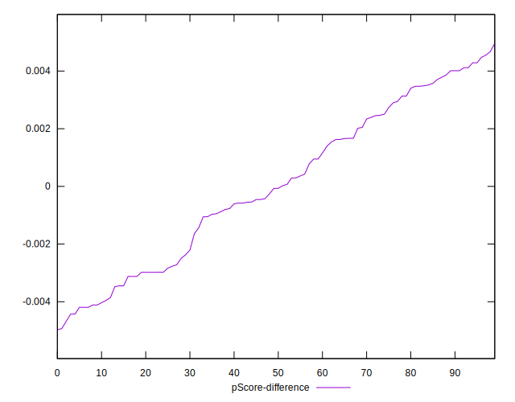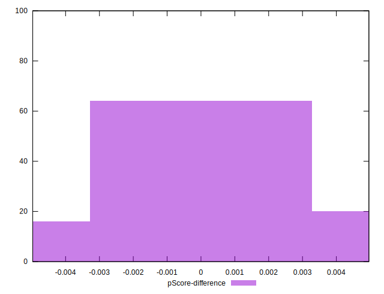