# //max-potential-fid/samples/pages+cached+noexternal+nomedia

[→ Parent](../..)


## Raw


```yaml
p90min: 434.00000000000364
p90max: 580
p90range: 145.99999999999636
p90mean: 477.38461538461524
p90median: 471
p90stdev: 33.21451067466698
p90skewness: 1.177998341279431
p90eccentricity: 1.0000000000000004
p90discretization: 1.421875
outlandishness: 1.0933522802748559
confidence: 38.04415020711872
p90confidence: 13.64851021737502

```

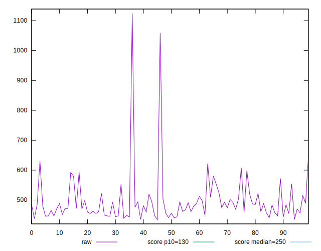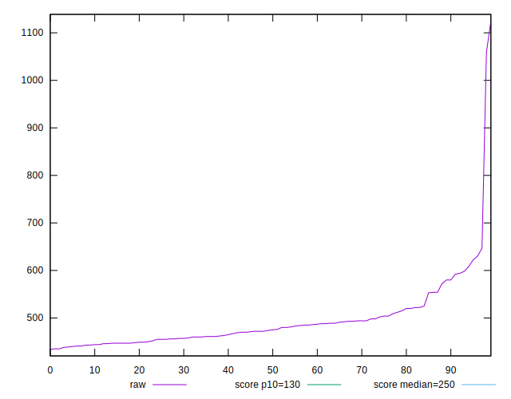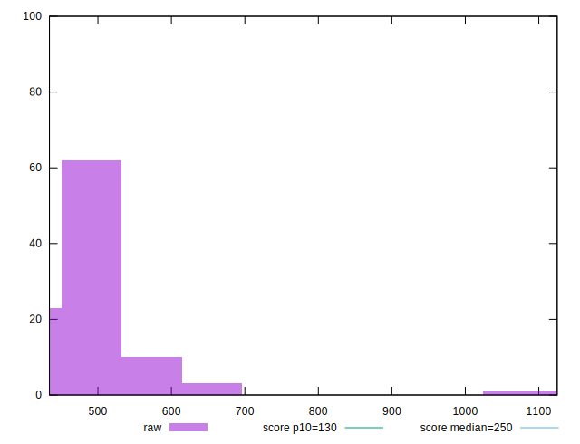
## Score


```yaml
p90min: 0.05
p90max: 0.14
p90range: 0.09000000000000001
p90mean: 0.10538461538461537
p90median: 0.11
p90stdev: 0.022644296388229963
p90skewness: -0.5725537346922854
p90eccentricity: 1.0000000000000013
p90discretization: 9.1
outlandishness: 0.877162134370504
confidence: 0.012052168996144003
p90confidence: 0.009304996651832265

```

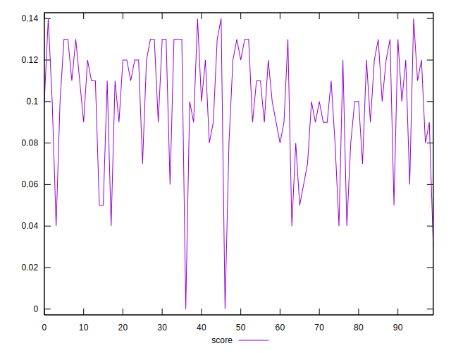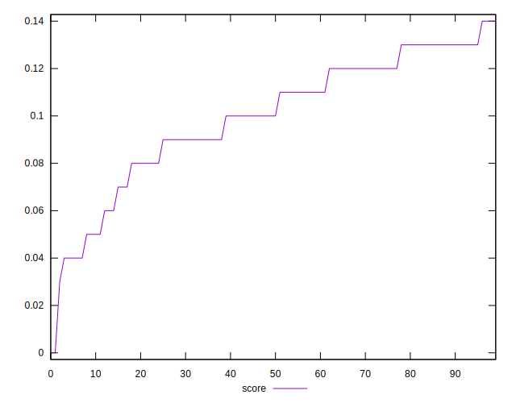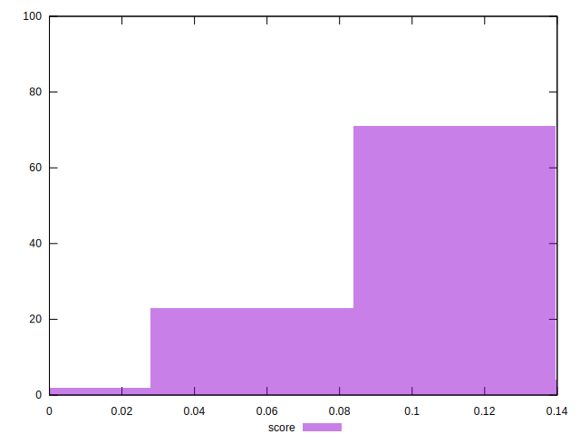
## Raw Estimate

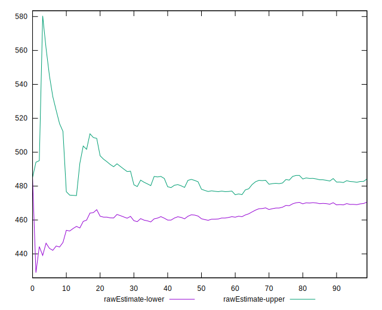
## Score Estimate

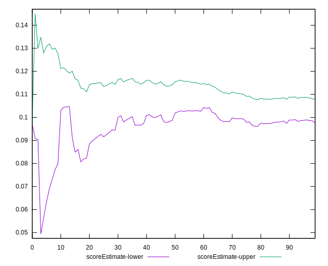
## P Score


```yaml
p90min: 0.04954451668400489
p90max: 0.13985256271552726
p90range: 0.09030804603152237
p90mean: 0.1051775189167506
p90median: 0.10724409059049755
p90stdev: 0.02200657480742111
p90skewness: -0.5866741104522298
p90eccentricity: 1
p90discretization: 1.421875
outlandishness: 0.877651650117397
confidence: 0.011831750177233924
p90confidence: 0.009042944032819938

```

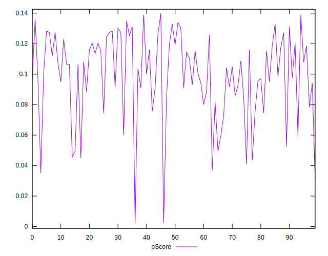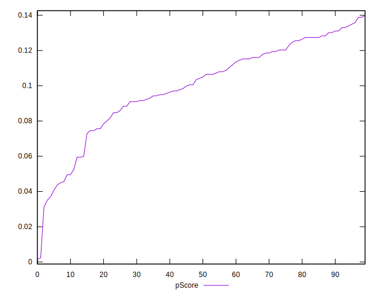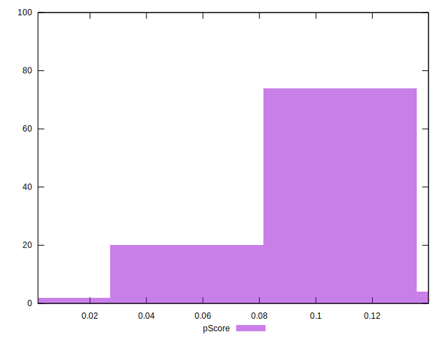
## Score Difference


```yaml
p90min: 0
p90max: 0
p90range: 0
p90mean: 0
p90median: 0
p90stdev: 0
p90skewness: .nan
p90eccentricity: .nan
p90discretization: 91
outlandishness: .nan
confidence: 0
p90confidence: 0

```


## P Score Difference


```yaml
p90min: -0.004786838063523757
p90max: 0.00453808758933838
p90range: 0.009324925652862137
p90mean: -0.0005554477766095623
p90median: -0.0005495678734271925
p90stdev: 0.0027048557857031973
p90skewness: 0.2086257552494851
p90eccentricity: 1.0000000000000002
p90discretization: 1.4
outlandishness: 0.0898306922214213
confidence: 0.0011788949250210463
p90confidence: 0.0011114796237492973

```

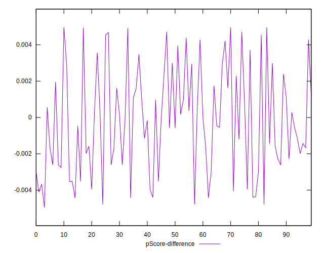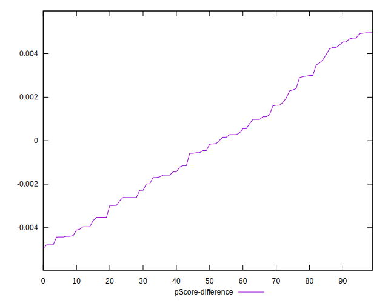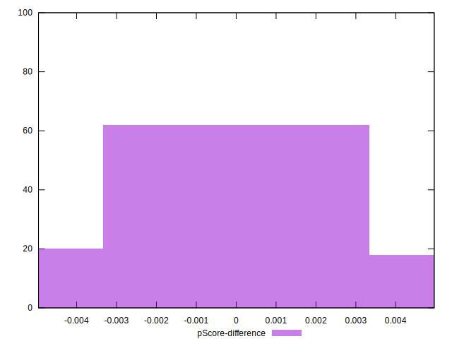