# //max-potential-fid/samples/pages+cached+noexternal

[→ Parent](../..)


## Raw


```yaml
p90min: 428
p90max: 506
p90range: 78
p90mean: 461.68131868131866
p90median: 458
p90stdev: 20.982399280819926
p90skewness: 0.3392900315916002
p90eccentricity: 0.9999999999999999
p90discretization: 1.378787878787879
outlandishness: 1.0473268938186537
confidence: 18.791750373176683
p90confidence: 8.622089717785116

```

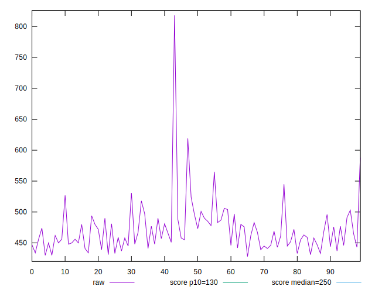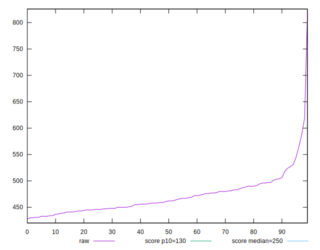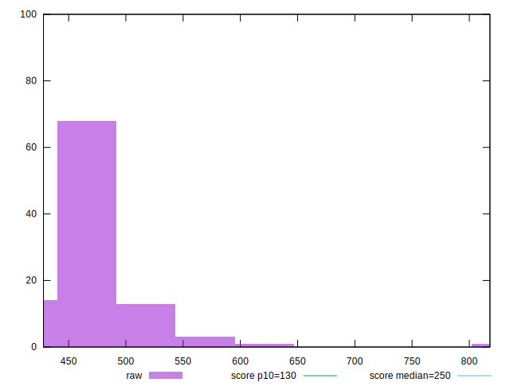
## Score


```yaml
p90min: 0.08
p90max: 0.14
p90range: 0.06000000000000001
p90mean: 0.1147252747252747
p90median: 0.12
p90stdev: 0.01711888998023223
p90skewness: -0.2292163825204067
p90eccentricity: 0.9999999999999993
p90discretization: 13
outlandishness: 0.9226669753086418
confidence: 0.009488817019152468
p90confidence: 0.0070344960699217085

```

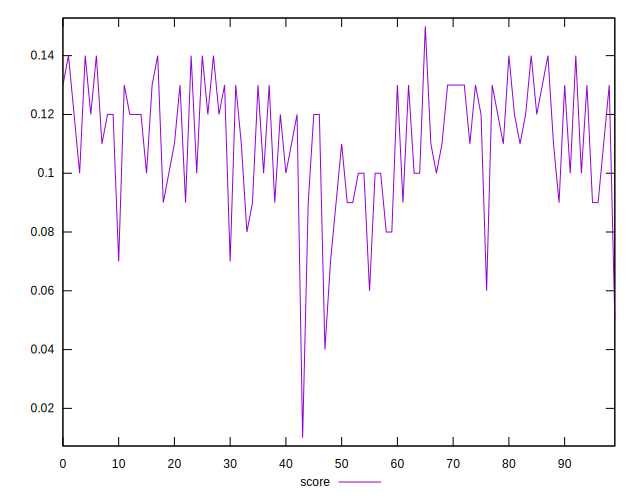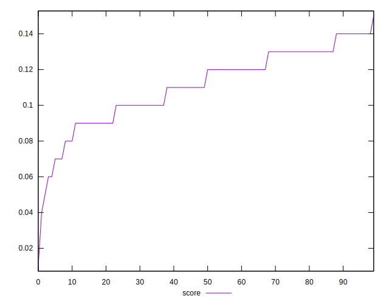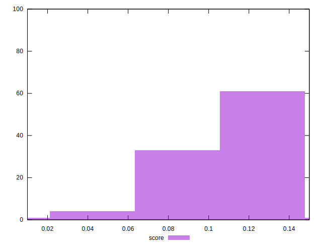
## Raw Estimate

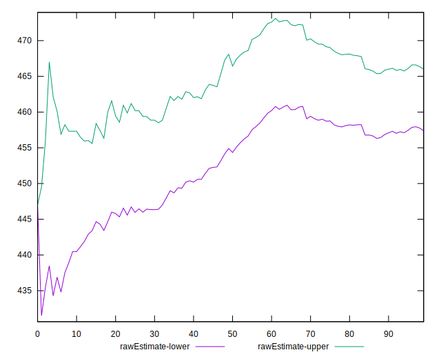
## Score Estimate

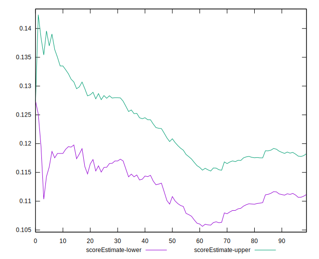
## P Score


```yaml
p90min: 0.07668523046209824
p90max: 0.1439282143479247
p90range: 0.06724298388582645
p90mean: 0.1151874789692046
p90median: 0.11771910535012109
p90stdev: 0.017164985973389245
p90skewness: -0.18420914091623306
p90eccentricity: 0.9999999999999999
p90discretization: 1.378787878787879
outlandishness: 0.9213575741763591
confidence: 0.009545193015018327
p90confidence: 0.007053437840274596

```

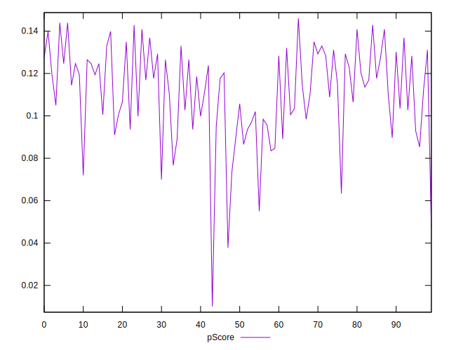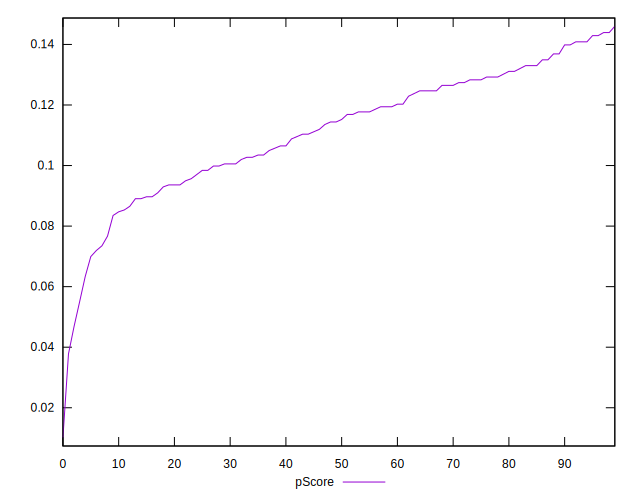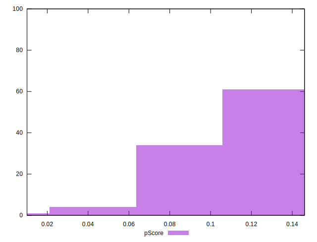
## Score Difference


```yaml
p90min: 0
p90max: 0
p90range: 0
p90mean: 0
p90median: 0
p90stdev: 0
p90skewness: .nan
p90eccentricity: .nan
p90discretization: 91
outlandishness: .nan
confidence: 0
p90confidence: 0

```


## P Score Difference


```yaml
p90min: -0.003989691079640506
p90max: 0.004716032485991076
p90range: 0.008705723565631582
p90mean: 0.0004379400260083788
p90median: 0.00028022848380648835
p90stdev: 0.0025731324203744762
p90skewness: 0.03881907928986984
p90eccentricity: 1.0000000000000002
p90discretization: 1.3582089552238805
outlandishness: 0.6962909142185149
confidence: 0.001116398611775888
p90confidence: 0.001057351844623914

```

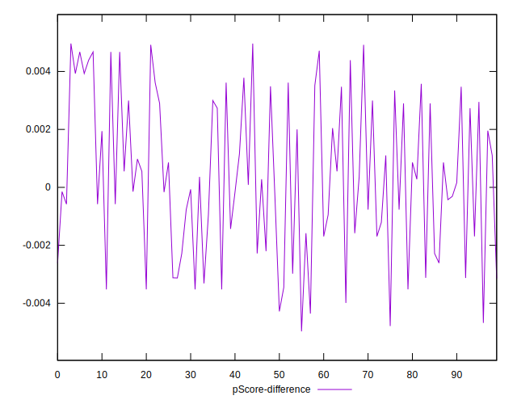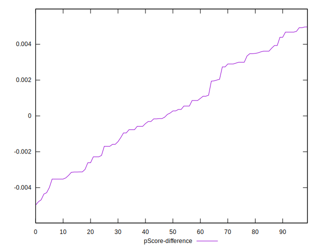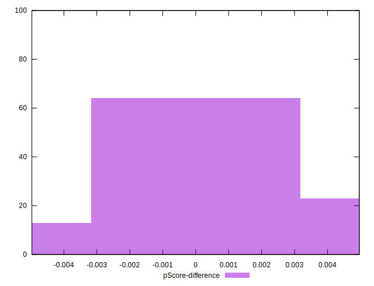