# //max-potential-fid/samples/pages+cached

[→ Parent](../..)


## Raw


```yaml
p90min: 431
p90max: 557.0000000000036
p90range: 126.00000000000364
p90mean: 481.5494505494507
p90median: 471
p90stdev: 33.89358386436363
p90skewness: 0.6307281250256835
p90eccentricity: 0.9999999999999993
p90discretization: 1.318840579710145
outlandishness: 1.168179606191564
confidence: 64.01215860529203
p90confidence: 13.927555043857637

```

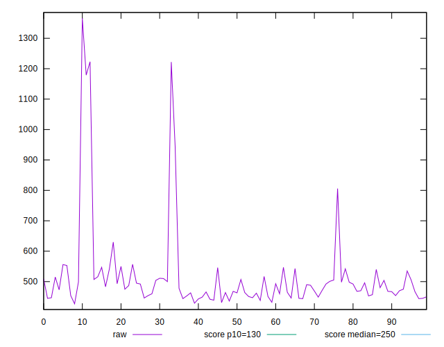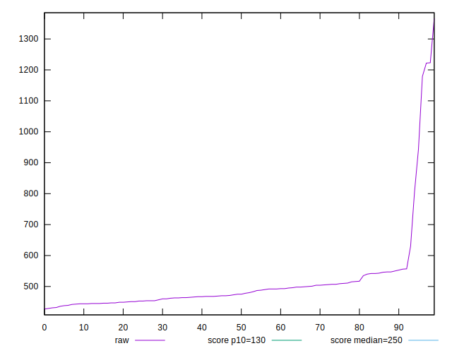
## Score


```yaml
p90min: 0.06
p90max: 0.14
p90range: 0.08000000000000002
p90mean: 0.10175824175824173
p90median: 0.11
p90stdev: 0.02337432641532424
p90skewness: -0.2587870942238219
p90eccentricity: 0.9999999999999992
p90discretization: 10.11111111111111
outlandishness: 0.8900271960964503
confidence: 0.013246804857372507
p90confidence: 0.009604980667294122

```

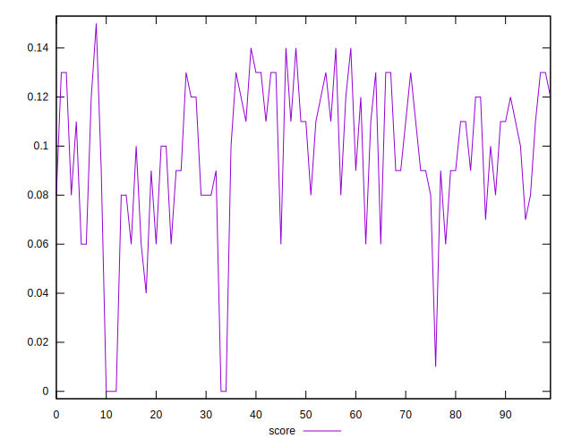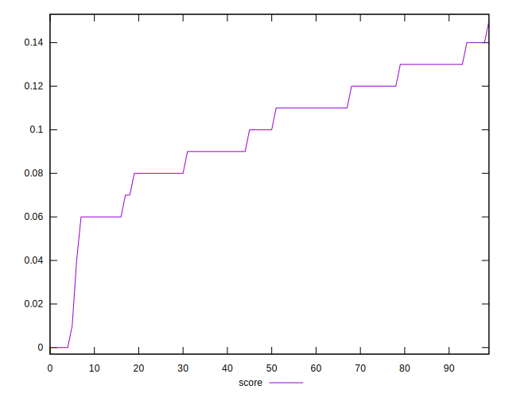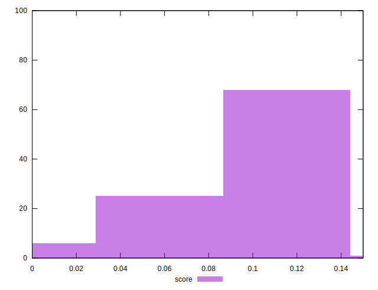
## Raw Estimate

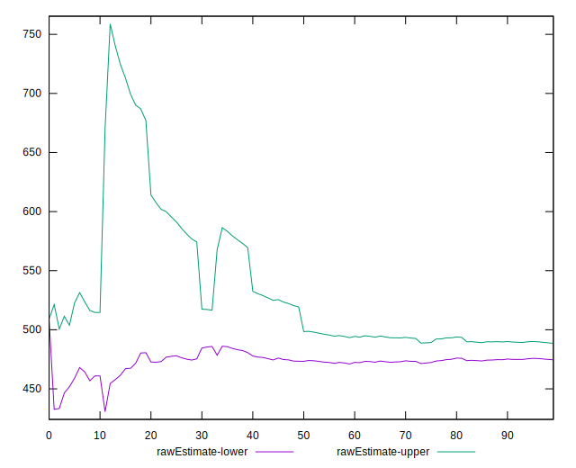
## Score Estimate

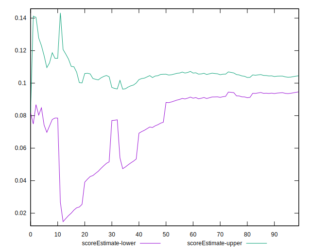
## P Score


```yaml
p90min: 0.05820899742884017
p90max: 0.14289830734397002
p90range: 0.08468930991512985
p90mean: 0.10230609358126849
p90median: 0.10724409059049755
p90stdev: 0.02294029337506708
p90skewness: -0.2660614057290374
p90eccentricity: 0.9999999999999997
p90discretization: 1.318840579710145
outlandishness: 0.8908075495474411
confidence: 0.01311805541960781
p90confidence: 0.009426627764773515

```

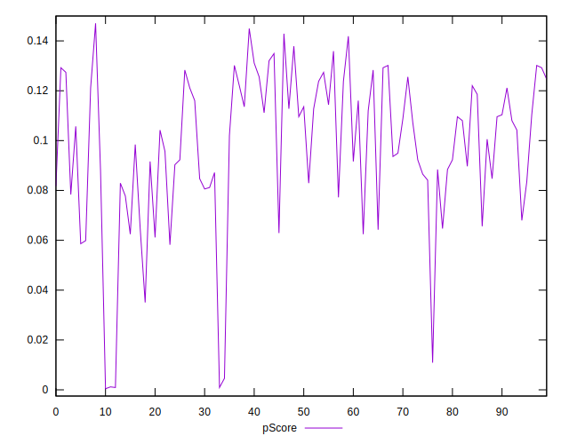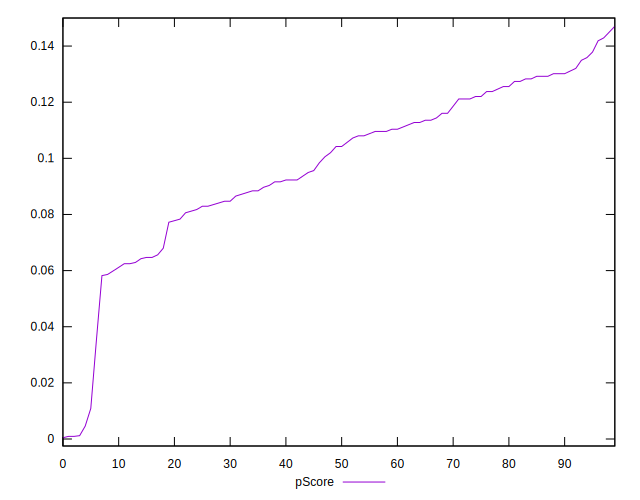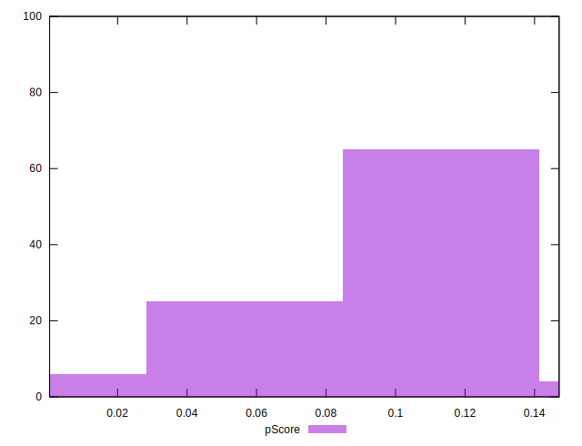
## Score Difference


```yaml
p90min: 0
p90max: 0
p90range: 0
p90mean: 0
p90median: 0
p90stdev: 0
p90skewness: .nan
p90eccentricity: .nan
p90discretization: 91
outlandishness: .nan
confidence: 0
p90confidence: 0

```


## P Score Difference


```yaml
p90min: -0.0034532384941602656
p90max: 0.004965531871838791
p90range: 0.008418770365999056
p90mean: 0.0010414193026374527
p90median: 0.0011463974916711694
p90stdev: 0.002367671847533453
p90skewness: -0.021361105407664706
p90eccentricity: 1
p90discretization: 1.3
outlandishness: 0.28827682055602116
confidence: 0.0010706798106230595
p90confidence: 0.0009729239644375822

```

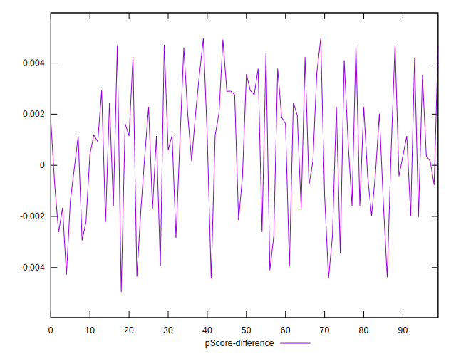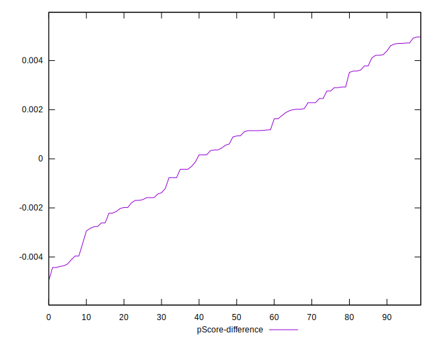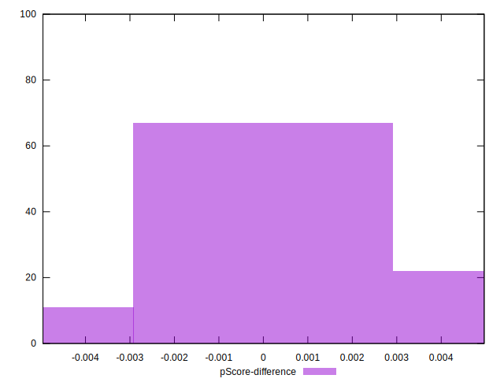