# //max-potential-fid/samples/pages

[→ Parent](../..)


## Raw


```yaml
p90min: 421
p90max: 618
p90range: 197
p90mean: 494.84615384615387
p90median: 485
p90stdev: 43.61870832540005
p90skewness: 0.9446550721441883
p90eccentricity: 0.9999999999999996
p90discretization: 1.3
outlandishness: 1.1252846353312547
confidence: 45.07065794994173
p90confidence: 17.923804209525315

```

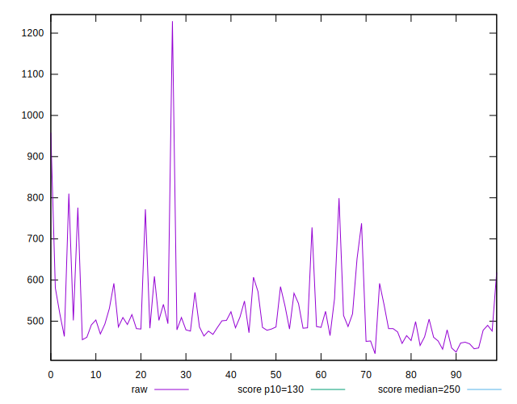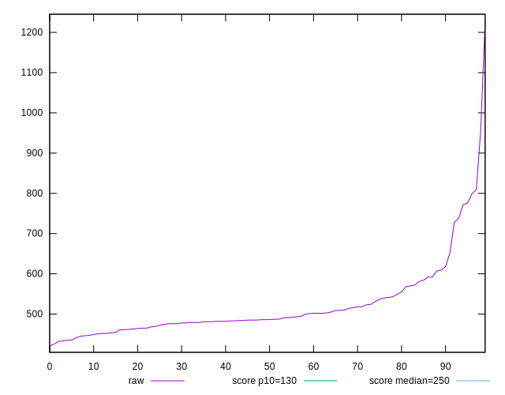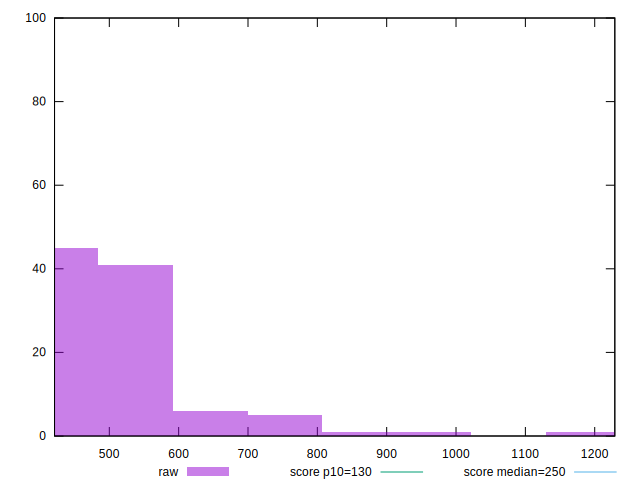
## Score


```yaml
p90min: 0.03
p90max: 0.15
p90range: 0.12
p90mean: 0.09351648351648348
p90median: 0.1
p90stdev: 0.02586412621754274
p90skewness: -0.3214741511400519
p90eccentricity: 0.9999999999999996
p90discretization: 7
outlandishness: 0.8734670562454346
confidence: 0.013380913984067933
p90confidence: 0.010628089463706886

```

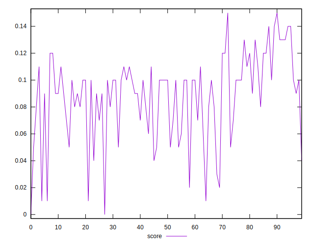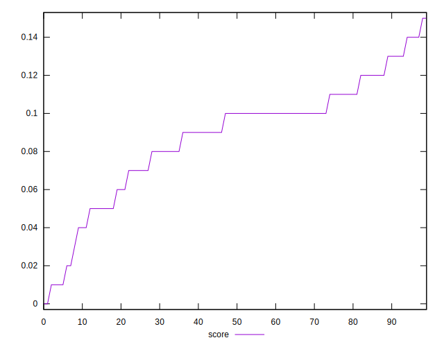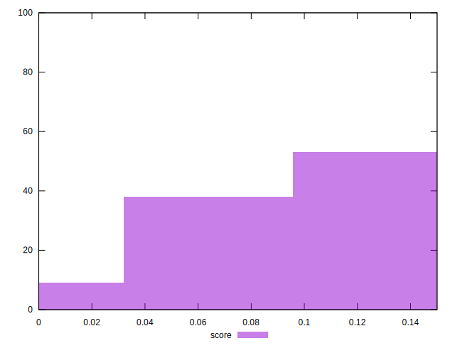
## Raw Estimate

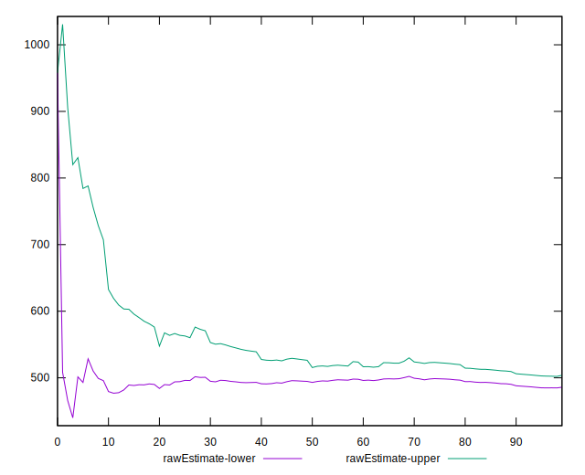
## Score Estimate

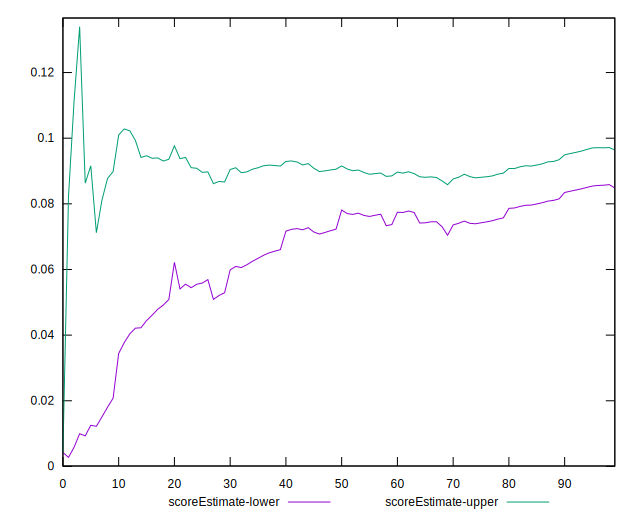
## P Score


```yaml
p90min: 0.030148654583908308
p90max: 0.1491898905359031
p90range: 0.11904123595199478
p90mean: 0.09323222535847522
p90median: 0.09701971208752203
p90stdev: 0.02599901202197822
p90skewness: -0.3022977404470162
p90eccentricity: 0.9999999999999999
p90discretization: 1.3
outlandishness: 0.876115257412955
confidence: 0.013337709668302389
p90confidence: 0.010683516752642397

```

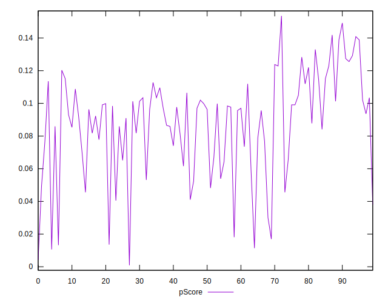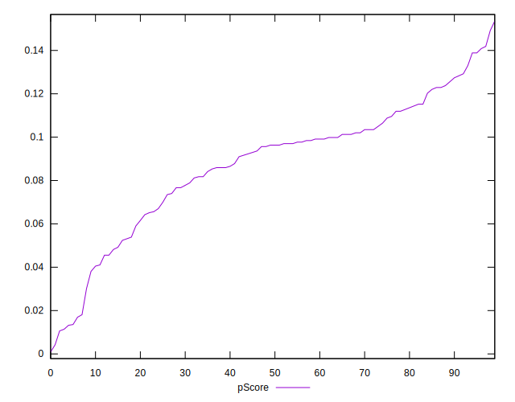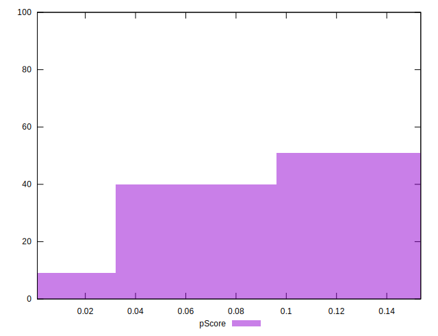
## Score Difference


```yaml
p90min: 0
p90max: 0
p90range: 0
p90mean: 0
p90median: 0
p90stdev: 0
p90skewness: .nan
p90eccentricity: .nan
p90discretization: 91
outlandishness: .nan
confidence: 0
p90confidence: 0

```


## P Score Difference


```yaml
p90min: -0.004430480440067899
p90max: 0.004114676975556911
p90range: 0.00854515741562481
p90mean: -0.00008433313449395962
p90median: -0.00016488261152422523
p90stdev: 0.0026005064763090177
p90skewness: -0.08035778562566072
p90eccentricity: 1.0000000000000002
p90discretization: 1.2638888888888888
outlandishness: 2.5125995601384514
confidence: 0.0011121235448286557
p90confidence: 0.0010686003945656276

```

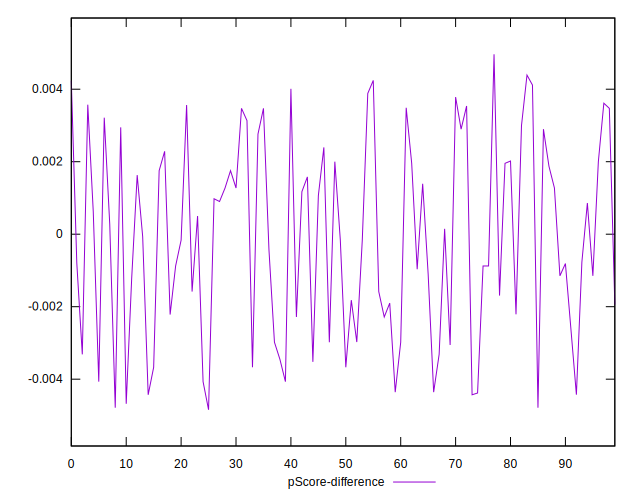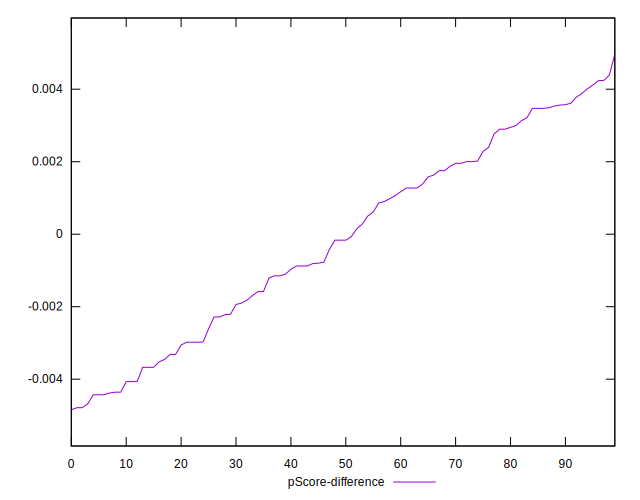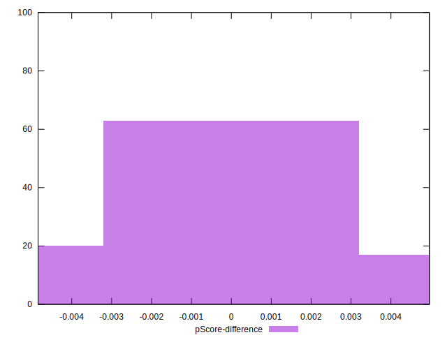